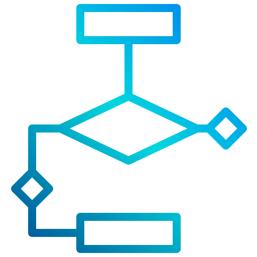
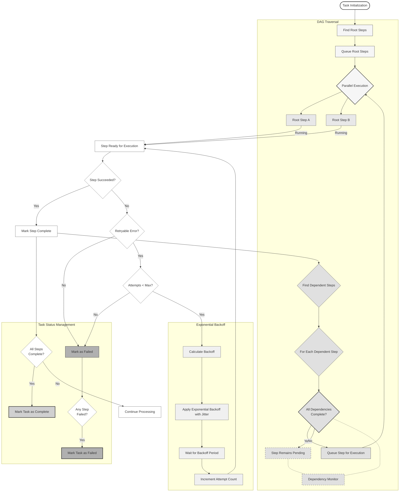

[](https://github.com/jcoletaylor/tasker/actions/workflows/main.yml)


# Tasker: Queable Multi-Step Tasks Made Easy-ish

## *Designed to make developing queuable multi-step tasks easier to reason about*



## Quickstart

Add to your Rails `Gemfile`

```ruby
# add to your Gemfile
source 'https://rubygems.pkg.github.com/jcoletaylor' do
  gem 'tasker', '~> 1.2.0'
end
```

Add the migrations in your Rails app root:

```bash
bundle exec rake tasker:install:migrations
bundle exec rake db:migrate
```

And then mount it where you'd like in `config/routes.rb` with:

```ruby
# config/routes.rb

Rails.application.routes.draw do
  mount Tasker::Engine, at: '/tasker', as: 'tasker'
end
```

## Usage

### Creating a Task Handler from scratch

1. Create a new task handler class in `app/task_handlers/my_task.rb`
2. Define the steps in the task handler class
3. Register the task handler with the Tasker registry

Full examples of this can be reviewed as an [API integration example](./spec/examples/api_task/integration_example.rb).

However, the most common pattern is to use a YAML file to define the task handler.

### Creating a Configured Task Handler

1. Create a YAML file defining your task handler following the structure above
2. Place it in an appropriate directory, e.g., `app/task_handlers/my_task.yaml`
3. Develop your step handlers as normal classes, and reference them in the YAML file
4. API-backed step handlers which inherit from `Tasker::StepHandler::Api` will automatically use exponential backoff and jitter
5. Task steps are organized as a Directed Acyclic Graph (DAG) to ensure proper ordering of execution, and if concurrency is not disabled, will automatically execute in parallel where dependencies allow

### Example of creating a Configured Task Handler

```ruby
module MyModule
  class MyYamlTask < Tasker::ConfiguredTask
    def self.yaml_path
      Rails.root.join('app/task_handlers/my_task.yaml')
    end
  end
end

# Usage:
handler = MyModule::MyYamlTask.new
# The class is already built and ready to use
# though this of course requires the step handler classes referenced in the YAML to be defined
# as that is the core of your business logic
```

### Example of a Configured Task Handler

Here's an example YAML file for an e-commerce API integration task handler:

```yaml
---
name: api_integration_yaml_task
module_namespace: ApiTask
class_name: IntegrationYamlExample
concurrent: true

default_dependent_system: ecommerce_system

named_steps:
  - fetch_cart
  - fetch_products
  - validate_products
  - create_order
  - publish_event

schema:
  type: object
  required:
    - cart_id
  properties:
    cart_id:
      type: integer

step_templates:
  - name: fetch_cart
    description: Fetch cart details from e-commerce system
    handler_class: ApiTask::StepHandler::CartFetchStepHandler
    handler_config:
      type: api
      url: https://api.ecommerce.com/cart
      params:
        cart_id: 1

  - name: fetch_products
    description: Fetch product details from product catalog
    handler_class: ApiTask::StepHandler::ProductsFetchStepHandler
    handler_config:
      type: api
      url: https://api.ecommerce.com/products

  - name: validate_products
    description: Validate product availability
    depends_on_steps:
      - fetch_products
      - fetch_cart
    handler_class: ApiTask::StepHandler::ProductsValidateStepHandler

  - name: create_order
    description: Create order from validated cart
    depends_on_step: validate_products
    handler_class: ApiTask::StepHandler::CreateOrderStepHandler

  - name: publish_event
    description: Publish order created event
    depends_on_step: create_order
    handler_class: ApiTask::StepHandler::PublishEventStepHandler
```

## API Task Example

See the [examples/api_task](./spec/examples/api_task) directory for an example of a task handler that processes an e-commerce order through a series of steps, interacting with external systems, and handling errors and retries. You can read more about the example [here](./spec/examples/api_task/README.md).

### API Routes

Tasker provides a RESTful API for managing tasks. Here are the available endpoints:

#### Tasks

- `GET /tasker/tasks` - List all tasks
- `POST /tasker/tasks` - Create and enqueue a new task
- `GET /tasker/tasks/{task_id}` - Get task details
- `PATCH/PUT /tasker/tasks/{task_id}` - Update task
- `DELETE /tasker/tasks/{task_id}` - Cancel task

#### Workflow Steps

- `GET /tasker/tasks/{task_id}/workflow_steps` - List steps for a task
- `GET /tasker/tasks/{task_id}/workflow_steps/{step_id}` - Get step details
- `PATCH/PUT /tasker/tasks/{task_id}/workflow_steps/{step_id}` - Update step
- `DELETE /tasker/tasks/{task_id}/workflow_steps/{step_id}` - Cancel step

### Creating a Task via API

Example of creating a task using curl:

```bash
curl -X POST https://www.example.com/tasker/tasks \
  -H "Content-Type: application/json" \
  -d '{
    "name": "api_integration_task",
    "context": {
      "cart_id": 123
    },
    "initiator": "web_interface",
    "reason": "Process new order",
    "source_system": "ecommerce",
    "tags": ["order_processing", "api_integration"]
  }'
```

The request body must include:

- `name`: The name of the task handler to use
- `context`: A JSON object containing the task's context data
- `initiator`: Who/what initiated the task
- `reason`: Why the task was created
- `source_system`: The system that created the task
- `tags`: (Optional) Array of tags for categorization

## Workflow & Retry Mechanism



The system implements advanced workflow traversal with parallel execution and sophisticated retry logic:

- **DAG Traversal & Parallel Execution**
  - Initial identification and queueing of root steps (no dependencies)
  - Parallel execution of independent steps at each level
  - Dynamic discovery of next executable steps as dependencies are satisfied
  - Continuous monitoring of dependency status to activate pending steps
  - Automatic task completion detection when all steps are finished

- **Industry Standard Exponential Backoff**
  - Base delay that doubles with each attempt: `base_delay * (2^attempt)`
  - Random jitter to prevent thundering herd problems
  - Configurable maximum delay cap (30 seconds)
  - Respects server-provided Retry-After headers when available

- **Task Status Management**
  - Real-time monitoring of all step statuses
  - Early failure detection and propagation
  - Graceful handling of unrecoverable errors

## Why build this?

See the [WHY.md](./docs/WHY.md) file for more information.

## TODO

A full [TODO](./docs/TODO.md).

## Dependencies

- Ruby version - 3.2.2
- System dependencies - Postgres, Redis, and Sidekiq

## Development

- Database - `bundle exec rake db:schema:load`
- How to run the test suite - `bundle exec rspec spec`
- Lint: `bundle exec rubocop`

## Gratitude

Flowchart PNG by [xnimrodx](https://www.flaticon.com/authors/xnimrodx) from [Flaticon](https://www.flaticon.com/)

## License

The gem is available as open source under the terms of the [MIT License](https://opensource.org/licenses/MIT).
