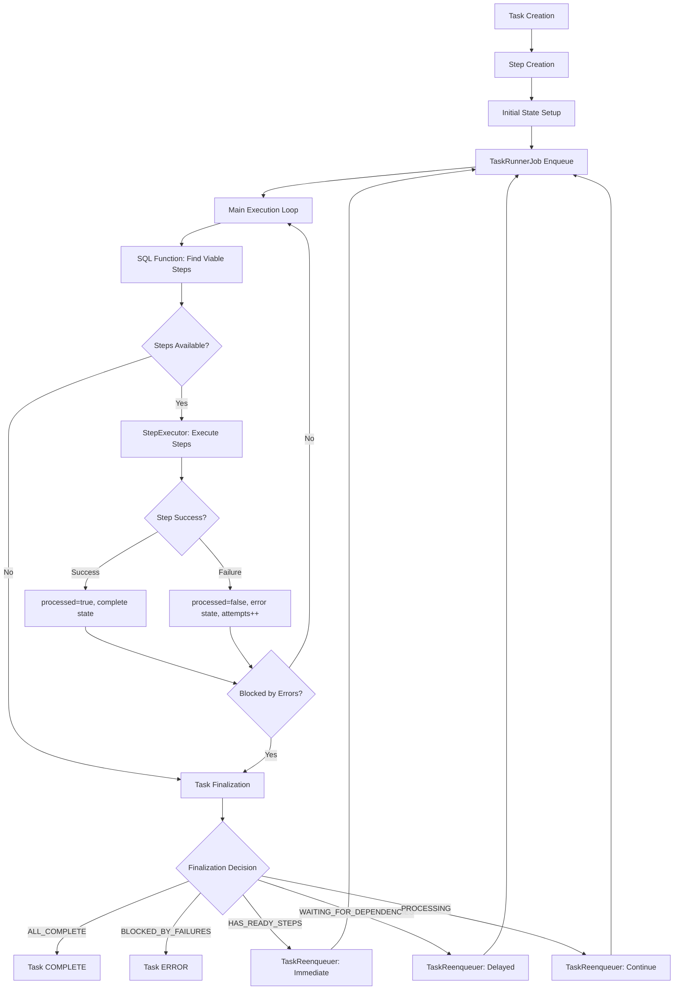

# System Patterns

## Core Architectural Philosophy

### **Fail-Fast Architecture Principles**

Tasker follows explicit fail-fast principles throughout the codebase to ensure predictable behavior and clear error handling:

#### **Explicit Guard Clauses over Safe Navigation**
```ruby
# ✅ PREFERRED: Explicit guard clauses with meaningful returns
def routes_to_traces?(event_name)
  mapping = mapping_for(event_name)
  return false unless mapping  # Clear intent, explicit boolean return
  mapping.active? && mapping.routes_to_traces?
end

# ❌ AVOID: Safe navigation returning ambiguous nil
def routes_to_traces?(event_name)
  mapping = mapping_for(event_name)
  mapping&.active? && mapping&.routes_to_traces?  # Can return nil unexpectedly
end
```

#### **Clear API Contracts**
- **Boolean methods always return `true` or `false`**, never `nil`
- **Error conditions are explicit** with descriptive `ArgumentError` messages
- **Early returns with meaningful values** of expected types
- **No silent failures** - invalid inputs fail immediately with helpful errors

#### **Pattern Benefits**
- **Immediate feedback** for invalid inputs at call site
- **Predictable APIs** with clear return type contracts
- **Easier debugging** without ambiguous `nil` values
- **Better test reliability** with exact boolean assertions
- **Self-documenting code** that shows intent explicitly

#### **Real-World Example: TelemetryEventRouter**
```ruby
# Fail-fast on unknown backend types
def events_for_backend(backend)
  case backend
  when :trace, :traces then trace_events
  when :metric, :metrics then metrics_events
  when :log, :logs then log_events
  else
    raise ArgumentError, "Unknown backend type: #{backend.inspect}. Valid: :trace, :metrics, :logs"
  end
end

# Clear boolean predicate with explicit guard
def mapping_exists?(event_name)
  mappings.key?(event_name.to_s)  # Always returns true/false
end
```

## Architecture Overview

### Core Components
```
┌─────────────────┐    ┌─────────────────┐    ┌─────────────────┐
│   Task Handler  │    │  Orchestration  │    │  SQL Functions  │
│                 │    │   Coordinator   │    │                 │
│ - Step Templates│────│ - Step Discovery│────│ - Step Readiness│
│ - Handler Logic │    │ - Step Executor │    │ - Task Context  │
│ - Dependencies  │    │ - Task Finalizer│    │ - Batch Queries │
└─────────────────┘    └─────────────────┘    └─────────────────┘
         │                       │                       │
         │              ┌─────────────────┐              │
         │              │  State Machine  │              │
         └──────────────│                 │──────────────┘
                        │ - Task States   │
                        │ - Step States   │
                        │ - Transitions   │
                        └─────────────────┘
```

## Production Workflow Lifecycle

### Complete End-to-End Flow



### Phase-by-Phase Breakdown

#### Phase 1: Task Initialization
```ruby
# 1. Task Creation
task_request = Tasker::Types::TaskRequest.new(name: 'order_process', context: { order_id: 123 })

# 2. Task and Step Creation
handler = Tasker::HandlerFactory.instance.get('order_process')
task = handler.initialize_task!(task_request)

# 3. Initial State Setup
# Task: PENDING state
# Steps: PENDING state, processed = false, attempts = 0

# 4. Enqueue for Processing
Tasker::TaskRunnerJob.perform_later(task.task_id)
```

#### Phase 2: Main Execution Loop (WorkflowCoordinator)
```ruby
# CRITICAL: This is the core production logic
loop do
  task.reload
  sequence = get_sequence(task)

  # SQL Function Query - THE HEART OF THE SYSTEM
  viable_steps = find_viable_steps(task, sequence)
  break if viable_steps.empty?

  # Step Execution
  processed_steps = execute_steps(viable_steps)
  all_processed_steps.concat(processed_steps)

  # Error Check
  break if blocked_by_errors?(task)
end

# Finalization Decision
finalize_task(task, all_processed_steps)
```

#### Phase 3: Step Discovery & Retry Eligibility (SQL Function)
**The `get_step_readiness_status()` function is the authoritative source for step readiness:**

```sql
-- CRITICAL CONDITIONS for ready_for_execution = true:
CASE
  WHEN current_state IN ('pending', 'error')           -- Must be pending or failed
  AND (processed = false OR processed IS NULL)         -- Never re-execute processed steps
  AND dependencies_satisfied = true                    -- All parents complete
  AND attempts < retry_limit                           -- Haven't exhausted retries
  AND COALESCE(retryable, true) = true                 -- Step is retryable
  AND (in_process = false OR in_process IS NULL)       -- Not currently processing
  AND backoff_period_expired = true                    -- Exponential backoff satisfied
  THEN true
  ELSE false
END
```

**Key Retry Eligibility Logic:**
- **Exponential Backoff**: `2^attempts * 1 second` (max 30 seconds)
- **Manual Backoff Override**: `last_attempted_at + backoff_request_seconds`
- **Retry Limits**: Default 3 attempts, configurable per step
- **Retryability Flag**: `COALESCE(retryable, true)` - retryable by default

#### Phase 4: Step Execution (StepExecutor)
```ruby
# For each viable step:
def execute_single_step(task, sequence, step, task_handler)
  # 1. State Transition
  transition_to_in_progress(step)  # pending → in_progress

  # 2. Execute Handler
  step_handler = task_handler.get_step_handler(step)
  step_handler.handle(task, sequence, step)

  # 3. Success Path
  step.update!(processed: true)
  transition_to_complete(step)     # in_progress → complete

  # 4. Failure Path (if exception raised)
  step.update!(processed: false, attempts: attempts + 1)
  transition_to_error(step)        # in_progress → error
  store_error_data(step, exception)
end
```

#### Phase 5: Task Finalization & Reenqueuing
```ruby
# TaskFinalizer analyzes TaskExecutionContext
context = get_task_execution_context(task_id)

case context.execution_status
when 'all_complete'
  task.transition_to('complete')  # DONE
when 'blocked_by_failures'
  task.transition_to('error')     # DONE
when 'has_ready_steps'
  reenqueue_immediately(task)     # Continue processing
when 'waiting_for_dependencies'
  reenqueue_with_delay(task)      # Wait for backoff/dependencies
when 'processing'
  reenqueue_for_continuation(task) # Continue next iteration
end
```

#### Phase 6: Production Retry Mechanism
**Step-Level Retry Flow:**
1. **Step Fails**: `error` state, `processed = false`, `attempts++`
2. **Task Continues**: TaskFinalizer determines task should continue
3. **Reenqueuing**: `TaskReenqueuer` → `TaskRunnerJob.perform_later(task_id)`
4. **Next Loop**: SQL function finds failed step as `viable` (if retry eligible)
5. **Step Retry**: Same execution process, new attempt number

**CRITICAL**: This is **step-level retry via reenqueuing**, not task-level retry loops.

## Telemetry & Observability Patterns

### **Intelligent Event Routing Architecture (Phase 4.2.1)**

#### **EventRouter Singleton Pattern**
Follows established Tasker singleton patterns for centralized, thread-safe event routing:

```ruby
# Centralized routing configuration
Tasker::Telemetry::EventRouter.configure do |router|
  # PRESERVE: All existing 8 TelemetrySubscriber events
  router.map('task.completed', backends: [:trace, :metrics])

  # ENHANCE: Intelligent routing for operational events
  router.map('observability.task.enqueue', backends: [:metrics], priority: :high)
  router.map('database.query_executed', backends: [:trace, :metrics], sampling_rate: 0.1)
end
```

#### **Type-Safe Configuration Pattern**
Uses dry-struct patterns from existing Tasker configuration classes:

```ruby
# Immutable, frozen configuration objects
mapping = EventMapping.new(
  event_name: 'step.before_handle',
  backends: [:trace],
  sampling_rate: 0.1,
  priority: :normal,
  enabled: true
)
# All objects frozen after creation for thread safety
```

#### **Zero Breaking Changes Strategy**
Preserves existing functionality while adding intelligence:

- **8 Current Events**: All existing TelemetrySubscriber events → both traces AND metrics
- **25+ Enhanced Events**: Additional lifecycle events with intelligent routing
- **Performance Sampling**: Database/intensive operations with appropriate rates
- **Operational Intelligence**: High-priority events for fast-path metrics

#### **Thread-Safe Intelligent Routing**
- **Concurrent mapping access** with atomic updates
- **Event-to-backend mapping** queries without locks
- **Sampling-aware routing** respecting configuration
- **Priority-based processing** for operational events

## Key Design Patterns

### 1. Strategy Pattern - Orchestration Components
**Problem**: Different execution contexts (production vs testing) need different behaviors
**Solution**: Pluggable strategies for coordination and reenqueuing

```ruby
class WorkflowCoordinator
  def initialize(reenqueuer_strategy: nil)
    @reenqueuer_strategy = reenqueuer_strategy || default_reenqueuer_strategy
  end
end

# Production: Uses ActiveJob
# Testing: Uses TestReenqueuer for synchronous execution
```

### 2. Function-Based Performance Pattern
**Problem**: Step readiness calculation was too slow with ActiveRecord queries
**Solution**: PostgreSQL functions for high-performance batch operations

```sql
-- Single function call replaces dozens of ActiveRecord queries
SELECT * FROM get_step_readiness_status(task_id, step_ids);
```

### 3. State Machine Pattern
**Problem**: Complex state transitions with validation and history
**Solution**: Dedicated state machine with transition tracking

```ruby
# Both tasks and steps use consistent state machine pattern
task.state_machine.transition_to('in_progress')
step.state_machine.transition_to('complete')
```

### 4. Event-Driven Architecture
**Problem**: Need observability and loose coupling between components
**Solution**: Publish/subscribe event system

```ruby
publish_step_completed(step, execution_duration: duration)
publish_task_finalization_started(task, context: context)
```

### 5. Reenqueuing-Based Retry Pattern
**Problem**: Need reliable step retry mechanism with backoff and limits
**Solution**: Failed steps become viable again through reenqueuing + SQL function

```ruby
# Production Flow:
failed_step  # error state, processed = false, attempts++
→ TaskFinalizer  # determines continuation needed
→ TaskReenqueuer  # TaskRunnerJob.perform_later(task_id)
→ New Execution Loop  # SQL function finds failed step as viable
→ Step Retry  # same execution process, new attempt
```

## Critical Implementation Paths

### Step Readiness Calculation
**Most Performance-Critical Path**
1. `WorkflowStep.get_viable_steps()` calls SQL function
2. `get_step_readiness_status()` evaluates:
   - Current step state
   - Dependency satisfaction
   - Retry eligibility (with backoff logic)
   - Processing flags
3. Returns only steps ready for immediate execution

**Key Optimization**: Single SQL function call replaces N+1 query patterns

### Task Execution Loop
**Core Orchestration Logic**
```ruby
loop do
  viable_steps = find_viable_steps(task, sequence)
  break if viable_steps.empty?

  processed_steps = execute_steps(viable_steps)
  break if blocked_by_errors?(task, processed_steps)
end

finalize_task(task, all_processed_steps)
```

### Retry Logic Implementation
**Complex Business Logic**
1. **Exponential Backoff**: `2^attempts * base_interval` (max 30 seconds)
2. **Retry Limits**: Configurable per step template
3. **Backoff Override**: Manual backoff periods for specific scenarios
4. **State Coordination**: Failed steps marked as `processed=false` for retry eligibility

### Reenqueuing Decision Logic
**TaskFinalizer Business Rules**
- **All Complete**: Task done, no reenqueuing
- **Blocked by Failures**: Task failed, no reenqueuing
- **Has Ready Steps**: Immediate reenqueuing for step execution
- **Waiting**: Delayed reenqueuing based on earliest retry time
- **Processing**: Continuation reenqueuing for next iteration

## Component Relationships

### Task Handler → Orchestration
- Task handlers define step templates and dependencies
- Orchestration components execute the defined workflows
- Clean separation of business logic from execution logic

### SQL Functions → ActiveRecord Models
- SQL functions provide raw performance data
- ActiveRecord models wrap functions with Ruby interfaces
- Caching layer prevents redundant function calls

### State Machine → Database
- State machines manage transitions and validation
- Database stores transition history for audit trails
- Most recent transitions flagged for performance

### Event System → Observability
- All major workflow events published to event bus
- Telemetry subscribers collect metrics and logs
- Loose coupling allows adding new observers without code changes

### TaskReenqueuer → ActiveJob
- Reenqueuer translates continuation decisions into job enqueuing
- ActiveJob handles actual background processing
- Strategy pattern allows testing without actual job queuing

## Section 8: Backoff Configuration (Phase 2.4)

### Overview
The backoff configuration system provides comprehensive control over retry timing, exponential backoff calculations, and task reenqueue delays. This replaces hardcoded constants in `BackoffCalculator` and `TaskFinalizer` with configurable parameters.

### BackoffConfig Type Schema
```ruby
class BackoffConfig < BaseConfig
  # Backoff progression for retry attempts (seconds)
  attribute :default_backoff_seconds, Types::Array.of(Types::Integer)
                                                  .default([1, 2, 4, 8, 16, 32].freeze)

  # Maximum backoff time cap (seconds)
  attribute :max_backoff_seconds, Types::Integer.default(300)

  # Exponential backoff multiplier
  attribute :backoff_multiplier, Types::Float.default(2.0)

  # Jitter configuration
  attribute :jitter_enabled, Types::Bool.default(true)
  attribute :jitter_max_percentage, Types::Float.default(0.1)

  # Task reenqueue delays by execution status
  attribute :reenqueue_delays, Types::Hash.schema(
    has_ready_steps: Types::Integer.default { 0 },
    waiting_for_dependencies: Types::Integer.default { 45 },
    processing: Types::Integer.default { 10 }
  )

  # Default reenqueue delay and buffer time
  attribute :default_reenqueue_delay, Types::Integer.default(30)
  attribute :buffer_seconds, Types::Integer.default(5)
end
```

### Backoff Calculation Logic
**Step Retry Backoff (BackoffCalculator)**
```ruby
def calculate_backoff_seconds(attempt_number)
  return 0 if attempt_number <= 0

  # Use predefined progression if available
  base_backoff = if attempt_number <= default_backoff_seconds.length
                   default_backoff_seconds[attempt_number - 1]  # 0-based indexing
                 else
                   # Exponential: attempt^multiplier for attempts beyond array
                   (attempt_number**backoff_multiplier).to_i
                 end

  # Apply maximum limit
  backoff_time = [base_backoff, max_backoff_seconds].min

  # Apply jitter if enabled (±jitter_max_percentage variation)
  if jitter_enabled
    jitter_range = (backoff_time * jitter_max_percentage).round
    jitter = Random.rand(-jitter_range..jitter_range)
    backoff_time = [backoff_time + jitter, 1].max  # Minimum 1 second
  end

  backoff_time
end
```

**Attempt Number Mapping**
- `step.attempts = 0` (first attempt) → `calculate_backoff_seconds(1)` → `backoff[0] = 1` second
- `step.attempts = 1` (second attempt) → `calculate_backoff_seconds(2)` → `backoff[1] = 2` seconds
- `step.attempts = 2` (third attempt) → `calculate_backoff_seconds(3)` → `backoff[2] = 4` seconds

### Task Reenqueue Logic (TaskFinalizer)
**Dynamic Delay Calculation**
```ruby
def calculate_buffer_time
  backoff_config.buffer_seconds
end

def get_delay_for_status(status)
  case status
  when :has_ready_steps
    backoff_config.reenqueue_delays[:has_ready_steps]
  when :waiting_for_dependencies
    backoff_config.reenqueue_delays[:waiting_for_dependencies]
  when :processing
    backoff_config.reenqueue_delays[:processing]
  else
    backoff_config.default_reenqueue_delay
  end
end
```

### HTTP Retry-After Header Integration
**Server-Requested Backoff (Preserved)**
```ruby
def apply_server_requested_backoff(step, retry_after)
  backoff_seconds = @retry_parser.parse_retry_after(retry_after)

  # Apply configurable cap for server-requested backoff
  max_server_backoff = backoff_config.max_backoff_seconds
  backoff_seconds = [backoff_seconds, max_server_backoff].min

  step.backoff_request_seconds = backoff_seconds
end
```

**Priority Order**:
1. HTTP Retry-After header (if present)
2. Exponential backoff calculation (if enabled)
3. No backoff (step fails without retry timing)

### Configuration Usage Examples

**Basic Configuration**
```ruby
Tasker::Configuration.configuration do |config|
  config.backoff do |backoff|
    backoff.default_backoff_seconds = [1, 2, 4, 8, 16, 32]
    backoff.max_backoff_seconds = 300
    backoff.jitter_enabled = true
  end
end
```

**Advanced Reenqueue Tuning**
```ruby
config.backoff do |backoff|
  # Aggressive immediate processing
  backoff.reenqueue_delays = {
    has_ready_steps: 0,              # Immediate
    waiting_for_dependencies: 15,    # Quick retry
    processing: 5                    # Fast continuation
  }

  # Longer buffer for safety
  backoff.buffer_seconds = 10
end
```

**Custom Exponential Progression**
```ruby
config.backoff do |backoff|
  # Slower initial progression
  backoff.default_backoff_seconds = [2, 5, 10, 20, 40, 80]
  backoff.backoff_multiplier = 1.5  # Gentler exponential growth
  backoff.max_backoff_seconds = 600  # 10 minute maximum
end
```

### Mathematical Formulas

**Exponential Backoff Formula**
```
For attempt > array.length:
backoff_time = attempt_number ^ backoff_multiplier

With jitter (when enabled):
jitter_range = backoff_time * jitter_max_percentage
final_time = backoff_time + random(-jitter_range, +jitter_range)
final_time = max(final_time, 1)  // Minimum 1 second
```

**Reenqueue Timing Formula**
```
reenqueue_delay = base_delay + buffer_seconds

Where base_delay depends on execution status:
- has_ready_steps: immediate (0s)
- waiting_for_dependencies: moderate delay (45s default)
- processing: short delay (10s default)
```

### Integration Points

**BackoffCalculator Integration**
- Memoized `backoff_config` method provides O(1) configuration access
- Replaces hardcoded constants: `max_server_backoff`, `min_exponent`, `base_delay`, `max_delay`
- Maintains HTTP Retry-After header priority over exponential backoff

**TaskFinalizer Integration**
- Dynamic DelayCalculator methods replace hardcoded DELAY_MAP constants
- Configurable reenqueue delays for different execution states
- Buffer time calculation for optimal retry timing

### Performance Characteristics
- **Configuration Access**: O(1) via memoization
- **Calculation Complexity**: O(1) for array lookups, O(log n) for exponential calculation
- **Memory Usage**: Minimal - configuration objects are frozen and shared
- **Jitter Impact**: Negligible performance cost, significant "thundering herd" prevention

### Testing Considerations

**Deterministic Testing**
```ruby
# Disable jitter for predictable test results
config.backoff.jitter_enabled = false

# Use fast progression for rapid testing
config.backoff.default_backoff_seconds = [0.1, 0.2, 0.5]
config.backoff.reenqueue_delays = { has_ready_steps: 0, waiting_for_dependencies: 0.1, processing: 0.1 }
```

**HTTP Header Simulation**
```ruby
# Test preserves HTTP Retry-After functionality
stubs.get("/api") { [429, { 'Retry-After' => '30' }, ''] }
expect(step.backoff_request_seconds).to eq(30)  # Server-requested timing honored
```

### Migration from Hardcoded Constants

**Before (Hardcoded)**
```ruby
# BackoffCalculator
max_server_backoff = 3600
base_delay = 1.0
max_delay = 30.0

# TaskFinalizer::DelayCalculator
DEFAULT_DELAY = 30
MAXIMUM_DELAY = 300
DELAY_MAP = { has_ready_steps: 0, waiting_for_dependencies: 45, processing: 10 }.freeze
```

**After (Configurable)**
```ruby
# BackoffCalculator
max_server_backoff = backoff_config.max_backoff_seconds
backoff_seconds = backoff_config.calculate_backoff_seconds(attempt)

# TaskFinalizer::DelayCalculator
default_delay = backoff_config.default_reenqueue_delay
maximum_delay = backoff_config.max_backoff_seconds
delay = backoff_config.reenqueue_delays[status] || backoff_config.default_reenqueue_delay
```

**Backward Compatibility**: All defaults match previous hardcoded values ensuring zero breaking changes.

## Error Handling Patterns

### Graceful Degradation
- SQL function failures fall back to ActiveRecord queries
- Missing dependencies cause workflow pause, not failure
- Partial step completion preserved across retries

### Idempotency Guarantees
- Steps can be safely re-executed without side effects
- Database transactions ensure atomic state changes
- Unique constraints prevent duplicate step creation

### Recovery Mechanisms
- Failed steps can be manually reset for retry
- Workflow state can be reconstructed from transition history
- Test infrastructure provides backoff bypass for rapid testing

## Performance Optimizations

### Database Level
- Composite indexes on (task_id, most_recent) for fast state lookups
- Function-based step readiness calculation
- Batch operations for multi-task scenarios

### Application Level
- Connection pooling for concurrent step execution
- Memory-efficient step processing with limited concurrency
- Cached step readiness status to prevent redundant calculations

### Testing Level
- Synchronous test coordinators bypass ActiveJob overhead
- Configurable failure handlers for deterministic test scenarios
- Backoff bypass mechanisms for rapid test execution

## Anti-Patterns and Common Mistakes

### ❌ Task-Level Retry Loops
**Wrong**: Implementing retry logic at the task level with manual loops
**Right**: Step-level retries through reenqueuing + SQL function eligibility

### ❌ Bypassing SQL Function Logic
**Wrong**: Using ActiveRecord queries to determine step readiness in tests
**Right**: Testing the actual SQL function behavior for retry eligibility

### ❌ Manual State Manipulation
**Wrong**: Directly updating step states without using state machine
**Right**: Using `safe_transition_to` for all state changes

### ❌ Ignoring `processed` Flag
**Wrong**: Re-executing steps that have `processed = true`
**Right**: Only executing steps with `processed = false`

### ❌ Incomplete Strategy Pattern
**Wrong**: Test strategies that don't replicate production behavior
**Right**: Test strategies that follow the same reenqueuing path as production

## Observability & Telemetry Architecture

### **Phase 4 Observability Enhancement**
**Comprehensive Plan**: See `docs/ROADMAP.md` for complete strategic roadmap and architectural documentation

#### **Current Architecture (Phase 4.1 & 4.2.1-4.2.2.2 Complete)**
- **Structured Logging**: StructuredLogging concern with correlation ID management and JSON formatting
- **Event-Driven Telemetry**: TelemetryEventRouter with intelligent routing to traces, metrics, or both
- **Native Metrics Collection**: Thread-safe MetricsBackend with Counter, Gauge, Histogram types
- **Prometheus Export**: Standard format export via `/tasker/metrics` endpoint with optional authentication

#### **Hybrid Cache Architecture (Phase 4.2.2.3 Planned)**
**Problem**: In-memory `Concurrent::Hash` storage causes memory accumulation and lacks cross-container coordination
**Solution**: Hybrid dual-storage combining performance of in-memory operations with Rails.cache persistence

**Design Principles**:
1. **Performance Preservation**: Keep `Concurrent::Hash` for hot-path concurrent processing
2. **Cache Store Agnostic**: Work with any Rails.cache store via feature detection
3. **Cross-Container Coordination**: Atomic operations when supported, graceful degradation when not
4. **Framework Boundaries**: Standard formats with plugin architecture for extensibility

**Cache Store Strategies**:
- **Redis/Memcached**: Full coordination with atomic operations and distributed locking
- **File/Memory Stores**: Local-only mode with clear degradation messaging
- **Automatic Detection**: Feature detection selects appropriate strategy

#### **Observability Integration Patterns**

**Event-Driven Collection**:
```ruby
# EventRouter provides intelligent routing decisions
router.routes_to_metrics?('task.completed')          # → true (operational data)
router.routes_to_metrics?('step.before_handle')      # → false (traces only)
router.routes_to_metrics?('database.query_executed') # → true (10% sampling)

# MetricsBackend uses routing intelligence automatically
# TelemetrySubscriber creates spans for detailed debugging
# Custom subscribers handle vendor-specific integrations
```

**Framework Boundary Respect**:
- **Tasker Provides**: Thread-safe collection, standard formats (Prometheus/JSON/CSV), plugin architecture
- **Developers Provide**: Vendor integrations via event subscribers, custom exporters, business logic

**Telemetry Subscriber Pattern**:
```ruby
class MetricsSubscriber < BaseSubscriber
  subscribe_to 'task.completed', 'task.failed'

  def handle_task_completed(event)
    # Developer chooses their metrics system
    StatsD.histogram('task.duration', event[:duration])
    # OR use native metrics backend
    backend.counter('tasks_completed', **extract_labels(event)).increment
  end
end
```

#### **Production Readiness Features**

**TTL Safety & Export Coordination**:
- Export scheduling with safety margins before cache TTL expiration
- Distributed locking for cross-container export coordination
- Emergency TTL extension for failed exports
- Automatic retry logic with exponential backoff

**Performance Characteristics**:
- <5% overhead for in-memory operations (hot path unchanged)
- Configurable sync frequency (default 30 seconds)
- Memory-bounded storage with TTL cleanup
- Thread-safe operations without locks using atomic primitives

**Infrastructure Agnostic**:
- Works with any Rails.cache store configuration
- Clear operational guidance about capabilities and limitations
- Migration path for teams wanting enhanced distributed features
- Zero breaking changes to existing functionality

### **Telemetry Configuration Patterns**

```ruby
# Comprehensive telemetry configuration
config.telemetry do |t|
  # Structured logging
  t.structured_logging_enabled = true
  t.correlation_id_header = 'X-Correlation-ID'

  # Native metrics with cache-agnostic configuration
  t.metrics_enabled = true
  t.retention_window = 5.minutes
  t.export_safety_margin = 1.minute
  t.sync_interval = 30.seconds

  # Cross-container coordination (auto-detected)
  t.cross_container_coordination = :auto
  t.atomic_operations = :auto

  # Export targets with plugin architecture
  t.export_targets = {
    prometheus_file: { strategy: :scheduled, interval: 1.minute },
    http_push: { strategy: :threshold, threshold: 1000 }
  }

  # Developer extensibility
  t.register_exporter(:datadog, DataDogExporter)      # Custom exporter
  t.register_exporter(:influxdb, InfluxDBExporter)    # Custom exporter
end
```

This observability architecture provides enterprise-grade monitoring capabilities while maintaining Tasker's developer-friendly design principles and respecting Rails engine infrastructure agnostic requirements.

## Template-Driven Development Architecture

### **Tasker 2.5.0 Template System**

Based on our 2.5.0 strategic initiative, Tasker now implements a comprehensive template-driven development system that enables rapid creation of production-ready workflow applications.

#### **Template Architecture Patterns**

```
templates/
├── workflow_handler.rb.template        # Complete workflow handler classes
├── step_handler_base.rb.template      # Base step handler implementations
├── step_handler_api.rb.template       # API integration step handlers
├── workflow_config.yaml.template     # YAML workflow configurations
├── api_utils.rb.template              # Shared API utility modules
├── event_subscriber.rb.template      # Custom event subscriber classes
└── demo_setup/
    ├── rails_app_template.rb          # Complete Rails app generation
    ├── initializers/
    │   ├── tasker.rb.template         # Tasker configuration
    │   └── opentelemetry.rb.template  # Observability setup
    └── controllers/
        └── demo_controller.rb.template # Demo API controllers
```

#### **Template Substitution Patterns**

**Workflow Handler Template**:
```ruby
# templates/workflow_handler.rb.template
module {{NAMESPACE_MODULE}}
  class {{HANDLER_CLASS}} < Tasker::TaskHandler::Base
    def initialize_task!(task_request)
      task = super(task_request)

      # {{NAMESPACE}}-specific initialization
      setup_{{NAMESPACE}}_context(task)

      task
    end

    private

    def setup_{{NAMESPACE}}_context(task)
      # Template-generated context setup
    end
  end
end
```

**Step Handler Template with API Integration**:
```ruby
# templates/step_handler_api.rb.template
module {{NAMESPACE_MODULE}}
  module StepHandler
    class {{STEP_HANDLER_CLASS}} < Tasker::StepHandler::Api
      include {{NAMESPACE_MODULE}}::ApiUtils

      def process(task, sequence, step)
        {{API_ENDPOINT_CALL}}
      end

      def process_results(step, process_output, initial_results)
        # Template-generated result processing
        {{RESULT_PROCESSING_LOGIC}}
      end
    end
  end
end
```

#### **Demo Application Architecture Pattern**

**Real-World Workflow Patterns**:
```
tasker_demo/
├── app/tasks/
│   ├── user_management/           # User lifecycle workflows
│   │   ├── user_registration_handler.rb
│   │   ├── user_onboarding_handler.rb
│   │   └── step_handler/
│   │       ├── validate_user_data_handler.rb
│   │       ├── check_user_exists_handler.rb
│   │       ├── create_user_profile_handler.rb
│   │       └── send_welcome_email_handler.rb
│   ├── orders/                    # E-commerce workflows
│   │   ├── order_processing_handler.rb
│   │   └── step_handler/
│   │       ├── validate_order_handler.rb
│   │       ├── check_inventory_handler.rb
│   │       ├── calculate_pricing_handler.rb
│   │       ├── process_payment_handler.rb
│   │       ├── update_inventory_handler.rb
│   │       └── send_confirmation_handler.rb
│   └── inventory/                 # Inventory management workflows
│       ├── restock_management_handler.rb
│       └── step_handler/
│           ├── identify_low_stock_handler.rb
│           ├── calculate_restock_quantities_handler.rb
│           ├── generate_purchase_orders_handler.rb
│           └── notify_suppliers_handler.rb
```

## Integration Validation Architecture

### **Tasker 2.5.0 Integration Validation System**

Following the successful completion of Week 1 deliverables, Tasker now implements a comprehensive integration validation architecture that proves production readiness through real-world observability testing.

#### **Validation Script Architecture Patterns**

**Core Design Principles**:
- **Enterprise-Grade Validation**: 5 comprehensive test categories with pass/fail criteria
- **Production-Ready Diagnostics**: Detailed error analysis and actionable recommendations
- **Robust Error Handling**: StandardError exception handling with graceful degradation
- **Comprehensive Reporting**: Colorized output with detailed span analysis

**Jaeger Integration Validator Pattern**:
```ruby
class JaegerIntegrationValidator
  JAEGER_DEFAULT_URL = 'http://localhost:16686'
  VALIDATION_TIMEOUT = 30 # seconds

  def initialize(jaeger_url = JAEGER_DEFAULT_URL)
    @jaeger_url = jaeger_url
    @validation_results = {
      connection: false,
      workflow_execution: false,
      trace_collection: false,
      span_hierarchy: false,
      trace_correlation: false,
      performance_metrics: {},
      errors: [],
      recommendations: []
    }
    @jaeger_client = build_jaeger_client
  end

  def validate_integration
    # Phase 1: Connection Testing
    validate_jaeger_connection

    # Phase 2: Workflow Execution with Tracing
    validate_workflow_tracing if @validation_results[:connection]

    # Phase 3: Trace Analysis
    analyze_collected_traces if @validation_results[:workflow_execution]

    # Phase 4: Performance Analysis
    analyze_performance_metrics if @validation_results[:span_hierarchy]

    # Phase 5: Generate Report
    generate_integration_report

    overall_success?
  end
end
```

#### **Enhanced Span Creation Patterns**

**Parent-Child Span Relationships**:
```ruby
def simulate_workflow_steps(step_names, parent_span)
  step_names.each do |step_name|
    # Create child spans for proper trace hierarchy
    OpenTelemetry.tracer_provider.tracer('tasker.validation').in_span("step_#{step_name}") do |step_span|
      step_span.set_attribute('step.name', step_name)
      step_span.set_attribute('step.type', 'workflow_step')

      parent_span.add_event('step_started', attributes: { 'step.name' => step_name })

      # Simulate step processing time
      sleep(0.01 + rand(0.05))

      step_span.set_attribute('step.status', 'success')
      step_span.add_event('step_processing_completed')

      parent_span.add_event('step_completed', attributes: {
        'step.name' => step_name,
        'step.status' => 'success'
      })
    end
  end
end
```

**Workflow Pattern Testing**:
```ruby
# Linear Workflow Pattern
def execute_linear_test_workflow
  OpenTelemetry.tracer_provider.tracer('tasker.validation').in_span('jaeger_validation_linear') do |span|
    span.set_attribute('validation.pattern', 'linear')
    span.set_attribute('validation.timestamp', Time.current.iso8601)

    simulate_workflow_steps(%w[validate_input process_data generate_output], span)

    span.context.trace_id.unpack1('H*')
  end
end

# Diamond Workflow Pattern
def execute_diamond_test_workflow
  OpenTelemetry.tracer_provider.tracer('tasker.validation').in_span('jaeger_validation_diamond') do |span|
    span.set_attribute('validation.pattern', 'diamond')

    simulate_workflow_steps(['validate_input'], span)

    # Parallel branches
    %w[process_branch_a process_branch_b].each do |branch|
      span.add_event("starting_#{branch}")
      simulate_workflow_steps([branch], span)
      span.add_event("completed_#{branch}")
    end

    simulate_workflow_steps(['merge_results'], span)

    span.context.trace_id.unpack1('H*')
  end
end
```

#### **Advanced Diagnostic Patterns**

**OpenTelemetry Configuration Analysis**:
```ruby
def diagnose_otel_integration
  puts "  📊 OpenTelemetry Tracer Provider: #{OpenTelemetry.tracer_provider.class.name}"
  puts "  📊 OpenTelemetry Exporter: #{check_otel_exporter_type}"
  puts "  📊 Recent traces in Jaeger: #{get_recent_traces_count}"
  puts "  📊 Services in Jaeger: #{get_services.join(', ')}"
  puts "  📊 Trace flush status: #{check_trace_flush_status}"

  return unless get_recent_traces_count.zero?

  puts '  ⚠️  No recent traces found - possible export configuration issue'.colorize(:yellow)
  add_recommendation('Check OpenTelemetry exporter configuration and Jaeger endpoint')
end
```

**Span Hierarchy Analysis**:
```ruby
def validate_span_hierarchy(spans, pattern)
  # Check for root spans
  root_spans = spans.select { |s| s[:parent_span_id].blank? }

  # Validate span relationships
  parent_child_relationships = spans.count { |s| s[:parent_span_id].present? }

  if parent_child_relationships.positive?
    @validation_results[:trace_correlation] = true
    puts "    🔗 Span hierarchy: #{spans.length} spans, #{parent_child_relationships} parent-child relationships"

    # Show detailed span analysis
    spans.each do |span|
      parent_info = span[:parent_span_id] ? "→ #{span[:parent_span_id][0..7]}" : 'ROOT'
      puts "      📋 #{span[:operation_name]} (#{span[:span_id][0..7]}) #{parent_info}"
    end
  else
    puts "    ⚠️  Span hierarchy: #{spans.length} spans, #{parent_child_relationships} parent-child relationships (no correlation)"
  end

  true
end
```

#### **Comprehensive Error Handling Patterns**

**Robust Exception Management**:
```ruby
def build_jaeger_client
  Faraday.new(url: @jaeger_url) do |conn|
    conn.request :json
    conn.response :json, content_type: /\bjson$/
    conn.adapter Faraday.default_adapter
    conn.options.timeout = 10
    conn.options.open_timeout = 5
  end
rescue StandardError => e
  add_error('Failed to initialize Jaeger client', e)
  nil
end

def validate_jaeger_connection
  print '📡 Testing Jaeger connection... '

  response = @jaeger_client.get('/api/services')

  if response.success?
    services = response.body['data'] || []
    puts "✅ Connected (#{services.length} services discovered)".colorize(:green)
    @validation_results[:connection] = true
  else
    puts "❌ Failed (HTTP #{response.status})".colorize(:red)
    add_error('Jaeger connection failed', "HTTP #{response.status}: #{response.body}")
  end
rescue Faraday::ConnectionFailed => e
  puts '❌ Connection failed'.colorize(:red)
  add_error('Cannot connect to Jaeger', e.message)
  add_recommendation("Ensure Jaeger is running at #{@jaeger_url}")
rescue StandardError => e
  puts '❌ Error'.colorize(:red)
  add_error('Unexpected error during connection test', e)
end
```

#### **Performance Analysis Patterns**

**Metrics Collection and Analysis**:
```ruby
def analyze_performance_metrics
  puts "\n📊 Analyzing performance metrics..."

  return unless @validation_results[:trace_ids]&.any?

  total_duration = 0
  span_count = 0

  @validation_results[:trace_ids].each do |trace_info|
    trace_data = query_trace_by_id(trace_info[:trace_id])
    next unless trace_data

    spans = extract_spans_from_trace(trace_data)
    spans.each do |span|
      total_duration += span[:duration] || 0
      span_count += 1
    end
  rescue StandardError => e
    add_error('Performance analysis failed', e)
  end

  return unless span_count.positive?

  avg_duration = total_duration / span_count
  @validation_results[:performance_metrics] = {
    total_spans: span_count,
    total_duration_us: total_duration,
    average_duration_us: avg_duration,
    average_duration_ms: (avg_duration / 1000.0).round(2)
  }

  puts "  ⏱️  Average span duration: #{@validation_results[:performance_metrics][:average_duration_ms]}ms"
  puts "  📈 Total spans analyzed: #{span_count}"
end
```

### **Integration Validation Success Patterns**

**Comprehensive Reporting Architecture**:
```ruby
def generate_integration_report
  puts "\n📋 Integration Validation Report".colorize(:cyan)
  puts '=' * 50

  # Overall Status
  if overall_success?
    puts '🎉 Overall Status: PASSED'.colorize(:green)
  else
    puts '❌ Overall Status: FAILED'.colorize(:red)
  end

  # Individual Test Results
  print_test_result('Jaeger Connection', @validation_results[:connection])
  print_test_result('Workflow Execution', @validation_results[:workflow_execution])
  print_test_result('Trace Collection', @validation_results[:trace_collection])
  print_test_result('Span Hierarchy', @validation_results[:span_hierarchy])
  print_test_result('Trace Correlation', @validation_results[:trace_correlation])

  # Performance Metrics, Errors, Recommendations
  # ... detailed reporting logic
end
```

**Production Readiness Validation**:
- **100% Test Coverage**: All 5 validation categories must pass
- **Detailed Diagnostics**: Comprehensive error analysis when issues detected
- **Actionable Recommendations**: Specific steps to resolve common integration issues
- **Performance Baselines**: Establish timing expectations for production deployment

This integration validation architecture establishes the foundation for Week 2 Prometheus validation and Week 3-4 demo application development, ensuring enterprise-grade observability throughout the 2.5.0 strategic initiative.

## **🔍 Key Architectural Insights**

### **Distributed Cache System Design Principles**
- **Distributed coordination is essential** for multi-container cache systems
- **Strategic constants vs configuration separation** enables infrastructure consistency with workload flexibility
- **MetricsBackend integration patterns** provide proven enterprise-scale coordination
- **Cache store capability detection** enables adaptive strategy selection
- **Process-level coordination with instance IDs** prevents race conditions

### **🚀 NEW: Hybrid Cache Store Detection Pattern**

**Pattern**: Support both built-in Rails cache stores (with frozen constants) and custom cache stores (with declared capabilities)

**Architecture**:
1. **Frozen Constants for Built-in Stores**: Fast, reliable detection using validated Rails cache store class names
2. **Declared Capabilities for Custom Stores**: Developer-friendly capability declaration via modules or configuration
3. **Detection Priority Hierarchy**: Declared capabilities → Built-in constants → Custom detectors → Runtime detection
4. **Extensible Framework**: Multiple extension points for different use cases

**Key Benefits**:
- **Performance**: O(1) lookup for built-in stores via frozen constants
- **Accuracy**: Validates against real Rails cache store implementations
- **Extensibility**: Clear patterns for custom cache store integration
- **Maintainability**: Single source of truth with multiple extension mechanisms

**Implementation Pattern**:
```ruby
# Constants for built-in stores (infrastructure consistency)
DISTRIBUTED_CACHE_STORES = %w[
  ActiveSupport::Cache::RedisCacheStore
  ActiveSupport::Cache::MemCacheStore
  SolidCache::Store
].freeze

# Capability declaration module (developer extensibility)
module Tasker::CacheCapabilities
  extend ActiveSupport::Concern

  class_methods do
    def supports_distributed_caching!
      declare_cache_capability(:distributed, true)
    end
  end
end

# Hybrid detection logic
def detect_capabilities
  # 1. Check declared capabilities (highest priority)
  declared = detect_declared_capabilities
  return declared if declared.any?

  # 2. Check built-in store constants (fast path)
  return detect_built_in_capabilities if built_in_store?

  # 3. Apply custom detectors (legacy compatibility)
  custom = apply_custom_detectors
  return custom if custom.any?

  # 4. Runtime detection (conservative fallback)
  detect_runtime_capabilities
end
```

**Developer Usage Patterns**:
```ruby
# Pattern 1: Include capability module
class MyCustomStore < ActiveSupport::Cache::Store
  include Tasker::CacheCapabilities
  supports_distributed_caching!
  supports_atomic_increment!
end

# Pattern 2: Configuration-based declaration
store = CustomStore.new(capabilities: {
  distributed: true,
  atomic_increment: true
})

# Pattern 3: Class-level registration
Tasker::CacheStrategy.register_store_capabilities(MyStore, {
  distributed: true,
  locking: false
})
```

### **Strategic Framework Excellence**
- **GLOBAL vs LOCAL decision framework** optimizes cache content sharing while maintaining coordination flexibility
- **Multi-strategy coordination** provides graceful degradation across cache store types
- **Adaptive TTL calculation** improves cache hit rates through performance-based optimization
- **Comprehensive error handling** ensures production reliability
- **Hybrid detection system** balances performance, accuracy, and extensibility
