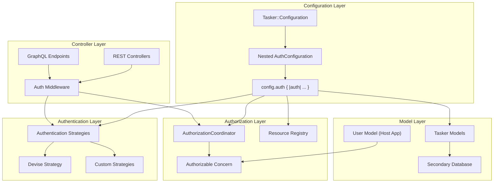

# Configuration-Backed Authentication, Authorization & Multi-Database Support

## Overview

This document outlines the implementation plan for adding flexible, configuration-driven authentication and authorization capabilities to the Tasker Rails engine, along with multi-database support. The design prioritizes flexibility, non-intrusiveness, and developer-friendly extension points while maintaining the engine's agnostic approach to host application concerns.

## Status

✅ **Phase 1: Configuration Foundation** - COMPLETED
🟡 **Phase 2: Authentication Layer** - IN PROGRESS
⚪ **Phase 3: Authorization Layer** - PLANNED
⚪ **Phase 4: Multi-Database Support** - PLANNED
⚪ **Phase 5: Controller Integration** - PLANNED
⚪ **Phase 6: Examples and Documentation** - PLANNED
⚪ **Phase 7: Comprehensive Test Suite** - PLANNED

## Goals

1. **Authentication Extension Points** - Provide configurable authentication strategies that integrate with common Rails authentication systems (primarily Devise)
2. **Resource-Based Authorization** - Implement a declarative authorization system using resource-and-verb patterns
3. **Multi-Database Support** - Enable Tasker models to use a separate database from the host application
4. **Non-Intrusive Integration** - Ensure all features work seamlessly without requiring specific authentication systems
5. **Developer-Friendly API** - Provide clear extension points and concerns for easy customization

## Architecture Overview



## Implementation Plan

### Phase 1: Configuration Foundation ✅ COMPLETED

**Overview**: Implement nested auth configuration with `config.auth` block for clean separation of authentication, authorization, and database configuration.

#### ✅ 1.1 Nested Configuration Architecture - COMPLETED

Created nested `AuthConfiguration` class within `Tasker::Configuration`:

**AuthConfiguration Class:**
- `strategy` (:none, :devise, :custom) - Authentication strategy
- `options` (hash) - Strategy-specific settings
- `current_user_method` (:current_user default) - Method to get current user
- `authenticate_user_method` (:authenticate_user! default) - Method to authenticate
- `coordinator_class` ('Tasker::Authorization::BaseCoordinator' default) - Authorization coordinator
- `user_class` (nil default) - Points to app user model
- `enabled` (false default) - Enable authorization
**Nested Configuration API:**
```ruby
Tasker.configuration do |config|
  config.auth do |auth|
    # Authentication and authorization configuration
    auth.strategy = :devise
    auth.options = { scope: :user }
    auth.enabled = true
  end

  config.database do |database|
    # Database configuration
    database.name = :tasker
    database.enable_secondary_database = true
  end
end
```

#### ✅ 1.2 Alias Methods for API Flexibility - COMPLETED

Provided convenience aliases for cleaner API:
- `authentication_strategy` → `strategy`
- `authentication_options` → `options`
- `authorization_coordinator_class` → `coordinator_class`
- `authorizable_user_class` → `user_class`
- `enable_authorization` → `enabled`

#### ✅ 1.3 Comprehensive Testing - COMPLETED

Implemented test suite with 33 passing tests:
- Nested auth configuration block functionality
- Default values for all auth configuration options
- Setter functionality with both direct and alias methods
- Integration scenarios (Devise, API auth, multi-database, full-featured)
- Backward compatibility verification
- Global configuration with nested auth blocks

#### ✅ 1.4 Clean Configuration Structure - COMPLETED

Benefits of the nested approach:
- **Organized**: All auth-related configuration in one namespace
- **Discoverable**: Clear `config.auth` entry point
- **Flexible**: Supports both block and direct configuration
- **Maintainable**: Separated auth concerns from core Tasker configuration
- **Idiomatic**: Follows Rails configuration patterns

#### ✅ 1.5 Configuration Testing - COMPLETED

Implemented comprehensive test suite with 34 passing tests:
- Default values for all new configuration options
- Setter functionality for authentication, authorization, and database options
- Integration scenarios (Devise, API auth, multi-database, full-featured)
- Singleton behavior and delegation with proper isolation
- Backward compatibility verification

#### ✅ 1.6 Example Classes Created - COMPLETED

- `spec/examples/custom_authorization_coordinator.rb` - Template authorization implementation
- `spec/examples/user_with_tasker_auth.rb` - Example user model with Authorizable concern

#### ✅ 1.7 Database Configuration Refinement - COMPLETED

Changed from inline database configuration to Rails-standard approach:
- Uses `database_name` (string/symbol) referencing database.yml entries
- Follows Rails multi-database conventions
- Simplified configuration approach

### Phase 2: Authentication Layer 🟡 IN PROGRESS

**Overview**: Implement extensible authentication hooks using dependency injection pattern, providing interfaces that work with any authentication provider (Devise, OmniAuth, JWT, Custom) without building provider-specific code into the engine.

**Design Change**: **Updated from original strategy-based approach** to avoid building provider-specific authentication strategies directly into the engine. Instead, we provide a clear interface contract that host applications implement, enabling true provider agnosticism and better separation of concerns.

**Design Philosophy**: Following the [Ruby authentication ecosystem](https://auth0.com/blog/five-ruby-gems-for-authentication-and-authorization/), we support:
- **Devise**: Database-based authentication with comprehensive features
- **OmniAuth**: Multi-provider authentication (OAuth, SAML, JWT, etc.)
- **Custom Strategies**: JWT, API tokens, or any custom authentication approach
- **Provider Agnostic**: Host applications provide their own authentication logic

#### 2.1 Authentication Interface Pattern

**Files to Create:**
- `lib/tasker/authentication/interface.rb` - Authentication interface contract
- `lib/tasker/authentication/none_authenticator.rb` - No authentication (passthrough)
- `lib/tasker/authentication/coordinator.rb` - Central coordination
- `lib/tasker/authentication/errors.rb` - Authentication error classes

**Core Interface Design:**

```ruby
# lib/tasker/authentication/interface.rb
module Tasker
  module Authentication
    # Interface that host application authenticators must implement
    module Interface
      # Required: Authenticate the request, raise exception if fails
      # @param controller [ActionController::Base] The controller instance
      # @return [void] Should raise exception on authentication failure
      def authenticate!(controller)
        raise NotImplementedError, "Authenticator must implement #authenticate!"
      end

      # Required: Get the current authenticated user
      # @param controller [ActionController::Base] The controller instance
      # @return [Object, nil] The authenticated user object or nil
      def current_user(controller)
        raise NotImplementedError, "Authenticator must implement #current_user"
      end

      # Optional: Check if user is authenticated (uses current_user by default)
      # @param controller [ActionController::Base] The controller instance
      # @return [Boolean] true if authenticated, false otherwise
      def authenticated?(controller)
        current_user(controller).present?
      end

      # Optional: Configuration validation for the authenticator
      # @param options [Hash] Configuration options
      # @return [Array<String>] Array of validation error messages, empty if valid
      def validate_configuration(options = {})
        []
      end
    end
  end
end
```

**Key Features:**
- **Dependency Injection**: Host apps provide their own authenticator implementations
- **Provider Agnostic**: Works with any authentication system
- **Clear Interface**: Simple contract with required and optional methods
- **Validation Support**: Built-in configuration validation

#### 2.2 Built-in Components

**None Authenticator (Engine Implementation):**

```ruby
# lib/tasker/authentication/none_authenticator.rb
module Tasker
  module Authentication
    class NoneAuthenticator
      include Interface

      def authenticate!(controller)
        # No authentication required - always succeeds
        true
      end

      def current_user(controller)
        # No user in no-auth mode
        nil
      end

      def authenticated?(controller)
        # Always considered "authenticated" in no-auth mode
        true
      end
    end
  end
end
```

**Error Classes:**

```ruby
# lib/tasker/authentication/errors.rb
module Tasker
  module Authentication
    class AuthenticationError < StandardError; end
    class ConfigurationError < StandardError; end
    class InterfaceError < StandardError; end
  end
end
```

#### 2.3 Authentication Coordinator

**File to Create:**
- `lib/tasker/authentication/coordinator.rb` - Central authentication coordinator

**Implementation Details:**

```ruby
# lib/tasker/authentication/coordinator.rb
module Tasker
  module Authentication
    class Coordinator
      class << self
        def authenticator
          @authenticator ||= build_authenticator
        end

        def authenticate!(controller)
          authenticator.authenticate!(controller)
        end

        def current_user(controller)
          authenticator.current_user(controller)
        end

        def authenticated?(controller)
          authenticator.authenticated?(controller)
        end

        def reset!
          @authenticator = nil
        end

        private

        def build_authenticator
          auth_config = Tasker.configuration.auth

          case auth_config.strategy
          when :none
            NoneAuthenticator.new
          when :custom
            build_custom_authenticator(auth_config)
          else
            raise ConfigurationError,
                  "Unsupported authentication strategy: #{auth_config.strategy}. " \
                  "Use :none or :custom with authenticator_class option."
          end
        end

        def build_custom_authenticator(auth_config)
          authenticator_class = auth_config.options[:authenticator_class]

          unless authenticator_class
            raise ConfigurationError,
                  "Custom authentication strategy requires authenticator_class option"
          end

          # Instantiate the host app's authenticator
          klass = authenticator_class.constantize
          authenticator = klass.new(auth_config.options)

          # Validate it implements the interface
          validate_authenticator!(authenticator)

          authenticator
        end

        def validate_authenticator!(authenticator)
          required_methods = [:authenticate!, :current_user]

          required_methods.each do |method|
            unless authenticator.respond_to?(method)
              raise InterfaceError,
                    "Authenticator #{authenticator.class} must implement ##{method}"
            end
          end

          # Run configuration validation if supported
          if authenticator.respond_to?(:validate_configuration)
            errors = authenticator.validate_configuration(Tasker.configuration.auth.options)
            if errors.any?
              raise ConfigurationError,
                    "Authenticator configuration errors: #{errors.join(', ')}"
            end
          end
        end
      end
    end
  end
end
```

**Key Features:**
- **Dependency Injection**: Instantiates host app's authenticator classes
- **Interface Validation**: Ensures authenticators implement required methods
- **Configuration Validation**: Supports authenticator-specific config validation
- **Error Handling**: Clear error messages for misconfigurations

#### 2.4 Authenticatable Concern

**File to Create:**
- `lib/tasker/concerns/authenticatable.rb` - Controller concern for authentication

**Implementation Details:**

```ruby
# lib/tasker/concerns/authenticatable.rb
module Tasker
  module Concerns
    module Authenticatable
      extend ActiveSupport::Concern

      included do
        before_action :authenticate_tasker_user!, unless: :skip_authentication?
      end

      private

      def authenticate_tasker_user!
        return true if skip_authentication?

        Tasker::Authentication::Coordinator.authenticate!(self)
      end

      def current_tasker_user
        @current_tasker_user ||= Tasker::Authentication::Coordinator.current_user(self)
      end

      def tasker_user_authenticated?
        Tasker::Authentication::Coordinator.authenticated?(self)
      end

      def skip_authentication?
        Tasker.configuration.auth.strategy == :none
      end
    end
  end
end
```

**Key Features:**
- **Automatic Authentication**: Uses before_action to ensure authentication
- **Skip Logic**: Respects :none strategy for no authentication
- **Helper Methods**: Provides current_tasker_user and authentication check methods
- **Non-Intrusive**: Only affects controllers that include it

#### 2.5 Host Application Authenticator Examples

**Example Authenticators for Common Providers:**

```ruby
# Example: Devise-based authenticator (implemented by host app)
# app/lib/authenticators/devise_authenticator.rb
class DeviseAuthenticator
  include Tasker::Authentication::Interface

  def initialize(options = {})
    @scope = options[:scope] || :user
    @failure_app = options[:failure_app]
  end

  def authenticate!(controller)
    # Use Devise's built-in authentication
    controller.send("authenticate_#{@scope}!")
  end

  def current_user(controller)
    # Use Devise's current_user helper
    controller.send("current_#{@scope}")
  end

  def validate_configuration(options = {})
    errors = []
    scope = options[:scope] || :user

    unless defined?(Devise)
      errors << "Devise gem is required for DeviseAuthenticator"
    end

    unless scope.is_a?(Symbol)
      errors << "Devise scope must be a symbol"
    end

    errors
  end

  private

  attr_reader :scope, :failure_app
end

# Example: JWT API authenticator (implemented by host app)
# app/lib/authenticators/jwt_authenticator.rb
class JwtAuthenticator
  include Tasker::Authentication::Interface

  def initialize(options = {})
    @secret = options[:secret] || Rails.application.secret_key_base
    @header_name = options[:header_name] || 'Authorization'
    @user_class = options[:user_class] || 'User'
  end

  def authenticate!(controller)
    user = current_user(controller)
    unless user
      raise Tasker::Authentication::AuthenticationError, "Invalid or missing JWT token"
    end
  end

  def current_user(controller)
    return @current_user if defined?(@current_user)

    @current_user = begin
      token = extract_token(controller.request)
      return nil unless token

      payload = JWT.decode(token, @secret, true, { algorithm: 'HS256' }).first
      user_class.constantize.find(payload['user_id'])
    rescue JWT::DecodeError, ActiveRecord::RecordNotFound
      nil
    end
  end

  def validate_configuration(options = {})
    errors = []

    unless options[:secret].present?
      errors << "JWT secret is required"
    end

    user_class = options[:user_class] || 'User'
    begin
      user_class.constantize
    rescue NameError
      errors << "User class '#{user_class}' not found"
    end

    errors
  end

  private

  attr_reader :secret, :header_name, :user_class

  def extract_token(request)
    header = request.headers[@header_name]
    return nil unless header

    # Support "Bearer <token>" format
    header.sub(/^Bearer /, '')
  end
end

# Example: OmniAuth-based authenticator (implemented by host app)
# app/lib/authenticators/omniauth_authenticator.rb
class OmniauthAuthenticator
  include Tasker::Authentication::Interface

  def initialize(options = {})
    @user_finder_method = options[:user_finder_method] || :find_by_provider_uid
  end

  def authenticate!(controller)
    unless authenticated?(controller)
      # Redirect to OmniAuth provider or raise error based on context
      if controller.request.format.html?
        controller.redirect_to('/auth/failure')
      else
        raise Tasker::Authentication::AuthenticationError, "Authentication required"
      end
    end
  end

  def current_user(controller)
    return @current_user if defined?(@current_user)

    @current_user = begin
      if controller.session[:user_id]
        User.find(controller.session[:user_id])
      elsif controller.session[:omniauth_auth]
        auth_data = controller.session[:omniauth_auth]
        User.send(@user_finder_method, auth_data['provider'], auth_data['uid'])
      end
    rescue ActiveRecord::RecordNotFound
      nil
    end
  end

  private

  attr_reader :user_finder_method
end
```

#### 2.6 Implementation Plan for Phase 2

**Step 1: Create Authentication Module Structure**
- Create `lib/tasker/authentication/` directory
- Set up interface module and error classes
- Create none authenticator for no-auth scenarios

**Step 2: Build Core Infrastructure**
- Authentication coordinator with dependency injection
- Interface validation and configuration validation
- Error handling and clear error messages

**Step 3: Create Controller Integration**
- Authenticatable concern for easy controller integration
- Helper methods for authentication state
- Before-action hooks for automatic authentication

**Step 4: Documentation and Examples**
- Example authenticators for Devise, JWT, OmniAuth
- Configuration examples for different scenarios
- Integration guides for host applications

**Step 5: Testing**
- Unit tests for coordinator and none authenticator
- Integration tests with example authenticators
- Controller tests with concern
- Configuration validation tests

#### 2.7 Testing Strategy for Phase 2

**Test Files to Create:**
- `spec/lib/tasker/authentication/interface_spec.rb`
- `spec/lib/tasker/authentication/none_authenticator_spec.rb`
- `spec/lib/tasker/authentication/coordinator_spec.rb`
- `spec/lib/tasker/authentication/errors_spec.rb`
- `spec/lib/tasker/concerns/authenticatable_spec.rb`
- `spec/examples/authenticators/devise_authenticator_spec.rb`
- `spec/examples/authenticators/jwt_authenticator_spec.rb`
- `spec/integration/authentication_integration_spec.rb`

**Test Coverage:**
- Interface compliance validation
- Configuration-based authenticator instantiation
- Controller integration scenarios
- Error handling and edge cases
- Example authenticator implementations

#### 2.8 Integration Points

**Configuration Integration:**
- Authenticators instantiated from `Tasker.configuration.auth.strategy` and `options`
- Host apps provide authenticator class via `auth.options[:authenticator_class]`
- Interface validation ensures compatibility

**Controller Integration:**
- Include `Tasker::Concerns::Authenticatable` in controllers
- Automatic authentication via before_action
- Helper methods available in controller actions

**Future Phase Integration:**
- Authentication state feeds into authorization layer
- User object passed to authorization coordinators
- Multi-database authentication considerations

**Developer Experience Benefits:**
- **Provider Agnostic**: Works with any authentication system
- **Clear Interface**: Simple contract for authenticator implementation
- **Configuration Validation**: Built-in validation with helpful error messages
- **Extensible**: Easy to add new authentication providers

#### 2.9 Configuration Examples After Phase 2

```ruby
# config/initializers/tasker.rb

# Example 1: Devise integration (host app implements DeviseAuthenticator)
Tasker.configuration do |config|
  config.auth do |auth|
    auth.strategy = :custom
    auth.options = {
      authenticator_class: 'DeviseAuthenticator',
      scope: :user
    }
  end
end

# Example 2: JWT API authentication (host app implements JwtAuthenticator)
Tasker.configuration do |config|
  config.auth do |auth|
    auth.strategy = :custom
    auth.options = {
      authenticator_class: 'JwtAuthenticator',
      secret: Rails.application.credentials.jwt_secret,
      header_name: 'Authorization',
      user_class: 'ApiUser'
    }
  end
end

# Example 3: OmniAuth integration (host app implements OmniauthAuthenticator)
Tasker.configuration do |config|
  config.auth do |auth|
    auth.strategy = :custom
    auth.options = {
      authenticator_class: 'OmniauthAuthenticator',
      user_finder_method: :find_by_provider_and_uid
    }
  end
end

# Example 4: No authentication (development/testing)
Tasker.configuration do |config|
  config.auth do |auth|
    auth.strategy = :none
  end
end

# Example 5: Multiple authentication for different contexts
Tasker.configuration do |config|
  config.auth do |auth|
    # Primary authentication strategy
    auth.strategy = :custom
    auth.options = {
      authenticator_class: Rails.env.development? ? 'DeviseAuthenticator' : 'JwtAuthenticator',
      # Environment-specific options
      **Rails.env.development? ? { scope: :user } : {
        secret: Rails.application.credentials.jwt_secret,
        user_class: 'ApiUser'
      }
    }
  end
end
```

**Usage in Controllers:**
```ruby
# app/controllers/tasker/tasks_controller.rb
module Tasker
  class TasksController < ApplicationController
    include Tasker::Concerns::Authenticatable

    def index
      # Authentication happens automatically via before_action
      # current_tasker_user is available here (from any auth provider)
      # tasker_user_authenticated? returns true/false

      user = current_tasker_user
      # user could be from Devise, JWT, OmniAuth, or any custom auth system
    end
  end
end
```

**Phase 2 Success Criteria:**
- [ ] Authentication interface and coordinator implemented and tested
- [ ] None authenticator for no-auth scenarios implemented
- [ ] Host app authenticator dependency injection working
- [ ] Interface validation and configuration validation functional
- [ ] Authenticatable concern functional in controllers
- [ ] Example authenticators documented (Devise, JWT, OmniAuth)
- [ ] Backward compatibility maintained (no authentication by default)
- [ ] Comprehensive test coverage (>95%)
- [ ] Clear error messages for misconfigurations

This detailed plan for Phase 2 provides clear implementation steps, testing strategy, and integration points for the authentication layer. Each component builds on the configuration foundation from Phase 1 and prepares for the authorization layer in Phase 3.

### Phase 3: Authorization Layer ⚪ PLANNED

#### 3.1 Resource Registry

```ruby
# lib/tasker/authorization/resource_registry.rb
module Tasker
  module Authorization
    class ResourceRegistry
      RESOURCES = {
        'tasker.task' => {
          actions: [:index, :show, :create, :update, :destroy, :retry, :cancel],
          description: 'Tasker workflow tasks'
        },
        'tasker.workflow_step' => {
          actions: [:index, :show, :update, :retry, :cancel],
          description: 'Individual workflow steps'
        },
        'tasker.task_diagram' => {
          actions: [:show],
          description: 'Task workflow diagrams'
        }
      }.freeze

      class << self
        def resources
          RESOURCES
        end

        def resource_exists?(resource)
          RESOURCES.key?(resource)
        end

        def action_exists?(resource, action)
          return false unless resource_exists?(resource)
          RESOURCES[resource][:actions].include?(action.to_sym)
        end

        def all_permissions
          RESOURCES.flat_map do |resource, config|
            config[:actions].map { |action| "#{resource}:#{action}" }
          end
        end
      end
    end
  end
end
```

#### 3.2 Authorization Coordinator Base Class

```ruby
# lib/tasker/authorization/base_coordinator.rb
module Tasker
  module Authorization
    class BaseCoordinator
      def initialize(user = nil)
        @user = user
      end

      def authorize!(resource, action, context = {})
        unless can?(resource, action, context)
          raise Tasker::Authorization::UnauthorizedError,
                "Not authorized to #{action} on #{resource}"
        end
      end

      def can?(resource, action, context = {})
        # Default: allow all actions if no authorization is configured
        return true unless authorization_enabled?

        # Validate resource and action exist
        unless ResourceRegistry.action_exists?(resource, action)
          raise ArgumentError, "Unknown resource:action '#{resource}:#{action}'"
        end

        # Delegate to subclass implementation
        authorized?(resource, action, context)
      end

      protected

      def authorized?(resource, action, context = {})
        # Default implementation: no access
        false
      end

      def authorization_enabled?
        Tasker.configuration.auth.enabled
      end

      attr_reader :user
    end

    class UnauthorizedError < StandardError; end
  end
end
```

#### 3.3 Authorizable Concern

```ruby
# lib/tasker/concerns/authorizable.rb
module Tasker
  module Concerns
    module Authorizable
      extend ActiveSupport::Concern

      included do
        # This concern provides a standard interface for authorization
        # The implementing class should define permission-checking methods
      end

      class_methods do
        def tasker_authorizable_config
          @tasker_authorizable_config ||= {
            permission_method: :has_tasker_permission?,
            role_method: :tasker_roles,
            admin_method: :tasker_admin?
          }
        end

        def configure_tasker_authorization(options = {})
          tasker_authorizable_config.merge!(options)
        end
      end

      # Standard interface methods that can be overridden
      def has_tasker_permission?(permission)
        # Default: check if a permissions method exists
        if respond_to?(:permissions)
          permissions.include?(permission)
        else
          false
        end
      end

      def tasker_roles
        # Default: check if a roles method exists
        respond_to?(:roles) ? roles : []
      end

      def tasker_admin?
        # Default: check common admin patterns
        return true if respond_to?(:admin?) && admin?
        return true if respond_to?(:role) && role == 'admin'
        return true if tasker_roles.include?('admin')
        false
      end

      def tasker_permissions_for_resource(resource)
        # Override this method to provide resource-specific permissions
        ResourceRegistry.resources[resource]&.fetch(:actions, [])&.select do |action|
          has_tasker_permission?("#{resource}:#{action}")
        end || []
      end
    end
  end
end
```

#### 3.4 Authorizable Concern (Controller Integration)

```ruby
# lib/tasker/concerns/controller_authorizable.rb
module Tasker
  module Concerns
    module ControllerAuthorizable
      extend ActiveSupport::Concern

      included do
        before_action :authorize_tasker_action!, unless: :skip_authorization?
      end

      private

      def authorize_tasker_action!
        return true if skip_authorization?

        resource = tasker_resource_name
        action = tasker_action_name
        context = tasker_authorization_context

        authorization_coordinator.authorize!(resource, action, context)
      end

      def authorization_coordinator
        @authorization_coordinator ||= build_authorization_coordinator
      end

      def build_authorization_coordinator
        coordinator_class = Tasker.configuration.auth.coordinator_class.constantize
        coordinator_class.new(current_tasker_user)
      end

      def tasker_resource_name
        # Extract from controller and action
        controller_name = self.class.name.demodulize.underscore.gsub('_controller', '')
        "tasker.#{controller_name.singularize}"
      end

      def tasker_action_name
        action_name.to_sym
      end

      def tasker_authorization_context
        {
          controller: self,
          params: params,
          resource_id: params[:id],
          parent_resource_id: params[:task_id]
        }
      end

              def skip_authorization?
          !Tasker.configuration.auth.enabled
        end
    end
  end
end
```

### Phase 4: Multi-Database Support

#### 4.1 Database Configuration

```ruby
# lib/tasker/database/configuration.rb
module Tasker
  module Database
    class Configuration
      class << self
        def setup!
          return unless Tasker.configuration.database.enable_secondary_database

          config = Tasker.configuration.database.name
          return unless config

          # Define the abstract connection class
          setup_abstract_connection_class(config)

          # Configure all Tasker models to use the secondary database
          configure_tasker_models
        end

        private

        def setup_abstract_connection_class(config)
          # Create the abstract class if it doesn't exist
          unless Object.const_defined?('TaskerApplicationRecord')
            Object.const_set('TaskerApplicationRecord', Class.new(ActiveRecord::Base))
          end

          TaskerApplicationRecord.establish_connection(config)
          TaskerApplicationRecord.abstract_class = true
        end

        def configure_tasker_models
          # Configure all Tasker models to inherit from TaskerApplicationRecord
          [
            Tasker::Task,
            Tasker::WorkflowStep,
            # Add other Tasker models as needed
          ].each do |model_class|
            # Only change if not already configured
            unless model_class.superclass == TaskerApplicationRecord
              model_class.class_eval do
                self.abstract_class = false if respond_to?(:abstract_class)
              end

              # This approach allows us to change the parent class at runtime
              configure_model_inheritance(model_class)
            end
          end
        end

        def configure_model_inheritance(model_class)
          # Use connection_class_for_self to specify the connection
          model_class.class_eval do
            def self.connection_class
              TaskerApplicationRecord
            end
          end
        end
      end
    end
  end
end
```

#### 4.2 Model Updates

```ruby
# Updates to existing models to support multi-database

# lib/tasker/task.rb
module Tasker
  class Task < (Tasker.configuration.database.enable_secondary_database ? TaskerApplicationRecord : ApplicationRecord)
    # Existing model code remains the same
  end
end

# lib/tasker/workflow_step.rb
module Tasker
  class WorkflowStep < (Tasker.configuration.database.enable_secondary_database ? TaskerApplicationRecord : ApplicationRecord)
    # Existing model code remains the same
  end
end
```

### Phase 5: Controller Integration

#### 5.1 Update Existing Controllers

```ruby
# app/controllers/tasker/tasks_controller.rb
module Tasker
  class TasksController < ApplicationController
    include Tasker::Concerns::Authenticatable
    include Tasker::Concerns::ControllerAuthorizable

    # Existing controller code remains the same
    # Authentication and authorization happen automatically via concerns
  end
end

# app/controllers/tasker/workflow_steps_controller.rb
module Tasker
  class WorkflowStepsController < ApplicationController
    include Tasker::Concerns::Authenticatable
    include Tasker::Concerns::ControllerAuthorizable

    # Existing controller code remains the same
  end
end
```

#### 5.2 GraphQL Integration

```ruby
# lib/tasker/graphql/types/base_object.rb
module Tasker
  module GraphQL
    module Types
      class BaseObject < GraphQL::Schema::Object
        include Tasker::Concerns::ControllerAuthorizable

        def authorize_tasker_action!(resource, action, context = {})
          return true unless Tasker.configuration.auth.enabled

          coordinator = build_authorization_coordinator
          coordinator.authorize!(resource, action, context)
        end

        def current_tasker_user
          context[:current_user]
        end

        private

        def build_authorization_coordinator
          coordinator_class = Tasker.configuration.auth.coordinator_class.constantize
          coordinator_class.new(current_tasker_user)
        end
      end
    end
  end
end
```

### Phase 6: Examples and Documentation

#### 6.1 Example Authorization Coordinator

```ruby
# spec/examples/custom_authorization_coordinator.rb
class CustomAuthorizationCoordinator < Tasker::Authorization::BaseCoordinator
  protected

  def authorized?(resource, action, context = {})
    case resource
    when 'tasker.task'
      authorize_task_action(action, context)
    when 'tasker.workflow_step'
      authorize_step_action(action, context)
    else
      false
    end
  end

  private

  def authorize_task_action(action, context)
    return false unless user&.respond_to?(:has_tasker_permission?)

    case action
    when :index, :show
      user.has_tasker_permission?("tasker.task:#{action}")
    when :create, :update, :destroy
      user.tasker_admin? || user.has_tasker_permission?("tasker.task:#{action}")
    when :retry, :cancel
      # Special business logic: users can only retry/cancel their own tasks
      task_id = context[:resource_id]
      user.tasker_admin? || owns_task?(task_id)
    else
      false
    end
  end

  def authorize_step_action(action, context)
    return false unless user&.respond_to?(:has_tasker_permission?)

    # Steps are generally read-only for most users
    case action
    when :index, :show
      user.has_tasker_permission?("tasker.workflow_step:#{action}")
    when :update, :retry, :cancel
      user.tasker_admin?
    else
      false
    end
  end

  def owns_task?(task_id)
    return false unless task_id && user

    task = Tasker::Task.find_by(task_id: task_id)
    return false unless task

    # Check if user created the task (assuming context contains creator info)
    task.context['created_by_user_id'] == user.id.to_s
  end
end
```

#### 6.2 Example User Model

```ruby
# spec/examples/user_with_tasker_auth.rb
class User < ApplicationRecord
  include Tasker::Concerns::Authorizable

  # Configure the authorization methods
  configure_tasker_authorization(
    permission_method: :has_permission?,
    role_method: :user_roles,
    admin_method: :admin?
  )

  def has_permission?(permission)
    permissions.include?(permission)
  end

  def permissions
    @permissions ||= roles.flat_map(&:permissions).map(&:name)
  end

  def user_roles
    roles.map(&:name)
  end

  def admin?
    user_roles.include?('admin')
  end

  # Example: resource-specific permission checking
  def tasker_permissions_for_resource(resource)
    case resource
    when 'tasker.task'
      if admin?
        [:index, :show, :create, :update, :destroy, :retry, :cancel]
      else
        permissions.select { |p| p.start_with?('tasker.task:') }
                  .map { |p| p.split(':').last.to_sym }
      end
    when 'tasker.workflow_step'
      if admin?
        [:index, :show, :update, :retry, :cancel]
      else
        [:index, :show] # Regular users can only view steps
      end
    else
      []
    end
  end
end
```

## Testing Strategy

### Phase 7: Comprehensive Test Suite

#### 7.1 Configuration Tests
- Test default configuration values
- Test configuration validation
- Test environment-specific overrides

#### 7.2 Authentication Tests
- Test each authentication strategy (none, devise, custom)
- Test authentication coordinator
- Test controller integration
- Test GraphQL integration

#### 7.3 Authorization Tests
- Test resource registry
- Test base authorization coordinator
- Test custom authorization coordinator examples
- Test controller authorization
- Test GraphQL authorization

#### 7.4 Multi-Database Tests
- Test database configuration setup
- Test model inheritance changes
- Test connection management
- Test migrations with secondary database

#### 7.5 Integration Tests
- Test complete authentication + authorization flow
- Test API endpoints with different auth configurations
- Test GraphQL with authorization
- Test multi-database with authentication

## File Structure

```
lib/tasker/
├── authentication/              # Phase 2 🟡
│   ├── interface.rb
│   ├── none_authenticator.rb
│   ├── coordinator.rb
│   └── errors.rb
├── authorization/               # Phase 3 ⚪
│   ├── resource_registry.rb
│   ├── base_coordinator.rb
│   └── errors.rb
├── concerns/                    # Phase 2-3 🟡⚪
│   ├── authenticatable.rb      # Phase 2 🟡
│   ├── authorizable.rb         # Phase 3 ⚪
│   └── controller_authorizable.rb # Phase 3 ⚪
├── database/                    # Phase 4 ⚪
│   └── configuration.rb
└── configuration.rb             # Phase 1 ✅ COMPLETED

spec/
├── lib/tasker/
│   ├── authentication/          # Phase 2 Tests 🟡
│   │   ├── interface_spec.rb
│   │   ├── none_authenticator_spec.rb
│   │   ├── coordinator_spec.rb
│   │   └── errors_spec.rb
│   ├── authorization/           # Phase 3 Tests ⚪
│   ├── concerns/               # Phase 2-3 Tests 🟡⚪
│   │   ├── authenticatable_spec.rb     # Phase 2 🟡
│   │   ├── authorizable_spec.rb        # Phase 3 ⚪
│   │   └── controller_authorizable_spec.rb # Phase 3 ⚪
│   ├── database/               # Phase 4 Tests ⚪
│   ├── configuration_auth_db_spec.rb    # Phase 1 ✅ COMPLETED
│   ├── configuration_integration_spec.rb # Phase 1 ✅ COMPLETED
│   └── configuration_singleton_spec.rb  # Phase 1 ✅ COMPLETED
├── examples/                    # Phase 1 ✅ + Future Phases
│   ├── custom_authorization_coordinator.rb # Phase 1 ✅ COMPLETED
│   ├── user_with_tasker_auth.rb # Phase 1 ✅ COMPLETED
│   └── authenticators/          # Phase 2 🟡
│       ├── devise_authenticator.rb
│       ├── jwt_authenticator.rb
│       └── omniauth_authenticator.rb
└── integration/                 # Phase 5-7 ⚪
    ├── authentication_integration_spec.rb
    ├── authorization_integration_spec.rb
    └── multi_database_integration_spec.rb
```

## Migration Path

1. **Backward Compatibility**: All features are opt-in and default to current behavior
2. **Gradual Adoption**: Each component can be enabled independently
3. **Clear Documentation**: Comprehensive examples and guides for each feature
4. **Testing Coverage**: Full test suite ensures reliability
5. **Performance Impact**: Minimal overhead when features are disabled

## Benefits

1. **Flexibility**: Support for any authentication system via strategy pattern
2. **Consistency**: Standard interfaces for authorization across REST and GraphQL
3. **Scalability**: Secondary database support for high-volume deployments
4. **Security**: Declarative permissions with clear audit trails
5. **Developer Experience**: Clear extension points and comprehensive examples

This plan provides a robust foundation for authentication, authorization, and multi-database support while maintaining Tasker's core philosophy of flexibility and non-intrusiveness.
