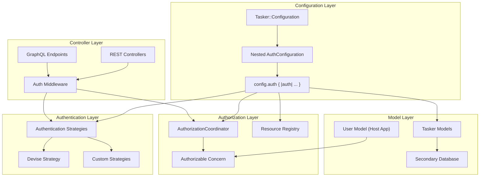

# Configuration-Backed Authentication, Authorization & Multi-Database Support

## Overview

This document outlines the implementation plan for adding flexible, configuration-driven authentication and authorization capabilities to the Tasker Rails engine, along with multi-database support. The design prioritizes flexibility, non-intrusiveness, and developer-friendly extension points while maintaining the engine's agnostic approach to host application concerns.

## Status

✅ **Phase 1: Configuration Foundation** - COMPLETED
🟡 **Phase 2: Authentication Layer** - IN PROGRESS
⚪ **Phase 3: Authorization Layer** - PLANNED
⚪ **Phase 4: Multi-Database Support** - PLANNED
⚪ **Phase 5: Controller Integration** - PLANNED
⚪ **Phase 6: Examples and Documentation** - PLANNED
⚪ **Phase 7: Comprehensive Test Suite** - PLANNED

## Goals

1. **Authentication Extension Points** - Provide configurable authentication strategies that integrate with common Rails authentication systems (primarily Devise)
2. **Resource-Based Authorization** - Implement a declarative authorization system using resource-and-verb patterns
3. **Multi-Database Support** - Enable Tasker models to use a separate database from the host application
4. **Non-Intrusive Integration** - Ensure all features work seamlessly without requiring specific authentication systems
5. **Developer-Friendly API** - Provide clear extension points and concerns for easy customization

## Architecture Overview



## Implementation Plan

### Phase 1: Configuration Foundation ✅ COMPLETED

**Overview**: Implement nested auth configuration with `config.auth` block for clean separation of authentication, authorization, and database configuration.

#### ✅ 1.1 Nested Configuration Architecture - COMPLETED

Created nested `AuthConfiguration` class within `Tasker::Configuration`:

**AuthConfiguration Class:**
- `strategy` (:none, :devise, :custom) - Authentication strategy
- `options` (hash) - Strategy-specific settings
- `current_user_method` (:current_user default) - Method to get current user
- `authenticate_user_method` (:authenticate_user! default) - Method to authenticate
- `coordinator_class` ('Tasker::Authorization::BaseCoordinator' default) - Authorization coordinator
- `user_class` (nil default) - Points to app user model
- `enabled` (false default) - Enable authorization
**Nested Configuration API:**
```ruby
Tasker.configuration do |config|
  config.auth do |auth|
    # Authentication and authorization configuration
    auth.strategy = :devise
    auth.options = { scope: :user }
    auth.enabled = true
  end

  config.database do |database|
    # Database configuration
    database.name = :tasker
    database.enable_secondary_database = true
  end
end
```

#### ✅ 1.2 Alias Methods for API Flexibility - COMPLETED

Provided convenience aliases for cleaner API:
- `authentication_strategy` → `strategy`
- `authentication_options` → `options`
- `authorization_coordinator_class` → `coordinator_class`
- `authorizable_user_class` → `user_class`
- `enable_authorization` → `enabled`

#### ✅ 1.3 Comprehensive Testing - COMPLETED

Implemented test suite with 33 passing tests:
- Nested auth configuration block functionality
- Default values for all auth configuration options
- Setter functionality with both direct and alias methods
- Integration scenarios (Devise, API auth, multi-database, full-featured)
- Backward compatibility verification
- Global configuration with nested auth blocks

#### ✅ 1.4 Clean Configuration Structure - COMPLETED

Benefits of the nested approach:
- **Organized**: All auth-related configuration in one namespace
- **Discoverable**: Clear `config.auth` entry point
- **Flexible**: Supports both block and direct configuration
- **Maintainable**: Separated auth concerns from core Tasker configuration
- **Idiomatic**: Follows Rails configuration patterns

#### ✅ 1.5 Configuration Testing - COMPLETED

Implemented comprehensive test suite with 34 passing tests:
- Default values for all new configuration options
- Setter functionality for authentication, authorization, and database options
- Integration scenarios (Devise, API auth, multi-database, full-featured)
- Singleton behavior and delegation with proper isolation
- Backward compatibility verification

#### ✅ 1.6 Example Classes Created - COMPLETED

- `spec/examples/custom_authorization_coordinator.rb` - Template authorization implementation
- `spec/examples/user_with_tasker_auth.rb` - Example user model with Authorizable concern

#### ✅ 1.7 Database Configuration Refinement - COMPLETED

Changed from inline database configuration to Rails-standard approach:
- Uses `database_name` (string/symbol) referencing database.yml entries
- Follows Rails multi-database conventions
- Simplified configuration approach

### Phase 2: Authentication Layer 🟡 IN PROGRESS

**Overview**: Implement the authentication strategy pattern with support for Devise, custom authentication, and no authentication.

#### 2.1 Authentication Strategy Pattern

**Files to Create:**
- `lib/tasker/authentication/base_strategy.rb` - Abstract base class
- `lib/tasker/authentication/devise_strategy.rb` - Devise integration
- `lib/tasker/authentication/none_strategy.rb` - No authentication (passthrough)
- `lib/tasker/authentication/custom_strategy.rb` - Custom authentication support

**Implementation Details:**

```ruby
# lib/tasker/authentication/base_strategy.rb
module Tasker
  module Authentication
    class BaseStrategy
      def initialize(options = {})
        @options = options
      end

      def authenticate!(controller)
        raise NotImplementedError, "Subclasses must implement #authenticate!"
      end

      def current_user(controller)
        raise NotImplementedError, "Subclasses must implement #current_user"
      end

      def authenticated?(controller)
        current_user(controller).present?
      end

      protected

      attr_reader :options
    end
  end
end
```

**Key Features:**
- **Strategy Pattern**: Clean interface for different authentication methods
- **Controller Integration**: Strategies work with any Rails controller
- **Configurable Options**: Each strategy can accept specific configuration
- **Consistent Interface**: All strategies implement the same methods

#### 2.2 Authentication Coordinator

**File to Create:**
- `lib/tasker/authentication/coordinator.rb` - Central authentication coordinator

**Implementation Details:**

```ruby
# lib/tasker/authentication/coordinator.rb
module Tasker
  module Authentication
    class Coordinator
      class << self
        def strategy
          @strategy ||= build_strategy
        end

        def authenticate!(controller)
          strategy.authenticate!(controller)
        end

        def current_user(controller)
          strategy.current_user(controller)
        end

        def authenticated?(controller)
          strategy.authenticated?(controller)
        end

        private

        def build_strategy
          strategy_name = Tasker.configuration.auth.strategy
          options = Tasker.configuration.auth.options

          case strategy_name
          when :devise
            DeviseStrategy.new(options)
          when :custom
            build_custom_strategy(options)
          else
            NoneStrategy.new(options)
          end
        end

        def build_custom_strategy(options)
          if options[:authenticator_class]
            options[:authenticator_class].constantize.new(options)
          else
            CustomStrategy.new(options)
          end
        end
      end
    end
  end
end
```

**Key Features:**
- **Singleton Pattern**: Single point of access for authentication
- **Strategy Selection**: Automatically builds the correct strategy based on configuration
- **Custom Strategy Support**: Can instantiate custom authenticator classes
- **Configuration Integration**: Uses Tasker.configuration settings

#### 2.3 Authenticatable Concern

**File to Create:**
- `lib/tasker/concerns/authenticatable.rb` - Controller concern for authentication

**Implementation Details:**

```ruby
# lib/tasker/concerns/authenticatable.rb
module Tasker
  module Concerns
    module Authenticatable
      extend ActiveSupport::Concern

      included do
        before_action :authenticate_tasker_user!, unless: :skip_authentication?
      end

      private

      def authenticate_tasker_user!
        return true if skip_authentication?

        Tasker::Authentication::Coordinator.authenticate!(self)
      end

      def current_tasker_user
        @current_tasker_user ||= Tasker::Authentication::Coordinator.current_user(self)
      end

      def tasker_user_authenticated?
        Tasker::Authentication::Coordinator.authenticated?(self)
      end

      def skip_authentication?
        Tasker.configuration.auth.strategy == :none
      end
    end
  end
end
```

**Key Features:**
- **Automatic Authentication**: Uses before_action to ensure authentication
- **Skip Logic**: Respects :none strategy for no authentication
- **Helper Methods**: Provides current_tasker_user and authentication check methods
- **Non-Intrusive**: Only affects controllers that include it

#### 2.4 Implementation Plan for Phase 2

**Step 1: Create Authentication Module Structure**
- Create `lib/tasker/authentication/` directory
- Set up base strategy abstract class
- Create error classes for authentication failures

**Step 2: Implement Core Strategies**
- `NoneStrategy`: Pass-through for no authentication
- `DeviseStrategy`: Integration with Devise gem
- `CustomStrategy`: Base for custom authentication implementations

**Step 3: Build Coordinator**
- Central authentication coordinator
- Strategy selection based on configuration
- Clean interface for controller integration

**Step 4: Create Authenticatable Concern**
- Controller concern for easy integration
- Helper methods for authentication state
- Before-action hooks for automatic authentication

**Step 5: Testing**
- Unit tests for each strategy
- Integration tests with coordinator
- Controller tests with concern
- Configuration integration tests

#### 2.5 Testing Strategy for Phase 2

**Test Files to Create:**
- `spec/lib/tasker/authentication/base_strategy_spec.rb`
- `spec/lib/tasker/authentication/devise_strategy_spec.rb`
- `spec/lib/tasker/authentication/none_strategy_spec.rb`
- `spec/lib/tasker/authentication/custom_strategy_spec.rb`
- `spec/lib/tasker/authentication/coordinator_spec.rb`
- `spec/lib/tasker/concerns/authenticatable_spec.rb`
- `spec/integration/authentication_integration_spec.rb`

**Test Coverage:**
- Strategy interface compliance
- Configuration-based strategy selection
- Controller integration scenarios
- Error handling and edge cases
- Backward compatibility with existing code

#### 2.6 Integration Points

**Configuration Integration:**
- Strategies read from `Tasker.configuration.auth.strategy`
- Options passed from `Tasker.configuration.auth.options`
- Method names configurable via `auth.current_user_method` and `auth.authenticate_user_method`

**Controller Integration:**
- Include `Tasker::Concerns::Authenticatable` in controllers
- Automatic authentication via before_action
- Helper methods available in controller actions

**Future Phase Integration:**
- Authentication state feeds into authorization layer
- User object passed to authorization coordinators
- Multi-database authentication considerations

**Developer Experience Benefits:**
- **Organized Configuration**: All auth settings grouped in `config.auth` block
- **IDE Support**: Better autocomplete and discoverability
- **Clear Separation**: Auth configuration separate from core Tasker settings
- **Flexible Usage**: Support both block and direct property setting

#### 2.7 Example Usage After Phase 2

```ruby
# config/initializers/tasker.rb

# Example 1: Basic Devise integration
Tasker.configuration do |config|
  config.auth do |auth|
    auth.strategy = :devise
    auth.options = {
      scope: :user,
      failure_app: Devise::FailureApp
    }
  end
end

# Example 2: Custom API authentication
Tasker.configuration do |config|
  config.auth do |auth|
    auth.strategy = :custom
    auth.options = {
      authenticator_class: 'MyApp::ApiAuthenticator',
      token_header: 'X-API-Token'
    }
    auth.current_user_method = :current_api_user
    auth.authenticate_user_method = :authenticate_api_user!
  end
end

# Example 3: No authentication (development/testing)
Tasker.configuration do |config|
  config.auth do |auth|
    auth.strategy = :none
  end
end
```

```ruby
# app/controllers/tasker/tasks_controller.rb
module Tasker
  class TasksController < ApplicationController
    include Tasker::Concerns::Authenticatable

    def index
      # Authentication happens automatically via before_action
      # current_tasker_user is available here
      # tasker_user_authenticated? returns true/false
    end
  end
end
```

**Phase 2 Success Criteria:**
- [ ] All authentication strategies implemented and tested
- [ ] Authentication coordinator working with configuration
- [ ] Authenticatable concern functional in controllers
- [ ] Backward compatibility maintained (no authentication by default)
- [ ] Comprehensive test coverage (>95%)
- [ ] Documentation and examples updated

This detailed plan for Phase 2 provides clear implementation steps, testing strategy, and integration points for the authentication layer. Each component builds on the configuration foundation from Phase 1 and prepares for the authorization layer in Phase 3.

### Phase 3: Authorization Layer ⚪ PLANNED

#### 3.1 Resource Registry

```ruby
# lib/tasker/authorization/resource_registry.rb
module Tasker
  module Authorization
    class ResourceRegistry
      RESOURCES = {
        'tasker.task' => {
          actions: [:index, :show, :create, :update, :destroy, :retry, :cancel],
          description: 'Tasker workflow tasks'
        },
        'tasker.workflow_step' => {
          actions: [:index, :show, :update, :retry, :cancel],
          description: 'Individual workflow steps'
        },
        'tasker.task_diagram' => {
          actions: [:show],
          description: 'Task workflow diagrams'
        }
      }.freeze

      class << self
        def resources
          RESOURCES
        end

        def resource_exists?(resource)
          RESOURCES.key?(resource)
        end

        def action_exists?(resource, action)
          return false unless resource_exists?(resource)
          RESOURCES[resource][:actions].include?(action.to_sym)
        end

        def all_permissions
          RESOURCES.flat_map do |resource, config|
            config[:actions].map { |action| "#{resource}:#{action}" }
          end
        end
      end
    end
  end
end
```

#### 3.2 Authorization Coordinator Base Class

```ruby
# lib/tasker/authorization/base_coordinator.rb
module Tasker
  module Authorization
    class BaseCoordinator
      def initialize(user = nil)
        @user = user
      end

      def authorize!(resource, action, context = {})
        unless can?(resource, action, context)
          raise Tasker::Authorization::UnauthorizedError,
                "Not authorized to #{action} on #{resource}"
        end
      end

      def can?(resource, action, context = {})
        # Default: allow all actions if no authorization is configured
        return true unless authorization_enabled?

        # Validate resource and action exist
        unless ResourceRegistry.action_exists?(resource, action)
          raise ArgumentError, "Unknown resource:action '#{resource}:#{action}'"
        end

        # Delegate to subclass implementation
        authorized?(resource, action, context)
      end

      protected

      def authorized?(resource, action, context = {})
        # Default implementation: no access
        false
      end

      def authorization_enabled?
        Tasker.configuration.auth.enabled
      end

      attr_reader :user
    end

    class UnauthorizedError < StandardError; end
  end
end
```

#### 3.3 Authorizable Concern

```ruby
# lib/tasker/concerns/authorizable.rb
module Tasker
  module Concerns
    module Authorizable
      extend ActiveSupport::Concern

      included do
        # This concern provides a standard interface for authorization
        # The implementing class should define permission-checking methods
      end

      class_methods do
        def tasker_authorizable_config
          @tasker_authorizable_config ||= {
            permission_method: :has_tasker_permission?,
            role_method: :tasker_roles,
            admin_method: :tasker_admin?
          }
        end

        def configure_tasker_authorization(options = {})
          tasker_authorizable_config.merge!(options)
        end
      end

      # Standard interface methods that can be overridden
      def has_tasker_permission?(permission)
        # Default: check if a permissions method exists
        if respond_to?(:permissions)
          permissions.include?(permission)
        else
          false
        end
      end

      def tasker_roles
        # Default: check if a roles method exists
        respond_to?(:roles) ? roles : []
      end

      def tasker_admin?
        # Default: check common admin patterns
        return true if respond_to?(:admin?) && admin?
        return true if respond_to?(:role) && role == 'admin'
        return true if tasker_roles.include?('admin')
        false
      end

      def tasker_permissions_for_resource(resource)
        # Override this method to provide resource-specific permissions
        ResourceRegistry.resources[resource]&.fetch(:actions, [])&.select do |action|
          has_tasker_permission?("#{resource}:#{action}")
        end || []
      end
    end
  end
end
```

#### 3.4 Authorizable Concern (Controller Integration)

```ruby
# lib/tasker/concerns/controller_authorizable.rb
module Tasker
  module Concerns
    module ControllerAuthorizable
      extend ActiveSupport::Concern

      included do
        before_action :authorize_tasker_action!, unless: :skip_authorization?
      end

      private

      def authorize_tasker_action!
        return true if skip_authorization?

        resource = tasker_resource_name
        action = tasker_action_name
        context = tasker_authorization_context

        authorization_coordinator.authorize!(resource, action, context)
      end

      def authorization_coordinator
        @authorization_coordinator ||= build_authorization_coordinator
      end

      def build_authorization_coordinator
        coordinator_class = Tasker.configuration.auth.coordinator_class.constantize
        coordinator_class.new(current_tasker_user)
      end

      def tasker_resource_name
        # Extract from controller and action
        controller_name = self.class.name.demodulize.underscore.gsub('_controller', '')
        "tasker.#{controller_name.singularize}"
      end

      def tasker_action_name
        action_name.to_sym
      end

      def tasker_authorization_context
        {
          controller: self,
          params: params,
          resource_id: params[:id],
          parent_resource_id: params[:task_id]
        }
      end

              def skip_authorization?
          !Tasker.configuration.auth.enabled
        end
    end
  end
end
```

### Phase 4: Multi-Database Support

#### 4.1 Database Configuration

```ruby
# lib/tasker/database/configuration.rb
module Tasker
  module Database
    class Configuration
      class << self
        def setup!
          return unless Tasker.configuration.database.enable_secondary_database

          config = Tasker.configuration.database.name
          return unless config

          # Define the abstract connection class
          setup_abstract_connection_class(config)

          # Configure all Tasker models to use the secondary database
          configure_tasker_models
        end

        private

        def setup_abstract_connection_class(config)
          # Create the abstract class if it doesn't exist
          unless Object.const_defined?('TaskerApplicationRecord')
            Object.const_set('TaskerApplicationRecord', Class.new(ActiveRecord::Base))
          end

          TaskerApplicationRecord.establish_connection(config)
          TaskerApplicationRecord.abstract_class = true
        end

        def configure_tasker_models
          # Configure all Tasker models to inherit from TaskerApplicationRecord
          [
            Tasker::Task,
            Tasker::WorkflowStep,
            # Add other Tasker models as needed
          ].each do |model_class|
            # Only change if not already configured
            unless model_class.superclass == TaskerApplicationRecord
              model_class.class_eval do
                self.abstract_class = false if respond_to?(:abstract_class)
              end

              # This approach allows us to change the parent class at runtime
              configure_model_inheritance(model_class)
            end
          end
        end

        def configure_model_inheritance(model_class)
          # Use connection_class_for_self to specify the connection
          model_class.class_eval do
            def self.connection_class
              TaskerApplicationRecord
            end
          end
        end
      end
    end
  end
end
```

#### 4.2 Model Updates

```ruby
# Updates to existing models to support multi-database

# lib/tasker/task.rb
module Tasker
  class Task < (Tasker.configuration.database.enable_secondary_database ? TaskerApplicationRecord : ApplicationRecord)
    # Existing model code remains the same
  end
end

# lib/tasker/workflow_step.rb
module Tasker
  class WorkflowStep < (Tasker.configuration.database.enable_secondary_database ? TaskerApplicationRecord : ApplicationRecord)
    # Existing model code remains the same
  end
end
```

### Phase 5: Controller Integration

#### 5.1 Update Existing Controllers

```ruby
# app/controllers/tasker/tasks_controller.rb
module Tasker
  class TasksController < ApplicationController
    include Tasker::Concerns::Authenticatable
    include Tasker::Concerns::ControllerAuthorizable

    # Existing controller code remains the same
    # Authentication and authorization happen automatically via concerns
  end
end

# app/controllers/tasker/workflow_steps_controller.rb
module Tasker
  class WorkflowStepsController < ApplicationController
    include Tasker::Concerns::Authenticatable
    include Tasker::Concerns::ControllerAuthorizable

    # Existing controller code remains the same
  end
end
```

#### 5.2 GraphQL Integration

```ruby
# lib/tasker/graphql/types/base_object.rb
module Tasker
  module GraphQL
    module Types
      class BaseObject < GraphQL::Schema::Object
        include Tasker::Concerns::ControllerAuthorizable

        def authorize_tasker_action!(resource, action, context = {})
          return true unless Tasker.configuration.auth.enabled

          coordinator = build_authorization_coordinator
          coordinator.authorize!(resource, action, context)
        end

        def current_tasker_user
          context[:current_user]
        end

        private

        def build_authorization_coordinator
          coordinator_class = Tasker.configuration.auth.coordinator_class.constantize
          coordinator_class.new(current_tasker_user)
        end
      end
    end
  end
end
```

### Phase 6: Examples and Documentation

#### 6.1 Example Authorization Coordinator

```ruby
# spec/examples/custom_authorization_coordinator.rb
class CustomAuthorizationCoordinator < Tasker::Authorization::BaseCoordinator
  protected

  def authorized?(resource, action, context = {})
    case resource
    when 'tasker.task'
      authorize_task_action(action, context)
    when 'tasker.workflow_step'
      authorize_step_action(action, context)
    else
      false
    end
  end

  private

  def authorize_task_action(action, context)
    return false unless user&.respond_to?(:has_tasker_permission?)

    case action
    when :index, :show
      user.has_tasker_permission?("tasker.task:#{action}")
    when :create, :update, :destroy
      user.tasker_admin? || user.has_tasker_permission?("tasker.task:#{action}")
    when :retry, :cancel
      # Special business logic: users can only retry/cancel their own tasks
      task_id = context[:resource_id]
      user.tasker_admin? || owns_task?(task_id)
    else
      false
    end
  end

  def authorize_step_action(action, context)
    return false unless user&.respond_to?(:has_tasker_permission?)

    # Steps are generally read-only for most users
    case action
    when :index, :show
      user.has_tasker_permission?("tasker.workflow_step:#{action}")
    when :update, :retry, :cancel
      user.tasker_admin?
    else
      false
    end
  end

  def owns_task?(task_id)
    return false unless task_id && user

    task = Tasker::Task.find_by(task_id: task_id)
    return false unless task

    # Check if user created the task (assuming context contains creator info)
    task.context['created_by_user_id'] == user.id.to_s
  end
end
```

#### 6.2 Example User Model

```ruby
# spec/examples/user_with_tasker_auth.rb
class User < ApplicationRecord
  include Tasker::Concerns::Authorizable

  # Configure the authorization methods
  configure_tasker_authorization(
    permission_method: :has_permission?,
    role_method: :user_roles,
    admin_method: :admin?
  )

  def has_permission?(permission)
    permissions.include?(permission)
  end

  def permissions
    @permissions ||= roles.flat_map(&:permissions).map(&:name)
  end

  def user_roles
    roles.map(&:name)
  end

  def admin?
    user_roles.include?('admin')
  end

  # Example: resource-specific permission checking
  def tasker_permissions_for_resource(resource)
    case resource
    when 'tasker.task'
      if admin?
        [:index, :show, :create, :update, :destroy, :retry, :cancel]
      else
        permissions.select { |p| p.start_with?('tasker.task:') }
                  .map { |p| p.split(':').last.to_sym }
      end
    when 'tasker.workflow_step'
      if admin?
        [:index, :show, :update, :retry, :cancel]
      else
        [:index, :show] # Regular users can only view steps
      end
    else
      []
    end
  end
end
```

## Testing Strategy

### Phase 7: Comprehensive Test Suite

#### 7.1 Configuration Tests
- Test default configuration values
- Test configuration validation
- Test environment-specific overrides

#### 7.2 Authentication Tests
- Test each authentication strategy (none, devise, custom)
- Test authentication coordinator
- Test controller integration
- Test GraphQL integration

#### 7.3 Authorization Tests
- Test resource registry
- Test base authorization coordinator
- Test custom authorization coordinator examples
- Test controller authorization
- Test GraphQL authorization

#### 7.4 Multi-Database Tests
- Test database configuration setup
- Test model inheritance changes
- Test connection management
- Test migrations with secondary database

#### 7.5 Integration Tests
- Test complete authentication + authorization flow
- Test API endpoints with different auth configurations
- Test GraphQL with authorization
- Test multi-database with authentication

## File Structure

```
lib/tasker/
├── authentication/              # Phase 2 🟡
│   ├── base_strategy.rb
│   ├── devise_strategy.rb
│   ├── none_strategy.rb
│   ├── custom_strategy.rb
│   └── coordinator.rb
├── authorization/               # Phase 3 ⚪
│   ├── resource_registry.rb
│   ├── base_coordinator.rb
│   └── errors.rb
├── concerns/                    # Phase 2-3 🟡⚪
│   ├── authenticatable.rb      # Phase 2 🟡
│   ├── authorizable.rb         # Phase 3 ⚪
│   └── controller_authorizable.rb # Phase 3 ⚪
├── database/                    # Phase 4 ⚪
│   └── configuration.rb
└── configuration.rb             # Phase 1 ✅ COMPLETED

spec/
├── lib/tasker/
│   ├── authentication/          # Phase 2 Tests 🟡
│   │   ├── base_strategy_spec.rb
│   │   ├── devise_strategy_spec.rb
│   │   ├── none_strategy_spec.rb
│   │   ├── custom_strategy_spec.rb
│   │   └── coordinator_spec.rb
│   ├── authorization/           # Phase 3 Tests ⚪
│   ├── concerns/               # Phase 2-3 Tests 🟡⚪
│   │   ├── authenticatable_spec.rb     # Phase 2 🟡
│   │   ├── authorizable_spec.rb        # Phase 3 ⚪
│   │   └── controller_authorizable_spec.rb # Phase 3 ⚪
│   ├── database/               # Phase 4 Tests ⚪
│   ├── configuration_auth_db_spec.rb    # Phase 1 ✅ COMPLETED
│   ├── configuration_integration_spec.rb # Phase 1 ✅ COMPLETED
│   └── configuration_singleton_spec.rb  # Phase 1 ✅ COMPLETED
├── examples/                    # Phase 1 ✅ + Future Phases
│   ├── custom_authorization_coordinator.rb # Phase 1 ✅ COMPLETED
│   ├── user_with_tasker_auth.rb # Phase 1 ✅ COMPLETED
│   └── custom_authentication_strategy.rb # Phase 2 🟡
└── integration/                 # Phase 5-7 ⚪
    ├── authentication_integration_spec.rb
    ├── authorization_integration_spec.rb
    └── multi_database_integration_spec.rb
```

## Migration Path

1. **Backward Compatibility**: All features are opt-in and default to current behavior
2. **Gradual Adoption**: Each component can be enabled independently
3. **Clear Documentation**: Comprehensive examples and guides for each feature
4. **Testing Coverage**: Full test suite ensures reliability
5. **Performance Impact**: Minimal overhead when features are disabled

## Benefits

1. **Flexibility**: Support for any authentication system via strategy pattern
2. **Consistency**: Standard interfaces for authorization across REST and GraphQL
3. **Scalability**: Secondary database support for high-volume deployments
4. **Security**: Declarative permissions with clear audit trails
5. **Developer Experience**: Clear extension points and comprehensive examples

This plan provides a robust foundation for authentication, authorization, and multi-database support while maintaining Tasker's core philosophy of flexibility and non-intrusiveness.
