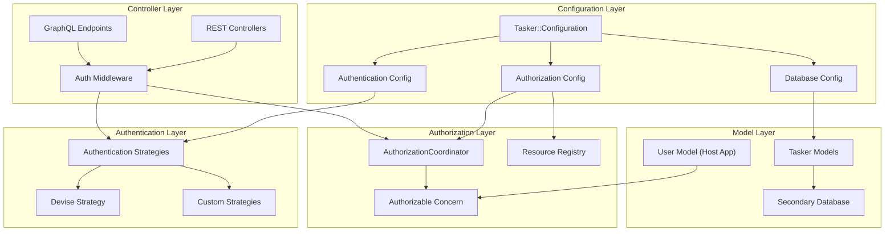

# Configuration-Backed Authentication, Authorization & Multi-Database Support

## Overview

This document outlines the implementation plan for adding flexible, configuration-driven authentication and authorization capabilities to the Tasker Rails engine, along with multi-database support. The design prioritizes flexibility, non-intrusiveness, and developer-friendly extension points while maintaining the engine's agnostic approach to host application concerns.

## Goals

1. **Authentication Extension Points** - Provide configurable authentication strategies that integrate with common Rails authentication systems (primarily Devise)
2. **Resource-Based Authorization** - Implement a declarative authorization system using resource-and-verb patterns
3. **Multi-Database Support** - Enable Tasker models to use a separate database from the host application
4. **Non-Intrusive Integration** - Ensure all features work seamlessly without requiring specific authentication systems
5. **Developer-Friendly API** - Provide clear extension points and concerns for easy customization

## Architecture Overview



## Implementation Plan

### Phase 1: Configuration Foundation

#### 1.1 Extend Tasker::Configuration

```ruby
# lib/tasker/configuration.rb additions
class Configuration
  # Authentication configuration
  attr_accessor :authentication_strategy
  attr_accessor :authentication_options
  attr_accessor :current_user_method
  attr_accessor :authenticate_user_method

  # Authorization configuration
  attr_accessor :authorization_coordinator_class
  attr_accessor :authorizable_user_class
  attr_accessor :enable_authorization

  # Database configuration
  attr_accessor :database_config
  attr_accessor :enable_secondary_database

  def initialize
    # Authentication defaults (assume no auth)
    @authentication_strategy = :none
    @authentication_options = {}
    @current_user_method = :current_user
    @authenticate_user_method = :authenticate_user!

    # Authorization defaults
    @authorization_coordinator_class = 'Tasker::Authorization::BaseCoordinator'
    @authorizable_user_class = nil
    @enable_authorization = false

    # Database defaults
    @database_config = nil
    @enable_secondary_database = false
  end
end
```

#### 1.2 Configuration Examples

```ruby
# config/initializers/tasker.rb

# Example 1: Basic Devise integration
Tasker.configuration do |config|
  config.authentication_strategy = :devise
  config.authentication_options = {
    scope: :user,
    failure_app: Devise::FailureApp
  }
  config.enable_authorization = true
  config.authorizable_user_class = 'User'
end

# Example 2: Custom authentication
Tasker.configuration do |config|
  config.authentication_strategy = :custom
  config.authentication_options = {
    authenticator_class: 'MyApp::ApiAuthenticator',
    token_header: 'X-API-Token'
  }
  config.current_user_method = :current_api_user
  config.authenticate_user_method = :authenticate_api_user!
end

# Example 3: Secondary database (using Rails database.yml configuration)
Tasker.configuration do |config|
  config.enable_secondary_database = true
  config.database_name = :tasker  # References the 'tasker' database defined in database.yml
end
```

### Phase 2: Authentication Layer

#### 2.1 Authentication Strategy Pattern

```ruby
# lib/tasker/authentication/base_strategy.rb
module Tasker
  module Authentication
    class BaseStrategy
      def initialize(options = {})
        @options = options
      end

      def authenticate!(controller)
        raise NotImplementedError, "Subclasses must implement #authenticate!"
      end

      def current_user(controller)
        raise NotImplementedError, "Subclasses must implement #current_user"
      end

      def authenticated?(controller)
        current_user(controller).present?
      end
    end
  end
end

# lib/tasker/authentication/devise_strategy.rb
module Tasker
  module Authentication
    class DeviseStrategy < BaseStrategy
      def authenticate!(controller)
        scope = @options[:scope] || :user
        controller.send("authenticate_#{scope}!")
      end

      def current_user(controller)
        scope = @options[:scope] || :user
        controller.send("current_#{scope}")
      end
    end
  end
end

# lib/tasker/authentication/none_strategy.rb
module Tasker
  module Authentication
    class NoneStrategy < BaseStrategy
      def authenticate!(controller)
        # No authentication required
        true
      end

      def current_user(controller)
        nil
      end

      def authenticated?(controller)
        true
      end
    end
  end
end
```

#### 2.2 Authentication Coordinator

```ruby
# lib/tasker/authentication/coordinator.rb
module Tasker
  module Authentication
    class Coordinator
      class << self
        def strategy
          @strategy ||= build_strategy
        end

        def authenticate!(controller)
          strategy.authenticate!(controller)
        end

        def current_user(controller)
          strategy.current_user(controller)
        end

        def authenticated?(controller)
          strategy.authenticated?(controller)
        end

        private

        def build_strategy
          strategy_name = Tasker.configuration.authentication_strategy
          options = Tasker.configuration.authentication_options

          case strategy_name
          when :devise
            DeviseStrategy.new(options)
          when :custom
            build_custom_strategy(options)
          else
            NoneStrategy.new(options)
          end
        end

        def build_custom_strategy(options)
          if options[:authenticator_class]
            options[:authenticator_class].constantize.new(options)
          else
            CustomStrategy.new(options)
          end
        end
      end
    end
  end
end
```

#### 2.3 Authenticatable Concern

```ruby
# lib/tasker/concerns/authenticatable.rb
module Tasker
  module Concerns
    module Authenticatable
      extend ActiveSupport::Concern

      included do
        before_action :authenticate_tasker_user!, unless: :skip_authentication?
      end

      private

      def authenticate_tasker_user!
        return true if skip_authentication?

        Tasker::Authentication::Coordinator.authenticate!(self)
      end

      def current_tasker_user
        @current_tasker_user ||= Tasker::Authentication::Coordinator.current_user(self)
      end

      def tasker_user_authenticated?
        Tasker::Authentication::Coordinator.authenticated?(self)
      end

      def skip_authentication?
        Tasker.configuration.authentication_strategy == :none
      end
    end
  end
end
```

### Phase 3: Authorization Layer

#### 3.1 Resource Registry

```ruby
# lib/tasker/authorization/resource_registry.rb
module Tasker
  module Authorization
    class ResourceRegistry
      RESOURCES = {
        'tasker.task' => {
          actions: [:index, :show, :create, :update, :destroy, :retry, :cancel],
          description: 'Tasker workflow tasks'
        },
        'tasker.workflow_step' => {
          actions: [:index, :show, :update, :retry, :cancel],
          description: 'Individual workflow steps'
        },
        'tasker.task_diagram' => {
          actions: [:show],
          description: 'Task workflow diagrams'
        }
      }.freeze

      class << self
        def resources
          RESOURCES
        end

        def resource_exists?(resource)
          RESOURCES.key?(resource)
        end

        def action_exists?(resource, action)
          return false unless resource_exists?(resource)
          RESOURCES[resource][:actions].include?(action.to_sym)
        end

        def all_permissions
          RESOURCES.flat_map do |resource, config|
            config[:actions].map { |action| "#{resource}:#{action}" }
          end
        end
      end
    end
  end
end
```

#### 3.2 Authorization Coordinator Base Class

```ruby
# lib/tasker/authorization/base_coordinator.rb
module Tasker
  module Authorization
    class BaseCoordinator
      def initialize(user = nil)
        @user = user
      end

      def authorize!(resource, action, context = {})
        unless can?(resource, action, context)
          raise Tasker::Authorization::UnauthorizedError,
                "Not authorized to #{action} on #{resource}"
        end
      end

      def can?(resource, action, context = {})
        # Default: allow all actions if no authorization is configured
        return true unless authorization_enabled?

        # Validate resource and action exist
        unless ResourceRegistry.action_exists?(resource, action)
          raise ArgumentError, "Unknown resource:action '#{resource}:#{action}'"
        end

        # Delegate to subclass implementation
        authorized?(resource, action, context)
      end

      protected

      def authorized?(resource, action, context = {})
        # Default implementation: no access
        false
      end

      def authorization_enabled?
        Tasker.configuration.enable_authorization
      end

      attr_reader :user
    end

    class UnauthorizedError < StandardError; end
  end
end
```

#### 3.3 Authorizable Concern

```ruby
# lib/tasker/concerns/authorizable.rb
module Tasker
  module Concerns
    module Authorizable
      extend ActiveSupport::Concern

      included do
        # This concern provides a standard interface for authorization
        # The implementing class should define permission-checking methods
      end

      class_methods do
        def tasker_authorizable_config
          @tasker_authorizable_config ||= {
            permission_method: :has_tasker_permission?,
            role_method: :tasker_roles,
            admin_method: :tasker_admin?
          }
        end

        def configure_tasker_authorization(options = {})
          tasker_authorizable_config.merge!(options)
        end
      end

      # Standard interface methods that can be overridden
      def has_tasker_permission?(permission)
        # Default: check if a permissions method exists
        if respond_to?(:permissions)
          permissions.include?(permission)
        else
          false
        end
      end

      def tasker_roles
        # Default: check if a roles method exists
        respond_to?(:roles) ? roles : []
      end

      def tasker_admin?
        # Default: check common admin patterns
        return true if respond_to?(:admin?) && admin?
        return true if respond_to?(:role) && role == 'admin'
        return true if tasker_roles.include?('admin')
        false
      end

      def tasker_permissions_for_resource(resource)
        # Override this method to provide resource-specific permissions
        ResourceRegistry.resources[resource]&.fetch(:actions, [])&.select do |action|
          has_tasker_permission?("#{resource}:#{action}")
        end || []
      end
    end
  end
end
```

#### 3.4 Authorizable Concern (Controller Integration)

```ruby
# lib/tasker/concerns/controller_authorizable.rb
module Tasker
  module Concerns
    module ControllerAuthorizable
      extend ActiveSupport::Concern

      included do
        before_action :authorize_tasker_action!, unless: :skip_authorization?
      end

      private

      def authorize_tasker_action!
        return true if skip_authorization?

        resource = tasker_resource_name
        action = tasker_action_name
        context = tasker_authorization_context

        authorization_coordinator.authorize!(resource, action, context)
      end

      def authorization_coordinator
        @authorization_coordinator ||= build_authorization_coordinator
      end

      def build_authorization_coordinator
        coordinator_class = Tasker.configuration.authorization_coordinator_class.constantize
        coordinator_class.new(current_tasker_user)
      end

      def tasker_resource_name
        # Extract from controller and action
        controller_name = self.class.name.demodulize.underscore.gsub('_controller', '')
        "tasker.#{controller_name.singularize}"
      end

      def tasker_action_name
        action_name.to_sym
      end

      def tasker_authorization_context
        {
          controller: self,
          params: params,
          resource_id: params[:id],
          parent_resource_id: params[:task_id]
        }
      end

      def skip_authorization?
        !Tasker.configuration.enable_authorization
      end
    end
  end
end
```

### Phase 4: Multi-Database Support

#### 4.1 Database Configuration

```ruby
# lib/tasker/database/configuration.rb
module Tasker
  module Database
    class Configuration
      class << self
        def setup!
          return unless Tasker.configuration.enable_secondary_database

          config = Tasker.configuration.database_config
          return unless config

          # Define the abstract connection class
          setup_abstract_connection_class(config)

          # Configure all Tasker models to use the secondary database
          configure_tasker_models
        end

        private

        def setup_abstract_connection_class(config)
          # Create the abstract class if it doesn't exist
          unless Object.const_defined?('TaskerApplicationRecord')
            Object.const_set('TaskerApplicationRecord', Class.new(ActiveRecord::Base))
          end

          TaskerApplicationRecord.establish_connection(config)
          TaskerApplicationRecord.abstract_class = true
        end

        def configure_tasker_models
          # Configure all Tasker models to inherit from TaskerApplicationRecord
          [
            Tasker::Task,
            Tasker::WorkflowStep,
            # Add other Tasker models as needed
          ].each do |model_class|
            # Only change if not already configured
            unless model_class.superclass == TaskerApplicationRecord
              model_class.class_eval do
                self.abstract_class = false if respond_to?(:abstract_class)
              end

              # This approach allows us to change the parent class at runtime
              configure_model_inheritance(model_class)
            end
          end
        end

        def configure_model_inheritance(model_class)
          # Use connection_class_for_self to specify the connection
          model_class.class_eval do
            def self.connection_class
              TaskerApplicationRecord
            end
          end
        end
      end
    end
  end
end
```

#### 4.2 Model Updates

```ruby
# Updates to existing models to support multi-database

# lib/tasker/task.rb
module Tasker
  class Task < (Tasker.configuration.enable_secondary_database ? TaskerApplicationRecord : ApplicationRecord)
    # Existing model code remains the same
  end
end

# lib/tasker/workflow_step.rb
module Tasker
  class WorkflowStep < (Tasker.configuration.enable_secondary_database ? TaskerApplicationRecord : ApplicationRecord)
    # Existing model code remains the same
  end
end
```

### Phase 5: Controller Integration

#### 5.1 Update Existing Controllers

```ruby
# app/controllers/tasker/tasks_controller.rb
module Tasker
  class TasksController < ApplicationController
    include Tasker::Concerns::Authenticatable
    include Tasker::Concerns::ControllerAuthorizable

    # Existing controller code remains the same
    # Authentication and authorization happen automatically via concerns
  end
end

# app/controllers/tasker/workflow_steps_controller.rb
module Tasker
  class WorkflowStepsController < ApplicationController
    include Tasker::Concerns::Authenticatable
    include Tasker::Concerns::ControllerAuthorizable

    # Existing controller code remains the same
  end
end
```

#### 5.2 GraphQL Integration

```ruby
# lib/tasker/graphql/types/base_object.rb
module Tasker
  module GraphQL
    module Types
      class BaseObject < GraphQL::Schema::Object
        include Tasker::Concerns::ControllerAuthorizable

        def authorize_tasker_action!(resource, action, context = {})
          return true unless Tasker.configuration.enable_authorization

          coordinator = build_authorization_coordinator
          coordinator.authorize!(resource, action, context)
        end

        def current_tasker_user
          context[:current_user]
        end

        private

        def build_authorization_coordinator
          coordinator_class = Tasker.configuration.authorization_coordinator_class.constantize
          coordinator_class.new(current_tasker_user)
        end
      end
    end
  end
end
```

### Phase 6: Examples and Documentation

#### 6.1 Example Authorization Coordinator

```ruby
# spec/examples/custom_authorization_coordinator.rb
class CustomAuthorizationCoordinator < Tasker::Authorization::BaseCoordinator
  protected

  def authorized?(resource, action, context = {})
    case resource
    when 'tasker.task'
      authorize_task_action(action, context)
    when 'tasker.workflow_step'
      authorize_step_action(action, context)
    else
      false
    end
  end

  private

  def authorize_task_action(action, context)
    return false unless user&.respond_to?(:has_tasker_permission?)

    case action
    when :index, :show
      user.has_tasker_permission?("tasker.task:#{action}")
    when :create, :update, :destroy
      user.tasker_admin? || user.has_tasker_permission?("tasker.task:#{action}")
    when :retry, :cancel
      # Special business logic: users can only retry/cancel their own tasks
      task_id = context[:resource_id]
      user.tasker_admin? || owns_task?(task_id)
    else
      false
    end
  end

  def authorize_step_action(action, context)
    return false unless user&.respond_to?(:has_tasker_permission?)

    # Steps are generally read-only for most users
    case action
    when :index, :show
      user.has_tasker_permission?("tasker.workflow_step:#{action}")
    when :update, :retry, :cancel
      user.tasker_admin?
    else
      false
    end
  end

  def owns_task?(task_id)
    return false unless task_id && user

    task = Tasker::Task.find_by(task_id: task_id)
    return false unless task

    # Check if user created the task (assuming context contains creator info)
    task.context['created_by_user_id'] == user.id.to_s
  end
end
```

#### 6.2 Example User Model

```ruby
# spec/examples/user_with_tasker_auth.rb
class User < ApplicationRecord
  include Tasker::Concerns::Authorizable

  # Configure the authorization methods
  configure_tasker_authorization(
    permission_method: :has_permission?,
    role_method: :user_roles,
    admin_method: :admin?
  )

  def has_permission?(permission)
    permissions.include?(permission)
  end

  def permissions
    @permissions ||= roles.flat_map(&:permissions).map(&:name)
  end

  def user_roles
    roles.map(&:name)
  end

  def admin?
    user_roles.include?('admin')
  end

  # Example: resource-specific permission checking
  def tasker_permissions_for_resource(resource)
    case resource
    when 'tasker.task'
      if admin?
        [:index, :show, :create, :update, :destroy, :retry, :cancel]
      else
        permissions.select { |p| p.start_with?('tasker.task:') }
                  .map { |p| p.split(':').last.to_sym }
      end
    when 'tasker.workflow_step'
      if admin?
        [:index, :show, :update, :retry, :cancel]
      else
        [:index, :show] # Regular users can only view steps
      end
    else
      []
    end
  end
end
```

## Testing Strategy

### Phase 7: Comprehensive Test Suite

#### 7.1 Configuration Tests
- Test default configuration values
- Test configuration validation
- Test environment-specific overrides

#### 7.2 Authentication Tests
- Test each authentication strategy (none, devise, custom)
- Test authentication coordinator
- Test controller integration
- Test GraphQL integration

#### 7.3 Authorization Tests
- Test resource registry
- Test base authorization coordinator
- Test custom authorization coordinator examples
- Test controller authorization
- Test GraphQL authorization

#### 7.4 Multi-Database Tests
- Test database configuration setup
- Test model inheritance changes
- Test connection management
- Test migrations with secondary database

#### 7.5 Integration Tests
- Test complete authentication + authorization flow
- Test API endpoints with different auth configurations
- Test GraphQL with authorization
- Test multi-database with authentication

## File Structure

```
lib/tasker/
├── authentication/
│   ├── base_strategy.rb
│   ├── devise_strategy.rb
│   ├── none_strategy.rb
│   ├── custom_strategy.rb
│   └── coordinator.rb
├── authorization/
│   ├── resource_registry.rb
│   ├── base_coordinator.rb
│   └── errors.rb
├── concerns/
│   ├── authenticatable.rb
│   ├── authorizable.rb
│   └── controller_authorizable.rb
├── database/
│   └── configuration.rb
└── configuration.rb (extended)

spec/
├── lib/tasker/
│   ├── authentication/
│   ├── authorization/
│   ├── concerns/
│   └── database/
├── examples/
│   ├── custom_authorization_coordinator.rb
│   ├── user_with_tasker_auth.rb
│   └── custom_authentication_strategy.rb
└── integration/
    ├── authentication_integration_spec.rb
    ├── authorization_integration_spec.rb
    └── multi_database_integration_spec.rb
```

## Migration Path

1. **Backward Compatibility**: All features are opt-in and default to current behavior
2. **Gradual Adoption**: Each component can be enabled independently
3. **Clear Documentation**: Comprehensive examples and guides for each feature
4. **Testing Coverage**: Full test suite ensures reliability
5. **Performance Impact**: Minimal overhead when features are disabled

## Benefits

1. **Flexibility**: Support for any authentication system via strategy pattern
2. **Consistency**: Standard interfaces for authorization across REST and GraphQL
3. **Scalability**: Secondary database support for high-volume deployments
4. **Security**: Declarative permissions with clear audit trails
5. **Developer Experience**: Clear extension points and comprehensive examples

This plan provides a robust foundation for authentication, authorization, and multi-database support while maintaining Tasker's core philosophy of flexibility and non-intrusiveness.
