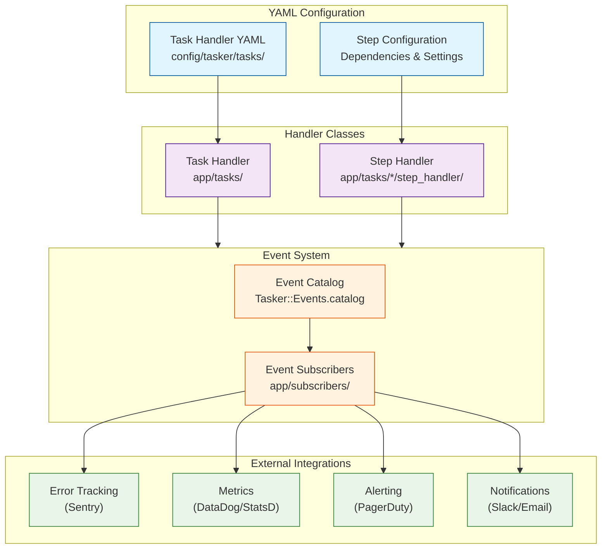
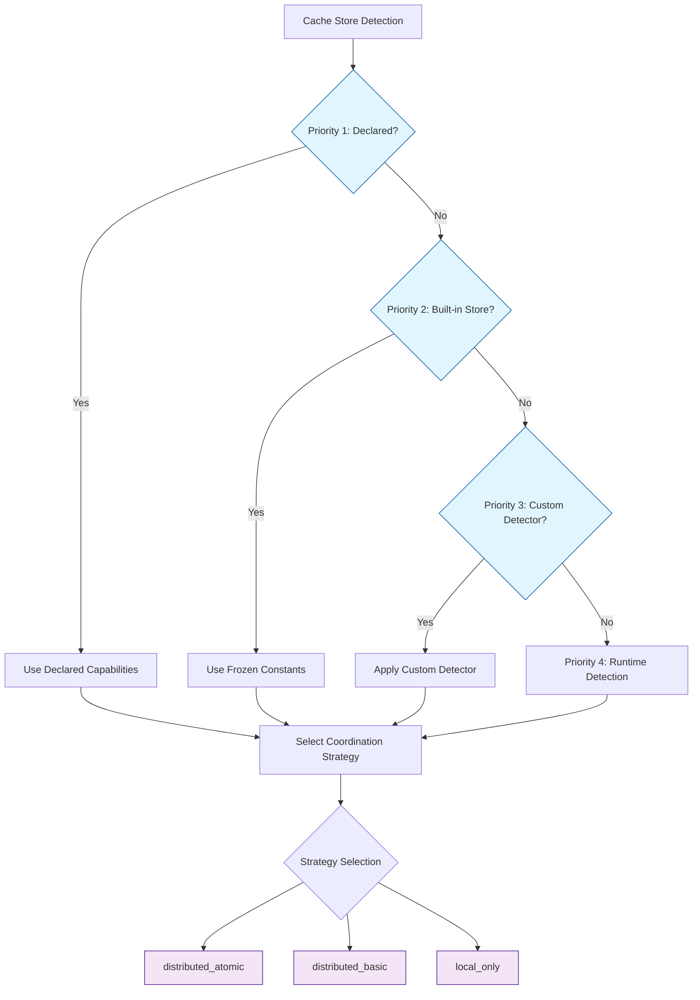
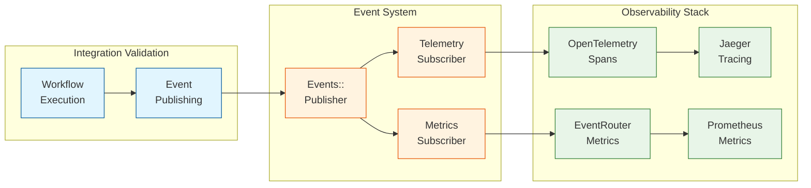

# Tasker Developer Guide

## Overview

This guide provides a comprehensive overview of developing with Tasker, covering all the key components that make up the workflow engine. Tasker is designed around six main developer-facing components:

1. **TaskNamespaces & Versioning** - Organize and version task handlers for scalable workflow management
2. **Task Handlers** - Define and coordinate multi-step workflows
3. **Step Handlers** - Implement the business logic for individual workflow steps
4. **Event Subscribers** - Create integrations with external services and monitoring systems
5. **YAML Configuration** - Declarative workflow and step configuration with namespace support
6. **Authentication & Authorization** - Secure your workflows with flexible authentication strategies

## New in Tasker 2.3.0: TaskNamespace + Versioning Architecture

Tasker now supports **hierarchical task organization** and **semantic versioning** for enterprise-scale workflow management:

### Key Benefits
- **Namespace Isolation**: Organize tasks by domain (`payments`, `inventory`, `notifications`)
- **Version Coexistence**: Multiple versions of the same task can run simultaneously
- **Zero Breaking Changes**: Existing tasks continue working with automatic defaults
- **Enterprise Scalability**: Clean separation of concerns for large organizations

### Quick Example
```ruby
# Create namespaced task handlers
task_request = Tasker::Types::TaskRequest.new(
  name: 'process_order',
  namespace: 'payments',    # NEW: Namespace organization
  version: '2.1.0',        # NEW: Semantic versioning
  context: { order_id: 123 }
)

# Handler lookup with namespace + version
handler = Tasker::HandlerFactory.instance.get(
  'process_order',
  namespace_name: 'payments',
  version: '2.1.0'
)
```

### Namespace Organization Patterns
- **`payments`** - Payment processing, billing, refunds
- **`inventory`** - Stock management, fulfillment, warehouse operations
- **`notifications`** - Email, SMS, push notifications, alerts
- **`integrations`** - Third-party APIs, webhooks, data synchronization
- **`data_processing`** - ETL, data transformation, analytics pipelines
- **`default`** - General workflows (automatic fallback when unspecified)

## Architecture Overview



## 1. TaskNamespaces & Versioning

TaskNamespaces provide organizational hierarchy for task handlers, while versioning enables multiple versions of the same task to coexist. This is essential for enterprise environments with complex workflows and deployment strategies.

### TaskNamespace Management

#### Creating TaskNamespaces

TaskNamespaces are automatically created when referenced, but you can also create them explicitly:

```ruby
# Automatic creation during task creation
task_request = Tasker::Types::TaskRequest.new(
  name: 'process_payment',
  namespace: 'payments',  # Automatically creates 'payments' namespace if needed
  version: '1.0.0',
  context: { payment_id: 123 }
)

# Manual creation with description
namespace = Tasker::TaskNamespace.create!(
  name: 'payments',
  description: 'Payment processing and billing workflows'
)
```

#### Namespace Patterns & Best Practices

**Domain-Based Organization**:
```yaml
# config/tasker/tasks/payments/process_order.yaml
---
name: process_order
namespace_name: payments
version: 2.1.0
task_handler_class: Payments::ProcessOrderHandler

# config/tasker/tasks/inventory/process_order.yaml
---
name: process_order
namespace_name: inventory
version: 1.5.0
task_handler_class: Inventory::ProcessOrderHandler
```

**Version Management Strategies**:
```ruby
# Gradual rollout - start with specific version
handler_v2 = Tasker::HandlerFactory.instance.get(
  'process_payment',
  namespace_name: 'payments',
  version: '2.0.0'
)

# Legacy support - maintain old version
handler_v1 = Tasker::HandlerFactory.instance.get(
  'process_payment',
  namespace_name: 'payments',
  version: '1.5.0'
)

# Default behavior - uses latest registered version
handler_default = Tasker::HandlerFactory.instance.get('process_payment')
```

#### HandlerFactory Registry Architecture

The HandlerFactory now uses a **thread-safe 3-level registry** with enterprise-grade capabilities:

```ruby
# Registry Structure: namespace_name → handler_name → version → handler_class
# Thread-safe storage: Concurrent::Hash for all levels
# Example internal structure:
{
  payments: {
    process_order: {
      '1.0.0' => Payments::ProcessOrderV1,
      '2.0.0' => Payments::ProcessOrderV2
    }
  },
  inventory: {
    process_order: {
      '1.5.0' => Inventory::ProcessOrder
    }
  }
}
```

**Enterprise Features**:
- **Thread-Safe Operations**: `Concurrent::Hash` storage eliminates race conditions
- **Structured Logging**: Every operation logged with correlation IDs
- **Interface Validation**: Fail-fast validation with detailed error messages
- **Conflict Resolution**: `replace: true` parameter for graceful updates
- **Health Monitoring**: Built-in statistics and health checks
- **Event Integration**: Registry operations trigger 56-event system

**Registration Examples**:
```ruby
# Class-based registration with namespace + version
class PaymentHandler < Tasker::TaskHandler
  register_handler(
    'process_payment',
    namespace_name: 'payments',
    version: '2.0.0'
  )
end

# Thread-safe manual registration with conflict resolution
Tasker::HandlerFactory.instance.register(
  'payment_processor',
  PaymentHandler,
  namespace_name: 'payments',
  version: '2.1.0',
  replace: true  # Gracefully handles conflicts
)

# Automatic structured logging output:
# {"correlation_id":"tsk_abc123","component":"handler_factory","message":"Registry item registered","entity_id":"payments/payment_processor/2.1.0","event_type":"registered"}

# YAML-based registration
# config/tasker/tasks/payments/process_payment.yaml
---
name: process_payment
namespace_name: payments
version: 2.0.0
task_handler_class: PaymentHandler
```

### Versioning Best Practices

#### Semantic Versioning
Follow [semver.org](https://semver.org) conventions:
- **Major version** (`2.0.0`): Breaking changes, incompatible API changes
- **Minor version** (`1.1.0`): New features, backward compatible
- **Patch version** (`1.0.1`): Bug fixes, backward compatible

#### Version Lifecycle Management
```ruby
# Development workflow
class PaymentHandler < Tasker::TaskHandler
  register_handler('process_payment',
                   namespace_name: 'payments',
                   version: '2.0.0-beta.1')  # Pre-release
end

# Production deployment
class PaymentHandler < Tasker::TaskHandler
  register_handler('process_payment',
                   namespace_name: 'payments',
                   version: '2.0.0')         # Stable release
end

# Maintenance mode
class PaymentHandler < Tasker::TaskHandler
  register_handler('process_payment',
                   namespace_name: 'payments',
                   version: '1.5.2')         # Patch release for legacy
end
```

## 2. Task Handlers

Task handlers define the overall workflow structure and coordinate step execution. They are the entry point for creating and managing multi-step processes.

### Creating Task Handlers

Use the generator to create a complete task handler structure:

```bash
rails generate tasker:task_handler OrderHandler --module_namespace OrderProcess
```

This creates:
- **Handler Class**: `app/tasks/order_process/order_handler.rb`
- **YAML Configuration**: `config/tasker/tasks/order_process/order_handler.yaml`
- **Test File**: `spec/tasks/order_process/order_handler_spec.rb`

### Task Handler Class Structure

```ruby
# app/tasks/order_process/order_handler.rb
module OrderProcess
  class OrderHandler < Tasker::ConfiguredTask
    # The task handler class is primarily configuration-driven
    # Most behavior is defined in the YAML file

    # Optional: Override the default task name (defaults to class name underscored)
    def self.task_name
      'custom_order_process'
    end

    # Optional: Override the default YAML path
    def self.yaml_path
      Rails.root.join('config/custom_tasks/order_handler.yaml')
    end

    # Optional: Establish custom step dependencies beyond YAML configuration
    def establish_step_dependencies_and_defaults(task, steps)
      # Add runtime dependencies based on task context
      if task.context['priority'] == 'expedited'
        # Modify step configuration for expedited orders
        payment_step = steps.find { |s| s.name == 'process_payment' }
        payment_step&.update(retry_limit: 1) # Faster failure for expedited orders
      end
    end

    # Optional: Update annotations after steps complete
    def update_annotations(task, sequence, steps)
      # Add custom annotations based on step results
      total_amount = steps.find { |s| s.name == 'calculate_total' }&.results&.dig('amount')
      if total_amount && total_amount > 1000
        task.annotations.create!(
          annotation_type: 'high_value_order',
          content: { amount: total_amount, flagged_at: Time.current }
        )
      end
    end

    # Optional: Custom validation schema (beyond YAML schema)
    def schema
      # This overrides any schema defined in YAML
      {
        type: 'object',
        required: ['order_id', 'customer_id'],
        properties: {
          order_id: { type: 'integer', minimum: 1 },
          customer_id: { type: 'integer', minimum: 1 },
          priority: { type: 'string', enum: ['standard', 'expedited', 'rush'] }
        }
      }
    end
  end
end
```

### Task Handler Capabilities

- **Workflow Orchestration**: Manages step dependencies and execution order
- **Parallel Processing**: Supports concurrent execution of independent steps
- **Error Handling**: Comprehensive retry logic with exponential backoff
- **Context Management**: Passes data between steps through task context
- **Validation**: JSON schema validation plus custom business rules
- **Event Publishing**: Automatic lifecycle event generation

### Available Override Methods

**ConfiguredTask Class Methods** (for customizing configuration):
- `self.task_name` - Override the default task name (defaults to class name underscored)
- `self.yaml_path` - Override the default YAML configuration file path
- `self.config` - Override how configuration is loaded (defaults to YAML.load_file)

**TaskHandler Instance Methods** (for customizing behavior):
- `establish_step_dependencies_and_defaults(task, steps)` - Modify step configuration at runtime
- `update_annotations(task, sequence, steps)` - Add custom annotations after step completion
- `schema` - Define custom validation schema for task context (overrides YAML schema)

## 2. Step Handlers

Step handlers implement the specific business logic for individual workflow steps. They are the workhorses that perform the actual operations.

### Step Handler Types

**Base Step Handler** - For general business logic with custom events:
```ruby
module OrderProcess
  module StepHandler
    class ProcessPaymentHandler < Tasker::StepHandler::Base
      # Define custom events that this handler can publish
      # These are automatically registered when the task handler is loaded
      def self.custom_event_configuration
        [
          {
            name: 'payment.processed',
            description: 'Published when payment processing completes successfully'
          },
          {
            name: 'payment.risk_flagged',
            description: 'Published when payment is flagged for manual review'
          }
        ]
      end

      def process(task, sequence, step)
        order_id = task.context[:order_id]
        payment_amount = task.context[:payment_amount]

        # Perform risk assessment
        risk_score = assess_payment_risk(order_id, payment_amount)

        if risk_score > 0.8
          # Publish custom event for high-risk payments
          publish_custom_event('payment.risk_flagged', {
            order_id: order_id,
            risk_score: risk_score,
            requires_manual_review: true,
            flagged_at: Time.current
          })

          { status: 'risk_review', risk_score: risk_score }
        else
          # Process payment normally
          payment_result = process_payment_transaction(order_id, payment_amount)

          # Publish custom event for successful payments
          publish_custom_event('payment.processed', {
            order_id: order_id,
            payment_amount: payment_amount,
            transaction_id: payment_result[:transaction_id],
            processed_at: Time.current
          })

          { status: 'completed', transaction_id: payment_result[:transaction_id] }
        end
      end

      private

      def assess_payment_risk(order_id, amount)
        # Risk assessment logic here
        # Returns a score between 0.0 and 1.0
        rand(0.0..1.0)
      end

      def process_payment_transaction(order_id, amount)
        # Payment processing logic here
        { transaction_id: "txn_#{SecureRandom.hex(8)}" }
      end
    end
  end
end
```

**API Step Handler** - For external API integrations:
```ruby
module OrderProcess
  module StepHandler
    class FetchInventoryHandler < Tasker::StepHandler::Api
      include OrderProcess::ApiUtils

      def process(task, sequence, step)
        product_ids = get_previous_step_data(sequence, 'fetch_products', 'product_ids')

        # Make HTTP request (automatic retry, timeout, error handling)
        connection.get('/inventory/check', { product_ids: product_ids })
      end

      def process_results(step, process_output, initial_results)
        # Custom response processing
        inventory_data = JSON.parse(process_output.body)
        step.results = {
          inventory_levels: inventory_data['levels'],
          availability: inventory_data['available'],
          last_updated: inventory_data['timestamp']
        }
      end
    end
  end
end
```

### API Step Handler Implementation

**The `process` Method - Your Extension Point**:

API step handlers use the `process` method as the developer extension point. The framework handles all orchestration, error handling, retries, and event publishing automatically:

```ruby
module OrderProcess
  module StepHandler
    class FetchUserProfileHandler < Tasker::StepHandler::Api
      include OrderProcess::ApiUtils

      def process(task, sequence, step)
        # Simply implement your HTTP request logic
        # Framework handles retries, timeouts, and error handling automatically
        user_id = task.context['user_id']
        connection.get("/users/#{user_id}/profile")
      end
    end
  end
end
```

**Making Different Types of API Requests**:

```ruby
module OrderProcess
  module StepHandler
    # GET request example
    class FetchOrderHandler < Tasker::StepHandler::Api
      def process(task, sequence, step)
        order_id = task.context['order_id']
        connection.get("/orders/#{order_id}")
      end
    end

    # POST request example
    class CreatePaymentHandler < Tasker::StepHandler::Api
      def process(task, sequence, step)
        payment_data = {
          amount: task.context['amount'],
          currency: task.context['currency'],
          customer_id: task.context['customer_id']
        }
        connection.post('/payments', payment_data)
      end
    end

    # PUT request with data from previous steps
    class UpdateInventoryHandler < Tasker::StepHandler::Api
      def process(task, sequence, step)
        # Get data from previous steps
        order_items = get_previous_step_data(sequence, 'fetch_order', 'items')

        inventory_updates = order_items.map do |item|
          { product_id: item['product_id'], quantity: -item['quantity'] }
        end

        connection.put('/inventory/bulk-update', { updates: inventory_updates })
      end
    end
  end
end
```

**Custom Response Processing**:

Override the `process_results` method to customize how API responses are processed and stored:

```ruby
module OrderProcess
  module StepHandler
    class FetchUserDataHandler < Tasker::StepHandler::Api
      def process(task, sequence, step)
        user_id = task.context['user_id']
        connection.get("/users/#{user_id}/profile")
      end

      # Override to customize response processing
      def process_results(step, process_output, initial_results)
        # process_output is the Faraday::Response from your process method
        if process_output.status == 200
          data = JSON.parse(process_output.body)
          step.results = {
            profile: data['user_profile'],
            preferences: data['preferences'],
            last_login: data['last_login_at'],
            api_response_time: process_output.headers['x-response-time']
          }
        else
          # Let framework handle error - this will trigger retries if configured
          raise "API error: #{process_output.status} - #{process_output.body}"
        end
      end
    end
  end
end
```

**Setting Results Directly in `process`**:

You can also set `step.results` directly in your `process` method if you prefer:

```ruby
module OrderProcess
  module StepHandler
    class ProcessOrderHandler < Tasker::StepHandler::Api
      def process(task, sequence, step)
        response = connection.post('/orders', task.context)

        # Set results directly - framework will respect this
        if response.status == 201
          order_data = JSON.parse(response.body)
          step.results = {
            order_id: order_data['id'],
            status: order_data['status'],
            created_at: order_data['created_at']
          }
        end

        response  # Return response for framework processing
      end
    end
  end
end
```

**Key API Step Handler Principles**:

1. **Implement `process` method** - This is your extension point for HTTP request logic
2. **Use the `connection` object** - Pre-configured Faraday connection with retry/timeout handling
3. **Return the response** - Let the framework handle response processing and error detection
4. **Override `process_results` for custom processing** - Transform responses while preserving framework behavior
5. **Set `step.results` for custom data** - Either in `process` or `process_results`
6. **Raise exceptions for failures** - Framework handles error states and retry orchestration
7. **Never override `handle`** - This is framework-only coordination code

### Step Handler Features

- **Automatic Result Storage**: Return values automatically stored in `step.results`
- **Context Access**: Full access to task context and previous step results
- **Error Handling**: Framework determines success/failure based on exceptions (see Error Handling Patterns in Best Practices)
- **Custom Processing**: Override `process_results` for custom result handling
- **Event Integration**: Automatic event publishing for observability

### Accessing Previous Step Data

```ruby
def process(task, sequence, step)
  # Access task context
  order_id = task.context['order_id']

  # Find specific step by name
  payment_step = sequence.find_step_by_name('process_payment')
  payment_id = payment_step.results['payment_id']

  # Get data from multiple steps
  product_data = get_previous_step_data(sequence, 'fetch_products', 'products')
  inventory_data = get_previous_step_data(sequence, 'check_inventory', 'levels')

  # Your business logic here
  process_order_fulfillment(order_id, payment_id, product_data, inventory_data)
end
```

## 3. Event Subscribers

Event subscribers handle **"collateral" or "secondary" logic** - operations that support observability, monitoring, and alerting but are not core business requirements. They respond to workflow events and provide operational visibility into system behavior.

### Architectural Distinction: Subscribers vs Steps

**Event Subscribers** are for collateral concerns:
- **Operational Observability**: Logging, metrics, telemetry, traces
- **Alerting & Monitoring**: Sentry errors, PagerDuty alerts, operational notifications
- **Analytics**: Business intelligence, usage tracking, performance monitoring
- **External Integrations**: Non-critical third-party service notifications

**Workflow Steps** are for business-critical operations requiring:
- **Idempotency**: Can be safely retried without side effects
- **Retryability**: Built-in retry logic with exponential backoff
- **Explicit Lifecycle Tracking**: Success/failure states that matter to the business
- **Transactional Integrity**: Operations that need to be rolled back on failure

**Rule of Thumb**: If the operation must succeed for the workflow to be considered complete, it should be a workflow step. If it's supporting infrastructure (logging, monitoring, analytics), it should be an event subscriber.

### Creating Event Subscribers

Use the generator to create subscribers with automatic method routing:

```bash
# Generate a subscriber for specific events
rails generate tasker:subscriber notification --events task.completed task.failed step.failed

# Generate a metrics collector
rails generate tasker:subscriber metrics --events task.completed step.completed task.failed step.failed
```

### Event Subscriber Structure

```ruby
# app/subscribers/observability_subscriber.rb
class ObservabilitySubscriber < Tasker::Events::Subscribers::BaseSubscriber
  # Subscribe to specific events for operational monitoring
  subscribe_to 'task.completed', 'task.failed', 'step.failed', 'order.fulfilled'

  # Automatic method routing: task.completed -> handle_task_completed
  def handle_task_completed(event)
    task_id = safe_get(event, :task_id)
    task_name = safe_get(event, :task_name, 'unknown')
    execution_duration = safe_get(event, :execution_duration, 0)

    # Operational logging and metrics (collateral concerns)
    Rails.logger.info "Task completed: #{task_name} (#{task_id}) in #{execution_duration}s"
    StatsD.histogram('tasker.task.duration', execution_duration, tags: ["task:#{task_name}"])
  end

  def handle_task_failed(event)
    task_id = safe_get(event, :task_id)
    error_message = safe_get(event, :error_message, 'Unknown error')

    # Send alerts to operational tools (collateral concerns)
    Sentry.capture_message("Task failed: #{task_id}", level: 'error', extra: { error: error_message })
    PagerDutyService.trigger_alert(
      summary: "Tasker workflow failed",
      severity: 'error',
      details: { task_id: task_id, error: error_message }
    )
  end

  def handle_step_failed(event)
    step_id = safe_get(event, :step_id)
    step_name = safe_get(event, :step_name, 'unknown')
    task_id = safe_get(event, :task_id)

    # Operational logging for debugging (collateral concern)
    Rails.logger.error "Step failure in task #{task_id}: #{step_name} (#{step_id})"
  end

  def handle_order_fulfilled(event)
    order_id = safe_get(event, :order_id)
    customer_id = safe_get(event, :customer_id)

    # Analytics and monitoring (collateral concerns)
    AnalyticsService.track_order_fulfillment(order_id, customer_id)
    Rails.logger.info "Order fulfilled: #{order_id} for customer #{customer_id}"
  end
end
```

### Available Events

Discover all available events using the event catalog:

```ruby
# In Rails console or your code
Tasker::Events.catalog.keys
# => ["task.started", "task.completed", "task.failed", "step.started", ...]

# Get detailed event information
Tasker::Events.event_info('task.completed')
# => { name: "task.completed", category: "task", description: "...", ... }

# Browse by category
Tasker::Events.task_events.keys      # Task lifecycle events
Tasker::Events.step_events.keys      # Step execution events
Tasker::Events.workflow_events.keys  # Orchestration events
```

### Real-World Integration Examples

**Metrics Collection (DataDog)**:
```ruby
class MetricsSubscriber < Tasker::Events::Subscribers::BaseSubscriber
  subscribe_to 'task.completed', 'task.failed', 'step.completed'

  def handle_task_completed(event)
    task_name = safe_get(event, :task_name, 'unknown')
    execution_duration = safe_get(event, :execution_duration, 0)

    StatsD.histogram('tasker.task.duration', execution_duration, tags: ["task:#{task_name}"])
    StatsD.increment('tasker.task.completed', tags: ["task:#{task_name}"])
  end

  def handle_task_failed(event)
    task_name = safe_get(event, :task_name, 'unknown')
    error_class = safe_get(event, :exception_class, 'unknown')

    StatsD.increment('tasker.task.failed', tags: ["task:#{task_name}", "error:#{error_class}"])
  end
end
```

**Error Tracking (Sentry)**:
```ruby
class SentrySubscriber < Tasker::Events::Subscribers::BaseSubscriber
  subscribe_to 'task.failed', 'step.failed'

  def handle_task_failed(event)
    task_id = safe_get(event, :task_id)
    error_message = safe_get(event, :error_message, 'Unknown error')

    Sentry.capture_message(error_message,
      level: 'error',
      fingerprint: ['tasker', 'task_failed', task_id],
      tags: { task_id: task_id, component: 'tasker' }
    )
  end
end
```

## 4. YAML Configuration

YAML files provide declarative configuration for task handlers, defining workflows, dependencies, and step settings without requiring code changes.

### Task Handler YAML Structure

```yaml
# config/tasker/tasks/payments/order_process.yaml
---
name: order_process
namespace_name: payments        # NEW: TaskNamespace organization
version: 1.2.0                 # NEW: Semantic versioning
module_namespace: OrderProcess  # Ruby module namespace
task_handler_class: OrderHandler

# JSON Schema validation for task context
schema:
  type: object
  required:
    - order_id
    - customer_id
  properties:
    order_id:
      type: integer
    customer_id:
      type: integer
    priority:
      type: string
      enum: [low, normal, high, critical]

# Step definitions with dependencies
step_templates:
  - name: fetch_order
    description: Retrieve order details from database
    handler_class: OrderProcess::StepHandler::FetchOrderHandler

  - name: validate_inventory
    description: Check product availability
    depends_on_step: fetch_order
    handler_class: OrderProcess::StepHandler::ValidateInventoryHandler
    default_retryable: true
    default_retry_limit: 3

  - name: process_payment
    description: Charge customer payment method
    depends_on_step: validate_inventory
    handler_class: OrderProcess::StepHandler::ProcessPaymentHandler
    default_retryable: true
    default_retry_limit: 2

  - name: update_inventory
    description: Decrement inventory levels
    depends_on_step: process_payment
    handler_class: OrderProcess::StepHandler::UpdateInventoryHandler

  - name: send_confirmation
    description: Send order confirmation email
    depends_on_step: update_inventory
    handler_class: OrderProcess::StepHandler::SendConfirmationHandler
    default_retryable: true
    default_retry_limit: 5

# Environment-specific overrides
environments:
  development:
    step_templates:
      - name: process_payment
        # Use test payment processor in development
        handler_config:
          payment_processor: test

  production:
    step_templates:
      - name: process_payment
        # Production payment configuration
        handler_config:
          payment_processor: stripe
          timeout: 30
```

### Advanced YAML Features

**Multiple Dependencies**:
```yaml
- name: finalize_order
  description: Complete order processing
  depends_on_steps:  # Multiple dependencies
    - process_payment
    - update_inventory
    - reserve_shipping
  handler_class: OrderProcess::StepHandler::FinalizeOrderHandler
```

**Environment-Specific Configuration**:
```yaml
environments:
  test:
    step_templates:
      - name: send_email
        handler_config:
          email_service: mock

  staging:
    step_templates:
      - name: send_email
        handler_config:
          email_service: sendgrid_test

  production:
    step_templates:
      - name: send_email
        handler_config:
          email_service: sendgrid_production
          api_key: ${SENDGRID_API_KEY}
```

**API Step Configuration**:
```yaml
- name: fetch_external_data
  handler_class: OrderProcess::StepHandler::FetchExternalDataHandler
  handler_config:
    type: api
    url: https://api.external-service.com/data
    method: GET
    headers:
      Authorization: "Bearer ${API_TOKEN}"
    timeout: 15
    retries: 3
```

### TaskNamespace + Versioning in YAML

The new namespace and versioning system provides enterprise-scale organization:

#### Namespace-Based File Organization

**Recommended File Structure**:
```
config/tasker/tasks/
├── payments/
│   ├── process_order.yaml          # version: 1.0.0
│   ├── process_refund.yaml         # version: 1.1.0
│   └── validate_payment.yaml       # version: 2.0.0
├── inventory/
│   ├── process_order.yaml          # version: 1.5.0 (same name, different namespace)
│   ├── stock_check.yaml            # version: 1.0.0
│   └── reorder_items.yaml          # version: 1.2.0
└── notifications/
    ├── send_email.yaml             # version: 1.0.0
    ├── send_sms.yaml               # version: 1.1.0
    └── push_notification.yaml      # version: 2.0.0
```

#### Version Coexistence Examples

**Multiple Versions of Same Task**:
```yaml
# config/tasker/tasks/payments/process_order_v1.yaml
---
name: process_order
namespace_name: payments
version: 1.0.0                      # Legacy version
task_handler_class: Payments::ProcessOrderV1

# config/tasker/tasks/payments/process_order_v2.yaml
---
name: process_order
namespace_name: payments
version: 2.0.0                      # Current version
task_handler_class: Payments::ProcessOrderV2
```

#### Namespace-Specific Configuration

**Domain-Specific Settings**:
```yaml
# config/tasker/tasks/integrations/api_sync.yaml
---
name: api_sync
namespace_name: integrations
version: 1.3.0
task_handler_class: Integrations::ApiSyncHandler

# Integration-specific settings
handler_config:
  max_concurrent_requests: 5
  rate_limit_per_second: 10
  dependent_systems:        # External systems this task interacts with
    - salesforce_api
    - inventory_service
    - notification_queue

step_templates:
  - name: fetch_data
    handler_class: Integrations::FetchDataHandler
    dependent_system: salesforce_api    # Step-level system identification

  - name: transform_data
    handler_class: Integrations::TransformDataHandler

  - name: upload_data
    handler_class: Integrations::UploadDataHandler
    dependent_system: inventory_service
```

#### Configuration Validation & Defaults

**YAML Configuration Schema**:
```yaml
# Full configuration with all optional fields
---
name: process_payment                      # Required
namespace_name: payments                   # Optional - defaults to 'default'
version: 2.1.0                           # Optional - defaults to '0.1.0'
module_namespace: Payments                # Optional - Ruby module namespace
task_handler_class: ProcessPaymentHandler # Required
description: "Advanced payment processing" # Optional - for documentation

# Database configuration (optional)
configuration:
  priority: high
  max_execution_time: 300
  custom_metadata:
    team: payments
    owner: alice@company.com
    documentation_url: https://wiki.company.com/payments
```

#### Migration Strategy for Existing Configurations

**Backward Compatibility**: Existing YAML files continue working unchanged:
```yaml
# Existing file - continues working with defaults
---
name: legacy_task
task_handler_class: LegacyHandler
# Automatically gets: namespace_name: 'default', version: '0.1.0'

# Enhanced file - new capabilities
---
name: legacy_task
namespace_name: default     # Explicit default
version: 0.1.0             # Explicit version
task_handler_class: LegacyHandler
```

## 5. Authentication & Authorization

Tasker provides a comprehensive, production-ready authentication and authorization system that works with any Rails authentication solution. The system uses **dependency injection** and **resource-based authorization** to provide enterprise-grade security for both REST APIs and GraphQL endpoints.

### Key Features

- **Provider Agnostic**: Works with Devise, JWT, OmniAuth, custom authentication, or no authentication
- **Resource-Based Authorization**: Granular permissions using resource:action patterns (e.g., `tasker.task:create`)
- **GraphQL Operation-Level Authorization**: Revolutionary security for GraphQL that maps operations to resource permissions
- **Automatic Controller Integration**: Authentication and authorization work seamlessly across REST and GraphQL
- **Comprehensive Generators**: Create production-ready authenticators and authorization coordinators
- **Zero Breaking Changes**: All features are opt-in and backward compatible

### Quick Configuration Example

```ruby
# config/initializers/tasker.rb
Tasker.configuration do |config|
  config.auth do |auth|
    # Authentication
    auth.authentication_enabled = true
    auth.authenticator_class = 'YourCustomAuthenticator'

    # Authorization
    auth.authorization_enabled = true
    auth.authorization_coordinator_class = 'YourAuthorizationCoordinator'
    auth.user_class = 'User'
  end
end
```

### Available Generators

```bash
# Generate authenticators for different systems
rails generate tasker:authenticator CompanyJWT --type=jwt
rails generate tasker:authenticator AdminAuth --type=devise --user-class=Admin
rails generate tasker:authenticator ApiAuth --type=api_token
rails generate tasker:authenticator SocialAuth --type=omniauth

# Generate authorization coordinator
rails generate tasker:authorization_coordinator CompanyAuth
```

### GraphQL Authorization Example

The system automatically maps GraphQL operations to resource permissions:

```ruby
# This GraphQL query:
query { tasks { taskId status } }

# Automatically requires: tasker.task:index permission

# This mutation:
mutation { createTask(input: {...}) { taskId } }

# Automatically requires: tasker.task:create permission
```

### Resource-Based Permissions

Authorization uses a simple resource:action permission model:

```ruby
# Available permissions:
'tasker.task:index'           # List all tasks
'tasker.task:create'          # Create new tasks
'tasker.workflow_step:show'   # View individual workflow steps
'tasker.task_diagram:index'   # List task diagrams
```

### Complete Documentation

For comprehensive documentation including:
- **Quick Start Guides** - Get authentication working in minutes
- **Custom Authenticator Examples** - JWT, Devise, API tokens, and more
- **Authorization Coordinator Patterns** - Role-based, context-aware, and time-based authorization
- **GraphQL Authorization Details** - Operation mapping and context handling
- **Production Best Practices** - Security, performance, and monitoring guidelines
- **Testing Strategies** - Complete test examples and isolation techniques

**See [Authentication & Authorization Guide](AUTH.md)** for complete documentation.

## 6. Multi-Database Support

Tasker provides optional multi-database support using Rails' standard multi-database conventions. This allows Tasker models to use a separate database from the host application for data isolation, performance, or compliance requirements.

### Key Features

- **Rails Multi-Database Integration**: Uses Rails' `connects_to` API following official conventions
- **Standard Configuration**: Leverages Rails database.yml patterns with named databases
- **Automatic Model Support**: All Tasker models inherit multi-database capability automatically
- **Zero Breaking Changes**: Fully backward compatible with existing installations
- **Environment-Specific**: Supports different database configurations per environment

### Configuration

```ruby
# config/initializers/tasker.rb

# Default: Use host application database (shared)
Tasker.configuration do |config|
  config.database.enable_secondary_database = false
end

# Use dedicated Tasker database
Tasker.configuration do |config|
  config.database.enable_secondary_database = true
  config.database.name = :tasker
end

# Environment-specific configuration
Tasker.configuration do |config|
  config.database.enable_secondary_database = Rails.env.production?
  config.database.name = Rails.env.production? ? :tasker : nil
end
```

### Database Configuration

```yaml
# config/database.yml
production:
  primary:
    database: my_primary_database
    adapter: postgresql
    username: app_user
    password: <%= ENV['DATABASE_PASSWORD'] %>

  tasker:
    database: my_tasker_database
    adapter: postgresql
    username: tasker_user
    password: <%= ENV['TASKER_DATABASE_PASSWORD'] %>
```

### Benefits of Multi-Database Setup

**Data Isolation**: Separate Tasker data from application data for security or compliance

**Performance**: Dedicated database resources for workflow processing

**Scaling**: Independent scaling of workflow database based on usage patterns

**Backup Strategy**: Separate backup and recovery policies for workflow data

**Development**: Easier testing and development with isolated workflow data

### Migration Support

When using a secondary database, Tasker migrations automatically target the correct database:

```bash
# Migrations run against the configured Tasker database
bundle exec rails tasker:install:migrations
bundle exec rails tasker:install:database_objects
bundle exec rails db:migrate
```

### Production Considerations

- **Connection Pooling**: Configure appropriate connection pool sizes for both databases
- **Monitoring**: Monitor connection usage and performance for both databases
- **Backup Strategy**: Implement coordinated backup strategies if data consistency across databases is required
- **Network Latency**: Consider network latency if databases are on different servers

## 7. Dependency Graph & Bottleneck Analysis Configuration

Tasker provides advanced dependency graph analysis and bottleneck detection capabilities that can be fine-tuned for your specific workflow patterns. The dependency graph configuration controls how Tasker analyzes workflow dependencies, identifies bottlenecks, and calculates impact scores for optimization recommendations.

### Key Features

- **Configurable Impact Scoring**: Customize how different factors influence bottleneck calculations
- **Adaptive Severity Classification**: Define custom thresholds for Critical/High/Medium/Low priority bottlenecks
- **Dynamic Duration Estimation**: Configure time estimates for path analysis and planning
- **State-Based Multipliers**: Adjust scoring based on step states and execution conditions
- **Retry Pattern Analysis**: Configure penalties for instability and failure patterns

### Quick Configuration Example

```ruby
# config/initializers/tasker.rb
Tasker.configuration do |config|
  config.dependency_graph do |graph|
    # Prioritize blocked steps more heavily
    graph.impact_multipliers = {
      blocked_weight: 20,        # Increase from default 15
      error_penalty: 40          # Increase from default 30
    }

    # Lower thresholds for faster bottleneck detection
    graph.severity_thresholds = {
      critical: 80,              # Decrease from default 100
      high: 40,                  # Decrease from default 50
      medium: 15                 # Decrease from default 20
    }
  end
end
```

### Configuration Options

#### Impact Multipliers

Control how different factors contribute to the overall bottleneck impact score:

```ruby
config.dependency_graph do |graph|
  graph.impact_multipliers = {
    downstream_weight: 5,      # Weight for downstream step count
    blocked_weight: 15,        # Weight for blocked step count (most critical)
    path_length_weight: 10,    # Weight for critical path length
    completed_penalty: 15,     # Penalty to reduce priority of completed work
    blocked_penalty: 25,       # Penalty to increase priority of blocked work
    error_penalty: 30,         # Penalty for steps in error state (highest)
    retry_penalty: 10          # Penalty for steps requiring retries
  }
end
```

**Impact Score Calculation:**
```
base_score = (downstream_count * downstream_weight) + (blocked_count * blocked_weight)
path_score = path_length * path_length_weight
penalties = (completed_steps * completed_penalty) + (blocked_steps * blocked_penalty) +
            (error_steps * error_penalty) + (retry_steps * retry_penalty)
final_score = (base_score + path_score + penalties) * severity_multiplier
```

#### Severity Multipliers

Adjust impact scores based on step states and execution conditions:

```ruby
config.dependency_graph do |graph|
  graph.severity_multipliers = {
    error_state: 2.0,          # Multiply score by 2.0 for steps in error state
    exhausted_retry_bonus: 0.5, # Additional 0.5x multiplier for exhausted retries
    dependency_issue: 1.2       # 1.2x multiplier for dependency-related issues
  }
end
```

**State-Based Scoring Examples:**
- Normal step: `base_score * 1.0`
- Error step: `base_score * 2.0`
- Error step with exhausted retries: `base_score * (2.0 + 0.5) = base_score * 2.5`
- Dependency blocked step: `base_score * 1.2`

#### Penalty Constants

Add fixed penalty points for specific problematic conditions:

```ruby
config.dependency_graph do |graph|
  graph.penalty_constants = {
    retry_instability: 3,      # +3 points per retry attempt
    non_retryable: 10,         # +10 points for non-retryable failures
    exhausted_retry: 20        # +20 points for exhausted retry attempts
  }
end
```

**Penalty Application:**
- Step with 2 retry attempts: `+6 penalty points`
- Non-retryable failure: `+10 penalty points`
- Exhausted retries (3+ attempts): `+20 penalty points`

#### Severity Thresholds

Define score ranges for bottleneck classification:

```ruby
config.dependency_graph do |graph|
  graph.severity_thresholds = {
    critical: 100,             # Score >= 100: Requires immediate attention
    high: 50,                  # Score >= 50: High priority for optimization
    medium: 20                 # Score >= 20: Monitor and plan improvements
  }                            # Score < 20: Low priority
end
```

**Classification Examples:**
- Score 150: **Critical** - Blocking multiple workflows, immediate intervention required
- Score 75: **High** - Significant impact, should be addressed in current sprint
- Score 35: **Medium** - Moderate impact, address in upcoming planning cycle
- Score 10: **Low** - Minor impact, monitor for trends

#### Duration Estimates

Configure time estimates for path analysis and planning:

```ruby
config.dependency_graph do |graph|
  graph.duration_estimates = {
    base_step_seconds: 30,     # Default time estimate per step
    error_penalty_seconds: 60, # Additional time for error recovery
    retry_penalty_seconds: 30  # Additional time per retry attempt
  }
end
```

**Duration Calculation:**
```
estimated_duration = (step_count * base_step_seconds) +
                     (error_steps * error_penalty_seconds) +
                     (total_retry_attempts * retry_penalty_seconds)
```

### Use Cases & Recommendations

#### High-Volume Transaction Processing

For workflows processing thousands of transactions per hour:

```ruby
config.dependency_graph do |graph|
  # Emphasize blocking issues more heavily
  graph.impact_multipliers = {
    blocked_weight: 25,        # Increase sensitivity to blocked steps
    error_penalty: 40          # Prioritize error resolution
  }

  # Lower thresholds for faster detection
  graph.severity_thresholds = {
    critical: 75,              # Faster escalation
    high: 35,
    medium: 15
  }

  # Faster execution estimates for high-volume patterns
  graph.duration_estimates = {
    base_step_seconds: 15,     # Optimized processes run faster
    error_penalty_seconds: 45  # Reduced error recovery time
  }
end
```

#### Long-Running Batch Processes

For workflows that run for hours or days:

```ruby
config.dependency_graph do |graph|
  # Focus on path length and completion tracking
  graph.impact_multipliers = {
    path_length_weight: 20,    # Longer paths have higher impact
    completed_penalty: 5       # Reduce penalty for completed work
  }

  # Higher thresholds due to expected longer execution
  graph.severity_thresholds = {
    critical: 200,
    high: 100,
    medium: 50
  }

  # Longer execution estimates
  graph.duration_estimates = {
    base_step_seconds: 120,    # Steps take longer in batch processes
    error_penalty_seconds: 300 # Error recovery is more expensive
  }
end
```

#### Real-Time Processing Systems

For workflows requiring sub-second response times:

```ruby
config.dependency_graph do |graph|
  # Maximize sensitivity to any delays
  graph.impact_multipliers = {
    retry_penalty: 20,         # Retries are very costly
    error_penalty: 50          # Errors must be resolved immediately
  }

  # Very low thresholds for immediate response
  graph.severity_thresholds = {
    critical: 30,
    high: 15,
    medium: 5
  }

  # Tight time estimates
  graph.duration_estimates = {
    base_step_seconds: 1,      # Sub-second execution expected
    error_penalty_seconds: 10, # Errors add significant delay
    retry_penalty_seconds: 5   # Each retry is expensive
  }
end
```

### Monitoring & Observability

The dependency graph analysis integrates with Tasker's observability system to provide actionable insights:

```ruby
# Published events include bottleneck severity levels
Tasker::Events.subscribe('task.bottleneck_detected') do |event|
  severity = event.payload['severity']  # 'Critical', 'High', 'Medium', 'Low'
  impact_score = event.payload['impact_score']

  case severity
  when 'Critical'
    PagerDuty.alert("Critical workflow bottleneck detected: #{impact_score}")
  when 'High'
    Slack.notify("#ops", "High priority bottleneck: #{impact_score}")
  end
end
```

### Production Best Practices

1. **Start with Defaults**: Begin with default values and adjust based on observed patterns
2. **Monitor Thresholds**: Track how often each severity level is triggered
3. **A/B Testing**: Test configuration changes on a subset of workflows first
4. **Gradual Tuning**: Make small adjustments and measure impact over time
5. **Documentation**: Document your configuration rationale for team knowledge

The dependency graph configuration provides powerful tools for optimizing workflow performance while maintaining the flexibility to adapt to your specific operational requirements.

## 8. Cache Strategy & Custom Store Capabilities

Tasker includes a **Hybrid Cache Detection System** that provides intelligent cache strategy selection and supports both built-in Rails cache stores and custom cache implementations. This system automatically adapts coordination strategies based on cache store capabilities, ensuring optimal performance across different deployment environments.

### Key Features

- **🎯 Developer-Friendly API**: Declarative capability system for custom cache stores
- **🚀 Performance Optimized**: Frozen constants provide O(1) lookup for built-in stores
- **🔄 Hybrid Detection**: Priority-based detection system (declared → constants → custom → runtime)
- **📊 Production-Ready**: Comprehensive structured logging and error handling
- **⚡ Rails Integration**: Always uses `Rails.cache` as the source of truth

### Quick Example

```ruby
# For custom cache stores - declare capabilities explicitly
class MyAwesomeCacheStore < ActiveSupport::Cache::Store
  include Tasker::CacheCapabilities

  # Use convenience methods for common capabilities
  supports_distributed_caching!
  supports_atomic_increment!
  supports_locking!

  # Or declare specific capabilities
  declare_cache_capability(:advanced_analytics, true)
  declare_cache_capability(:compression_support, false)
end

# Configure Rails to use your custom store
Rails.application.configure do
  config.cache_store = MyAwesomeCacheStore.new
end

# Tasker automatically detects capabilities and selects optimal strategy
strategy = Tasker::CacheStrategy.detect
puts strategy.coordination_mode  # => :distributed_atomic
puts strategy.supports?(:distributed)  # => true
```

### Architecture Overview

The cache detection system uses a **4-level priority hierarchy**:



### Built-in Store Support

Tasker includes **frozen constants** for fast, reliable detection of official Rails cache stores:

```ruby
# Automatically detected with O(1) lookup
DISTRIBUTED_CACHE_STORES = %w[
  ActiveSupport::Cache::RedisCacheStore
  ActiveSupport::Cache::MemCacheStore
  SolidCache::Store
].freeze

ATOMIC_INCREMENT_STORES = %w[
  ActiveSupport::Cache::RedisCacheStore
  ActiveSupport::Cache::MemCacheStore
  SolidCache::Store
].freeze

LOCKING_CAPABLE_STORES = %w[
  ActiveSupport::Cache::RedisCacheStore
  SolidCache::Store
].freeze

LOCAL_CACHE_STORES = %w[
  ActiveSupport::Cache::MemoryStore
  ActiveSupport::Cache::FileStore
  ActiveSupport::Cache::NullStore
].freeze
```

**Coordination Strategies by Store Type**:
- **Redis/SolidCache**: `distributed_atomic` (full distributed coordination with locking)
- **Memcached**: `distributed_basic` (distributed coordination without locking)
- **Memory/File/Null**: `local_only` (single-process coordination)

### Custom Cache Store Integration

#### Using CacheCapabilities Module

The `Tasker::CacheCapabilities` module provides a clean API for declaring your cache store's capabilities:

```ruby
class MyRedisCluster < ActiveSupport::Cache::Store
  include Tasker::CacheCapabilities

  # Convenience methods for common capabilities
  supports_distributed_caching!     # Sets distributed: true
  supports_atomic_increment!        # Sets atomic_increment: true
  supports_locking!                 # Sets locking: true
  supports_ttl_inspection!          # Sets ttl_inspection: true
  supports_namespace_isolation!     # Sets namespace_support: true
  supports_compression!             # Sets compression_support: true

  # Custom capabilities specific to your implementation
  declare_cache_capability(:cluster_failover, true)
  declare_cache_capability(:read_replicas, true)
  declare_cache_capability(:geo_replication, false)

  # Your cache store implementation...
  def read(name, options = nil)
    # Implementation
  end

  def write(name, value, options = nil)
    # Implementation
  end

  # Optional: Implement advanced features
  def increment(name, amount = 1, options = nil)
    # Atomic increment implementation
  end

  def with_lock(name, options = {}, &block)
    # Distributed locking implementation
  end
end
```

#### Capability Reference

| Capability | Description | Impact |
|------------|-------------|---------|
| `distributed` | Cache is shared across processes/containers | Enables distributed coordination |
| `atomic_increment` | Supports atomic increment/decrement operations | Enables optimistic locking patterns |
| `locking` | Supports distributed locking (with_lock) | Enables `distributed_atomic` strategy |
| `ttl_inspection` | Can inspect/extend TTL of cached entries | Enables advanced TTL management |
| `namespace_support` | Supports cache key namespacing | Enables namespace isolation |
| `compression_support` | Supports automatic value compression | Enables bandwidth optimization |

#### Chaining and Inheritance

```ruby
class BaseDistributedStore < ActiveSupport::Cache::Store
  include Tasker::CacheCapabilities

  supports_distributed_caching!
  supports_ttl_inspection!
end

class RedisClusterStore < BaseDistributedStore
  # Inherits distributed and ttl_inspection capabilities
  supports_atomic_increment!
  supports_locking!

  # Override inherited capabilities if needed
  declare_cache_capability(:ttl_inspection, false)  # Override parent
end

class MemcachedClusterStore < BaseDistributedStore
  # Different capabilities for different technology
  supports_atomic_increment!
  # Note: Memcached doesn't support distributed locking
end
```

### Advanced Usage Patterns

#### Custom Detector Registration

For complex detection logic that can't be expressed through simple capability declarations:

```ruby
# Register a custom detector for pattern-based detection
Tasker::CacheStrategy.register_detector(/MyCustomCache/, lambda do |store|
  {
    distributed: store.respond_to?(:cluster_nodes) && store.cluster_nodes.size > 1,
    atomic_increment: store.respond_to?(:atomic_ops),
    locking: store.respond_to?(:distributed_lock),
    custom_feature: store.respond_to?(:advanced_query)
  }
end)

# The detector will be applied automatically during detection
strategy = Tasker::CacheStrategy.detect
```

#### Runtime Strategy Inspection

```ruby
strategy = Tasker::CacheStrategy.detect

# Check coordination mode
puts strategy.coordination_mode  # => :distributed_atomic

# Check specific capabilities
puts strategy.supports?(:distributed)      # => true
puts strategy.supports?(:locking)          # => true
puts strategy.supports?(:custom_feature)   # => true

# Export all capabilities (useful for debugging)
puts strategy.export_capabilities
# => {
#   distributed: true,
#   atomic_increment: true,
#   locking: true,
#   ttl_inspection: true,
#   namespace_support: true,
#   compression_support: false,
#   key_transformation: true,
#   store_class: "MyAwesomeCacheStore"
# }
```

#### Production Monitoring

The cache strategy system includes comprehensive structured logging:

```ruby
# Automatic logging when strategy is detected
strategy = Tasker::CacheStrategy.detect

# Logs output (JSON format):
{
  "timestamp": "2025-06-28T17:15:53.386Z",
  "correlation_id": "tsk_mcgi5my9_a24eXc",
  "component": "cache_strategy",
  "message": "Cache strategy detected",
  "environment": "production",
  "tasker_version": "2.5.0",
  "store_class": "MyAwesomeCacheStore",
  "coordination_strategy": "distributed_atomic",
  "capabilities": {
    "distributed": true,
    "atomic_increment": true,
    "locking": true,
    "ttl_inspection": true,
    "namespace_support": true,
    "compression_support": false,
    "key_transformation": true,
    "store_class": "MyAwesomeCacheStore"
  },
  "instance_id": "web-01-12345"
}
```

### Best Practices

#### Cache Store Selection

**For High-Performance Applications**:
```ruby
# Redis with full capabilities
class ProductionRedisStore < ActiveSupport::Cache::RedisCacheStore
  include Tasker::CacheCapabilities

  supports_distributed_caching!
  supports_atomic_increment!
  supports_locking!
  supports_ttl_inspection!
  supports_namespace_isolation!
  supports_compression!
end
```

**For Development/Testing**:
```ruby
# Memory store with local-only coordination
# No additional configuration needed - automatically detected
Rails.application.configure do
  config.cache_store = :memory_store
end
```

**For Legacy Memcached**:
```ruby
class LegacyMemcachedStore < ActiveSupport::Cache::MemCacheStore
  include Tasker::CacheCapabilities

  supports_distributed_caching!
  supports_atomic_increment!
  # Note: Don't declare locking support - Memcached doesn't support it
  supports_ttl_inspection!
end
```

#### Testing Custom Stores

```ruby
# spec/lib/my_awesome_cache_store_spec.rb
RSpec.describe MyAwesomeCacheStore do
  let(:store) { described_class.new }

  describe 'capability declarations' do
    it 'declares expected capabilities' do
      capabilities = store.class.declared_cache_capabilities

      expect(capabilities[:distributed]).to be(true)
      expect(capabilities[:atomic_increment]).to be(true)
      expect(capabilities[:locking]).to be(true)
      expect(capabilities[:advanced_analytics]).to be(true)
      expect(capabilities[:compression_support]).to be(false)
    end
  end

  describe 'integration with CacheStrategy' do
    before do
      allow(Rails).to receive(:cache).and_return(store)
    end

    it 'is detected correctly by CacheStrategy' do
      strategy = Tasker::CacheStrategy.detect

      expect(strategy.coordination_mode).to eq(:distributed_atomic)
      expect(strategy.supports?(:distributed)).to be(true)
      expect(strategy.supports?(:advanced_analytics)).to be(true)
    end
  end
end
```

### Migration Guide

#### Upgrading Existing Custom Stores

If you have existing custom cache stores, add capability declarations:

```ruby
# Before: No capability declarations
class MyLegacyStore < ActiveSupport::Cache::Store
  # Implementation...
end

# After: With capability declarations
class MyLegacyStore < ActiveSupport::Cache::Store
  include Tasker::CacheCapabilities

  # Declare what your store actually supports
  supports_distributed_caching! if respond_to?(:cluster_mode?)
  supports_atomic_increment! if respond_to?(:increment)
  # etc.
end
```

#### Backwards Compatibility

The system maintains full backwards compatibility:
- **Undeclared stores**: Fall back to runtime pattern detection
- **Existing configurations**: Continue working without changes
- **Built-in stores**: Automatically detected with frozen constants

The cache strategy system provides a robust foundation for building cache-aware applications that adapt intelligently to different deployment environments while maintaining optimal performance characteristics.

## Extensibility & Advanced Patterns

### Custom Step Handler Types

Beyond the built-in `Base` and `Api` step handlers, you can create specialized step handler types for common patterns in your application:

```ruby
# Base class for database-heavy operations
module YourApp
  module StepHandler
    class DatabaseBase < Tasker::StepHandler::Base
      protected

      def with_transaction(&block)
        ActiveRecord::Base.transaction(&block)
      rescue ActiveRecord::StatementInvalid => e
        # Transform database errors for consistent handling
        raise Tasker::RetryableError, "Database operation failed: #{e.message}"
      end

      def bulk_insert(model_class, records, batch_size: 1000)
        records.each_slice(batch_size) do |batch|
          model_class.insert_all(batch)
        end
      end
    end
  end
end

# Usage in your step handlers
class ProcessBulkOrdersHandler < YourApp::StepHandler::DatabaseBase
  def process(task, sequence, step)
    orders_data = get_previous_step_data(sequence, 'fetch_orders', 'orders')

    with_transaction do
      bulk_insert(Order, orders_data, batch_size: 500)
    end

    { processed_count: orders_data.size }
  end
end
```

### Custom Event Publishing Patterns

Create reusable event publishing patterns for consistent observability:

```ruby
# Mixin for consistent business event publishing
module BusinessEventPublisher
  extend ActiveSupport::Concern

  def publish_business_event(domain, action, entity_id, data = {})
    event_name = "#{domain}.#{action}"
    event_data = {
      entity_id: entity_id,
      domain: domain,
      action: action,
      timestamp: Time.current.iso8601,
      **data
    }

    publish_custom_event(event_name, event_data)
  end
end

# Usage in step handlers
class ProcessOrderHandler < Tasker::StepHandler::Base
  include BusinessEventPublisher

  def process(task, sequence, step)
    order = Order.find(task.context['order_id'])

    # Process order logic here...
    order.update!(status: 'processed')

    # Publish consistent business event
    publish_business_event('order', 'processed', order.id, {
      customer_id: order.customer_id,
      total_amount: order.total,
      processing_duration: Time.current - order.created_at
    })

    { order_id: order.id, status: 'processed' }
  end
end
```

### Advanced Configuration Patterns

**Environment-Specific Step Configuration**:
```yaml
# config/tasker/tasks/order_process/order_handler.yaml
step_templates:
  - name: send_notification
    handler_class: OrderProcess::SendNotificationHandler
    handler_config:
      <% if Rails.env.production? %>
      notification_service: sms_gateway
      priority: high
      <% else %>
      notification_service: email_only
      priority: low
      <% end %>
```

**Dynamic Step Generation**:
```ruby
# Support for dynamically generated workflows
class DynamicOrderProcess < Tasker::TaskHandler::Base
  def self.generate_step_templates(product_types)
    base_steps = [
      { name: 'validate_order', handler_class: 'OrderProcess::ValidateOrderHandler' }
    ]

    # Generate product-specific steps
    product_steps = product_types.map do |type|
      {
        name: "process_#{type}",
        depends_on_step: 'validate_order',
        handler_class: "OrderProcess::Process#{type.camelize}Handler"
      }
    end

    merge_step = {
      name: 'finalize_order',
      depends_on_steps: product_steps.map { |step| step[:name] },
      handler_class: 'OrderProcess::FinalizeOrderHandler'
    }

    base_steps + product_steps + [merge_step]
  end
end
```

### Custom Workflow Coordination

**Priority-Based Step Execution**:
```ruby
module PriorityWorkflow
  class Coordinator < Tasker::Orchestration::Coordinator
    private

    def prioritize_ready_steps(ready_steps)
      # Custom sorting based on step configuration
      ready_steps.sort_by do |step|
        priority = step.handler_config['priority'] || 'normal'
        case priority
        when 'critical' then 0
        when 'high' then 1
        when 'normal' then 2
        when 'low' then 3
        else 2
        end
      end
    end
  end
end

# Configure in initializer
Tasker.configuration do |config|
  config.orchestration.coordinator_class = 'PriorityWorkflow::Coordinator'
end
```

**Resource-Aware Execution**:
```ruby
class ResourceAwareStepHandler < Tasker::StepHandler::Base
  def process(task, sequence, step)
    # Check system resources before proceeding
    if system_under_load?
      # Delay execution by raising a retryable error
      raise Tasker::RetryableError, "System under load, retrying later"
    end

    # Normal processing
    perform_resource_intensive_operation
  end

  private

  def system_under_load?
    # Check CPU, memory, or external service health
    cpu_usage > 80 || memory_usage > 90 || external_service_degraded?
  end
end
```

### Custom Result Processing

**Structured Result Schemas**:
```ruby
class SchemaValidatedStepHandler < Tasker::StepHandler::Base
  RESULT_SCHEMA = {
    type: 'object',
    required: ['status', 'data'],
    properties: {
      status: { type: 'string', enum: ['success', 'partial', 'warning'] },
      data: { type: 'object' },
      metadata: { type: 'object' }
    }
  }.freeze

  def process(task, sequence, step)
    result = perform_business_logic

    # Validate result structure
    validate_result_schema(result)

    result
  end

  private

  def validate_result_schema(result)
    errors = JSON::Validator.fully_validate(RESULT_SCHEMA, result)
    raise ArgumentError, "Invalid result schema: #{errors.join(', ')}" if errors.any?
  end
end
```

**Result Transformation Pipelines**:
```ruby
module ResultTransformers
  class SensitiveDataFilter
    def self.transform(results)
      # Remove sensitive data from results before storage
      results.except('password', 'api_key', 'secret_token')
    end
  end

  class MetricsExtractor
    def self.transform(results)
      # Extract metrics for monitoring
      {
        **results,
        performance_metrics: {
          execution_time: results['duration'],
          memory_used: results['memory_peak'],
          records_processed: results['record_count']
        }
      }
    end
  end
end

class TransformingStepHandler < Tasker::StepHandler::Base
  def process_results(step, process_output, initial_results)
    # Apply transformation pipeline
    transformed = process_output
    transformed = ResultTransformers::SensitiveDataFilter.transform(transformed)
    transformed = ResultTransformers::MetricsExtractor.transform(transformed)

    step.results = transformed
  end
end
```

## Best Practices

### Task Handler Design

1. **Single Responsibility**: Each task handler should represent one business process
2. **Meaningful Names**: Use descriptive names that clearly indicate the workflow purpose
3. **Proper Dependencies**: Define clear step dependencies that reflect business logic
4. **Error Handling**: Configure appropriate retry limits based on operation reliability
5. **Context Design**: Include all necessary data in task context for step execution
6. **Extensibility**: Design task handlers to support configuration-driven customization

### Step Handler Implementation

1. **Focused Logic**: Each step should do one thing well
2. **Clear Results**: Return meaningful data structure for dependent steps
3. **Error Handling**: Understand how the framework determines step success/failure (see Error Handling Patterns below)
4. **Idempotency**: Design steps to be safely retryable
5. **Resource Cleanup**: Clean up resources in error scenarios

#### Error Handling Patterns

The framework determines step success/failure based on whether the `process` method raises an exception:

- **Exception raised** → Step marked as FAILED, retry logic triggered, workflow stops
- **No exception raised** → Step marked as COMPLETED, workflow continues

**Pattern 1: Let exceptions bubble up (Recommended)**
```ruby
def process(task, sequence, step)
  # Attempt the operation - let exceptions propagate naturally
  result = perform_complex_operation(task.context)
  { success: true, data: result }

  # Framework automatically handles exceptions:
  # - Publishes step_failed event with error details
  # - Stores error information in step.results
  # - Transitions step to error state
  # - Triggers retry logic if configured
end
```

**Pattern 2: Catch, record error details, then re-raise**
```ruby
def process(task, sequence, step)
  begin
    result = perform_complex_operation(task.context)
    { success: true, data: result }
  rescue StandardError => e
    # Add custom error context to step.results
    step.results = {
      error: e.message,
      error_type: e.class.name,
      custom_context: "Additional business context",
      retry_recommended: should_retry?(e)
    }
    # Re-raise so framework knows this step failed
    raise
  end
end
```

**Pattern 3: Treat handled exceptions as success**
```ruby
def process(task, sequence, step)
  begin
    result = perform_complex_operation(task.context)
    { success: true, data: result }
  rescue RecoverableError => e
    # This exception is handled and considered a success case
    # Step will be marked as COMPLETED, not failed
    {
      success: true,
      data: get_fallback_data(task.context),
      recovered_from_error: e.message,
      used_fallback: true
    }
  end
end
```

⚠️ **Important**: Only catch exceptions in your `process` method if you intend to either:
- Add custom error context to `step.results` and re-raise (Pattern 2)
- Treat the exception as a recoverable success case (Pattern 3)

**Never** catch an exception, return error data, and expect the framework to treat it as a failure - it will be marked as successful.

### Event Subscriber Guidelines

1. **Extend BaseSubscriber**: Always use `Tasker::Events::Subscribers::BaseSubscriber`
2. **Safe Data Access**: Use `safe_get(event, :key, default)` for robust data access
3. **Error Isolation**: Don't let subscriber errors break task execution
4. **Async Operations**: Move heavy operations to background jobs
5. **Monitoring**: Monitor subscriber performance and error rates

### YAML Configuration Management

1. **Environment Separation**: Use environment-specific configurations appropriately
2. **Sensitive Data**: Use environment variables for secrets and API keys
3. **Documentation**: Include clear descriptions for all steps
4. **Validation**: Use JSON schema validation for task context requirements
5. **Versioning**: Version control all YAML configuration files

## Development Workflow

### 1. Plan Your Workflow
```bash
# Define your business process steps and dependencies
# Example: Order Processing
# 1. Validate Order → 2. Process Payment → 3. Ship Order
```

### 2. Generate Task Handler
```bash
rails generate tasker:task_handler OrderHandler --module_namespace OrderProcess --steps="validate_order,process_payment,ship_order"
```

### 3. Implement Step Handlers
```ruby
# app/tasks/order_process/validate_order_handler.rb
class ValidateOrderHandler < Tasker::StepHandler::Base
  def self.custom_event_configuration
    [
      { name: 'order.validation_failed', description: 'Order validation failed' },
      { name: 'order.validated', description: 'Order validation successful' }
    ]
  end

  def process(task, sequence, step)
    # Implementation here
    # Publish custom events as needed
  end
end
```

### 4. Configure Dependencies
```yaml
# config/tasker/tasks/order_process/order_handler.yaml
step_templates:
  - name: validate_order
    handler_class: OrderProcess::ValidateOrderHandler
  - name: process_payment
    depends_on_step: validate_order
    handler_class: OrderProcess::ProcessPaymentHandler
    custom_events:
      - name: payment.gateway_error
        description: Payment gateway returned an error
  - name: ship_order
    depends_on_step: process_payment
    handler_class: OrderProcess::ShipOrderHandler
```

### 5. Test Your Workflow
```ruby
# spec/tasks/order_process/order_handler_spec.rb
RSpec.describe OrderProcess::OrderHandler do
  it 'processes orders successfully' do
    # Test implementation
  end
end
```

### 6. Deploy and Monitor
- Custom events are automatically registered and discoverable
- External systems can subscribe to your custom events
- Monitor workflow execution through event subscriptions

## Testing Strategies

### Testing Task Handlers
```ruby
RSpec.describe OrderProcess::OrderHandler do
  describe '#initialize_task!' do
    let(:task_request) do
      Tasker::Types::TaskRequest.new(
        name: 'order_process',
        context: { order_id: 12345, customer_id: 67890 }
      )
    end

    it 'creates task with proper step configuration' do
      handler = described_class.new
      task = handler.initialize_task!(task_request)

      expect(task.workflow_steps.count).to eq(5)
      expect(task.workflow_steps.pluck(:name)).to include('fetch_order', 'process_payment')
    end
  end
end
```

### Testing Step Handlers
```ruby
RSpec.describe OrderProcess::StepHandler::ProcessPaymentHandler do
  describe '#process' do
    let(:task) { create(:task, context: { order_id: 123, payment_method: 'credit_card' }) }
    let(:sequence) { build_sequence_for(task) }
    let(:step) { sequence.find_step_by_name('process_payment') }

    it 'processes payment and returns payment details' do
      handler = described_class.new
      result = handler.process(task, sequence, step)

      expect(result).to include(:payment_id, :amount_charged, :transaction_id)
    end
  end
end
```

### Testing Event Subscribers
```ruby
RSpec.describe NotificationSubscriber do
  describe '#handle_task_completed' do
    let(:event) { { task_id: 'task_123', task_name: 'order_process', execution_duration: 45.2 } }

    it 'sends completion notification' do
      subscriber = described_class.new

      expect(NotificationService).to receive(:send_email)
        .with(hash_including(subject: /Task Completed/))

      subscriber.handle_task_completed(event)
    end
  end
end
```

## Integration Validation & Production Readiness

Tasker includes comprehensive integration validation scripts that prove production readiness through real-world testing of the complete observability stack. These scripts are essential for validating enterprise deployments and ensuring reliable metrics collection and distributed tracing.

### Validation Script Architecture

The validation scripts (`scripts/validate_*.rb`) provide **enterprise-grade validation** of Tasker's integration with observability stack components:

#### **Jaeger Integration Validator** (`validate_jaeger_integration.rb`)
Validates OpenTelemetry distributed tracing integration:

```bash
# Run comprehensive Jaeger validation
./scripts/validate_jaeger_integration.rb
```

**Validation Categories**:
- **Connection Testing**: Verifies Jaeger HTTP API connectivity
- **Workflow Execution**: Creates and executes real workflow patterns (linear, diamond, parallel)
- **Trace Collection**: Validates trace export and collection in Jaeger
- **Span Hierarchy**: Analyzes parent-child relationships across workflow steps
- **Trace Correlation**: Ensures proper trace correlation across distributed operations

**Sample Results**:
```
🎯 Tasker 2.5.0 - Jaeger Integration Validator
✅ Jaeger Connection: PASS - Successfully connected to Jaeger
✅ Workflow Execution: PASS - Created and executed 3 workflows
✅ Trace Collection: PASS - Successfully collected 13 spans
✅ Span Hierarchy: PASS - Validated 10 parent-child relationships
✅ Trace Correlation: PASS - All spans properly correlated

📊 Span Analysis Results:
Linear Workflow: 4 spans, 3 parent-child relationships
Diamond Workflow: 5 spans, 4 parent-child relationships
Parallel Workflow: 4 spans, 3 parent-child relationships
```

#### **Prometheus Integration Validator** (`validate_prometheus_integration.rb`)
Validates metrics collection and Prometheus integration:

```bash
# Run comprehensive Prometheus validation
./scripts/validate_prometheus_integration.rb
```

**Validation Categories**:
- **Prometheus Connection**: Verifies Prometheus server connectivity
- **Metrics Endpoint**: Tests Tasker's `/tasker/metrics` endpoint
- **Workflow Execution**: Executes workflows to generate authentic metrics
- **Metrics Collection**: Validates event-driven metrics collection via EventRouter
- **Query Validation**: Tests PromQL queries for dashboard compatibility
- **Performance Analysis**: Analyzes TSDB integration and performance

**Sample Results**:
```
🎯 Tasker 2.5.0 - Prometheus Integration Validator
✅ MetricsSubscriber registered successfully
✅ Prometheus Connection: PASS - Successfully connected to Prometheus
✅ Metrics Endpoint: PASS - Tasker metrics endpoint accessible
✅ Workflow Execution: PASS - Created and executed 3 workflows
✅ Metrics Collection: PASS - Successfully collected 3 total metrics
✅ Query Validation: PASS - All 4 PromQL queries successful

📊 Metrics Analysis Results:
Counter metrics: 2 (step_completed_total: 22, task_completed_total: 3)
Histogram metrics: 1 (step_duration_seconds)
Total workflow activity: 22 steps completed across 3 tasks
```

### Event-Driven Architecture Validation

The validation scripts prove Tasker's sophisticated event-driven architecture:



### Critical Technical Breakthrough: MetricsSubscriber

The Prometheus validator discovered and resolved a **critical missing component** in Tasker's metrics architecture:

**Problem**: Events were being published via `Events::Publisher` and creating OpenTelemetry spans via `TelemetrySubscriber`, but **no metrics were being collected** because there was no bridge between the event system and the `EventRouter` → `MetricsBackend` system.

**Solution**: Created `MetricsSubscriber` that bridges events to the EventRouter:

```ruby
# lib/tasker/events/subscribers/metrics_subscriber.rb
class MetricsSubscriber < BaseSubscriber
  def handle_event(event_name, payload)
    # Bridge events to EventRouter for automatic metrics collection
    Tasker::Telemetry::EventRouter.instance.route_event(event_name, payload)
  rescue StandardError => e
    Rails.logger.error("MetricsSubscriber failed to route event: #{e.message}")
  end
end
```

**Integration**: The `MetricsSubscriber` is now automatically registered in the `Orchestration::Coordinator` alongside the `TelemetrySubscriber`, ensuring complete observability coverage.

### Production Deployment Validation

#### Prerequisites for Validation
```bash
# 1. Start observability stack
docker-compose up -d jaeger prometheus

# 2. Ensure Tasker Rails application is running
bundle exec rails server

# 3. Run validation scripts
./scripts/validate_jaeger_integration.rb
./scripts/validate_prometheus_integration.rb
```

#### Continuous Integration Integration
Both scripts are designed for CI/CD pipelines:

```yaml
# .github/workflows/integration-validation.yml
name: Integration Validation
on: [push, pull_request]

jobs:
  validate-integrations:
    runs-on: ubuntu-latest
    services:
      jaeger:
        image: jaegertracing/all-in-one:latest
        ports:
          - 14268:14268
      prometheus:
        image: prom/prometheus:latest
        ports:
          - 9090:9090

    steps:
      - uses: actions/checkout@v2
      - name: Setup Ruby
        uses: ruby/setup-ruby@v1
        with:
          bundler-cache: true

      - name: Start Rails Application
        run: bundle exec rails server &

      - name: Validate Jaeger Integration
        run: ./scripts/validate_jaeger_integration.rb

      - name: Validate Prometheus Integration
        run: ./scripts/validate_prometheus_integration.rb
```

#### Enterprise Deployment Checklist

**Pre-Deployment Validation**:
- [ ] ✅ Jaeger integration validator passes (100% success rate)
- [ ] ✅ Prometheus integration validator passes (100% success rate)
- [ ] ✅ All observability stack components responding
- [ ] ✅ Metrics collection functioning (non-zero metrics count)
- [ ] ✅ Distributed tracing working (proper span hierarchies)
- [ ] ✅ Dashboard queries validated (PromQL compatibility)

**Post-Deployment Monitoring**:
```bash
# Validate production observability stack
PROMETHEUS_URL=https://prometheus.production.com \
JAEGER_URL=https://jaeger.production.com \
./scripts/validate_prometheus_integration.rb

# Monitor metrics collection in production
bundle exec rake app:tasker:metrics_status
```

### Development Workflow Integration

#### Local Development Setup
```bash
# 1. Start local observability stack
docker-compose up -d

# 2. Run Tasker with observability enabled
RAILS_ENV=development bundle exec rails server

# 3. Validate integrations during development
./scripts/validate_jaeger_integration.rb
./scripts/validate_prometheus_integration.rb
```

#### Debugging Integration Issues
The validation scripts provide comprehensive diagnostics:

```bash
# Detailed diagnostic output for troubleshooting
./scripts/validate_jaeger_integration.rb --verbose
./scripts/validate_prometheus_integration.rb --verbose
```

**Common Issues & Solutions**:
- **No Metrics Collected**: Ensure `MetricsSubscriber` is registered (automatic in Tasker 2.5.0+)
- **Missing Spans**: Verify OpenTelemetry exporter configuration
- **Connection Failures**: Check service ports and network connectivity
- **Query Failures**: Validate Prometheus data retention and configuration

### Strategic Value

The integration validation scripts provide:

- **🎯 Production Confidence**: Comprehensive proof of enterprise readiness
- **🔧 Developer Experience**: Clear validation results with actionable feedback
- **📊 Integration Foundation**: Proven patterns for observability stack integration
- **📈 Content Creation**: Technical excellence provides foundation for documentation and presentations
- **🚀 Enterprise Adoption**: Validated observability enables confident production deployment

**Status**: **COMPLETE** - Both Jaeger and Prometheus integration validators fully implemented and tested with 100% success rates, proving Tasker's production readiness through comprehensive observability stack validation.
