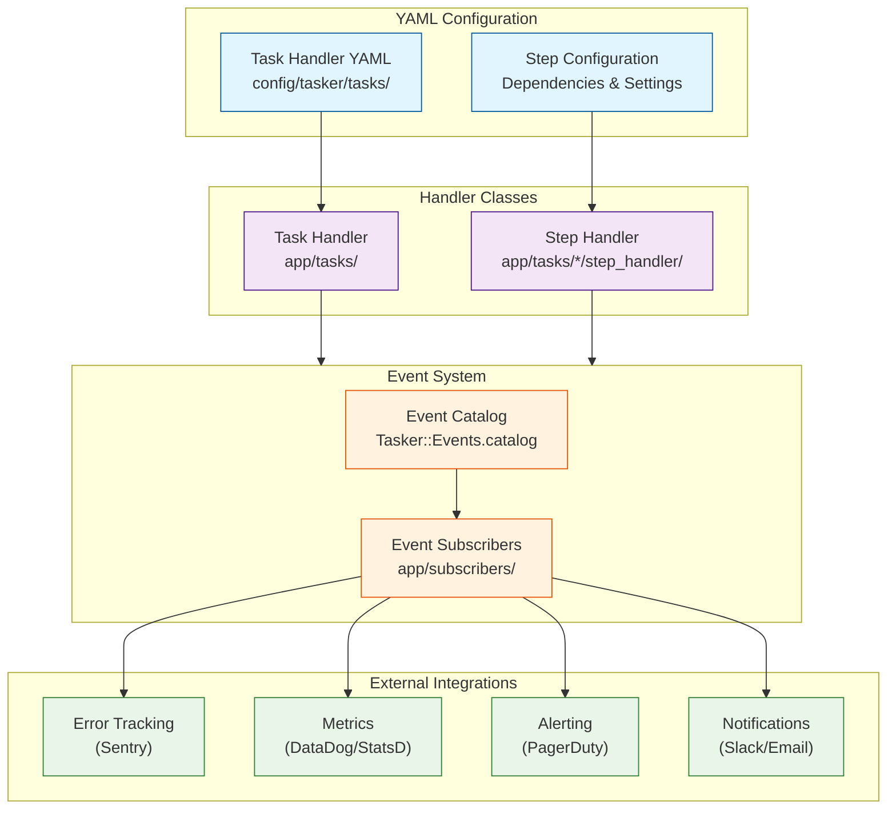

# Tasker Developer Guide

## Overview

This guide provides a comprehensive overview of developing with Tasker, covering all the key components that make up the workflow engine. Tasker is designed around four main developer-facing components:

1. **Task Handlers** - Define and coordinate multi-step workflows
2. **Step Handlers** - Implement the business logic for individual workflow steps
3. **Event Subscribers** - Create integrations with external services and monitoring systems
4. **YAML Configuration** - Declarative workflow and step configuration

## Architecture Overview



## 1. Task Handlers

Task handlers define the overall workflow structure and coordinate step execution. They are the entry point for creating and managing multi-step processes.

### Creating Task Handlers

Use the generator to create a complete task handler structure:

```bash
rails generate task_handler OrderProcess
```

This creates:
- **Handler Class**: `app/tasks/order_process.rb`
- **YAML Configuration**: `config/tasker/tasks/order_process.yaml`
- **Test File**: `spec/tasks/order_process_spec.rb`

### Task Handler Class Structure

```ruby
# app/tasks/order_process.rb
class OrderProcess < Tasker::TaskHandler::Base
  # The task handler class is primarily configuration-driven
  # Most behavior is defined in the YAML file

  # Optional: Custom initialization logic
  def initialize_task_context(task_request)
    super.merge(
      # Add custom context initialization
      processed_at: Time.current.iso8601,
      environment: Rails.env
    )
  end

  # Optional: Custom validation beyond JSON schema
  def validate_task_request(task_request)
    super

    # Custom business logic validation
    raise ArgumentError, "Order must exist" unless Order.exists?(task_request.context['order_id'])
  end
end
```

### Task Handler Capabilities

- **Workflow Orchestration**: Manages step dependencies and execution order
- **Parallel Processing**: Supports concurrent execution of independent steps
- **Error Handling**: Comprehensive retry logic with exponential backoff
- **Context Management**: Passes data between steps through task context
- **Validation**: JSON schema validation plus custom business rules
- **Event Publishing**: Automatic lifecycle event generation

## 2. Step Handlers

Step handlers implement the specific business logic for individual workflow steps. They are the workhorses that perform the actual operations.

### Step Handler Types

**Base Step Handler** - For general business logic:
```ruby
module OrderProcess
  module StepHandler
    class ProcessPaymentHandler < Tasker::StepHandler::Base
      def process(task, sequence, step)
        order_id = task.context['order_id']
        payment_method = task.context['payment_method']

        # Perform payment processing
        payment_result = PaymentService.charge(
          order_id: order_id,
          payment_method: payment_method
        )

        # Return results for dependent steps
        {
          payment_id: payment_result.id,
          amount_charged: payment_result.amount,
          transaction_id: payment_result.transaction_id
        }
      end
    end
  end
end
```

**API Step Handler** - For external API integrations:
```ruby
module OrderProcess
  module StepHandler
    class FetchInventoryHandler < Tasker::StepHandler::Api
      include OrderProcess::ApiUtils

      def process(task, sequence, step)
        product_ids = get_previous_step_data(sequence, 'fetch_products', 'product_ids')

        # Make HTTP request (automatic retry, timeout, error handling)
        connection.get('/inventory/check', { product_ids: product_ids })
      end

      def process_results(step, process_output, initial_results)
        # Custom response processing
        inventory_data = JSON.parse(process_output.body)
        step.results = {
          inventory_levels: inventory_data['levels'],
          availability: inventory_data['available'],
          last_updated: inventory_data['timestamp']
        }
      end
    end
  end
end
```

### Step Handler Features

- **Automatic Result Storage**: Return values automatically stored in `step.results`
- **Context Access**: Full access to task context and previous step results
- **Error Handling**: Exceptions trigger retry logic and error events
- **Custom Processing**: Override `process_results` for custom result handling
- **Event Integration**: Automatic event publishing for observability

### Accessing Previous Step Data

```ruby
def process(task, sequence, step)
  # Access task context
  order_id = task.context['order_id']

  # Find specific step by name
  payment_step = sequence.find_step_by_name('process_payment')
  payment_id = payment_step.results['payment_id']

  # Get data from multiple steps
  product_data = get_previous_step_data(sequence, 'fetch_products', 'products')
  inventory_data = get_previous_step_data(sequence, 'check_inventory', 'levels')

  # Your business logic here
  process_order_fulfillment(order_id, payment_id, product_data, inventory_data)
end
```

## 3. Event Subscribers

Event subscribers enable powerful integrations with external services and monitoring systems. They respond to workflow events and can trigger actions like notifications, alerts, or metrics collection.

### Creating Event Subscribers

Use the generator to create subscribers with automatic method routing:

```bash
# Generate a subscriber for specific events
rails generate tasker:subscriber notification --events task.completed task.failed step.failed

# Generate a metrics collector
rails generate tasker:subscriber metrics --events task.completed step.completed task.failed step.failed
```

### Event Subscriber Structure

```ruby
# app/subscribers/notification_subscriber.rb
class NotificationSubscriber < Tasker::Events::Subscribers::BaseSubscriber
  # Subscribe to specific events
  subscribe_to 'task.completed', 'task.failed', 'step.failed'

  # Automatic method routing: task.completed -> handle_task_completed
  def handle_task_completed(event)
    task_id = safe_get(event, :task_id)
    task_name = safe_get(event, :task_name, 'unknown')
    execution_duration = safe_get(event, :execution_duration, 0)

    # Send success notification
    NotificationService.send_email(
      to: 'team@company.com',
      subject: "Task Completed: #{task_name}",
      body: "Task #{task_id} completed successfully in #{execution_duration}s"
    )
  end

  def handle_task_failed(event)
    task_id = safe_get(event, :task_id)
    error_message = safe_get(event, :error_message, 'Unknown error')

    # Send failure alert
    AlertService.notify(
      level: 'error',
      message: "Task #{task_id} failed: #{error_message}",
      tags: { component: 'tasker', task_id: task_id }
    )
  end

  def handle_step_failed(event)
    step_id = safe_get(event, :step_id)
    step_name = safe_get(event, :step_name, 'unknown')
    task_id = safe_get(event, :task_id)

    # Log detailed step failure
    Rails.logger.error "Step failure in task #{task_id}: #{step_name} (#{step_id})"
  end
end
```

### Available Events

Discover all available events using the event catalog:

```ruby
# In Rails console or your code
Tasker::Events.catalog.keys
# => ["task.started", "task.completed", "task.failed", "step.started", ...]

# Get detailed event information
Tasker::Events.event_info('task.completed')
# => { name: "task.completed", category: "task", description: "...", ... }

# Browse by category
Tasker::Events.task_events.keys      # Task lifecycle events
Tasker::Events.step_events.keys      # Step execution events
Tasker::Events.workflow_events.keys  # Orchestration events
```

### Real-World Integration Examples

**Metrics Collection (DataDog)**:
```ruby
class MetricsSubscriber < Tasker::Events::Subscribers::BaseSubscriber
  subscribe_to 'task.completed', 'task.failed', 'step.completed'

  def handle_task_completed(event)
    task_name = safe_get(event, :task_name, 'unknown')
    execution_duration = safe_get(event, :execution_duration, 0)

    StatsD.histogram('tasker.task.duration', execution_duration, tags: ["task:#{task_name}"])
    StatsD.increment('tasker.task.completed', tags: ["task:#{task_name}"])
  end

  def handle_task_failed(event)
    task_name = safe_get(event, :task_name, 'unknown')
    error_class = safe_get(event, :exception_class, 'unknown')

    StatsD.increment('tasker.task.failed', tags: ["task:#{task_name}", "error:#{error_class}"])
  end
end
```

**Error Tracking (Sentry)**:
```ruby
class SentrySubscriber < Tasker::Events::Subscribers::BaseSubscriber
  subscribe_to 'task.failed', 'step.failed'

  def handle_task_failed(event)
    task_id = safe_get(event, :task_id)
    error_message = safe_get(event, :error_message, 'Unknown error')

    Sentry.capture_message(error_message,
      level: 'error',
      fingerprint: ['tasker', 'task_failed', task_id],
      tags: { task_id: task_id, component: 'tasker' }
    )
  end
end
```

## 4. YAML Configuration

YAML files provide declarative configuration for task handlers, defining workflows, dependencies, and step settings without requiring code changes.

### Task Handler YAML Structure

```yaml
# config/tasker/tasks/order_process.yaml
---
name: order_process
module_namespace: OrderProcess
task_handler_class: OrderProcess
concurrent: true  # Enable parallel step execution

# JSON Schema validation for task context
schema:
  type: object
  required:
    - order_id
    - customer_id
  properties:
    order_id:
      type: integer
    customer_id:
      type: integer
    priority:
      type: string
      enum: [low, normal, high, critical]

# Step definitions with dependencies
step_templates:
  - name: fetch_order
    description: Retrieve order details from database
    handler_class: OrderProcess::StepHandler::FetchOrderHandler

  - name: validate_inventory
    description: Check product availability
    depends_on_step: fetch_order
    handler_class: OrderProcess::StepHandler::ValidateInventoryHandler
    default_retryable: true
    default_retry_limit: 3

  - name: process_payment
    description: Charge customer payment method
    depends_on_step: validate_inventory
    handler_class: OrderProcess::StepHandler::ProcessPaymentHandler
    default_retryable: true
    default_retry_limit: 2

  - name: update_inventory
    description: Decrement inventory levels
    depends_on_step: process_payment
    handler_class: OrderProcess::StepHandler::UpdateInventoryHandler

  - name: send_confirmation
    description: Send order confirmation email
    depends_on_step: update_inventory
    handler_class: OrderProcess::StepHandler::SendConfirmationHandler
    default_retryable: true
    default_retry_limit: 5

# Environment-specific overrides
environments:
  development:
    step_templates:
      - name: process_payment
        # Use test payment processor in development
        handler_config:
          payment_processor: test

  production:
    step_templates:
      - name: process_payment
        # Production payment configuration
        handler_config:
          payment_processor: stripe
          timeout: 30
```

### Advanced YAML Features

**Multiple Dependencies**:
```yaml
- name: finalize_order
  description: Complete order processing
  depends_on_steps:  # Multiple dependencies
    - process_payment
    - update_inventory
    - reserve_shipping
  handler_class: OrderProcess::StepHandler::FinalizeOrderHandler
```

**Environment-Specific Configuration**:
```yaml
environments:
  test:
    step_templates:
      - name: send_email
        handler_config:
          email_service: mock

  staging:
    step_templates:
      - name: send_email
        handler_config:
          email_service: sendgrid_test

  production:
    step_templates:
      - name: send_email
        handler_config:
          email_service: sendgrid_production
          api_key: ${SENDGRID_API_KEY}
```

**API Step Configuration**:
```yaml
- name: fetch_external_data
  handler_class: OrderProcess::StepHandler::FetchExternalDataHandler
  handler_config:
    type: api
    url: https://api.external-service.com/data
    method: GET
    headers:
      Authorization: "Bearer ${API_TOKEN}"
    timeout: 15
    retries: 3
```

## Best Practices

### Task Handler Design

1. **Single Responsibility**: Each task handler should represent one business process
2. **Meaningful Names**: Use descriptive names that clearly indicate the workflow purpose
3. **Proper Dependencies**: Define clear step dependencies that reflect business logic
4. **Error Handling**: Configure appropriate retry limits based on operation reliability
5. **Context Design**: Include all necessary data in task context for step execution

### Step Handler Implementation

1. **Focused Logic**: Each step should do one thing well
2. **Clear Results**: Return meaningful data structure for dependent steps
3. **Error Information**: Provide helpful error context when operations fail
4. **Idempotency**: Design steps to be safely retryable
5. **Resource Cleanup**: Clean up resources in error scenarios

### Event Subscriber Guidelines

1. **Extend BaseSubscriber**: Always use `Tasker::Events::Subscribers::BaseSubscriber`
2. **Safe Data Access**: Use `safe_get(event, :key, default)` for robust data access
3. **Error Isolation**: Don't let subscriber errors break task execution
4. **Async Operations**: Move heavy operations to background jobs
5. **Monitoring**: Monitor subscriber performance and error rates

### YAML Configuration Management

1. **Environment Separation**: Use environment-specific configurations appropriately
2. **Sensitive Data**: Use environment variables for secrets and API keys
3. **Documentation**: Include clear descriptions for all steps
4. **Validation**: Use JSON schema validation for task context requirements
5. **Versioning**: Version control all YAML configuration files

## Development Workflow

### 1. Plan Your Workflow
- Identify the business process and break it into discrete steps
- Determine step dependencies and potential parallel execution
- Consider error scenarios and retry requirements

### 2. Generate and Configure
```bash
# Generate the task handler structure
rails generate task_handler YourWorkflow

# Generate step handlers as needed
rails generate step_handler YourWorkflow::ProcessData

# Generate event subscribers for integrations
rails generate tasker:subscriber monitoring --events task.completed task.failed
```

### 3. Implement Step Logic
- Implement business logic in step handler `process` methods
- Use previous step data and task context appropriately
- Handle errors gracefully with meaningful error information

### 4. Configure Dependencies
- Update YAML file with proper step dependencies
- Configure retry settings based on operation characteristics
- Add environment-specific configurations as needed

### 5. Create Integrations
- Implement event subscribers for monitoring and alerting
- Test subscriber behavior with realistic event data
- Configure external service integrations (Sentry, DataDog, etc.)

### 6. Test and Monitor
- Write comprehensive tests for both success and failure scenarios
- Monitor task execution through events and telemetry
- Use event catalog to understand available observability data

## Testing Strategies

### Testing Task Handlers
```ruby
RSpec.describe OrderProcess do
  describe '#initialize_task!' do
    let(:task_request) do
      Tasker::Types::TaskRequest.new(
        name: 'order_process',
        context: { order_id: 12345, customer_id: 67890 }
      )
    end

    it 'creates task with proper step configuration' do
      handler = described_class.new
      task = handler.initialize_task!(task_request)

      expect(task.workflow_steps.count).to eq(5)
      expect(task.workflow_steps.pluck(:name)).to include('fetch_order', 'process_payment')
    end
  end
end
```

### Testing Step Handlers
```ruby
RSpec.describe OrderProcess::StepHandler::ProcessPaymentHandler do
  describe '#process' do
    let(:task) { create(:task, context: { order_id: 123, payment_method: 'credit_card' }) }
    let(:sequence) { build_sequence_for(task) }
    let(:step) { sequence.find_step_by_name('process_payment') }

    it 'processes payment and returns payment details' do
      handler = described_class.new
      result = handler.process(task, sequence, step)

      expect(result).to include(:payment_id, :amount_charged, :transaction_id)
    end
  end
end
```

### Testing Event Subscribers
```ruby
RSpec.describe NotificationSubscriber do
  describe '#handle_task_completed' do
    let(:event) { { task_id: 'task_123', task_name: 'order_process', execution_duration: 45.2 } }

    it 'sends completion notification' do
      subscriber = described_class.new

      expect(NotificationService).to receive(:send_email)
        .with(hash_including(subject: /Task Completed/))

      subscriber.handle_task_completed(event)
    end
  end
end
```

## Related Documentation

- **[EVENT_SYSTEM.md](EVENT_SYSTEM.md)** - Complete event system documentation
- **[TELEMETRY.md](TELEMETRY.md)** - OpenTelemetry integration and observability
- **[OVERVIEW.md](OVERVIEW.md)** - System architecture overview
- **[FLOW_CHART.md](FLOW_CHART.md)** - Workflow execution visualization

## Quick Reference

### Generators
```bash
# Task handler with YAML and tests
rails generate task_handler WorkflowName

# Step handler for specific workflow
rails generate step_handler WorkflowName::ProcessData

# Event subscriber with automatic method routing
rails generate tasker:subscriber name --events event1 event2

# API step handler for external integrations
rails generate api_step_handler WorkflowName::FetchData
```

### Event Discovery
```ruby
# Discover all events
Tasker::Events.catalog.keys

# Get event details
Tasker::Events.event_info('task.completed')

# Browse by category
Tasker::Events.task_events.keys
Tasker::Events.step_events.keys
```

### Common Patterns
```ruby
# Access previous step data
previous_data = get_previous_step_data(sequence, 'step_name', 'data_key')

# Safe event data access
value = safe_get(event, :key, 'default_value')

# Publish custom events
publish_step_completed(step, custom_data: 'value')
```

This developer guide provides a comprehensive foundation for building sophisticated workflows with Tasker. The combination of task handlers, step handlers, event subscribers, and YAML configuration creates a powerful and flexible system for managing complex business processes.
