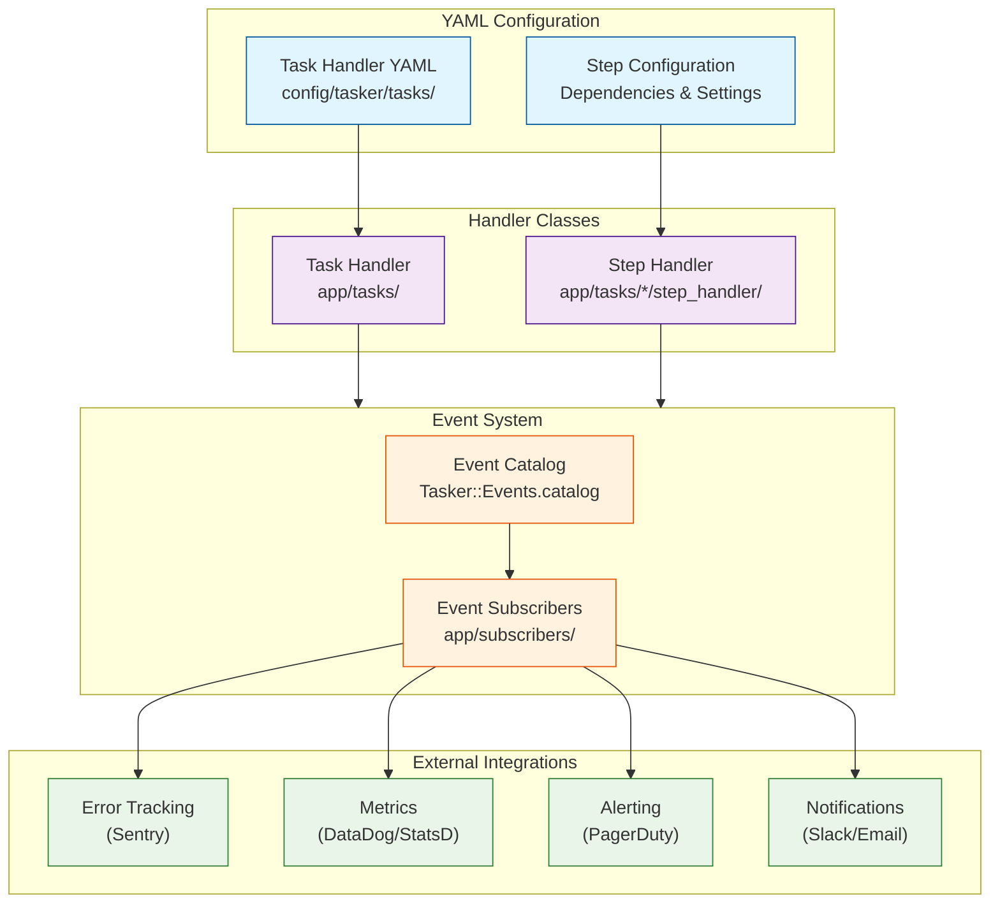

# Tasker Developer Guide

## Overview

This guide provides a comprehensive overview of developing with Tasker, covering all the key components that make up the workflow engine. Tasker is designed around five main developer-facing components:

1. **Task Handlers** - Define and coordinate multi-step workflows
2. **Step Handlers** - Implement the business logic for individual workflow steps
3. **Event Subscribers** - Create integrations with external services and monitoring systems
4. **YAML Configuration** - Declarative workflow and step configuration
5. **Authentication & Authorization** - Secure your workflows with flexible authentication strategies

## Architecture Overview



## 1. Task Handlers

Task handlers define the overall workflow structure and coordinate step execution. They are the entry point for creating and managing multi-step processes.

### Creating Task Handlers

Use the generator to create a complete task handler structure:

```bash
rails generate tasker:task_handler OrderProcess
```

This creates:
- **Handler Class**: `app/tasks/order_process.rb`
- **YAML Configuration**: `config/tasker/tasks/order_process.yaml`
- **Test File**: `spec/tasks/order_process_spec.rb`

### Task Handler Class Structure

```ruby
# app/tasks/order_process.rb
class OrderProcess < Tasker::TaskHandler::Base
  # The task handler class is primarily configuration-driven
  # Most behavior is defined in the YAML file

  # Optional: Custom initialization logic
  def initialize_task_context(task_request)
    super.merge(
      # Add custom context initialization
      processed_at: Time.current.iso8601,
      environment: Rails.env
    )
  end

  # Optional: Custom validation beyond JSON schema
  def validate_task_request(task_request)
    super

    # Custom business logic validation
    raise ArgumentError, "Order must exist" unless Order.exists?(task_request.context['order_id'])
  end
end
```

### Task Handler Capabilities

- **Workflow Orchestration**: Manages step dependencies and execution order
- **Parallel Processing**: Supports concurrent execution of independent steps
- **Error Handling**: Comprehensive retry logic with exponential backoff
- **Context Management**: Passes data between steps through task context
- **Validation**: JSON schema validation plus custom business rules
- **Event Publishing**: Automatic lifecycle event generation

## 2. Step Handlers

Step handlers implement the specific business logic for individual workflow steps. They are the workhorses that perform the actual operations.

### Step Handler Types

**Base Step Handler** - For general business logic with custom events:
```ruby
module OrderProcess
  module StepHandler
    class ProcessPaymentHandler < Tasker::StepHandler::Base
      # Define custom events that this handler can publish
      # These are automatically registered when the task handler is loaded
      def self.custom_event_configuration
        [
          {
            name: 'payment.processed',
            description: 'Published when payment processing completes successfully'
          },
          {
            name: 'payment.risk_flagged',
            description: 'Published when payment is flagged for manual review'
          }
        ]
      end

      def process(task, sequence, step)
        order_id = task.context[:order_id]
        payment_amount = task.context[:payment_amount]

        # Perform risk assessment
        risk_score = assess_payment_risk(order_id, payment_amount)

        if risk_score > 0.8
          # Publish custom event for high-risk payments
          publish_custom_event('payment.risk_flagged', {
            order_id: order_id,
            risk_score: risk_score,
            requires_manual_review: true,
            flagged_at: Time.current
          })

          { status: 'risk_review', risk_score: risk_score }
        else
          # Process payment normally
          payment_result = process_payment_transaction(order_id, payment_amount)

          # Publish custom event for successful payments
          publish_custom_event('payment.processed', {
            order_id: order_id,
            payment_amount: payment_amount,
            transaction_id: payment_result[:transaction_id],
            processed_at: Time.current
          })

          { status: 'completed', transaction_id: payment_result[:transaction_id] }
        end
      end

      private

      def assess_payment_risk(order_id, amount)
        # Risk assessment logic here
        # Returns a score between 0.0 and 1.0
        rand(0.0..1.0)
      end

      def process_payment_transaction(order_id, amount)
        # Payment processing logic here
        { transaction_id: "txn_#{SecureRandom.hex(8)}" }
      end
    end
  end
end
```

**API Step Handler** - For external API integrations:
```ruby
module OrderProcess
  module StepHandler
    class FetchInventoryHandler < Tasker::StepHandler::Api
      include OrderProcess::ApiUtils

      def process(task, sequence, step)
        product_ids = get_previous_step_data(sequence, 'fetch_products', 'product_ids')

        # Make HTTP request (automatic retry, timeout, error handling)
        connection.get('/inventory/check', { product_ids: product_ids })
      end

      def process_results(step, process_output, initial_results)
        # Custom response processing
        inventory_data = JSON.parse(process_output.body)
        step.results = {
          inventory_levels: inventory_data['levels'],
          availability: inventory_data['available'],
          last_updated: inventory_data['timestamp']
        }
      end
    end
  end
end
```

### Step Handler Features

- **Automatic Result Storage**: Return values automatically stored in `step.results`
- **Context Access**: Full access to task context and previous step results
- **Error Handling**: Framework determines success/failure based on exceptions (see Error Handling Patterns in Best Practices)
- **Custom Processing**: Override `process_results` for custom result handling
- **Event Integration**: Automatic event publishing for observability

### Accessing Previous Step Data

```ruby
def process(task, sequence, step)
  # Access task context
  order_id = task.context['order_id']

  # Find specific step by name
  payment_step = sequence.find_step_by_name('process_payment')
  payment_id = payment_step.results['payment_id']

  # Get data from multiple steps
  product_data = get_previous_step_data(sequence, 'fetch_products', 'products')
  inventory_data = get_previous_step_data(sequence, 'check_inventory', 'levels')

  # Your business logic here
  process_order_fulfillment(order_id, payment_id, product_data, inventory_data)
end
```

## 3. Event Subscribers

Event subscribers handle **"collateral" or "secondary" logic** - operations that support observability, monitoring, and alerting but are not core business requirements. They respond to workflow events and provide operational visibility into system behavior.

### Architectural Distinction: Subscribers vs Steps

**Event Subscribers** are for collateral concerns:
- **Operational Observability**: Logging, metrics, telemetry, traces
- **Alerting & Monitoring**: Sentry errors, PagerDuty alerts, operational notifications
- **Analytics**: Business intelligence, usage tracking, performance monitoring
- **External Integrations**: Non-critical third-party service notifications

**Workflow Steps** are for business-critical operations requiring:
- **Idempotency**: Can be safely retried without side effects
- **Retryability**: Built-in retry logic with exponential backoff
- **Explicit Lifecycle Tracking**: Success/failure states that matter to the business
- **Transactional Integrity**: Operations that need to be rolled back on failure

**Rule of Thumb**: If the operation must succeed for the workflow to be considered complete, it should be a workflow step. If it's supporting infrastructure (logging, monitoring, analytics), it should be an event subscriber.

### Creating Event Subscribers

Use the generator to create subscribers with automatic method routing:

```bash
# Generate a subscriber for specific events
rails generate tasker:subscriber notification --events task.completed task.failed step.failed

# Generate a metrics collector
rails generate tasker:subscriber metrics --events task.completed step.completed task.failed step.failed
```

### Event Subscriber Structure

```ruby
# app/subscribers/observability_subscriber.rb
class ObservabilitySubscriber < Tasker::Events::Subscribers::BaseSubscriber
  # Subscribe to specific events for operational monitoring
  subscribe_to 'task.completed', 'task.failed', 'step.failed', 'order.fulfilled'

  # Automatic method routing: task.completed -> handle_task_completed
  def handle_task_completed(event)
    task_id = safe_get(event, :task_id)
    task_name = safe_get(event, :task_name, 'unknown')
    execution_duration = safe_get(event, :execution_duration, 0)

    # Operational logging and metrics (collateral concerns)
    Rails.logger.info "Task completed: #{task_name} (#{task_id}) in #{execution_duration}s"
    StatsD.histogram('tasker.task.duration', execution_duration, tags: ["task:#{task_name}"])
  end

  def handle_task_failed(event)
    task_id = safe_get(event, :task_id)
    error_message = safe_get(event, :error_message, 'Unknown error')

    # Send alerts to operational tools (collateral concerns)
    Sentry.capture_message("Task failed: #{task_id}", level: 'error', extra: { error: error_message })
    PagerDutyService.trigger_alert(
      summary: "Tasker workflow failed",
      severity: 'error',
      details: { task_id: task_id, error: error_message }
    )
  end

  def handle_step_failed(event)
    step_id = safe_get(event, :step_id)
    step_name = safe_get(event, :step_name, 'unknown')
    task_id = safe_get(event, :task_id)

    # Operational logging for debugging (collateral concern)
    Rails.logger.error "Step failure in task #{task_id}: #{step_name} (#{step_id})"
  end

  def handle_order_fulfilled(event)
    order_id = safe_get(event, :order_id)
    customer_id = safe_get(event, :customer_id)

    # Analytics and monitoring (collateral concerns)
    AnalyticsService.track_order_fulfillment(order_id, customer_id)
    Rails.logger.info "Order fulfilled: #{order_id} for customer #{customer_id}"
  end
end
```

### Available Events

Discover all available events using the event catalog:

```ruby
# In Rails console or your code
Tasker::Events.catalog.keys
# => ["task.started", "task.completed", "task.failed", "step.started", ...]

# Get detailed event information
Tasker::Events.event_info('task.completed')
# => { name: "task.completed", category: "task", description: "...", ... }

# Browse by category
Tasker::Events.task_events.keys      # Task lifecycle events
Tasker::Events.step_events.keys      # Step execution events
Tasker::Events.workflow_events.keys  # Orchestration events
```

### Real-World Integration Examples

**Metrics Collection (DataDog)**:
```ruby
class MetricsSubscriber < Tasker::Events::Subscribers::BaseSubscriber
  subscribe_to 'task.completed', 'task.failed', 'step.completed'

  def handle_task_completed(event)
    task_name = safe_get(event, :task_name, 'unknown')
    execution_duration = safe_get(event, :execution_duration, 0)

    StatsD.histogram('tasker.task.duration', execution_duration, tags: ["task:#{task_name}"])
    StatsD.increment('tasker.task.completed', tags: ["task:#{task_name}"])
  end

  def handle_task_failed(event)
    task_name = safe_get(event, :task_name, 'unknown')
    error_class = safe_get(event, :exception_class, 'unknown')

    StatsD.increment('tasker.task.failed', tags: ["task:#{task_name}", "error:#{error_class}"])
  end
end
```

**Error Tracking (Sentry)**:
```ruby
class SentrySubscriber < Tasker::Events::Subscribers::BaseSubscriber
  subscribe_to 'task.failed', 'step.failed'

  def handle_task_failed(event)
    task_id = safe_get(event, :task_id)
    error_message = safe_get(event, :error_message, 'Unknown error')

    Sentry.capture_message(error_message,
      level: 'error',
      fingerprint: ['tasker', 'task_failed', task_id],
      tags: { task_id: task_id, component: 'tasker' }
    )
  end
end
```

## 4. YAML Configuration

YAML files provide declarative configuration for task handlers, defining workflows, dependencies, and step settings without requiring code changes.

### Task Handler YAML Structure

```yaml
# config/tasker/tasks/order_process.yaml
---
name: order_process
module_namespace: OrderProcess
task_handler_class: OrderProcess
concurrent: true  # Enable parallel step execution

# JSON Schema validation for task context
schema:
  type: object
  required:
    - order_id
    - customer_id
  properties:
    order_id:
      type: integer
    customer_id:
      type: integer
    priority:
      type: string
      enum: [low, normal, high, critical]

# Step definitions with dependencies
step_templates:
  - name: fetch_order
    description: Retrieve order details from database
    handler_class: OrderProcess::StepHandler::FetchOrderHandler

  - name: validate_inventory
    description: Check product availability
    depends_on_step: fetch_order
    handler_class: OrderProcess::StepHandler::ValidateInventoryHandler
    default_retryable: true
    default_retry_limit: 3

  - name: process_payment
    description: Charge customer payment method
    depends_on_step: validate_inventory
    handler_class: OrderProcess::StepHandler::ProcessPaymentHandler
    default_retryable: true
    default_retry_limit: 2

  - name: update_inventory
    description: Decrement inventory levels
    depends_on_step: process_payment
    handler_class: OrderProcess::StepHandler::UpdateInventoryHandler

  - name: send_confirmation
    description: Send order confirmation email
    depends_on_step: update_inventory
    handler_class: OrderProcess::StepHandler::SendConfirmationHandler
    default_retryable: true
    default_retry_limit: 5

# Environment-specific overrides
environments:
  development:
    step_templates:
      - name: process_payment
        # Use test payment processor in development
        handler_config:
          payment_processor: test

  production:
    step_templates:
      - name: process_payment
        # Production payment configuration
        handler_config:
          payment_processor: stripe
          timeout: 30
```

### Advanced YAML Features

**Multiple Dependencies**:
```yaml
- name: finalize_order
  description: Complete order processing
  depends_on_steps:  # Multiple dependencies
    - process_payment
    - update_inventory
    - reserve_shipping
  handler_class: OrderProcess::StepHandler::FinalizeOrderHandler
```

**Environment-Specific Configuration**:
```yaml
environments:
  test:
    step_templates:
      - name: send_email
        handler_config:
          email_service: mock

  staging:
    step_templates:
      - name: send_email
        handler_config:
          email_service: sendgrid_test

  production:
    step_templates:
      - name: send_email
        handler_config:
          email_service: sendgrid_production
          api_key: ${SENDGRID_API_KEY}
```

**API Step Configuration**:
```yaml
- name: fetch_external_data
  handler_class: OrderProcess::StepHandler::FetchExternalDataHandler
  handler_config:
    type: api
    url: https://api.external-service.com/data
    method: GET
    headers:
      Authorization: "Bearer ${API_TOKEN}"
    timeout: 15
    retries: 3
```

## 5. Authentication & Authorization

Tasker provides a comprehensive, production-ready authentication and authorization system that works with any Rails authentication solution. The system uses **dependency injection** and **resource-based authorization** to provide enterprise-grade security for both REST APIs and GraphQL endpoints.

### Key Features

- **Provider Agnostic**: Works with Devise, JWT, OmniAuth, custom authentication, or no authentication
- **Resource-Based Authorization**: Granular permissions using resource:action patterns (e.g., `tasker.task:create`)
- **GraphQL Operation-Level Authorization**: Revolutionary security for GraphQL that maps operations to resource permissions
- **Automatic Controller Integration**: Authentication and authorization work seamlessly across REST and GraphQL
- **Comprehensive Generators**: Create production-ready authenticators and authorization coordinators
- **Zero Breaking Changes**: All features are opt-in and backward compatible

### Quick Configuration Example

```ruby
# config/initializers/tasker.rb
Tasker.configuration do |config|
  config.auth do |auth|
    # Authentication
    auth.authentication_enabled = true
    auth.authenticator_class = 'YourCustomAuthenticator'

    # Authorization
    auth.authorization_enabled = true
    auth.authorization_coordinator_class = 'YourAuthorizationCoordinator'
    auth.user_class = 'User'
  end
end
```

### Available Generators

```bash
# Generate authenticators for different systems
rails generate tasker:authenticator CompanyJWT --type=jwt
rails generate tasker:authenticator AdminAuth --type=devise --user-class=Admin
rails generate tasker:authenticator ApiAuth --type=api_token
rails generate tasker:authenticator SocialAuth --type=omniauth

# Generate authorization coordinator
rails generate tasker:authorization_coordinator CompanyAuth
```

### GraphQL Authorization Example

The system automatically maps GraphQL operations to resource permissions:

```ruby
# This GraphQL query:
query { tasks { taskId status } }

# Automatically requires: tasker.task:index permission

# This mutation:
mutation { createTask(input: {...}) { taskId } }

# Automatically requires: tasker.task:create permission
```

### Resource-Based Permissions

Authorization uses a simple resource:action permission model:

```ruby
# Available permissions:
'tasker.task:index'           # List all tasks
'tasker.task:create'          # Create new tasks
'tasker.workflow_step:show'   # View individual workflow steps
'tasker.task_diagram:index'   # List task diagrams
```

### Complete Documentation

For comprehensive documentation including:
- **Quick Start Guides** - Get authentication working in minutes
- **Custom Authenticator Examples** - JWT, Devise, API tokens, and more
- **Authorization Coordinator Patterns** - Role-based, context-aware, and time-based authorization
- **GraphQL Authorization Details** - Operation mapping and context handling
- **Production Best Practices** - Security, performance, and monitoring guidelines
- **Testing Strategies** - Complete test examples and isolation techniques

**See [Authentication & Authorization Guide](AUTH.md)** for complete documentation.

## 6. Multi-Database Support

Tasker provides optional multi-database support using Rails' standard multi-database conventions. This allows Tasker models to use a separate database from the host application for data isolation, performance, or compliance requirements.

### Key Features

- **Rails Multi-Database Integration**: Uses Rails' `connects_to` API following official conventions
- **Standard Configuration**: Leverages Rails database.yml patterns with named databases
- **Automatic Model Support**: All Tasker models inherit multi-database capability automatically
- **Zero Breaking Changes**: Fully backward compatible with existing installations
- **Environment-Specific**: Supports different database configurations per environment

### Configuration

```ruby
# config/initializers/tasker.rb

# Default: Use host application database (shared)
Tasker.configuration do |config|
  config.database.enable_secondary_database = false
end

# Use dedicated Tasker database
Tasker.configuration do |config|
  config.database.enable_secondary_database = true
  config.database.name = :tasker
end

# Environment-specific configuration
Tasker.configuration do |config|
  config.database.enable_secondary_database = Rails.env.production?
  config.database.name = Rails.env.production? ? :tasker : nil
end
```

### Database Configuration

```yaml
# config/database.yml
production:
  primary:
    database: my_primary_database
    adapter: postgresql
    username: app_user
    password: <%= ENV['DATABASE_PASSWORD'] %>

  tasker:
    database: my_tasker_database
    adapter: postgresql
    username: tasker_user
    password: <%= ENV['TASKER_DATABASE_PASSWORD'] %>
```

### Benefits of Multi-Database Setup

**Data Isolation**: Separate Tasker data from application data for security or compliance

**Performance**: Dedicated database resources for workflow processing

**Scaling**: Independent scaling of workflow database based on usage patterns

**Backup Strategy**: Separate backup and recovery policies for workflow data

**Development**: Easier testing and development with isolated workflow data

### Migration Support

When using a secondary database, Tasker migrations automatically target the correct database:

```bash
# Migrations run against the configured Tasker database
bundle exec rails tasker:install:migrations
bundle exec rails db:migrate
```

### Production Considerations

- **Connection Pooling**: Configure appropriate connection pool sizes for both databases
- **Monitoring**: Monitor connection usage and performance for both databases
- **Backup Strategy**: Implement coordinated backup strategies if data consistency across databases is required
- **Network Latency**: Consider network latency if databases are on different servers

## Best Practices

### Task Handler Design

1. **Single Responsibility**: Each task handler should represent one business process
2. **Meaningful Names**: Use descriptive names that clearly indicate the workflow purpose
3. **Proper Dependencies**: Define clear step dependencies that reflect business logic
4. **Error Handling**: Configure appropriate retry limits based on operation reliability
5. **Context Design**: Include all necessary data in task context for step execution

### Step Handler Implementation

1. **Focused Logic**: Each step should do one thing well
2. **Clear Results**: Return meaningful data structure for dependent steps
3. **Error Handling**: Understand how the framework determines step success/failure (see Error Handling Patterns below)
4. **Idempotency**: Design steps to be safely retryable
5. **Resource Cleanup**: Clean up resources in error scenarios

#### Error Handling Patterns

The framework determines step success/failure based on whether the `process` method raises an exception:

- **Exception raised** → Step marked as FAILED, retry logic triggered, workflow stops
- **No exception raised** → Step marked as COMPLETED, workflow continues

**Pattern 1: Let exceptions bubble up (Recommended)**
```ruby
def process(task, sequence, step)
  # Attempt the operation - let exceptions propagate naturally
  result = perform_complex_operation(task.context)
  { success: true, data: result }

  # Framework automatically handles exceptions:
  # - Publishes step_failed event with error details
  # - Stores error information in step.results
  # - Transitions step to error state
  # - Triggers retry logic if configured
end
```

**Pattern 2: Catch, record error details, then re-raise**
```ruby
def process(task, sequence, step)
  begin
    result = perform_complex_operation(task.context)
    { success: true, data: result }
  rescue StandardError => e
    # Add custom error context to step.results
    step.results = {
      error: e.message,
      error_type: e.class.name,
      custom_context: "Additional business context",
      retry_recommended: should_retry?(e)
    }
    # Re-raise so framework knows this step failed
    raise
  end
end
```

**Pattern 3: Treat handled exceptions as success**
```ruby
def process(task, sequence, step)
  begin
    result = perform_complex_operation(task.context)
    { success: true, data: result }
  rescue RecoverableError => e
    # This exception is handled and considered a success case
    # Step will be marked as COMPLETED, not failed
    {
      success: true,
      data: get_fallback_data(task.context),
      recovered_from_error: e.message,
      used_fallback: true
    }
  end
end
```

⚠️ **Important**: Only catch exceptions in your `process` method if you intend to either:
- Add custom error context to `step.results` and re-raise (Pattern 2)
- Treat the exception as a recoverable success case (Pattern 3)

**Never** catch an exception, return error data, and expect the framework to treat it as a failure - it will be marked as successful.

### Event Subscriber Guidelines

1. **Extend BaseSubscriber**: Always use `Tasker::Events::Subscribers::BaseSubscriber`
2. **Safe Data Access**: Use `safe_get(event, :key, default)` for robust data access
3. **Error Isolation**: Don't let subscriber errors break task execution
4. **Async Operations**: Move heavy operations to background jobs
5. **Monitoring**: Monitor subscriber performance and error rates

### YAML Configuration Management

1. **Environment Separation**: Use environment-specific configurations appropriately
2. **Sensitive Data**: Use environment variables for secrets and API keys
3. **Documentation**: Include clear descriptions for all steps
4. **Validation**: Use JSON schema validation for task context requirements
5. **Versioning**: Version control all YAML configuration files

## Development Workflow

### 1. Plan Your Workflow
```bash
# Define your business process steps and dependencies
# Example: Order Processing
# 1. Validate Order → 2. Process Payment → 3. Ship Order
```

### 2. Generate Task Handler
```bash
rails generate tasker:task_handler OrderProcess --steps="validate_order,process_payment,ship_order"
```

### 3. Implement Step Handlers
```ruby
# app/tasks/order_process/validate_order_handler.rb
class ValidateOrderHandler < Tasker::StepHandler::Base
  def self.custom_event_configuration
    [
      { name: 'order.validation_failed', description: 'Order validation failed' },
      { name: 'order.validated', description: 'Order validation successful' }
    ]
  end

  def process(task, sequence, step)
    # Implementation here
    # Publish custom events as needed
  end
end
```

### 4. Configure Dependencies
```yaml
# config/tasker/tasks/order_process.yaml
step_templates:
  - name: validate_order
    handler_class: OrderProcess::ValidateOrderHandler
  - name: process_payment
    depends_on_step: validate_order
    handler_class: OrderProcess::ProcessPaymentHandler
    custom_events:
      - name: payment.gateway_error
        description: Payment gateway returned an error
  - name: ship_order
    depends_on_step: process_payment
    handler_class: OrderProcess::ShipOrderHandler
```

### 5. Test Your Workflow
```ruby
# spec/tasks/order_process_spec.rb
RSpec.describe OrderProcess do
  it 'processes orders successfully' do
    # Test implementation
  end
end
```

### 6. Deploy and Monitor
- Custom events are automatically registered and discoverable
- External systems can subscribe to your custom events
- Monitor workflow execution through event subscriptions

## Testing Strategies

### Testing Task Handlers
```ruby
RSpec.describe OrderProcess do
  describe '#initialize_task!' do
    let(:task_request) do
      Tasker::Types::TaskRequest.new(
        name: 'order_process',
        context: { order_id: 12345, customer_id: 67890 }
      )
    end

    it 'creates task with proper step configuration' do
      handler = described_class.new
      task = handler.initialize_task!(task_request)

      expect(task.workflow_steps.count).to eq(5)
      expect(task.workflow_steps.pluck(:name)).to include('fetch_order', 'process_payment')
    end
  end
end
```

### Testing Step Handlers
```ruby
RSpec.describe OrderProcess::StepHandler::ProcessPaymentHandler do
  describe '#process' do
    let(:task) { create(:task, context: { order_id: 123, payment_method: 'credit_card' }) }
    let(:sequence) { build_sequence_for(task) }
    let(:step) { sequence.find_step_by_name('process_payment') }

    it 'processes payment and returns payment details' do
      handler = described_class.new
      result = handler.process(task, sequence, step)

      expect(result).to include(:payment_id, :amount_charged, :transaction_id)
    end
  end
end
```

### Testing Event Subscribers
```ruby
RSpec.describe NotificationSubscriber do
  describe '#handle_task_completed' do
    let(:event) { { task_id: 'task_123', task_name: 'order_process', execution_duration: 45.2 } }

    it 'sends completion notification' do
      subscriber = described_class.new

      expect(NotificationService).to receive(:send_email)
        .with(hash_including(subject: /Task Completed/))

      subscriber.handle_task_completed(event)
    end
  end
end
```

## Related Documentation

- **[EVENT_SYSTEM.md](EVENT_SYSTEM.md)** - Complete event system documentation
- **[TELEMETRY.md](TELEMETRY.md)** - OpenTelemetry integration and observability
- **[OVERVIEW.md](OVERVIEW.md)** - System architecture overview
- **[FLOW_CHART.md](FLOW_CHART.md)** - Workflow execution visualization

## Quick Reference

### Generators
```bash
# Task handler with YAML and tests
rails generate tasker:task_handler WorkflowName

# Event subscriber with automatic method routing
rails generate tasker:subscriber name --events event1 event2

# Specialized metrics subscriber with helper methods
rails generate tasker:subscriber metrics --metrics --events task.completed task.failed
```

### Event Discovery
```ruby
# Discover all events
Tasker::Events.catalog.keys              # System events only
Tasker::Events.complete_catalog.keys     # System + custom events
Tasker::Events.custom_events.keys        # Custom events only

# Search and filter events
Tasker::Events.search_events('payment')  # Search by name/description
Tasker::Events.events_by_namespace('order')  # Events by namespace

# Get event details
Tasker::Events.event_info('task.completed')

# Browse by category
Tasker::Events.task_events.keys
Tasker::Events.step_events.keys
```

### Common Patterns
```ruby
# Access previous step data
previous_data = get_previous_step_data(sequence, 'step_name', 'data_key')

# Safe event data access
value = safe_get(event, :key, 'default_value')

# Class-based custom events (automatic registration)
class MyStepHandler < Tasker::StepHandler::Base
  def self.custom_event_configuration
    [{ name: 'order.processed', description: 'Order completed' }]
  end
end

# Publish custom events in step handlers
publish_custom_event('order.processed', order_id: 123, status: 'completed')

# Publish system events with custom data
publish_step_completed(step, custom_data: 'value')
```
