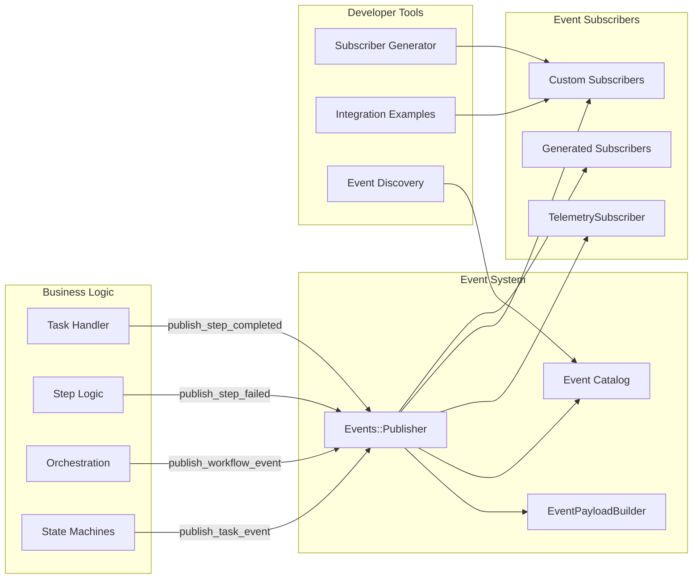

# Tasker Event System

## Overview

Tasker features a comprehensive event-driven architecture that provides deep insights into task execution, workflow orchestration, and system behavior. The event system is designed to be both production-ready for observability and developer-friendly for building custom integrations.

## Architecture

The Tasker event system consists of several key components working together:

### Core Components

1. **Events::Publisher** - Centralized event publishing using dry-events
2. **EventPublisher Concern** - Clean interface for business logic (`publish_step_completed`, etc.)
3. **EventPayloadBuilder** - Standardized payload creation for consistent data structures
4. **Event Catalog** - Complete event discovery and documentation system
5. **BaseSubscriber** - Foundation for creating custom event subscribers
6. **TelemetrySubscriber** - Production OpenTelemetry integration

### Event Flow Architecture



## Event Categories

### Task Events (`Tasker::Constants::TaskEvents`)

Task lifecycle events track the overall progress of workflow execution:

| Event | Description | Typical Payload |
|-------|-------------|-----------------|
| `INITIALIZE_REQUESTED` | Task creation and setup | `task_id`, `task_name`, `context` |
| `START_REQUESTED` | Task processing begins | `task_id`, `started_at` |
| `COMPLETED` | Task finished successfully | `task_id`, `execution_duration`, `step_count` |
| `FAILED` | Task encountered fatal error | `task_id`, `error_message`, `failed_step_id` |
| `RETRY_REQUESTED` | Task being retried | `task_id`, `retry_count`, `reason` |
| `CANCELLED` | Task manually cancelled | `task_id`, `cancelled_by`, `reason` |

### Step Events (`Tasker::Constants::StepEvents`)

Step-level events provide detailed execution tracking:

| Event | Description | Typical Payload |
|-------|-------------|-----------------|
| `EXECUTION_REQUESTED` | Step queued for processing | `task_id`, `step_id`, `step_name` |
| `BEFORE_HANDLE` | Step about to execute | `task_id`, `step_id`, `attempt_number` |
| `HANDLE` | Step currently executing | `task_id`, `step_id`, `started_at` |
| `COMPLETED` | Step finished successfully | `task_id`, `step_id`, `execution_duration`, `results` |
| `FAILED` | Step encountered error | `task_id`, `step_id`, `error_message`, `exception_class`, `backtrace` |
| `RETRY_REQUESTED` | Step being retried | `task_id`, `step_id`, `attempt_number`, `retry_delay` |
| `MAX_RETRIES_REACHED` | Step exceeded retry limit | `task_id`, `step_id`, `final_error` |

### Workflow Events (`Tasker::Constants::WorkflowEvents`)

Orchestration events track workflow coordination:

| Event | Description | Typical Payload |
|-------|-------------|-----------------|
| `TASK_STARTED` | Workflow orchestration begins | `task_id`, `total_steps` |
| `STEP_COMPLETED` | Individual step in workflow completed | `task_id`, `step_id`, `remaining_steps` |
| `VIABLE_STEPS_DISCOVERED` | Steps ready for execution identified | `task_id`, `step_ids`, `batch_size` |
| `NO_VIABLE_STEPS` | No executable steps found | `task_id`, `reason`, `blocked_steps` |
| `TASK_COMPLETED` | Entire workflow finished | `task_id`, `total_duration`, `success_rate` |

### Observability Events (`Tasker::Constants::ObservabilityEvents`)

System-level monitoring events:

| Event | Description | Typical Payload |
|-------|-------------|-----------------|
| `Task::ENQUEUE` | Task queued for background processing | `task_id`, `queue_name`, `enqueued_at` |
| `Task::START` | Task processing started by worker | `task_id`, `worker_id`, `started_at` |
| `Step::PROCESSING` | Step processing metrics | `task_id`, `step_id`, `processing_time`, `memory_usage` |

## Event Discovery

### Using the Event Catalog

The event catalog provides comprehensive event discovery and documentation:

```ruby
# Discover all available events
puts Tasker::Events.catalog.keys
# => ["task.started", "task.completed", "task.failed", "step.started", ...]

# Get detailed event information
event_info = Tasker::Events.event_info('task.completed')
puts event_info
# => {
#   name: "task.completed",
#   category: "task",
#   description: "Fired when a task completes successfully",
#   payload_schema: { task_id: String, execution_duration: Float },
#   example_payload: { task_id: "task_123", execution_duration: 45.2 },
#   fired_by: ["TaskFinalizer", "TaskHandler"]
# }

# Browse events by category
puts Tasker::Events.task_events.keys
puts Tasker::Events.step_events.keys
puts Tasker::Events.workflow_events.keys
```

### Event Documentation Structure

Each event in the catalog includes:

- **Name**: Standard event identifier
- **Category**: Event classification (task, step, workflow, observability)
- **Description**: Human-readable explanation of when the event fires
- **Payload Schema**: Expected data structure with types
- **Example Payload**: Real example of event data
- **Fired By**: Components that publish this event

## Creating Custom Subscribers

### Using the Subscriber Generator

The easiest way to create custom event subscribers is using the built-in generator:

```bash
# Generate a subscriber with specific events
rails generate tasker:subscriber notification --events task.completed task.failed step.failed

# Generate a basic subscriber (add events manually)
rails generate tasker:subscriber sentry
```

This creates:
- A subscriber class extending `Tasker::Events::Subscribers::BaseSubscriber`
- Automatic method routing based on event names
- Complete RSpec test file with realistic patterns
- Clear usage instructions and documentation

### Manual Subscriber Creation

You can also create subscribers manually:

```ruby
class NotificationSubscriber < Tasker::Events::Subscribers::BaseSubscriber
  # Subscribe to specific events
  subscribe_to 'task.completed', 'task.failed', 'step.failed'

  # Handle task.completed events
  def handle_task_completed(event)
    task_id = safe_get(event, :task_id)
    execution_duration = safe_get(event, :execution_duration, 0)

    # Send success notification
    NotificationService.send_success_email(
      task_id: task_id,
      duration: execution_duration
    )
  end

  # Handle task.failed events
  def handle_task_failed(event)
    task_id = safe_get(event, :task_id)
    error_message = safe_get(event, :error_message, 'Unknown error')

    # Send failure alert
    AlertService.send_failure_alert(
      task_id: task_id,
      error: error_message
    )
  end

  # Handle step.failed events
  def handle_step_failed(event)
    step_id = safe_get(event, :step_id)
    step_name = safe_get(event, :step_name)

    # Log step failure for debugging
    Rails.logger.error "Step failed: #{step_name} (#{step_id})"
  end
end
```

### BaseSubscriber Features

The `BaseSubscriber` class provides:

- **Automatic Method Routing**: `task.completed` → `handle_task_completed`
- **Safe Data Access**: `safe_get(event, :key, default)` with type checking
- **Error Handling**: Graceful handling of malformed events
- **Logging**: Automatic debug logging for event processing
- **Flexible Subscription**: Subscribe to specific events or event patterns

## Integration Examples

Tasker includes comprehensive integration examples demonstrating real-world usage patterns. These examples are located in `spec/lib/tasker/events/subscribers/examples/` and serve as both documentation and implementation templates.

### Available Examples

#### SentrySubscriber - Error Tracking Integration
```ruby
class SentrySubscriber < Tasker::Events::Subscribers::BaseSubscriber
  subscribe_to 'task.failed', 'step.failed', 'workflow.error'

  def handle_task_failed(event)
    task_id = safe_get(event, :task_id)
    error_message = safe_get(event, :error_message, 'Unknown error')

    # Intelligent error fingerprinting for Sentry
    sentry_data = {
      level: 'error',
      fingerprint: ['tasker', 'task_failed', task_id],
      tags: {
        task_id: task_id,
        component: 'tasker',
        environment: Rails.env
      },
      extra: {
        error_message: error_message,
        timestamp: Time.current.iso8601
      }
    }

    # In real implementation: Sentry.capture_message(error_message, **sentry_data)
    Rails.logger.info "Would report to Sentry: #{sentry_data}"
  end
end
```

#### PagerDutySubscriber - Critical Alerting
```ruby
class PagerDutySubscriber < Tasker::Events::Subscribers::BaseSubscriber
  subscribe_to 'task.failed', 'step.failed'

  def handle_task_failed(event)
    task_id = safe_get(event, :task_id)

    # Only alert on critical tasks (business logic filtering)
    return unless critical_task?(task_id)

    pagerduty_event = {
      routing_key: ENV['PAGERDUTY_INTEGRATION_KEY'],
      event_action: 'trigger',
      dedup_key: "tasker_task_failed_#{task_id}",
      payload: {
        summary: "Critical Tasker task failed: #{task_id}",
        severity: 'critical',
        source: 'tasker'
      }
    }

    # In real implementation: PagerDuty.trigger(pagerduty_event)
    Rails.logger.warn "Would trigger PagerDuty alert: #{pagerduty_event}"
  end

  private

  def critical_task?(task_id)
    # Example business logic for determining criticality
    task_id.include?('critical') ||
    task_id.include?('production') ||
    task_id.include?('order_processing')
  end
end
```

#### SlackSubscriber - Team Notifications
```ruby
class SlackSubscriber < Tasker::Events::Subscribers::BaseSubscriber
  subscribe_to 'task.completed', 'task.failed'

  def handle_task_completed(event)
    task_id = safe_get(event, :task_id)
    execution_duration = safe_get(event, :execution_duration, 0)

    message = {
      channel: channel_for_environment,
      username: 'Tasker Bot',
      icon_emoji: ':white_check_mark:',
      text: "Task completed successfully!",
      attachments: [
        {
          color: 'good',
          fields: [
            { title: 'Task ID', value: task_id, short: true },
            { title: 'Duration', value: format_duration(execution_duration), short: true },
            { title: 'Environment', value: Rails.env, short: true }
          ],
          footer: 'Tasker Workflow Engine',
          ts: Time.current.to_i
        }
      ]
    }

    # In real implementation: SlackNotifier.ping(message)
    Rails.logger.info "Would send Slack notification: #{message}"
  end

  private

  def channel_for_environment
    case Rails.env
    when 'production' then '#alerts-production'
    when 'staging' then '#alerts-staging'
    else '#tasker-dev'
    end
  end

  def format_duration(seconds)
    return "#{seconds}s" if seconds < 60
    minutes = seconds / 60
    "#{minutes.round(1)}m"
  end
end
```

### Multi-Service Integration Pattern
```ruby
class ComprehensiveSubscriber < Tasker::Events::Subscribers::BaseSubscriber
  subscribe_to 'task.completed', 'task.failed', 'step.failed'

  def handle_task_completed(event)
    task_id = safe_get(event, :task_id)

    # Multi-service integration on success
    update_external_system(task_id, 'completed')
    send_completion_email(task_id)
    record_success_metric(task_id)
    cleanup_temporary_resources(task_id)
  end

  def handle_task_failed(event)
    task_id = safe_get(event, :task_id)
    error_message = safe_get(event, :error_message)

    # Comprehensive failure handling
    notify_operations_team(task_id, error_message)
    create_support_ticket(task_id, error_message)
    record_failure_metric(task_id)
    preserve_debug_data(task_id)
  end

  private

  def update_external_system(task_id, status)
    # External API integration
    Rails.logger.info "Updating external system for task #{task_id}: #{status}"
  end

  def record_success_metric(task_id)
    # Metrics collection (StatsD, DataDog, etc.)
    Rails.logger.info "Recording success metric for task #{task_id}"
  end

  # Additional integration methods...
end
```

## Publishing Events

### Using EventPublisher Concern

The `EventPublisher` concern provides clean methods for publishing events from your business logic:

```ruby
class MyStepHandler
  include Tasker::Concerns::EventPublisher

  def handle(task, sequence, step)
    # Clean step started event
    publish_step_started(step)

    begin
      # Your business logic here
      result = perform_operation(task.context)
      step.results = { data: result }

      # Clean completion event with additional context
      publish_step_completed(step, operation_count: result.size)
    rescue StandardError => e
      # Clean failure event with error context
      publish_step_failed(step, error: e)
      raise
    end
  end
end
```

### Available Publishing Methods

**Task Events**:
- `publish_task_event(event_name, task, **additional_context)`
- `publish_task_started(task, **context)`
- `publish_task_completed(task, **context)`
- `publish_task_failed(task, **context)`

**Step Events**:
- `publish_step_event(event_name, step, **additional_context)`
- `publish_step_started(step, **context)`
- `publish_step_completed(step, **context)`
- `publish_step_failed(step, **context)`

**Workflow Events**:
- `publish_workflow_event(event_name, **context)`

**Generic Events**:
- `publish_event(event_name, **payload)`

### Event Payload Structure

All events follow a standardized payload structure:

```ruby
{
  # Core identifiers (always present)
  task_id: "task_123",
  step_id: "step_456",           # When applicable

  # Timing information (when available)
  started_at: "2024-01-15T10:30:00Z",
  completed_at: "2024-01-15T10:32:15Z",
  execution_duration: 135.2,    # seconds

  # Error information (for error events)
  error_message: "Connection timeout",
  exception_class: "Net::TimeoutError",
  backtrace: ["line1", "line2"],
  attempt_number: 3,

  # Context (when relevant)
  step_name: "fetch_data",
  task_name: "order_processing",
  environment: "production",

  # Custom context (event-specific)
  # ... additional fields
}
```

## Testing Event Subscribers

### Generated Test Patterns

The subscriber generator creates comprehensive test files:

```ruby
require 'rails_helper'

RSpec.describe NotificationSubscriber do
  let(:subscriber) { described_class.new }
  let(:sample_event) { { task_id: 'task_123', execution_duration: 45.2 } }

  describe '#handle_task_completed' do
    it 'processes task completion events successfully' do
      expect { subscriber.handle_task_completed(sample_event) }.not_to raise_error
    end

    it 'handles missing task_id gracefully' do
      event_without_task_id = { execution_duration: 45.2 }
      expect { subscriber.handle_task_completed(event_without_task_id) }.not_to raise_error
    end
  end

  describe '#handle_task_failed' do
    let(:failure_event) { { task_id: 'task_123', error_message: 'Something went wrong' } }

    it 'processes task failure events successfully' do
      expect { subscriber.handle_task_failed(failure_event) }.not_to raise_error
    end
  end
end
```

### Integration Testing

The event system includes comprehensive integration tests demonstrating real-world patterns:

```ruby
# spec/lib/tasker/events/subscribers/example_integrations_spec.rb
RSpec.describe 'Event Subscriber Integration Examples' do
  describe 'SentrySubscriber' do
    it 'handles task failures with intelligent error fingerprinting' do
      subscriber = SentrySubscriber.new
      event = { task_id: 'critical_task_123', error_message: 'Database connection failed' }

      expect { subscriber.handle_task_failed(event) }.not_to raise_error
      # Additional verification of Sentry integration behavior
    end
  end
end
```

## Production Deployment

### OpenTelemetry Integration

The event system automatically integrates with OpenTelemetry for production observability. See [TELEMETRY.md](TELEMETRY.md) for detailed configuration.

### Performance Considerations

- **Async Event Publishing**: Events are published asynchronously to avoid blocking business logic
- **Efficient Payload Building**: `EventPayloadBuilder` optimizes payload creation
- **Selective Subscription**: Subscribers only receive events they're registered for
- **Error Isolation**: Subscriber errors don't affect task execution

### Configuration

Configure event publishing in `config/initializers/tasker.rb`:

```ruby
Tasker.configuration do |config|
  # Filter sensitive data from event payloads
  config.filter_parameters = [:password, :api_key, 'credit_card.number', /token/i]

  # Custom filter mask for sensitive data
  config.telemetry_filter_mask = '***REDACTED***'

  # OpenTelemetry service identification
  config.otel_telemetry_service_name = 'my_app_tasker'
  config.otel_telemetry_service_version = '1.2.3'
end
```

## Best Practices

### Subscriber Development

1. **Extend BaseSubscriber**: Always use `Tasker::Events::Subscribers::BaseSubscriber`
2. **Use safe_get**: Access event data with `safe_get(event, :key, default)`
3. **Handle Errors Gracefully**: Don't let subscriber errors break task execution
4. **Focus on Single Responsibility**: Each subscriber should handle one concern
5. **Test Thoroughly**: Use generated test patterns for comprehensive coverage

### Event Publishing

1. **Use EventPublisher Concern**: Leverage provided publishing methods
2. **Include Relevant Context**: Add meaningful additional context to events
3. **Follow Naming Conventions**: Use consistent event naming patterns
4. **Avoid Sensitive Data**: Use configuration filters for sensitive information

### Performance

1. **Async Operations**: Keep subscriber logic fast or move to background jobs
2. **Batch Operations**: Group related actions when possible
3. **Circuit Breakers**: Implement failure handling for external service calls
4. **Monitoring**: Monitor subscriber performance and error rates

## Related Documentation

- [TELEMETRY.md](TELEMETRY.md) - OpenTelemetry integration and observability
- [OVERVIEW.md](OVERVIEW.md) - System architecture and task handler configuration
- [Phase 2 Developer Event System](PHASE_2_DEVELOPER_EVENT_SYSTEM.md) - Implementation details

## Example Files

Live examples are available in the codebase:

- **Integration Examples**: `spec/lib/tasker/events/subscribers/examples/`
- **Generated Subscribers**: Use `rails generate tasker:subscriber` to see templates
- **Test Patterns**: Generated test files show comprehensive testing approaches
- **Event Catalog**: Explore `Tasker::Events.catalog` in Rails console
