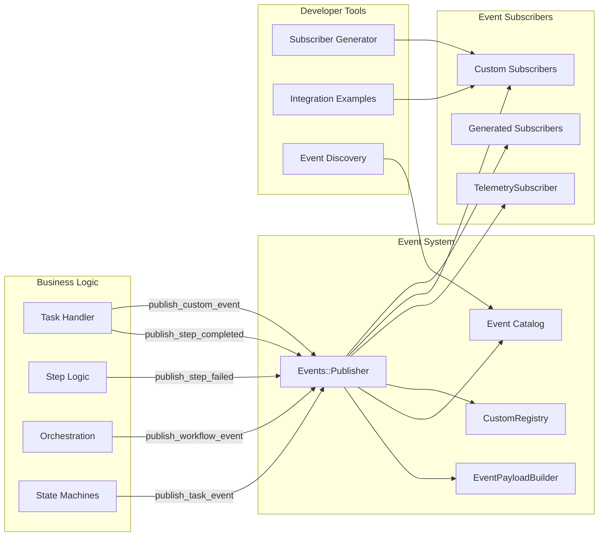

# Tasker Event System

## Overview

Tasker features a comprehensive event-driven architecture that provides deep insights into task execution, workflow orchestration, and system behavior. The event system supports both **system events** (built-in workflow events) and **custom events** (business logic events), designed to be production-ready for observability and developer-friendly for building custom integrations.

## Architecture

The Tasker event system consists of several key components working together:

### Core Components

1. **Events::Publisher** - Centralized event publishing using dry-events
2. **EventPublisher Concern** - Clean interface for business logic (`publish_step_completed`, `publish_custom_event`)
3. **EventPayloadBuilder** - Standardized payload creation for consistent data structures
4. **Event Catalog** - Complete event discovery and documentation system (system + custom events)
5. **BaseSubscriber** - Foundation for creating custom event subscribers
6. **TelemetrySubscriber** - Production OpenTelemetry integration
7. **CustomRegistry** - Registration and management of custom business events

### Event Flow Architecture



---

## System Events

System events are built-in events that track the core workflow execution lifecycle. These events are automatically published by Tasker as tasks and steps execute.

### Task Events (`Tasker::Constants::TaskEvents`)

Task lifecycle events track the overall progress of workflow execution:

| Event | Description | Typical Payload |
|-------|-------------|-----------------|
| `INITIALIZE_REQUESTED` | Task creation and setup | `task_id`, `task_name`, `context` |
| `START_REQUESTED` | Task processing begins | `task_id`, `started_at` |
| `COMPLETED` | Task finished successfully | `task_id`, `execution_duration`, `step_count` |
| `FAILED` | Task encountered fatal error | `task_id`, `error_message`, `failed_step_id` |
| `RETRY_REQUESTED` | Task being retried | `task_id`, `retry_count`, `reason` |
| `CANCELLED` | Task manually cancelled | `task_id`, `cancelled_by`, `reason` |

### Step Events (`Tasker::Constants::StepEvents`)

Step-level events provide detailed execution tracking:

| Event | Description | Typical Payload |
|-------|-------------|-----------------|
| `EXECUTION_REQUESTED` | Step queued for processing | `task_id`, `step_id`, `step_name` |
| `BEFORE_HANDLE` | Step about to execute | `task_id`, `step_id`, `attempt_number` |
| `HANDLE` | Step currently executing | `task_id`, `step_id`, `started_at` |
| `COMPLETED` | Step finished successfully | `task_id`, `step_id`, `execution_duration`, `results` |
| `FAILED` | Step encountered error | `task_id`, `step_id`, `error_message`, `exception_class`, `backtrace` |
| `RETRY_REQUESTED` | Step being retried | `task_id`, `step_id`, `attempt_number`, `retry_delay` |
| `MAX_RETRIES_REACHED` | Step exceeded retry limit | `task_id`, `step_id`, `final_error` |

### Workflow Events (`Tasker::Constants::WorkflowEvents`)

Orchestration events track workflow coordination:

| Event | Description | Typical Payload |
|-------|-------------|-----------------|
| `TASK_STARTED` | Workflow orchestration begins | `task_id`, `total_steps` |
| `STEP_COMPLETED` | Individual step in workflow completed | `task_id`, `step_id`, `remaining_steps` |
| `VIABLE_STEPS_DISCOVERED` | Steps ready for execution identified | `task_id`, `step_ids`, `batch_size` |
| `NO_VIABLE_STEPS` | No executable steps found | `task_id`, `reason`, `blocked_steps` |
| `TASK_COMPLETED` | Entire workflow finished | `task_id`, `total_duration`, `success_rate` |

### Observability Events (`Tasker::Constants::ObservabilityEvents`)

System-level monitoring events:

| Event | Description | Typical Payload |
|-------|-------------|-----------------|
| `Task::ENQUEUE` | Task queued for background processing | `task_id`, `queue_name`, `enqueued_at` |
| `Task::START` | Task processing started by worker | `task_id`, `worker_id`, `started_at` |
| `Step::PROCESSING` | Step processing metrics | `task_id`, `step_id`, `processing_time`, `memory_usage` |

---

## Custom Events

Custom events allow you to define and publish business logic events from your step handlers that can be consumed by subscribers for monitoring, alerting, and notifications. Unlike system events, custom events are declaratively defined by developers and automatically registered.

### Creating Custom Events

Tasker provides multiple ways to define custom events with **automatic registration**:

#### 1. Class-Based Event Configuration (Recommended)

```ruby
class OrderFulfillmentStep < Tasker::StepHandler::Base
  # Define custom events - these are automatically registered when the handler loads
  def self.custom_event_configuration
    [
      {
        name: 'order.fulfilled',
        description: 'Order has been fulfilled and shipped'
      },
      {
        name: 'order.shipment_delayed',
        description: 'Order shipment has been delayed'
      }
    ]
  end

  def process(task, sequence, step)
    order = find_order(step.inputs['order_id'])

    # ... fulfillment logic ...

    # Publish custom event for subscribers (PagerDuty, Sentry, Slack, etc.)
    publish_custom_event('order.fulfilled', {
      order_id: order.id,
      customer_id: order.customer_id,
      total_amount: order.total,
      priority: order.priority_level,
      fulfillment_center: order.fulfillment_center,
      shipping_method: order.shipping_method
    })
  end
end
```

#### 2. YAML-Based Event Configuration

You can also define custom events in your step template YAML files:

```yaml
# config/step_templates/order_fulfillment.yml
name: "Order Fulfillment Step"
description: "Processes and fulfills customer orders"
handler_class: "OrderFulfillmentStep"
custom_events:
  - name: "order.fulfilled"
    description: "Order has been fulfilled and shipped"
  - name: "order.shipment_delayed"
    description: "Order shipment has been delayed"
```

#### Key Features

- **Automatic Registration**: Events are registered when step handlers load - no manual registration required
- **Namespace Validation**: Events must be namespaced (e.g., `order.fulfilled`)
- **Conflict Prevention**: Cannot conflict with system events
- **Reserved Namespaces**: `task.*`, `step.*`, `workflow.*`, `observability.*`, `test.*` are reserved
- **Complete Integration**: Custom events appear in all discovery methods
- **Subscriber Compatibility**: Work seamlessly with existing subscriber patterns

### Publishing Custom Events

From within your step handlers, use the `publish_custom_event` method:

```ruby
class PaymentRiskAssessmentStep < Tasker::StepHandler::Base
  def self.custom_event_configuration
    [
      {
        name: 'payment.risk_flagged',
        description: 'Payment flagged for manual review due to risk factors'
      }
    ]
  end

  def process(task, sequence, step)
    risk_assessment = assess_payment_risk(step.inputs)

    if risk_assessment.flagged?
      # Publish the pre-declared custom event
      publish_custom_event('payment.risk_flagged', {
        payment_id: risk_assessment.payment_id,
        risk_score: risk_assessment.score,
        flagged_reasons: risk_assessment.reasons,
        requires_manual_review: true,
        customer_tier: risk_assessment.customer_tier
      })
    end
  end
end
```

### Custom Event Best Practices

#### Event Naming
- Use namespace.action format: `order.fulfilled`, `payment.processed`
- Choose descriptive, business-focused names
- Avoid technical implementation details in names

#### Event Payloads
Include relevant business context:

```ruby
# Good: Business context
publish_custom_event('order.cancelled', {
  order_id: order.id,
  customer_id: order.customer_id,
  cancellation_reason: 'customer_request',
  refund_amount: order.refundable_amount,
  cancelled_at: Time.current,
  order_status_before_cancellation: order.previous_status
})

# Avoid: Too technical or sparse
publish_custom_event('order.cancelled', {
  id: 123,
  status: 'cancelled'
})
```

---

## Event Discovery

The event catalog provides comprehensive discovery for both system and custom events:

### Using the Event Catalog

```ruby
# Discover all available events
puts Tasker::Events.catalog.keys                    # System events only
puts Tasker::Events.complete_catalog.keys           # System + custom events
puts Tasker::Events.custom_events.keys              # Custom events only

# Search and filter events
puts Tasker::Events.search_events('payment')        # Search by name/description
puts Tasker::Events.events_by_namespace('order')    # Get events by namespace

# Get detailed event information
event_info = Tasker::Events.event_info('task.completed')
puts event_info
# => {
#   name: "task.completed",
#   category: "task",
#   description: "Fired when a task completes successfully",
#   payload_schema: { task_id: String, execution_duration: Float },
#   example_payload: { task_id: "task_123", execution_duration: 45.2 },
#   fired_by: ["TaskFinalizer", "TaskHandler"]
# }

# Browse events by category
puts Tasker::Events.task_events.keys                # System task events
puts Tasker::Events.step_events.keys                # System step events
puts Tasker::Events.workflow_events.keys            # System workflow events
puts Tasker::Events.custom_events.keys              # Custom business events
```

### Event Documentation Structure

Each event in the catalog includes:

- **Name**: Standard event identifier
- **Category**: Event classification (task, step, workflow, observability, custom)
- **Description**: Human-readable explanation of when the event fires
- **Payload Schema**: Expected data structure with types
- **Example Payload**: Real example of event data
- **Fired By**: Components that publish this event

### Print Complete Catalog

```ruby
# Print complete catalog (includes custom events)
Tasker::Events::Catalog.print_catalog

# Or in Rails console:
pp Tasker::Events.custom_events
```

---

## Architectural Distinction: Event Subscribers vs Workflow Steps

**Critical Design Principle**: Event subscribers should handle **"collateral" or "secondary" logic** - operations that support observability, monitoring, and alerting but are not core business requirements.

### Use Event Subscribers For:
- **Operational Observability**: Logging, metrics, telemetry, traces
- **Alerting & Monitoring**: Sentry errors, PagerDuty alerts, operational notifications
- **Analytics**: Business intelligence, usage tracking, performance monitoring
- **External Integrations**: Non-critical third-party service notifications

### Use Workflow Steps For:
- **Business-Critical Operations**: Actions that must succeed for the workflow to be considered complete
- **Operations Requiring**:
  - **Idempotency**: Can be safely retried without side effects
  - **Retryability**: Built-in retry logic with exponential backoff
  - **Explicit Lifecycle Tracking**: Success/failure states that matter to the business
  - **Transactional Integrity**: Operations that need to be rolled back on failure

### Examples of Proper Usage

**✅ Event Subscriber (Collateral Concerns)**:
```ruby
class ObservabilitySubscriber < Tasker::Events::Subscribers::BaseSubscriber
  subscribe_to 'order.fulfilled'

  def handle_order_fulfilled(event)
    # Operational logging and analytics - if these fail, the order is still fulfilled
    AnalyticsService.track_fulfillment(order_id: safe_get(event, :order_id))
    Rails.logger.info "Order #{safe_get(event, :order_id)} fulfilled"
  end
end
```

**✅ Workflow Step (Business Logic)**:
```yaml
# config/tasker/tasks/order_process.yaml
- name: send_confirmation_email
  description: Send order confirmation email to customer
  depends_on_step: process_payment
  handler_class: OrderProcess::StepHandler::SendConfirmationEmailHandler
  default_retryable: true
  default_retry_limit: 3
```

**❌ Wrong - Business Logic in Event Subscriber**:
```ruby
# DON'T DO THIS - Critical email sending belongs in a workflow step
def handle_order_fulfilled(event)
  CustomerService.send_confirmation_email(safe_get(event, :order_id))  # Critical business action!
end
```

**Rule of Thumb**: If the operation must succeed for the workflow to be considered complete, it should be a workflow step. If it's supporting infrastructure (logging, monitoring, analytics), it should be an event subscriber.

## Creating Custom Subscribers

### Using the Subscriber Generator

The easiest way to create custom event subscribers is using the built-in generator:

```bash
# Generate a subscriber with specific events (works for both system and custom events)
rails generate tasker:subscriber notification --events task.completed task.failed order.fulfilled

# Generate a basic subscriber (add events manually)
rails generate tasker:subscriber sentry
```

This creates:
- A subscriber class extending `Tasker::Events::Subscribers::BaseSubscriber`
- Automatic method routing based on event names
- Complete RSpec test file with realistic patterns
- Clear usage instructions and documentation

### Manual Subscriber Creation

You can also create subscribers manually to handle both system and custom events:

```ruby
class ObservabilitySubscriber < Tasker::Events::Subscribers::BaseSubscriber
  # Subscribe to system and custom events for operational monitoring
  subscribe_to 'task.completed', 'task.failed', 'order.fulfilled', 'payment.risk_flagged'

  # Handle system events - operational monitoring only
  def handle_task_completed(event)
    task_id = safe_get(event, :task_id)
    task_name = safe_get(event, :task_name, 'unknown')
    execution_duration = safe_get(event, :execution_duration, 0)

    # Operational logging and metrics (collateral concerns)
    Rails.logger.info "Task completed: #{task_name} (#{task_id}) in #{execution_duration}s"
    StatsD.histogram('tasker.task.duration', execution_duration, tags: ["task:#{task_name}"])
  end

  def handle_task_failed(event)
    task_id = safe_get(event, :task_id)
    error_message = safe_get(event, :error_message, 'Unknown error')

    # Operational alerting (collateral concerns)
    Sentry.capture_message("Task failed: #{task_id}", level: 'error', extra: { error: error_message })
    PagerDutyService.trigger_alert(
      summary: "Tasker workflow failed",
      severity: 'error',
      details: { task_id: task_id, error: error_message }
    )
  end

  # Handle custom business events - monitoring and analytics only
  def handle_order_fulfilled(event)
    order_id = safe_get(event, :order_id)
    customer_id = safe_get(event, :customer_id)

    # Analytics and operational monitoring (collateral concerns)
    AnalyticsService.track_order_fulfillment(order_id, customer_id)
    Rails.logger.info "Order fulfilled: #{order_id} for customer #{customer_id}"
  end

  def handle_payment_risk_flagged(event)
    risk_score = safe_get(event, :risk_score, 0)

    # Operational alerting for high-risk scenarios (collateral concern)
    if risk_score > 0.8
      PagerDutyService.trigger_alert(
        summary: "High-risk payment detected",
        severity: 'warning',
        details: event
      )
    end

    # Analytics tracking (collateral concern)
    AnalyticsService.track_payment_risk(safe_get(event, :payment_id), risk_score)
  end
end
```

### BaseSubscriber Features

The `BaseSubscriber` class provides:

- **Automatic Method Routing**: `task.completed` → `handle_task_completed`, `order.fulfilled` → `handle_order_fulfilled`
- **Safe Data Access**: `safe_get(event, :key, default)` with type checking
- **Error Handling**: Graceful handling of malformed events
- **Logging**: Automatic debug logging for event processing
- **Flexible Subscription**: Subscribe to specific events or event patterns

### Subscriber Integration Examples

Your subscribers can handle both system and custom events seamlessly:

```ruby
class PagerDutySubscriber < Tasker::Events::BaseSubscriber
  # Listen to both system failures and custom high-priority events
  subscribe_to 'task.failed', 'step.failed', 'payment.risk_flagged', 'inventory.restock_needed'

  def handle_task_failed(event)
    # Handle system event
    trigger_pagerduty_alert(
      summary: "Tasker task failed: #{safe_get(event, :task_id)}",
      severity: 'error',
      details: event
    )
  end

  def handle_payment_risk_flagged(event)
    # Handle custom business logic event
    if safe_get(event, :risk_score, 0) > 80
      trigger_pagerduty_alert(
        summary: "High-risk payment requires review",
        severity: 'error',
        details: event
      )
    end
  end
end
```

```ruby
class SlackSubscriber < Tasker::Events::BaseSubscriber
  subscribe_to 'task.completed', 'order.fulfilled'

  def handle_task_completed(event)
    # Handle system event
    send_slack_message(
      channel: '#ops',
      text: "✅ Task #{safe_get(event, :task_id)} completed in #{safe_get(event, :execution_duration)}s"
    )
  end

  def handle_order_fulfilled(event)
    # Handle custom business event
    send_slack_message(
      channel: '#fulfillment',
      text: "🎉 Order #{safe_get(event, :order_id)} fulfilled!",
      attachments: [{
        color: 'good',
        fields: [
          { title: 'Customer', value: safe_get(event, :customer_id), short: true },
          { title: 'Amount', value: "$#{safe_get(event, :total_amount)}", short: true },
          { title: 'Priority', value: safe_get(event, :priority), short: true }
        ]
      }]
    )
  end
end
```

---

## Development & Testing

### Viewing Events

```ruby
# Print complete catalog (includes custom events)
Tasker::Events::Catalog.print_catalog

# Or in Rails console:
pp Tasker::Events.custom_events
pp Tasker::Events.complete_catalog
```

### Testing Both System and Custom Events

```ruby
RSpec.describe OrderFulfillmentStep do
  it 'publishes custom order fulfilled event' do
    step = create_step_with_inputs(order_id: 'ORDER123')

    expect(subject).to receive(:publish_custom_event).with(
      'order.fulfilled',
      hash_including(
        order_id: 'ORDER123',
        customer_id: be_present
      )
    )

    subject.process(task, sequence, step)
  end
end

RSpec.describe ObservabilitySubscriber do
  it 'handles both system and custom events for monitoring' do
    # Test system event handling - operational logging and metrics
    system_event = { task_id: 'TASK123', task_name: 'order_process', execution_duration: 45.2 }
    expect(Rails.logger).to receive(:info).with(/Task completed/)
    expect(StatsD).to receive(:histogram).with('tasker.task.duration', 45.2, anything)
    subject.handle_task_completed(system_event)

    # Test custom event handling - analytics and operational monitoring
    custom_event = { order_id: 'ORDER123', customer_id: 'CUSTOMER456' }
    expect(AnalyticsService).to receive(:track_order_fulfillment).with('ORDER123', 'CUSTOMER456')
    expect(Rails.logger).to receive(:info).with(/Order fulfilled/)
    subject.handle_order_fulfilled(custom_event)
  end
end
```

---

## Integration Examples

Tasker includes comprehensive integration examples demonstrating real-world usage patterns for both system and custom events. These examples are located in `spec/lib/tasker/events/subscribers/examples/` and serve as both documentation and implementation templates.

### Available Examples

#### SentrySubscriber - Error Tracking Integration
```ruby
class SentrySubscriber < Tasker::Events::Subscribers::BaseSubscriber
  subscribe_to 'task.failed', 'step.failed', 'payment.risk_flagged'

  def handle_task_failed(event)
    # Handle system event
    task_id = safe_get(event, :task_id)
    error_message = safe_get(event, :error_message, 'Unknown error')

    sentry_data = {
      level: 'error',
      fingerprint: ['tasker', 'task_failed', task_id],
      tags: {
        task_id: task_id,
        component: 'tasker',
        environment: Rails.env
      },
      extra: {
        error_message: error_message,
        timestamp: Time.current.iso8601
      }
    }

    Rails.logger.info "Would report to Sentry: #{sentry_data}"
  end

  def handle_payment_risk_flagged(event)
    # Handle custom business event
    payment_id = safe_get(event, :payment_id)
    risk_score = safe_get(event, :risk_score, 0)

    sentry_data = {
      level: 'warning',
      fingerprint: ['payment', 'risk_flagged', payment_id],
      tags: {
        payment_id: payment_id,
        risk_score: risk_score,
        component: 'payment_system'
      }
    }

    Rails.logger.info "Would report payment risk to Sentry: #{sentry_data}"
  end
end
```

### Summary

The Tasker Event System provides a unified approach to handling both system workflow events and custom business logic events:

- **System Events**: Automatically published by Tasker for observability and monitoring
- **Custom Events**: Declaratively defined by developers for business logic integration
- **Unified Discovery**: Single catalog and search interface for all events
- **Seamless Subscribers**: Same subscriber patterns work for both event types
- **Production Ready**: Built for real-world monitoring, alerting, and notification scenarios

This comprehensive event system enables you to build robust, observable, and well-integrated workflows that provide visibility into both technical execution and business processes.
