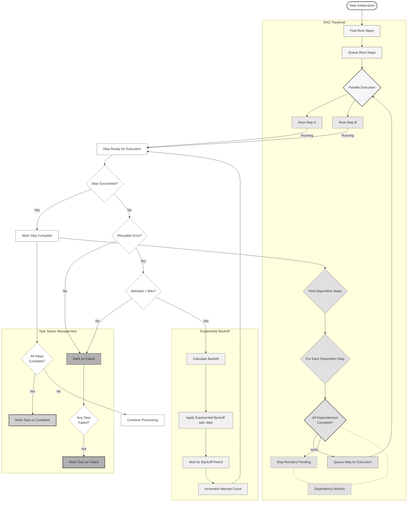

# Workflow & Retry Mechanism

The system implements advanced workflow traversal with parallel execution, sophisticated retry logic, and comprehensive event-driven observability:

- **DAG Traversal & Parallel Execution**
  - Initial identification and queueing of root steps (no dependencies)
  - Parallel execution of independent steps at each level
  - Dynamic discovery of next executable steps as dependencies are satisfied
  - Continuous monitoring of dependency status to activate pending steps
  - Automatic task completion detection when all steps are finished

- **Industry Standard Exponential Backoff**
  - Base delay that doubles with each attempt: `base_delay * (2^attempt)`
  - Random jitter to prevent thundering herd problems
  - Configurable maximum delay cap (30 seconds)
  - Respects server-provided Retry-After headers when available

- **Task Status Management**
  - Real-time monitoring of all step statuses
  - Early failure detection and propagation
  - Graceful handling of unrecoverable errors

- **Event-Driven Observability**
  - Events published at every workflow transition point
  - Custom subscribers for external integrations (Sentry, PagerDuty, Slack)
  - OpenTelemetry integration for production observability
  - Complete event catalog for discovery and documentation

### Event Flow Architecture

Throughout the workflow execution, Tasker publishes events that enable comprehensive observability and custom integrations:

- **Task Events**: `task.started`, `task.completed`, `task.failed`
- **Step Events**: `step.started`, `step.completed`, `step.failed`, `step.retry_requested`
- **Workflow Events**: `workflow.viable_steps_discovered`, `workflow.no_viable_steps`
- **Observability Events**: Performance and monitoring metrics

For complete documentation on the event system and creating custom subscribers, see [EVENT_SYSTEM.md](EVENT_SYSTEM.md).
