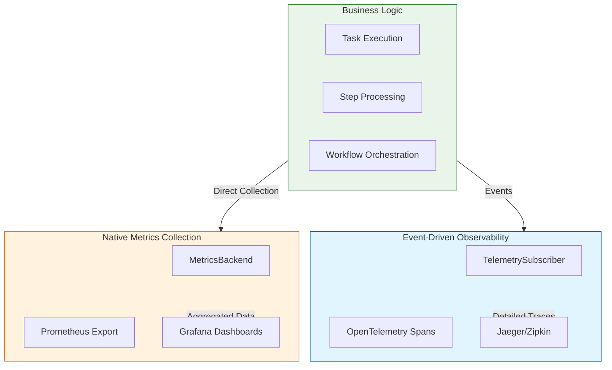

# Tasker Metrics System

## Overview

Tasker's metrics system provides production-ready observability for workflow orchestration through a hybrid architecture that combines high-performance in-memory collection with persistent, distributed storage. This system is designed to be cache-store agnostic, infrastructure-independent, and production-scalable.

## Architecture Philosophy

### Distinct Systems: Event Subscribers vs Metrics Collector

Tasker employs **two complementary but distinct observability systems** with clear separation of concerns:

#### **🔍 TelemetrySubscriber (Event-Driven Spans)**
- **Purpose**: Detailed tracing and debugging with OpenTelemetry spans
- **Use Cases**:
  - "Why did task #12345 fail?"
  - "What's the execution path through this workflow?"
  - "Which step is causing the bottleneck?"
- **Data**: Rich contextual information, hierarchical relationships, error details
- **Storage**: OpenTelemetry backends (Jaeger, Zipkin, Honeycomb)
- **Performance**: Optimized for detailed context, not high-volume aggregation

#### **📊 MetricsBackend (Native Metrics Collection)**
- **Purpose**: High-performance aggregated metrics for dashboards and alerting
- **Use Cases**:
  - "How many tasks completed in the last hour?"
  - "What's the 95th percentile execution time?"
  - "Alert if error rate exceeds 5%"
- **Data**: Numerical counters, gauges, histograms with labels
- **Storage**: Prometheus, JSON, CSV exports
- **Performance**: Optimized for high-volume, low-latency operations

### Why Two Systems?



**Benefits of Separation**:
- **Performance**: Native metrics avoid event publishing overhead for high-frequency operations
- **Reliability**: Metrics collection continues even if event system has issues
- **Flexibility**: Choose appropriate storage backend for each use case
- **Scalability**: Each system optimized for its specific workload

## Core Components

### 1. MetricsBackend (Thread-Safe Collection)

The core metrics collection engine using `Concurrent::Hash` for thread-safe operations:

```ruby
class MetricsBackend
  include Singleton

  def initialize
    @metrics = Concurrent::Hash.new
    @cache_capabilities = detect_cache_capabilities
    @sync_strategy = select_sync_strategy
  end

  # High-performance metric operations
  def counter(name, value: 1, **labels)
    # Thread-safe increment operations
  end

  def gauge(name, value:, **labels)
    # Atomic value updates
  end

  def histogram(name, value:, **labels)
    # Concurrent histogram updates
  end
end
```

### 2. Cache-Agnostic Sync Strategies

Adaptive synchronization based on Rails.cache capabilities:

```ruby
# Automatic strategy selection based on cache store
@sync_strategy = case @cache_capabilities[:store_class]
when 'Redis::Store', 'RedisCacheStore'
  :distributed_atomic    # Full coordination with atomic operations
when 'MemCacheStore'
  :distributed_basic     # Basic coordination with read-modify-write
when 'FileStore', 'MemoryStore', 'NullStore'
  :local_only           # Local snapshots only
end
```

### 3. Export Coordination System

TTL-aware export scheduling with distributed coordination:

```ruby
class ExportCoordinator
  def schedule_export(format: :prometheus)
    # Calculate optimal export timing
    timing = calculate_export_timing(safety_margin)

    # Schedule with TTL safety
    MetricsExportJob.set(wait_until: timing[:export_time])
                   .perform_later(format: format)
  end
end
```

## Cache Strategy Benefits and Drawbacks

### Redis Cache Store (`:redis_cache_store`)

#### ✅ Benefits
- **Full Coordination**: Atomic operations enable perfect cross-container synchronization
- **Distributed Locking**: Prevents concurrent export conflicts
- **TTL Inspection**: Can detect and extend cache expiration times
- **High Performance**: Optimized for concurrent access patterns
- **Persistence**: Survives container restarts and deployments

#### ⚠️ Considerations
- **Infrastructure Dependency**: Requires Redis cluster for production
- **Network Latency**: Sync operations involve network calls
- **Redis Memory**: Additional memory usage for metrics storage
- **Complexity**: More moving parts in infrastructure stack

**Best For**: Production environments with existing Redis infrastructure, multi-container deployments requiring coordination.

### Memcached (`:mem_cache_store`)

#### ✅ Benefits
- **Distributed Storage**: Shared cache across multiple containers
- **Atomic Operations**: Basic increment/decrement support
- **Mature Technology**: Well-understood operational characteristics
- **Memory Efficiency**: Optimized for memory usage patterns

#### ⚠️ Considerations
- **Limited Locking**: No distributed locking support
- **No TTL Inspection**: Cannot detect or extend expiration times
- **Basic Coordination**: Read-modify-write patterns only
- **Data Loss Risk**: No persistence across restarts

**Best For**: Environments with existing Memcached infrastructure, scenarios where basic distributed storage is sufficient.

### File Store (`:file_store`)

#### ✅ Benefits
- **No Infrastructure**: Works without external dependencies
- **Persistence**: Survives container restarts
- **Simple Deployment**: Easy to set up and maintain
- **Local Performance**: No network latency for operations

#### ⚠️ Considerations
- **No Distribution**: Cannot coordinate across containers
- **File I/O Overhead**: Disk operations slower than memory
- **Concurrency Limits**: File locking limitations
- **Storage Management**: Requires disk space management

**Best For**: Single-container deployments, development environments, scenarios where external dependencies are not allowed.

### Memory Store (`:memory_store`)

#### ✅ Benefits
- **Highest Performance**: Pure in-memory operations
- **No Dependencies**: No external infrastructure required
- **Simple Configuration**: Works out of the box
- **Low Latency**: Fastest possible cache operations

#### ⚠️ Considerations
- **Single Process Only**: No cross-container coordination
- **Data Loss**: Lost on container restart
- **Memory Limits**: Bounded by container memory
- **No Persistence**: Cannot survive deployments

**Best For**: Development environments, single-container applications, testing scenarios.

## Kubernetes Integration

### CronJob-Based Export Architecture

Tasker follows cloud-native patterns by providing export capabilities while delegating scheduling to Kubernetes:

```yaml
# Prometheus Export Every 5 Minutes
apiVersion: batch/v1
kind: CronJob
metadata:
  name: tasker-metrics-export
  namespace: production
spec:
  schedule: "*/5 * * * *"
  jobTemplate:
    spec:
      template:
        spec:
          containers:
          - name: metrics-exporter
            image: your-app:latest
            command:
            - /bin/bash
            - -c
            - |
              cd /app && \
              bundle exec rake tasker:export_metrics[prometheus]
            env:
            - name: RAILS_ENV
              value: "production"
            - name: METRICS_FORMAT
              value: "prometheus"
            resources:
              requests:
                memory: "128Mi"
                cpu: "100m"
              limits:
                memory: "256Mi"
                cpu: "200m"
          restartPolicy: OnFailure
  successfulJobsHistoryLimit: 3
  failedJobsHistoryLimit: 3
```

### Cache Synchronization

```yaml
# Cache Sync Every 30 Seconds
apiVersion: batch/v1
kind: CronJob
metadata:
  name: tasker-cache-sync
spec:
  schedule: "*/1 * * * *"  # Every minute
  jobTemplate:
    spec:
      template:
        spec:
          containers:
          - name: cache-sync
            image: your-app:latest
            command:
            - /bin/bash
            - -c
            - |
              cd /app && \
              bundle exec rake tasker:sync_metrics && \
              sleep 30 && \
              bundle exec rake tasker:sync_metrics
            resources:
              requests:
                memory: "64Mi"
                cpu: "50m"
              limits:
                memory: "128Mi"
                cpu: "100m"
```

### Monitoring and Alerting

```yaml
# Prometheus ServiceMonitor
apiVersion: monitoring.coreos.com/v1
kind: ServiceMonitor
metadata:
  name: tasker-metrics
spec:
  selector:
    matchLabels:
      app: tasker-metrics-exporter
  endpoints:
  - port: metrics
    interval: 30s
    path: /metrics
```

```yaml
# Prometheus Alerts
groups:
- name: tasker-metrics
  rules:
  - alert: TaskerMetricsExportFailed
    expr: increase(kube_job_status_failed{job_name=~"tasker-metrics-export.*"}[1h]) > 0
    for: 5m
    labels:
      severity: warning
    annotations:
      summary: "Tasker metrics export job failed"
      description: "Metrics export job has failed {{ $value }} times in the last hour"

  - alert: TaskerMetricsStale
    expr: time() - kube_job_status_completion_time{job_name=~"tasker-metrics-export.*"} > 900
    for: 10m
    labels:
      severity: critical
    annotations:
      summary: "Tasker metrics export stale"
      description: "No successful metrics export in the last 15 minutes"
```

## Configuration

### Basic Configuration

```ruby
# config/initializers/tasker.rb
Tasker.configuration do |config|
  config.telemetry do |tel|
    # Enable native metrics collection
    tel.metrics_enabled = true
    tel.metrics_format = 'prometheus'  # String, not symbol

    # Prometheus export configuration
    tel.prometheus = {
      endpoint: ENV['PROMETHEUS_ENDPOINT'],
      retention_window: 5.minutes,
      safety_margin: 1.minute,
      export_timeout: 2.minutes,
      username: ENV['PROMETHEUS_USERNAME'],  # Optional
      password: ENV['PROMETHEUS_PASSWORD']   # Optional
    }
  end
end
```

### Advanced Configuration

```ruby
Tasker.configuration do |config|
  config.telemetry do |tel|
    tel.metrics_enabled = true
    tel.metrics_format = 'prometheus'

    # Prometheus export configuration (matches TelemetryConfig.default_prometheus_config)
    tel.prometheus = {
      # Prometheus remote write endpoint (nil disables export)
      endpoint: 'http://prometheus:9090/api/v1/write',

      # Basic authentication for Prometheus endpoint
      username: ENV['PROMETHEUS_USERNAME'],
      password: ENV['PROMETHEUS_PASSWORD'],

      # Job configuration
      job_timeout: 5.minutes,
      export_timeout: 2.minutes,
      retry_attempts: 3,

      # Export scheduling
      retention_window: 5.minutes,
      safety_margin: 1.minute,

      # Metric naming
      metric_prefix: 'tasker',
      include_instance_labels: true,

      # Performance tuning
      compression: 'snappy', # 'snappy', 'gzip', or nil
      batch_size: 1000,

      # Test/development mode
      skip_if_unavailable: true # Don't fail if Prometheus is unreachable
    }
  end
end
```

### Environment-Specific Configuration

```ruby
# config/environments/production.rb
config.after_initialize do
  Tasker.configuration do |config|
    config.telemetry do |tel|
      tel.metrics_enabled = true
      tel.prometheus = {
        endpoint: ENV.fetch('PROMETHEUS_ENDPOINT'),
        retention_window: 10.minutes,
        safety_margin: 2.minutes,
        username: ENV['PROMETHEUS_USERNAME'],
        password: ENV['PROMETHEUS_PASSWORD']
      }
    end
  end
end

# config/environments/development.rb
config.after_initialize do
  Tasker.configuration do |config|
    config.telemetry do |tel|
      tel.metrics_enabled = true
      tel.prometheus = {
        endpoint: 'http://localhost:9090/api/v1/write',
        retention_window: 2.minutes,
        safety_margin: 30.seconds,
        skip_if_unavailable: true  # Don't fail if Prometheus is unreachable in dev
      }
    end
  end
end
```

## Dependencies and Assumptions

### Required Dependencies

```ruby
# Gemfile
gem 'concurrent-ruby', '~> 1.0'  # Thread-safe data structures
gem 'activejob', '>= 6.0'        # Background job processing
gem 'rails', '>= 6.0'            # Rails.cache integration
```

### Optional Dependencies

```ruby
# For Redis cache store
gem 'redis', '~> 4.0'
gem 'redis-rails', '~> 5.0'

# For Memcached
gem 'dalli', '~> 3.0'

# For background job processing
gem 'sidekiq', '~> 6.0'  # or
gem 'resque', '~> 2.0'   # or
gem 'delayed_job_active_record', '~> 4.0'
```

### Infrastructure Assumptions

#### **Cache Store**
- Rails.cache properly configured
- Cache store supports basic read/write operations
- TTL (time-to-live) support for automatic cleanup

#### **Background Jobs**
- ActiveJob backend configured (Sidekiq, Resque, DelayedJob, etc.)
- Job queues operational and monitored
- Retry mechanisms available for failed jobs

#### **Container Environment**
- Container orchestration platform (Kubernetes, Docker Swarm, etc.)
- CronJob scheduling capabilities
- Resource limits and monitoring

#### **Monitoring Infrastructure**
- Prometheus server (for Prometheus export)
- Grafana or similar for visualization
- Alerting system for operational issues

### Performance Expectations

#### **In-Memory Operations**
- **Latency**: < 1ms for counter/gauge operations
- **Throughput**: > 10,000 operations/second per container
- **Memory**: ~1MB per 10,000 unique metric combinations
- **Concurrency**: Scales linearly with CPU cores

#### **Cache Synchronization**
- **Frequency**: Every 30 seconds (configurable)
- **Latency**: < 100ms for Redis, < 500ms for Memcached
- **Batch Size**: 1,000 metrics per sync operation
- **Network**: Minimal bandwidth usage with compression

#### **Export Operations**
- **Frequency**: Every 5 minutes (configurable via CronJob)
- **Duration**: < 30 seconds for 10,000 metrics
- **Resource Usage**: < 256MB memory, < 200m CPU
- **Network**: Compressed payload reduces bandwidth by 70%

## Interoperability

### Prometheus Integration

#### **Native Prometheus Format**
```ruby
# Exported metrics follow Prometheus naming conventions
tasker_task_duration_seconds_bucket{le="0.1",task_name="payment_processing"} 45
tasker_task_duration_seconds_bucket{le="0.5",task_name="payment_processing"} 123
tasker_task_duration_seconds_bucket{le="1.0",task_name="payment_processing"} 145
tasker_task_duration_seconds_count{task_name="payment_processing"} 150
tasker_task_duration_seconds_sum{task_name="payment_processing"} 87.5

tasker_step_executions_total{step_name="validate_payment",status="success"} 1247
tasker_step_executions_total{step_name="validate_payment",status="failure"} 23
```

#### **Grafana Dashboards**
```yaml
# Example Grafana dashboard queries
- name: "Task Completion Rate"
  query: 'rate(tasker_task_executions_total{status="success"}[5m])'

- name: "95th Percentile Task Duration"
  query: 'histogram_quantile(0.95, rate(tasker_task_duration_seconds_bucket[5m]))'

- name: "Error Rate by Task Type"
  query: 'rate(tasker_task_executions_total{status="failure"}[5m]) / rate(tasker_task_executions_total[5m])'
```

### OpenTelemetry Compatibility

The native metrics system is designed to be complementary to OpenTelemetry spans from TelemetrySubscriber. For OpenTelemetry metrics integration, use the existing TelemetrySubscriber which automatically publishes to OpenTelemetry backends.

```ruby
# OpenTelemetry spans (via TelemetrySubscriber) + Native metrics (via MetricsBackend)
config.telemetry do |tel|
  tel.enabled = true                # Enable OpenTelemetry spans
  tel.metrics_enabled = true        # Enable native metrics
  tel.metrics_format = 'prometheus' # Export native metrics to Prometheus
end
```

### Custom Export Formats

```ruby
# JSON export for custom integrations
{
  "timestamp": "2024-01-01T12:00:00Z",
  "metrics": {
    "counters": {
      "tasker.task.executions": {
        "value": 1247,
        "labels": {"status": "success", "task_name": "payment_processing"}
      }
    },
    "gauges": {
      "tasker.queue.depth": {
        "value": 42,
        "labels": {"queue": "default"}
      }
    },
    "histograms": {
      "tasker.task.duration": {
        "count": 150,
        "sum": 87.5,
        "buckets": [
          {"le": "0.1", "count": 45},
          {"le": "0.5", "count": 123},
          {"le": "1.0", "count": 145}
        ],
        "labels": {"task_name": "payment_processing"}
      }
    }
  }
}
```

### DataDog Integration

```ruby
# Custom subscriber for DataDog StatsD
class DataDogMetricsSubscriber < Tasker::Events::BaseSubscriber
  # Subscribe to task completion events
  subscribe_to Tasker::Constants::TaskEvents::COMPLETED

  def handle_task_completed(event)
    duration = event[:execution_duration]
    task_name = event[:task_name]

    StatsD.histogram('tasker.task.duration', duration,
                    tags: ["task:#{task_name}"])
    StatsD.increment('tasker.task.completed',
                    tags: ["task:#{task_name}"])
  end
end
```

## Production Deployment Patterns

### High-Availability Setup

```yaml
# Multiple export jobs for redundancy
apiVersion: batch/v1
kind: CronJob
metadata:
  name: tasker-metrics-export-primary
spec:
  schedule: "*/5 * * * *"
  # ... primary export configuration

---
apiVersion: batch/v1
kind: CronJob
metadata:
  name: tasker-metrics-export-backup
spec:
  schedule: "2-57/5 * * * *"  # Offset by 2 minutes
  # ... backup export configuration with different endpoint
```

### Resource Management

```yaml
# Resource quotas for metrics jobs
apiVersion: v1
kind: ResourceQuota
metadata:
  name: tasker-metrics-quota
spec:
  hard:
    requests.cpu: "500m"
    requests.memory: "1Gi"
    limits.cpu: "1000m"
    limits.memory: "2Gi"
    count/jobs.batch: "10"
```

### Security Considerations

```yaml
# ServiceAccount with minimal permissions
apiVersion: v1
kind: ServiceAccount
metadata:
  name: tasker-metrics-exporter

---
apiVersion: rbac.authorization.k8s.io/v1
kind: Role
metadata:
  name: tasker-metrics-role
rules:
- apiGroups: [""]
  resources: ["configmaps", "secrets"]
  verbs: ["get", "list"]

---
apiVersion: rbac.authorization.k8s.io/v1
kind: RoleBinding
metadata:
  name: tasker-metrics-binding
subjects:
- kind: ServiceAccount
  name: tasker-metrics-exporter
roleRef:
  kind: Role
  name: tasker-metrics-role
  apiGroup: rbac.authorization.k8s.io
```

## Troubleshooting

### Common Issues

#### **Cache Sync Failures**
```bash
# Check cache store connectivity
bundle exec rails runner "puts Rails.cache.read('test') || 'Cache not accessible'"

# Verify cache capabilities
bundle exec rake tasker:metrics_status
```

#### **Export Job Failures**
```bash
# Check job queue status
bundle exec rails runner "puts ActiveJob::Base.queue_adapter"

# View failed jobs
bundle exec sidekiq-cli stats  # for Sidekiq
```

#### **Missing Metrics**
```bash
# Verify metrics collection
bundle exec rails runner "
  backend = Tasker::Telemetry::MetricsBackend.instance
  puts backend.all_metrics.size
"

# Check sync strategy
bundle exec rake tasker:metrics_status | grep 'Sync Strategy'
```

### Debugging Commands

```bash
# Export metrics immediately for testing
bundle exec rake tasker:export_metrics_now[prometheus]

# Sync metrics to cache manually
bundle exec rake tasker:sync_metrics

# Show detailed configuration
VERBOSE=true bundle exec rake tasker:metrics_status
```

### Performance Monitoring

```ruby
# Add custom monitoring to your application
class MetricsHealthCheck
  def self.check
    backend = Tasker::Telemetry::MetricsBackend.instance

    {
      metrics_count: backend.all_metrics.size,
      sync_strategy: backend.sync_strategy,
      last_sync: backend.last_sync_time,
      cache_healthy: Rails.cache.write('health_check', Time.current)
    }
  end
end
```

This comprehensive metrics system provides production-ready observability while maintaining the flexibility to adapt to different infrastructure environments and scaling requirements.
