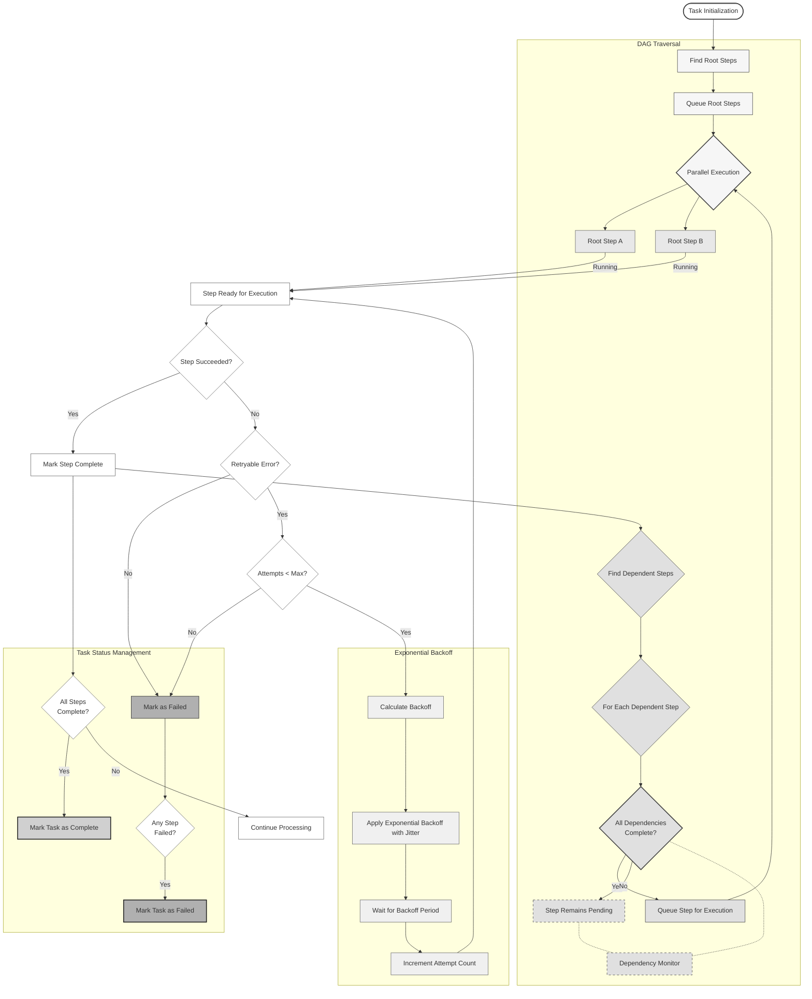

# System Overview

## 🎉 PRODUCTION-READY WORKFLOW ORCHESTRATION ENGINE

**MASSIVE BREAKTHROUGH**: Registry System Consolidation **SUCCESSFULLY COMPLETED**! Tasker now features enterprise-grade registry architecture with 100% test success (1,479/1,479 tests passing) and comprehensive thread-safe operations.

### 🎯 Current Status: ENTERPRISE READY
- ✅ **Registry System Consolidation Complete** - Thread-safe operations with structured logging
- ✅ **100% Test Success** - 1,479/1,479 tests passing with comprehensive validation
- ✅ **Thread-Safe Architecture** - All registry systems use `Concurrent::Hash` storage
- ✅ **Structured Logging** - Correlation IDs and JSON formatting for observability
- ✅ **Interface Validation** - Fail-fast validation with detailed error messages
- ✅ **Production Resilience** - Exponential backoff and comprehensive error handling

Tasker now features:

- **Enterprise Registry Architecture** - Thread-safe registry systems with structured logging
- **Unified Event System** - Single `Events::Publisher` with standardized event payloads
- **Complete Step Error Persistence** - Atomic transactions ensuring zero data loss
- **Production-Ready OpenTelemetry Integration** - Full observability stack with safety mechanisms
- **Memory-Safe Operation** - Database connection pooling and leak prevention
- **Developer-Friendly API** - Clean `EventPublisher` concern for easy integration

## Registry System Architecture

Tasker's registry systems have been completely modernized with enterprise-grade capabilities:

### Thread-Safe Registry Operations

All registry systems now use `Concurrent::Hash` for thread-safe operations:

```ruby
# HandlerFactory - Thread-safe task handler management
Tasker::HandlerFactory.instance.register(
  'payment_processor',
  PaymentHandler,
  namespace_name: 'payments',
  version: '2.1.0',
  replace: true  # Graceful conflict resolution
)

# PluginRegistry - Format-based plugin discovery
Tasker::Telemetry::PluginRegistry.register(
  'custom_exporter',
  CustomExporter,
  format: :json,
  replace: true
)

# SubscriberRegistry - Event subscriber management
Tasker::Registry::SubscriberRegistry.register(
  'notification_subscriber',
  NotificationSubscriber,
  events: ['task.completed', 'task.failed']
)
```

### Structured Logging with Correlation IDs

Every registry operation includes comprehensive structured logging:

```json
{
  "timestamp": "2024-01-15T10:30:45Z",
  "correlation_id": "tsk_abc123_def456",
  "component": "handler_factory",
  "message": "Registry item registered",
  "environment": "production",
  "tasker_version": "2.4.1",
  "process_id": 12345,
  "thread_id": "abc123",
  "entity_type": "task_handler",
  "entity_id": "payments/payment_processor/2.1.0",
  "entity_class": "PaymentHandler",
  "registry_name": "handler_factory",
  "options": {
    "namespace_name": "payments",
    "version": "2.1.0",
    "replace": true
  },
  "event_type": "registered"
}
```

### Interface Validation & Error Handling

Comprehensive validation prevents runtime errors:

```ruby
# Fail-fast validation with detailed error messages
begin
  Tasker::HandlerFactory.instance.register('invalid_handler', InvalidClass)
rescue Tasker::Registry::ValidationError => e
  # Detailed error with context and suggestions
  puts e.message
  # => "Handler validation failed: InvalidClass does not implement required method 'process'.
  #     Required methods: [process, initialize_task!].
  #     Suggestion: Inherit from Tasker::TaskHandler::Base"
end
```

### Registry Statistics & Health Monitoring

Built-in monitoring and statistics:

```ruby
# Comprehensive registry statistics
stats = Tasker::HandlerFactory.instance.stats
# => {
#   total_handlers: 45,
#   namespaces: ["payments", "inventory", "notifications"],
#   versions: ["1.0.0", "1.1.0", "2.0.0"],
#   thread_safe: true,
#   last_registration: "2024-01-15T10:30:45Z"
# }

# Health check integration
health = Tasker::HandlerFactory.instance.health_check
# => { status: "healthy", registry_size: 45, thread_safe: true }
```

## Event System Architecture

Tasker features a comprehensive event-driven architecture that provides both deep observability and powerful developer integration capabilities:

### Event Categories

- **Task Events** (`Tasker::Constants::TaskEvents`) - Task lifecycle events (started, completed, failed)
- **Step Events** (`Tasker::Constants::StepEvents`) - Step execution events with error context
- **Workflow Events** (`Tasker::Constants::WorkflowEvents`) - Orchestration and dependency management
- **Observability Events** (`Tasker::Constants::ObservabilityEvents`) - Performance monitoring and metrics

### Developer-Friendly Event Discovery

The event system includes a comprehensive catalog for discovering and understanding events:

```ruby
# Discover all available events
Tasker::Events.catalog.keys
# => ["task.started", "task.completed", "task.failed", "step.started", ...]

# Get detailed event information
Tasker::Events.event_info('task.completed')
# => {
#   name: "task.completed",
#   category: "task",
#   description: "Fired when a task completes successfully",
#   payload_schema: { task_id: String, execution_duration: Float },
#   example_payload: { task_id: "task_123", execution_duration: 45.2 },
#   fired_by: ["TaskFinalizer", "TaskHandler"]
# }
```

### Custom Event Subscribers

Create custom integrations with external services using the subscriber generator:

```bash
# Generate a subscriber with specific events
rails generate tasker:subscriber notification --events task.completed task.failed step.failed
```

This creates a complete subscriber class with automatic method routing:

```ruby
class NotificationSubscriber < Tasker::Events::Subscribers::BaseSubscriber
  subscribe_to 'task.completed', 'task.failed', 'step.failed'

  def handle_task_completed(event)
    task_id = safe_get(event, :task_id)
    NotificationService.send_success_email(task_id: task_id)
  end

  def handle_task_failed(event)
    task_id = safe_get(event, :task_id)
    error_message = safe_get(event, :error_message, 'Unknown error')
    AlertService.send_failure_alert(task_id: task_id, error: error_message)
  end
end
```

### Publishing Events

```ruby
class MyStepHandler
  include Tasker::Concerns::EventPublisher

  def handle(task, sequence, step)
    # Clean step started event
    publish_step_started(step)

    # Your business logic here
    result = perform_operation(task.context)
    step.results = { data: result }

    # Clean completion event with additional context
    publish_step_completed(step, operation_count: result.size)
  end
end
```

### Integration Examples

The system includes comprehensive integration examples in `spec/lib/tasker/events/subscribers/examples/`:

- **SentrySubscriber** - Error tracking with intelligent fingerprinting
- **PagerDutySubscriber** - Critical alerting with business logic filtering
- **SlackSubscriber** - Rich team notifications with environment routing
- **MetricsSubscriber** - Analytics and performance tracking
- **ComprehensiveSubscriber** - Multi-service integration patterns

For complete documentation, see [EVENT_SYSTEM.md](EVENT_SYSTEM.md).

### OpenTelemetry Integration

Full observability stack including:

- **Database Query Monitoring** - PostgreSQL instrumentation with connection safety
- **Background Job Tracking** - Sidekiq, Redis, and concurrent processing
- **API Call Tracing** - HTTP requests with proper error handling
- **State Machine Transitions** - Complete audit trail of workflow state changes

For detailed telemetry configuration, see [TELEMETRY.md](TELEMETRY.md).

## Example of a Configured Task Handler

Here's an example YAML file for an e-commerce API integration task handler:

```yaml
---
name: api_task/integration_yaml_example
module_namespace: ApiTask
task_handler_class: IntegrationYamlExample

default_dependent_system: ecommerce_system

named_steps:
  - fetch_cart
  - fetch_products
  - validate_products
  - create_order
  - publish_event

schema:
  type: object
  required:
    - cart_id
  properties:
    cart_id:
      type: integer

step_templates:
  - name: fetch_cart
    description: Fetch cart details from e-commerce system
    handler_class: ApiTask::StepHandler::CartFetchStepHandler
    handler_config:
      type: api
      url: https://api.ecommerce.com/cart
      params:
        cart_id: 1

  - name: fetch_products
    description: Fetch product details from product catalog
    handler_class: ApiTask::StepHandler::ProductsFetchStepHandler
    handler_config:
      type: api
      url: https://api.ecommerce.com/products

  - name: validate_products
    description: Validate product availability
    depends_on_steps:
      - fetch_products
      - fetch_cart
    handler_class: ApiTask::StepHandler::ProductsValidateStepHandler

  - name: create_order
    description: Create order from validated cart
    depends_on_step: validate_products
    handler_class: ApiTask::StepHandler::CreateOrderStepHandler

  - name: publish_event
    description: Publish order created event
    depends_on_step: create_order
    handler_class: ApiTask::StepHandler::PublishEventStepHandler

environments:
  development:
    step_templates:
      - name: fetch_cart
        handler_config:
          url: http://localhost:3000/api/cart
          params:
            cart_id: 1
            debug: true

      - name: fetch_products
        handler_config:
          url: http://localhost:3000/api/products
          params:
            debug: true

  test:
    step_templates:
      - name: fetch_cart
        handler_config:
          url: http://test-api.ecommerce.com/cart
          params:
            cart_id: 1
            test_mode: true

      - name: fetch_products
        handler_config:
          url: http://test-api.ecommerce.com/products
          params:
            test_mode: true

  production:
    step_templates:
      - name: fetch_cart
        handler_config:
          url: https://api.ecommerce.com/cart
          params:
            cart_id: 1
            api_key: ${ECOMMERCE_API_KEY}

      - name: fetch_products
        handler_config:
          url: https://api.ecommerce.com/products
          params:
            api_key: ${ECOMMERCE_API_KEY}
```

## Environment-Specific Configuration

Tasker supports environment-specific configuration overrides in YAML files. This allows you to:

1. Define a base configuration that works across all environments
2. Override specific settings for each environment (development, test, production)

The configuration is merged at runtime, with environment-specific settings taking precedence over the base configuration. This is particularly useful for:

- Using different API endpoints per environment
- Enabling debug mode in development
- Using test mode in test environments

To use environment-specific configuration:

1. Add environment-specific sections to your YAML file
2. Override only the settings that need to change per environment
3. The TaskBuilder will automatically merge the configurations based on the current Rails environment

## API Task Example

See the [spec/dummy/app/tasks/api_task](./spec/dummy/app/tasks/api_task) directory for an example of a task handler that processes an e-commerce order through a series of steps, interacting with external systems, and handling errors and retries. You can read more about the example [here](./spec/dummy/app/tasks/api_task/README.md).

### API Routes

Tasker provides a RESTful API for managing tasks. Here are the available endpoints:

#### Tasks

- `GET /tasker/tasks` - List all tasks
- `POST /tasker/tasks` - Create and enqueue a new task
- `GET /tasker/tasks/{task_id}` - Get task details
- `PATCH/PUT /tasker/tasks/{task_id}` - Update task
- `DELETE /tasker/tasks/{task_id}` - Cancel task

#### Workflow Steps

- `GET /tasker/tasks/{task_id}/workflow_steps` - List steps for a task
- `GET /tasker/tasks/{task_id}/workflow_steps/{step_id}` - Get step details
- `PATCH/PUT /tasker/tasks/{task_id}/workflow_steps/{step_id}` - Update step
- `DELETE /tasker/tasks/{task_id}/workflow_steps/{step_id}` - Cancel step

#### Task Diagrams

- `GET /tasker/tasks/{task_id}/diagram` - Get a diagram for a task

### Creating a Task via API

Example of creating a task using curl:

```bash
curl -X POST https://www.example.com/tasker/tasks \
  -H "Content-Type: application/json" \
  -d '{
    "name": "api_integration_task",
    "context": {
      "cart_id": 123
    },
    "initiator": "web_interface",
    "reason": "Process new order",
    "source_system": "ecommerce",
    "tags": ["order_processing", "api_integration"]
  }'
```

The request body must include:

- `name`: The name of the task handler to use
- `context`: A JSON object containing the task's context data
- `initiator`: Who/what initiated the task
- `reason`: Why the task was created
- `source_system`: The system that created the task
- `tags`: (Optional) Array of tags for categorization

## Workflow & Retry Mechanism



The system implements advanced workflow traversal with parallel execution, sophisticated retry logic, and production-ready error handling:

- **DAG Traversal & Parallel Execution**
  - Initial identification and queueing of root steps (no dependencies)
  - Parallel execution of independent steps at each level
  - Dynamic discovery of next executable steps as dependencies are satisfied
  - Continuous monitoring of dependency status to activate pending steps
  - Automatic task completion detection when all steps are finished

- **Industry Standard Exponential Backoff**
  - Base delay that doubles with each attempt: `base_delay * (2^attempt)`
  - Random jitter to prevent thundering herd problems
  - Configurable maximum delay cap (30 seconds)
  - Respects server-provided Retry-After headers when available

- **Production-Ready Error Handling & Persistence**
  - **Complete Step Error Persistence** - All step failures saved with full error context, backtrace, and attempt tracking
  - **Atomic Transactions** - Save-first, transition-second pattern ensures data integrity and idempotency
  - **Memory-Safe Processing** - Database connection pooling and explicit cleanup prevents connection leaks
  - **Comprehensive Event Publishing** - Both success and error paths publish standardized events for observability
  - **Zero Data Loss** - All step executions (success/error) properly persisted with complete context

- **Task Status Management**
  - Real-time monitoring of all step statuses with unified event system
  - Early failure detection and propagation with comprehensive error data
  - Graceful handling of unrecoverable errors with full audit trail
  - OpenTelemetry integration for complete observability
