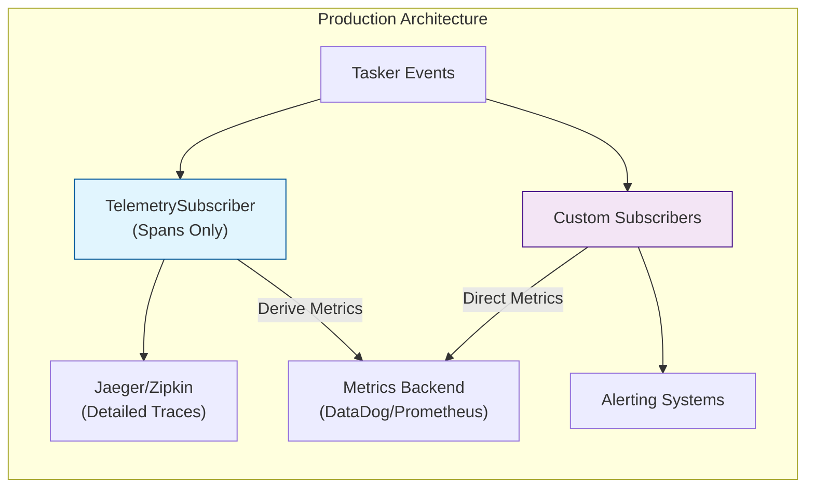
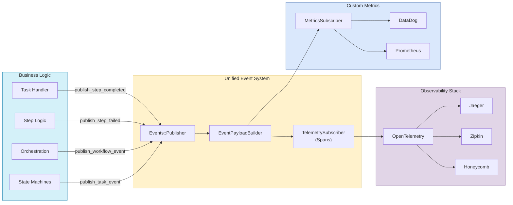

# Tasker Telemetry and Observability

## Overview

Tasker includes comprehensive telemetry capabilities to provide insights into task execution, workflow steps, and overall system performance. The telemetry system leverages OpenTelemetry standards and a unified event architecture to ensure compatibility with a wide range of observability tools and platforms.

## OpenTelemetry Architecture: Metrics vs Spans

Tasker follows OpenTelemetry best practices by using **both** metrics and spans for different purposes:

### **Spans** 🔍 (Primary Focus)
- **Purpose**: Individual trace records with detailed context for debugging and analysis
- **Use Cases**:
  - "Why did task #12345 take 30 seconds?"
  - "What was the exact execution path for this failed workflow?"
  - "Which step in the order process is the bottleneck?"
- **Benefits**:
  - Complete request context and timing
  - Parent-child relationships show workflow hierarchy
  - Error propagation with full stack traces
  - Rich attributes for detailed analysis
- **Implementation**: `TelemetrySubscriber` creates hierarchical spans for tasks and steps

### **Metrics** 📊 (Derived or Separate)
- **Purpose**: Aggregated numerical data for dashboards, alerts, and SLIs/SLOs
- **Use Cases**:
  - "How many tasks completed in the last hour?"
  - "What's the 95th percentile task duration?"
  - "Alert if error rate exceeds 5%"
- **Benefits**:
  - Very efficient storage and querying
  - Perfect for real-time dashboards
  - Lightweight for high-volume scenarios
- **Implementation**: Can be derived from span data or collected separately

### **Recommended Strategy**



## Key Features

- **Unified Event System** - Single `Events::Publisher` with consistent event publishing patterns
- **Standardized Event Payloads** - `EventPayloadBuilder` ensures consistent telemetry data structure
- **Production-Ready OpenTelemetry Integration** - Full instrumentation stack with safety mechanisms
- **Hierarchical Span Creation** - Proper parent-child relationships for complex workflows
- **Automatic Step Error Persistence** - Complete error data capture with atomic transactions
- **Memory-Safe Operation** - Database connection pooling and leak prevention
- **Comprehensive Event Lifecycle Tracking** - Task, step, workflow, and orchestration events
- **Sensitive Data Filtering** - Automatic security and privacy protection
- **Developer-Friendly API** - Clean `EventPublisher` concern for easy event publishing
- **Custom Event Subscribers** - Generator and BaseSubscriber for creating integrations
- **Event Discovery System** - Complete event catalog with documentation and examples

## Architecture

Tasker's telemetry is built on a unified event system with these main components:

1. **Events::Publisher** - Centralized event publishing using dry-events with OpenTelemetry integration
2. **EventPublisher Concern** - Clean interface providing `publish_event()`, `publish_step_event()`, etc.
3. **EventPayloadBuilder** - Standardized payload creation for consistent telemetry data
4. **TelemetrySubscriber** - Converts events to OpenTelemetry spans (spans only, no metrics)
5. **Event Catalog** - Complete event discovery and documentation system
6. **BaseSubscriber** - Foundation for creating custom event subscribers
7. **Subscriber Generator** - Tool for creating custom integrations with external services
8. **Configuration** - OpenTelemetry setup with production-ready safety mechanisms

### Event Flow



## Two Complementary Observability Systems

Tasker provides **two distinct but complementary observability systems** designed for different use cases:

### 🔍 **TelemetrySubscriber (Event-Driven Spans)**
- **Purpose**: Detailed tracing and debugging with OpenTelemetry spans
- **Trigger**: Automatic via event subscription (no manual instrumentation needed)
- **Use Cases**:
  - "Why did task #12345 fail?"
  - "What's the execution path through this workflow?"
  - "Which step is causing the bottleneck?"
- **Data**: Rich contextual information, hierarchical relationships, error details
- **Storage**: OpenTelemetry backends (Jaeger, Zipkin, Honeycomb)
- **Performance**: Optimized for detailed context, not high-volume aggregation

### 📊 **MetricsBackend (Native Metrics Collection)**
- **Purpose**: High-performance aggregated metrics for dashboards and alerting
- **Trigger**: Direct collection during workflow execution (no events)
- **Use Cases**:
  - "How many tasks completed in the last hour?"
  - "What's the 95th percentile execution time?"
  - "Alert if error rate exceeds 5%"
- **Data**: Numerical counters, gauges, histograms with labels
- **Storage**: Prometheus, JSON, CSV exports
- **Performance**: Optimized for high-volume, low-latency operations

### Why Two Systems?

**Performance**: Native metrics avoid event publishing overhead for high-frequency operations
**Reliability**: Metrics collection continues even if event system has issues
**Flexibility**: Choose appropriate storage backend for each use case
**Scalability**: Each system optimized for its specific workload

### ✅ **TelemetrySubscriber** - Spans Only (Event-Driven)
```ruby
class TelemetrySubscriber < BaseSubscriber
  # ONLY creates OpenTelemetry spans with hierarchical context
  # Triggered automatically by Tasker's event system
  # Does NOT record metrics - focuses on detailed tracing

  def handle_task_completed(event)
    # Create comprehensive span with all context
    finish_task_span(event, :ok, extract_attributes(event))
  end
end
```

### ✅ **MetricsBackend** - Native Collection (Direct)
```ruby
class MetricsBackend
  # ONLY records aggregated metrics for dashboards/alerts
  # Called directly during workflow execution
  # Does NOT create spans - focuses on operational data

  def record_task_completion(task_name:, duration:, status:)
    # Record metrics for dashboards and alerting
    counter("tasker.task.executions", status: status, task_name: task_name)
    histogram("tasker.task.duration", value: duration, task_name: task_name)
  end
end
```

### ✅ **Clean Architecture** - Complementary Systems
```ruby
# config/initializers/tasker.rb
Tasker.configuration do |config|
  config.telemetry do |tel|
    # Enable OpenTelemetry spans (event-driven)
    tel.enabled = true

    # Enable native metrics collection (direct)
    tel.metrics_enabled = true
    tel.metrics_format = 'prometheus'
  end
end
```

See [METRICS.md](METRICS.md) for comprehensive details on the native metrics system including cache strategies, Kubernetes integration, and production deployment patterns.

## Configuration

### Tasker Configuration

Configure Tasker's telemetry in `config/initializers/tasker.rb`:

```ruby
Tasker.configuration do |config|
  config.telemetry do |tel|
    # Enable telemetry (TelemetrySubscriber for OpenTelemetry spans)
    tel.enabled = true

    # Service name used for OpenTelemetry traces (default: 'tasker')
    tel.service_name = 'my_app_tasker'

    # Service version used for OpenTelemetry traces (default: Tasker::VERSION)
    tel.service_version = '1.2.3'

    # Parameters to filter from telemetry data for privacy and security
    tel.filter_parameters = [:password, :api_key, 'credit_card.number', /token/i]

    # The mask to use when filtering sensitive data (default: '[FILTERED]')
    tel.filter_mask = '***REDACTED***'
  end
end
```

### OpenTelemetry Configuration

Configure OpenTelemetry with production-ready settings in `config/initializers/opentelemetry.rb`:

```ruby
require 'opentelemetry/sdk'
require 'opentelemetry-exporter-otlp'
require 'opentelemetry/instrumentation/all'

# Configure OpenTelemetry
OpenTelemetry::SDK.configure do |c|
  # Use the configured service name
  c.service_name = Tasker.configuration.telemetry.service_name

  # Configure OTLP exporter to send to local Jaeger
  otlp_exporter = OpenTelemetry::Exporter::OTLP::Exporter.new(
    endpoint: 'http://localhost:4318/v1/traces'
  )

  # Add the OTLP exporter
  c.add_span_processor(
    OpenTelemetry::SDK::Trace::Export::BatchSpanProcessor.new(otlp_exporter)
  )

  # Configure resource with additional attributes
  c.resource = OpenTelemetry::SDK::Resources::Resource.create({
    'service.name' => Tasker.configuration.telemetry.service_name,
    'service.version' => Tasker.configuration.telemetry.service_version,
    'service.framework' => 'tasker'
  })

  # Production-ready instrumentation configuration
  # Excludes Faraday instrumentation due to known bug (see generator template for details)
  c.use_all({ 'OpenTelemetry::Instrumentation::Faraday' => { enabled: false } })
end
```

## Custom Telemetry Integrations

Beyond OpenTelemetry, Tasker's event system enables easy integration with any observability or monitoring service:

### Creating Custom Metrics Subscribers

Tasker now provides specialized tooling for metrics collection:

```bash
# Generate a specialized metrics subscriber with helper methods
rails generate tasker:subscriber metrics --metrics --events task.completed task.failed step.completed step.failed

# Generate a regular subscriber for other integrations
rails generate tasker:subscriber pager_duty --events task.failed step.failed
```

The `--metrics` flag creates a specialized subscriber with:
- Built-in helper methods for extracting timing, error, and performance metrics
- Automatic tag generation for categorization
- Examples for StatsD, DataDog, Prometheus, and other metrics systems
- Safe numeric value extraction with defaults
- Production-ready patterns for operational monitoring

### Creating Custom Subscribers

For non-metrics integrations, use the regular subscriber generator:

### Example Custom Integrations

**Metrics Collection (Using Helper Methods)**:
```ruby
class MetricsSubscriber < Tasker::Events::Subscribers::BaseSubscriber
  subscribe_to 'task.completed', 'step.completed'

  def handle_task_completed(event)
    # Use built-in helper methods for standardized data extraction
    timing = extract_timing_metrics(event)
    tags = extract_metric_tags(event)

    # Record task completion metrics using helpers
    record_histogram('tasker.task.duration', timing[:execution_duration], tags)
    record_counter('tasker.task.completed', 1, tags)

    if timing[:step_count] > 0
      record_gauge('tasker.workflow.step_count', timing[:step_count], tags)
    end
  end

  def handle_step_completed(event)
    timing = extract_timing_metrics(event)
    tags = extract_metric_tags(event)

    # Record step-level metrics
    record_histogram('tasker.step.duration', timing[:execution_duration], tags)
  end

  private

  # Customize for your metrics backend (StatsD example)
  def record_histogram(name, value, tags = [])
    StatsD.histogram(name, value, tags: tags)
  end

  def record_counter(name, value, tags = [])
    StatsD.increment(name, value, tags: tags)
  end

  def record_gauge(name, value, tags = [])
    StatsD.gauge(name, value, tags: tags)
  end
end
```

**Error Tracking (Sentry)**:
```ruby
class SentrySubscriber < Tasker::Events::Subscribers::BaseSubscriber
  subscribe_to 'task.failed', 'step.failed'

  def handle_task_failed(event)
    task_id = safe_get(event, :task_id)
    error_message = safe_get(event, :error_message, 'Unknown error')

    Sentry.capture_message(error_message, level: 'error', fingerprint: ['tasker', 'task_failed', task_id])
  end
end
```

### Metrics Helper Methods

BaseSubscriber now includes specialized helper methods for extracting common metrics data:

```ruby
# Extract timing metrics (duration, step counts, etc.)
timing = extract_timing_metrics(event)
# => { execution_duration: 45.2, step_count: 5, completed_steps: 5, failed_steps: 0 }

# Extract error metrics with categorization
error = extract_error_metrics(event)
# => { error_type: 'timeout', attempt_number: 2, is_retryable: true, final_failure: false }

# Extract performance metrics
perf = extract_performance_metrics(event)
# => { memory_usage: 1024, cpu_time: 2.5, queue_time: 0.1, processing_time: 1.8 }

# Generate standardized tags for categorization
tags = extract_metric_tags(event)
# => ['task:order_process', 'environment:production', 'retryable:true']

# Build consistent metric names
metric_name = build_metric_name('tasker.task', 'completed')
# => 'tasker.task.completed'

# Extract numeric values safely
duration = extract_numeric_metric(event, :execution_duration, 0.0)
# => 45.2 (with proper type conversion and defaults)
```

These helpers standardize metrics extraction and ensure consistency across different subscriber implementations.

For complete documentation on creating custom subscribers and integration examples, see [EVENT_SYSTEM.md](EVENT_SYSTEM.md).

## Integration with OpenTelemetry

Tasker's unified event system automatically integrates with OpenTelemetry through the enhanced `TelemetrySubscriber`. For each task:

1. **Root Task Span**: A root span (`tasker.task.execution`) is created when the task starts and stored for the entire task lifecycle
2. **Child Step Spans**: Child spans (`tasker.step.execution`) are created for each step with proper parent-child relationships to the root task span
3. **Hierarchical Context**: All spans maintain proper parent-child relationships, ensuring full traceability in Jaeger/Zipkin
4. **Event Annotations**: Each span includes relevant events (task.started, step.completed, etc.) with comprehensive attributes
5. **Error Propagation**: Error status and messages are properly propagated through the span hierarchy
6. **Performance Metrics**: Execution duration and attempt tracking are captured at both task and step levels

### Span Hierarchy Example

```
tasker.task.execution (task_id: 123, task_name: order_process)
├── events: [task.started, task.completed]
├── attributes: { tasker.task_id: "123", tasker.task_name: "order_process", tasker.total_steps: 5 }
├── status: OK
└── child spans:
    ├── tasker.step.execution (step: fetch_cart)
    │   ├── events: [step.completed]
    │   ├── attributes: { tasker.task_id: "123", tasker.step_id: "456", tasker.step_name: "fetch_cart", tasker.execution_duration: "1.23" }
    │   └── status: OK
    ├── tasker.step.execution (step: validate_products)
    │   ├── events: [step.completed]
    │   ├── attributes: { tasker.task_id: "123", tasker.step_id: "457", tasker.step_name: "validate_products", tasker.execution_duration: "2.34" }
    │   └── status: OK
    └── tasker.step.execution (step: process_payment)
        ├── events: [step.failed]
        ├── attributes: { tasker.task_id: "123", tasker.step_id: "458", tasker.step_name: "process_payment", tasker.error: "Payment gateway timeout" }
        └── status: ERROR
```

### Key Improvements

- **Proper Hierarchical Context**: All step spans are now properly parented to their task span
- **Consistent Span Names**: Standardized span names (`tasker.task.execution`, `tasker.step.execution`) make filtering and querying easier
- **Rich Event Annotations**: Spans include relevant lifecycle events as annotations for detailed timeline visibility
- **Error Context Preservation**: Failed steps maintain full error context while still being linked to their parent task
- **Task ID Propagation**: All spans include the task_id for easy correlation across the entire workflow

## Best Practices

### 1. Single Responsibility for Telemetry Components

```ruby
# ✅ GOOD: TelemetrySubscriber focuses only on spans
class TelemetrySubscriber < BaseSubscriber
  def handle_task_completed(event)
    # Only create detailed spans for debugging
    finish_task_span(event, :ok, extract_attributes(event))
  end
end

# ✅ GOOD: MetricsSubscriber focuses only on metrics
class MetricsSubscriber < BaseSubscriber
  def handle_task_completed(event)
    # Only record metrics for dashboards/alerts
    StatsD.histogram('task.duration', safe_get(event, :execution_duration, 0))
  end
end

# ❌ BAD: Don't mix both in one subscriber
class MixedSubscriber < BaseSubscriber
  def handle_task_completed(event)
    finish_task_span(event, :ok, extract_attributes(event))  # Spans
    StatsD.histogram('task.duration', event[:duration])       # Metrics - causes confusion
  end
end
```

### 2. Avoid Duplication Between Systems

```ruby
# ✅ GOOD: Simple, clean telemetry configuration
  config.telemetry.enabled = true  # TelemetrySubscriber creates OpenTelemetry spans

# ✅ GOOD: Create separate subscribers for different purposes
# - TelemetrySubscriber: OpenTelemetry spans for debugging
# - MetricsSubscriber: Operational metrics for dashboards
# - AlertingSubscriber: Critical alerts for incidents
```

### 3. Use Spans for Debugging, Metrics for Operations

```ruby
# ✅ Spans: "Why did task #12345 fail?"
# Use when you need detailed context for specific instances

# ✅ Metrics: "How many tasks are failing per hour?"
# Use when you need aggregated data for dashboards/alerts
```

### 4. Production Sampling Strategy

```ruby
# Consider span sampling for high-volume production environments
OpenTelemetry::SDK.configure do |c|
  # Sample 10% of traces to reduce storage costs while maintaining observability
  c.add_span_processor(
    OpenTelemetry::SDK::Trace::Export::BatchSpanProcessor.new(
      otlp_exporter,
      schedule_delay: 5_000,     # 5 seconds
      max_queue_size: 2_048,     # Queue size
      max_export_batch_size: 512 # Batch size
    )
  )

  # Use probabilistic sampler for production
  c.use('OpenTelemetry::SDK::Trace::Samplers::ProbabilitySampler', 0.1) # 10% sampling
end

# Keep 100% of metrics - they're much cheaper to store
```

## Event Payload Standardization

The `EventPayloadBuilder` ensures all events have consistent, comprehensive payloads:

### Step Event Payloads

```ruby
{
  # Core identifiers (always present)
  task_id: "task_123",
  step_id: "step_456",
  step_name: "fetch_cart",

  # Timing information
  started_at: "2025-06-01T12:00:00Z",
  completed_at: "2025-06-01T12:00:02Z",
  execution_duration: 2.34,

  # Retry and attempt tracking
  attempt_number: 1,
  retry_limit: 3,

  # Event metadata
  event_type: "completed",
  timestamp: "2025-06-01T12:00:02Z"
}
```

### Task Event Payloads

```ruby
{
  # Core identifiers
  task_id: "task_123",
  task_name: "order_processing",

  # Timing information
  started_at: "2025-06-01T12:00:00Z",
  completed_at: "2025-06-01T12:05:30Z",

  # Task statistics (from optimized queries)
  total_steps: 5,
  completed_steps: 5,
  failed_steps: 0,

  # Event metadata
  event_type: "completed",
  timestamp: "2025-06-01T12:05:30Z"
}
```

## Developing with Telemetry

### Using EventPublisher Concern

When implementing custom task handlers, events are **automatically published** around your business logic:

```ruby
class MyCustomStepHandler < Tasker::StepHandler::Base
  def process(task, sequence, step)
    # Events are published automatically around this method:
    # 1. publish_step_started(step) - fired before this method
    # 2. publish_step_completed(step) - fired after successful completion
    # 3. publish_step_failed(step, error: exception) - fired if exception occurs

    # Just implement your business logic and return the results:
    result = perform_complex_operation(task.context)
    { success: true, data: result }

    # No need to manually publish events or set step.results - they happen automatically!
  end
end
```

#### For API Step Handlers

API step handlers follow the same automatic event publishing pattern:

```ruby
class MyApiStepHandler < Tasker::StepHandler::Api
  def process(task, sequence, step)
    # Events published automatically around the entire process() flow
    # Just focus on making your API call:

    user_id = task.context['user_id']
    connection.get("/users/#{user_id}/profile")

    # Automatic events:
    # - step_started before process
    # - step_completed after successful process
    # - step_failed if exception occurs
  end

  # Optional: custom response processing
  def process(task, sequence, step)
    # Let parent handle API call and basic response processing
    super

    # Add custom processing
    user_data = step.results.body['user']
    step.results = { user: user_data, processed_at: Time.current }
  end
end
```

**Key Architecture Points:**
- ✅ **Implement `process()`** for regular step handlers (your business logic)
- ✅ **Implement `process()`** for API step handlers (your HTTP request)
- ✅ **Optionally override `process()`** in API handlers for custom response processing
- ✅ **Optionally override `process_results()`** to customize how return values are stored in `step.results`
- ⚠️ **Never override `handle()`** - it's framework-only code that publishes events and coordinates execution

#### Alternative: Manual Event Publishing (Advanced Use Cases)

### Manual Event Publishing (Advanced Use Cases)

For special cases where you need additional custom events, you can still manually publish them:

```ruby
class MyStepHandlerWithCustomEvents < Tasker::StepHandler::Base
  include Tasker::Concerns::EventPublisher

  def process(task, sequence, step)
    # Custom domain-specific event (before your business logic)
    publish_event('order.validation_started', {
      order_id: task.context['order_id'],
      validation_rules: get_validation_rules
    })

    # Your business logic
    validation_result = validate_order(task.context)

    # Another custom event (after your business logic)
    publish_event('order.validation_completed', {
      order_id: task.context['order_id'],
      validation_passed: validation_result[:passed]
    })

    # Return results - they will be stored in step.results automatically
    { validation_passed: validation_result[:passed], details: validation_result[:details] }
  end
end
```

## Error Handling and Observability

Tasker automatically captures comprehensive error information:

```ruby
# Error events automatically include:
{
  task_id: "task_123",
  step_id: "step_456",
  step_name: "payment_processing",
  error_message: "Payment gateway timeout",
  error_class: "PaymentGateway::TimeoutError",
  backtrace: ["app/services/payment.rb:45", "..."],
  attempt_number: 2,
  retry_limit: 3,
  event_type: "failed",
  timestamp: "2025-06-01T12:00:15Z"
}
```

## Production Considerations

### Memory Management

Tasker includes production-ready memory management:
- Database connection pooling prevents connection exhaustion
- Explicit cleanup in concurrent processing (`futures.clear()`)
- Batched processing limits (`MAX_CONCURRENT_STEPS = 3`)

### OpenTelemetry Safety

The system includes safety mechanisms for production use:
- Selective instrumentation excludes problematic components (Faraday)
- PostgreSQL instrumentation safely re-enabled after connection improvements
- Error isolation prevents telemetry failures from affecting core workflow

### Performance Optimization

- Optimized payload building with single database queries (`WorkflowStep.task_completion_stats`)
- Immediate event emission (no custom batching overhead)
- Lightweight event publishing with standardized payloads

## Troubleshooting

### Common Issues

- **Missing Events**: Check that `EventPublisher` concern is included in step handlers
- **Payload Issues**: Use domain-specific methods like `publish_step_completed(step)` for standardized payloads
- **Parameter Confusion**: Use clean API methods instead of legacy `publish_step_event()` with redundant `event_type:` parameters
- **Error Information Missing**: Use `publish_step_failed(step, error: exception)` for automatic error capture
- **OpenTelemetry Errors**: Ensure Faraday instrumentation is disabled (known bug)
- **Memory Issues**: Verify database connection pooling is configured
- **Performance Impact**: Monitor for excessive event publishing in high-throughput scenarios

### Span Duplication Issues

- **Multiple Telemetry Subscribers**: If you see unexpected behavior, ensure you're not creating multiple subscribers that handle the same events. Use single-responsibility subscribers:
  ```ruby
  # ✅ GOOD: Single responsibility per subscriber
  config.telemetry.enabled = true  # TelemetrySubscriber for spans only
  # Create separate MetricsSubscriber for operational data
  ```

- **Metrics and Spans Mixed**: If you're seeing both metrics and spans for the same events, separate them into different subscribers with single responsibilities

### Hierarchical Context Issues

- **Standalone Spans in Jaeger**: If you see individual spans without parent-child relationships, ensure the `TelemetrySubscriber` is properly registered and OpenTelemetry is configured
- **Missing Task Context**: Step spans should appear as children of task spans. If steps appear as standalone spans, check that `task.start_requested` events are being published before step events
- **Broken Span Hierarchy**: Verify that the task ID is consistently included in all event payloads - this is critical for maintaining span relationships

### Debug Commands

```bash
# Verify OpenTelemetry configuration
bundle exec rails runner "puts OpenTelemetry.tracer_provider.inspect"

# Check event publisher availability
bundle exec rails runner "puts Tasker::Events::Publisher.instance.inspect"

# Validate telemetry subscriber
bundle exec rails runner "puts Tasker::Events::Subscribers::TelemetrySubscriber.new.inspect"

# Test TelemetrySubscriber span management
bundle exec rails runner "
  subscriber = Tasker::Events::Subscribers::TelemetrySubscriber.new
  puts 'OpenTelemetry available: ' + subscriber.send(:opentelemetry_available?).to_s
  puts 'Telemetry enabled: ' + subscriber.send(:telemetry_enabled?).to_s
"

# Test span creation with sample events
bundle exec rails runner "
  subscriber = Tasker::Events::Subscribers::TelemetrySubscriber.new

  # Simulate task start event
  task_event = { task_id: 'test-123', task_name: 'test_task' }
  subscriber.handle_task_start_requested(task_event)

  # Check if span was stored
  span = subscriber.send(:get_task_span, 'test-123')
  puts 'Task span created: ' + (!span.nil?).to_s

  # Simulate step event
  step_event = { task_id: 'test-123', step_id: 'step-456', step_name: 'test_step' }
  subscriber.handle_step_completed(step_event)

  # Clean up
  subscriber.send(:remove_task_span, 'test-123')
"
```

### Log Monitoring

Look for these log patterns:
- `Instrumentation: OpenTelemetry::Instrumentation::* was successfully installed`
- `Instrumentation: OpenTelemetry::Instrumentation::Faraday failed to install` (expected)
- Event publishing errors: `Error publishing event * :`

## Summary

The key insight you had is correct - **spans can provide much of the same information as metrics**, but they serve different purposes:

- **Spans**: Rich individual trace records for debugging specific issues
- **Metrics**: Aggregated operational data for dashboards and alerting

**Recommended approach**:

1. **Use `TelemetrySubscriber` for comprehensive spans** (captures everything for debugging)
2. **Create separate `MetricsSubscriber` for operational metrics** (lightweight data for dashboards)
3. **Use single-responsibility subscribers** for clean separation of concerns
4. **Consider deriving metrics from spans** in high-maturity setups instead of separate collection

This gives you the best of both worlds: detailed debugging capability through spans and efficient operational monitoring through metrics.

