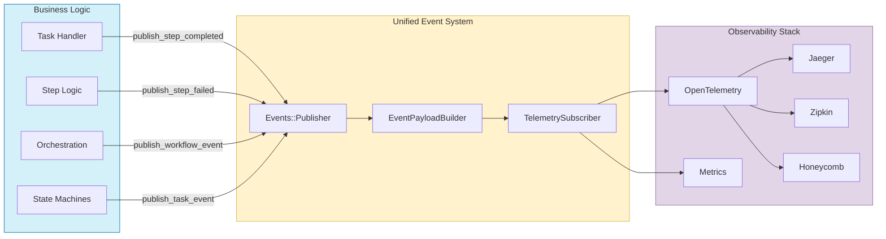

# Tasker Telemetry and Observability

## Overview

Tasker includes comprehensive telemetry capabilities to provide insights into task execution, workflow steps, and overall system performance. The telemetry system leverages OpenTelemetry standards and a unified event architecture to ensure compatibility with a wide range of observability tools and platforms.

## Key Features

- **Unified Event System** - Single `Events::Publisher` with consistent event publishing patterns
- **Standardized Event Payloads** - `EventPayloadBuilder` ensures consistent telemetry data structure
- **Production-Ready OpenTelemetry Integration** - Full instrumentation stack with safety mechanisms
- **Automatic Step Error Persistence** - Complete error data capture with atomic transactions
- **Memory-Safe Operation** - Database connection pooling and leak prevention
- **Comprehensive Event Lifecycle Tracking** - Task, step, workflow, and orchestration events
- **Sensitive Data Filtering** - Automatic security and privacy protection
- **Developer-Friendly API** - Clean `EventPublisher` concern for easy event publishing
- **Custom Event Subscribers** - Generator and BaseSubscriber for creating integrations
- **Event Discovery System** - Complete event catalog with documentation and examples

## Architecture

Tasker's telemetry is built on a unified event system with these main components:

1. **Events::Publisher** - Centralized event publishing using dry-events with OpenTelemetry integration
2. **EventPublisher Concern** - Clean interface providing `publish_event()`, `publish_step_event()`, etc.
3. **EventPayloadBuilder** - Standardized payload creation for consistent telemetry data
4. **TelemetrySubscriber** - Converts events to OpenTelemetry spans and metrics
5. **Event Catalog** - Complete event discovery and documentation system
6. **BaseSubscriber** - Foundation for creating custom event subscribers
7. **Subscriber Generator** - Tool for creating custom integrations with external services
8. **Configuration** - OpenTelemetry setup with production-ready safety mechanisms

### Event Flow



## Standard Events

### Task Events (Tasker::Constants::TaskEvents)

| Event Constant | Description |
|----------------|-------------|
| `INITIALIZE_REQUESTED` | Task is being created and initialized |
| `START_REQUESTED` | Task processing has started |
| `COMPLETED` | Task has completed successfully |
| `FAILED` | Task has encountered an error |
| `RETRY_REQUESTED` | Task is being retried |
| `CANCELLED` | Task has been cancelled |

### Step Events (Tasker::Constants::StepEvents)

| Event Constant | Description |
|----------------|-------------|
| `EXECUTION_REQUESTED` | Step is being queued for execution |
| `BEFORE_HANDLE` | Step is about to be processed |
| `HANDLE` | Step is being processed |
| `COMPLETED` | Step has completed successfully |
| `FAILED` | Step has encountered an error |
| `RETRY_REQUESTED` | Step is being retried |
| `MAX_RETRIES_REACHED` | Step has reached retry limit |

### Workflow Events (Tasker::Constants::WorkflowEvents)

| Event Constant | Description |
|----------------|-------------|
| `TASK_STARTED` | Workflow processing has begun |
| `STEP_COMPLETED` | Individual workflow step completed |
| `VIABLE_STEPS_DISCOVERED` | Steps ready for execution identified |
| `NO_VIABLE_STEPS` | No executable steps found |
| `TASK_COMPLETED` | Entire workflow completed |

### Observability Events (Tasker::Constants::ObservabilityEvents)

| Event Constant | Description |
|----------------|-------------|
| `Task::ENQUEUE` | Task enqueued for background processing |
| `Task::START` | Task processing started |
| `Step::PROCESSING` | Step processing in progress |

## Configuration

### Tasker Configuration

Configure Tasker's telemetry in `config/initializers/tasker.rb`:

```ruby
Tasker.configuration do |config|
  # Service name used for OpenTelemetry traces (default: 'tasker')
  # This value is used for tracer names and attribute prefixes in OpenTelemetry telemetry
  config.otel_telemetry_service_name = 'my_app_tasker'

  # Service version used for OpenTelemetry traces (default: Tasker::VERSION)
  # This value is used to identify the version of the service in traces
  config.otel_telemetry_service_version = '1.2.3'

  # Parameters to filter from telemetry data for privacy and security
  # By default, uses Rails.application.config.filter_parameters if available, or a predefined list
  config.filter_parameters = [:password, :api_key, 'credit_card.number', /token/i]

  # The mask to use when filtering sensitive data (default: '[FILTERED]')
  config.telemetry_filter_mask = '***REDACTED***'
end
```

### OpenTelemetry Configuration

Configure OpenTelemetry with production-ready settings in `config/initializers/opentelemetry.rb`:

```ruby
require 'opentelemetry/sdk'
require 'opentelemetry-exporter-otlp'
require 'opentelemetry/instrumentation/all'

# Configure OpenTelemetry
OpenTelemetry::SDK.configure do |c|
  # Use the configured service name
  c.service_name = Tasker::Configuration.configuration.otel_telemetry_service_name

  # Configure OTLP exporter to send to local Jaeger
  otlp_exporter = OpenTelemetry::Exporter::OTLP::Exporter.new(
    endpoint: 'http://localhost:4318/v1/traces'
  )

  # Add the OTLP exporter
  c.add_span_processor(
    OpenTelemetry::SDK::Trace::Export::BatchSpanProcessor.new(otlp_exporter)
  )

  # Configure resource with additional attributes
  c.resource = OpenTelemetry::SDK::Resources::Resource.create({
    'service.name' => Tasker::Configuration.configuration.otel_telemetry_service_name,
    'service.version' => Tasker::Configuration.configuration.otel_telemetry_service_version,
    'service.framework' => 'tasker'
  })

  # Production-ready instrumentation configuration
  # Excludes Faraday instrumentation due to known bug (see generator template for details)
  c.use_all({ 'OpenTelemetry::Instrumentation::Faraday' => { enabled: false } })
end
```

## Custom Telemetry Integrations

Beyond OpenTelemetry, Tasker's event system enables easy integration with any observability or monitoring service:

### Creating Custom Subscribers

Use the subscriber generator to create integrations:

```bash
# Generate a metrics subscriber for DataDog/StatsD
rails generate tasker:subscriber metrics --events task.completed task.failed step.completed step.failed

# Generate an alerting subscriber for PagerDuty
rails generate tasker:subscriber pager_duty --events task.failed step.failed
```

### Example Custom Integrations

**Metrics Collection (DataDog/StatsD)**:
```ruby
class MetricsSubscriber < Tasker::Events::Subscribers::BaseSubscriber
  subscribe_to 'task.completed', 'step.completed'

  def handle_task_completed(event)
    execution_duration = safe_get(event, :execution_duration, 0)
    task_name = safe_get(event, :task_name, 'unknown')

    # Record task completion time
    StatsD.histogram('tasker.task.duration', execution_duration, tags: ["task:#{task_name}"])
    StatsD.increment('tasker.task.completed', tags: ["task:#{task_name}"])
  end

  def handle_step_completed(event)
    step_name = safe_get(event, :step_name, 'unknown')
    execution_duration = safe_get(event, :execution_duration, 0)

    # Record step-level metrics
    StatsD.histogram('tasker.step.duration', execution_duration, tags: ["step:#{step_name}"])
  end
end
```

**Error Tracking (Sentry)**:
```ruby
class SentrySubscriber < Tasker::Events::Subscribers::BaseSubscriber
  subscribe_to 'task.failed', 'step.failed'

  def handle_task_failed(event)
    task_id = safe_get(event, :task_id)
    error_message = safe_get(event, :error_message, 'Unknown error')

    Sentry.capture_message(error_message, level: 'error', fingerprint: ['tasker', 'task_failed', task_id])
  end
end
```

For complete documentation on creating custom subscribers and integration examples, see [EVENT_SYSTEM.md](EVENT_SYSTEM.md).

## Integration with OpenTelemetry

Tasker's unified event system automatically integrates with OpenTelemetry through the `TelemetrySubscriber`. For each task:

1. A root span is created for the task lifecycle
2. Child spans are created for each step with proper parent-child relationships
3. Events are automatically converted to spans with standardized attributes
4. Error information is captured with full context and backtraces
5. Performance metrics include execution duration and attempt tracking

### Span Hierarchy Example

```
tasker.task.started (task_id: 123)
├── tasker.step.processing (step: fetch_cart)
│   ├── attributes: { task_id: 123, step_id: 456, attempt_number: 1 }
│   └── events: [step.started, step.completed]
├── tasker.step.processing (step: validate_products)
│   ├── attributes: { task_id: 123, step_id: 457, execution_duration: 2.34 }
│   └── events: [step.started, step.completed]
└── tasker.task.completed
    └── attributes: { task_id: 123, total_steps: 5, completion_time: "2025-06-01T12:00:00Z" }
```

## Event Payload Standardization

The `EventPayloadBuilder` ensures all events have consistent, comprehensive payloads:

### Step Event Payloads

```ruby
{
  # Core identifiers (always present)
  task_id: "task_123",
  step_id: "step_456",
  step_name: "fetch_cart",

  # Timing information
  started_at: "2025-06-01T12:00:00Z",
  completed_at: "2025-06-01T12:00:02Z",
  execution_duration: 2.34,

  # Retry and attempt tracking
  attempt_number: 1,
  retry_limit: 3,

  # Event metadata
  event_type: "completed",
  timestamp: "2025-06-01T12:00:02Z"
}
```

### Task Event Payloads

```ruby
{
  # Core identifiers
  task_id: "task_123",
  task_name: "order_processing",

  # Timing information
  started_at: "2025-06-01T12:00:00Z",
  completed_at: "2025-06-01T12:05:30Z",

  # Task statistics (from optimized queries)
  total_steps: 5,
  completed_steps: 5,
  failed_steps: 0,

  # Event metadata
  event_type: "completed",
  timestamp: "2025-06-01T12:05:30Z"
}
```

## Developing with Telemetry

### Using EventPublisher Concern

When implementing custom task handlers, events are **automatically published** around your business logic:

```ruby
class MyCustomStepHandler < Tasker::StepHandler::Base
  def process(task, sequence, step)
    # Events are published automatically around this method:
    # 1. publish_step_started(step) - fired before this method
    # 2. publish_step_completed(step) - fired after successful completion
    # 3. publish_step_failed(step, error: exception) - fired if exception occurs

    # Just implement your business logic and return the results:
    result = perform_complex_operation(task.context)
    { success: true, data: result }

    # No need to manually publish events or set step.results - they happen automatically!
  end
end
```

#### For API Step Handlers

API step handlers follow the same automatic event publishing pattern:

```ruby
class MyApiStepHandler < Tasker::StepHandler::Api
  def process(task, sequence, step)
    # Events published automatically around the entire process() flow
    # Just focus on making your API call:

    user_id = task.context['user_id']
    connection.get("/users/#{user_id}/profile")

    # Automatic events:
    # - step_started before process
    # - step_completed after successful process
    # - step_failed if exception occurs
  end

  # Optional: custom response processing
  def process(task, sequence, step)
    # Let parent handle API call and basic response processing
    super

    # Add custom processing
    user_data = step.results.body['user']
    step.results = { user: user_data, processed_at: Time.current }
  end
end
```

**Key Architecture Points:**
- ✅ **Implement `process()`** for regular step handlers (your business logic)
- ✅ **Implement `process()`** for API step handlers (your HTTP request)
- ✅ **Optionally override `process()`** in API handlers for custom response handling
- ✅ **Optionally override `process_results()`** to customize how return values are stored in `step.results`
- ⚠️ **Never override `handle()`** - it's framework-only code that publishes events and coordinates execution

#### Alternative: Manual Event Publishing (Advanced Use Cases)

### Manual Event Publishing (Advanced Use Cases)

For special cases where you need additional custom events, you can still manually publish them:

```ruby
class MyStepHandlerWithCustomEvents < Tasker::StepHandler::Base
  include Tasker::Concerns::EventPublisher

  def process(task, sequence, step)
    # Custom domain-specific event (before your business logic)
    publish_event('order.validation_started', {
      order_id: task.context['order_id'],
      validation_rules: get_validation_rules
    })

    # Your business logic
    validation_result = validate_order(task.context)

    # Another custom event (after your business logic)
    publish_event('order.validation_completed', {
      order_id: task.context['order_id'],
      validation_passed: validation_result[:passed]
    })

    # Return results - they will be stored in step.results automatically
    { validation_passed: validation_result[:passed], details: validation_result[:details] }
  end
end
```

## Error Handling and Observability

Tasker automatically captures comprehensive error information:

```ruby
# Error events automatically include:
{
  task_id: "task_123",
  step_id: "step_456",
  step_name: "payment_processing",
  error_message: "Payment gateway timeout",
  error_class: "PaymentGateway::TimeoutError",
  backtrace: ["app/services/payment.rb:45", "..."],
  attempt_number: 2,
  retry_limit: 3,
  event_type: "failed",
  timestamp: "2025-06-01T12:00:15Z"
}
```

## Production Considerations

### Memory Management

Tasker includes production-ready memory management:
- Database connection pooling prevents connection exhaustion
- Explicit cleanup in concurrent processing (`futures.clear()`)
- Batched processing limits (`MAX_CONCURRENT_STEPS = 3`)

### OpenTelemetry Safety

The system includes safety mechanisms for production use:
- Selective instrumentation excludes problematic components (Faraday)
- PostgreSQL instrumentation safely re-enabled after connection improvements
- Error isolation prevents telemetry failures from affecting core workflow

### Performance Optimization

- Optimized payload building with single database queries (`WorkflowStep.task_completion_stats`)
- Immediate event emission (no custom batching overhead)
- Lightweight event publishing with standardized payloads

## Best Practices

1. **Use Domain-Specific Event Methods** - Use `publish_step_completed(step)` instead of verbose `publish_step_event()` patterns
2. **Leverage Automatic Error Capture** - Use `publish_step_failed(step, error: exception)` for automatic error information
3. **Include Business Context** - Add domain-specific data via keyword arguments: `publish_step_completed(step, operation_count: 42)`
4. **Use Event Constants for Custom Events** - Reference `Tasker::Constants::*Events` for type safety when using `publish_event()`
5. **Monitor Error Patterns** - Use comprehensive error payloads for debugging with automatic error context
6. **Configure Filter Parameters** - Protect sensitive data in telemetry
7. **Test with Real Data** - Validate telemetry in staging environments
8. **Prefer Context-Aware Publishing** - Use `publish_step_event_for_context(step)` when event type can be inferred

### Migration from Legacy API

When migrating from the verbose legacy API, follow these patterns:

```ruby
# BEFORE (Legacy - still works but deprecated)
publish_step_event(
  Tasker::Constants::StepEvents::COMPLETED,
  step,
  event_type: :completed,
  additional_context: { operation_count: result.size }
)

# AFTER (Clean - recommended)
publish_step_completed(step, operation_count: result.size)
```

```ruby
# BEFORE (Legacy - manual error handling)
publish_step_event(
  Tasker::Constants::StepEvents::FAILED,
  step,
  event_type: :failed,
  additional_context: {
    error_message: exception.message,
    error_class: exception.class.name
  }
)

# AFTER (Clean - automatic error capture)
publish_step_failed(step, error: exception)
```

### Deprecation Timeline

- **Legacy methods remain functional** for backward compatibility
- **New domain-specific methods are preferred** for all new code
- **Legacy methods will show deprecation warnings** in future versions
- **Migration is optional but recommended** for cleaner, more maintainable code

## Troubleshooting

### Common Issues

- **Missing Events**: Check that `EventPublisher` concern is included in step handlers
- **Payload Issues**: Use domain-specific methods like `publish_step_completed(step)` for standardized payloads
- **Parameter Confusion**: Use clean API methods instead of legacy `publish_step_event()` with redundant `event_type:` parameters
- **Error Information Missing**: Use `publish_step_failed(step, error: exception)` for automatic error capture
- **OpenTelemetry Errors**: Ensure Faraday instrumentation is disabled (known bug)
- **Memory Issues**: Verify database connection pooling is configured
- **Performance Impact**: Monitor for excessive event publishing in high-throughput scenarios

### API Migration Issues

- **Legacy Method Deprecation**: Update to domain-specific methods (e.g., `publish_step_completed(step)` instead of `publish_step_event(..., event_type: :completed)`)
- **Parameter Mismatch**: New methods use keyword arguments (`publish_step_completed(step, count: 42)`) instead of hash parameters
- **Context-Aware Publishing**: Use `publish_step_event_for_context(step)` when the event type should be inferred from step state
- **Error Handling**: New methods automatically capture error information when `error:` parameter is provided

### Debug Commands

```bash
# Verify OpenTelemetry configuration
bundle exec rails runner "puts OpenTelemetry.tracer_provider.inspect"

# Check event publisher availability
bundle exec rails runner "puts Tasker::Events::Publisher.instance.inspect"

# Validate telemetry subscriber
bundle exec rails runner "puts Tasker::Events::Subscribers::TelemetrySubscriber.new.inspect"

# Test new domain-specific event methods
bundle exec rails runner "
  include Tasker::Concerns::EventPublisher
  puts respond_to?(:publish_step_completed)  # Should be true
  puts respond_to?(:publish_task_failed)     # Should be true
"
```

### Log Monitoring

Look for these log patterns:
- `Instrumentation: OpenTelemetry::Instrumentation::* was successfully installed`
- `Instrumentation: OpenTelemetry::Instrumentation::Faraday failed to install` (expected)
- Event publishing errors: `Error publishing event * :`

### Customizing Result Processing

Both regular and API step handlers support the `process_results()` method for customizing how results are stored:

```ruby
class MyApiStepHandlerWithCustomResults < Tasker::StepHandler::Api
  def process(task, _sequence, _step)
    # Make your API call
    connection.get("/users/#{task.context['user_id']}")
  end

  # Customize how the API response gets stored
  def process_results(step, process_output, initial_results)
    # Automatic events still fire around the entire handle() flow
    # This method just customizes result storage

    if process_output.status == 200
      user_data = JSON.parse(process_output.body)
      step.results = {
        user: user_data,
        fetched_at: Time.current,
        success: true
      }
    else
      step.results = {
        success: false,
        error_status: process_output.status,
        error_message: "Failed to fetch user data"
      }
    end
  end
end
```

**Benefits of `process_results()` Pattern:**
- **Separation of Concerns**: Business logic in `process()`, result formatting in `process_results()`
- **Automatic Event Publishing**: Events fire regardless of how you customize result storage
- **Flexible Result Processing**: Transform raw API responses or computation results before storage
- **Consistent Interface**: Same pattern works for both regular and API step handlers

