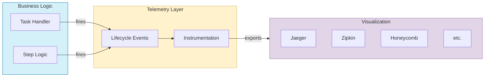

# Tasker Telemetry and Observability

## Overview

Tasker includes built-in telemetry capabilities to provide insights into task execution, workflow steps, and overall system performance. The telemetry system leverages OpenTelemetry standards to ensure compatibility with a wide range of observability tools and platforms.

## Key Features

- Standardized event naming for consistent observability
- Automatic span creation for tasks and steps
- Parent-child relationship tracking for complex workflows
- Sensitive data filtering to ensure security and privacy
- Compatible with OpenTelemetry ecosystem (Jaeger, Zipkin, etc.)
- Customizable service name and version configuration
- Comprehensive event lifecycle tracking

## Architecture

Tasker's telemetry is built on three main components:

1. **Lifecycle Events** - Defines and fires standard events for task and step operations
2. **Instrumentation** - Captures events and transforms them into OpenTelemetry spans
3. **Configuration** - Provides customization options for telemetry behavior

### Event Flow



## Standard Events

### Task Events

| Event Name | Description |
|------------|-------------|
| `TaskerTask.Initialize` | Task is being created and initialized |
| `TaskerTask.Start` | Task processing has started |
| `TaskerTask.Handle` | Task is being processed |
| `TaskerTask.Enqueue` | Task is being enqueued for processing |
| `TaskerTask.Finalize` | Task processing is being finalized |
| `TaskerTask.Error` | Task has encountered an error |
| `TaskerTask.Complete` | Task has completed successfully |

### Step Events

| Event Name | Description |
|------------|-------------|
| `TaskerStep.FindViable` | System is identifying viable steps |
| `TaskerStep.Handle` | Step is being processed |
| `TaskerStep.Complete` | Step has completed successfully |
| `TaskerStep.Error` | Step has encountered an error |
| `TaskerStep.Retry` | Step is being retried |
| `TaskerStep.Backoff` | Step is backing off before retry |
| `TaskerStep.Skip` | Step is being skipped |
| `TaskerStep.MaxRetriesReached` | Step has reached retry limit |

## Configuration

Tasker's telemetry can be configured in `config/initializers/tasker.rb`:

```ruby
Tasker.configuration do |config|
  # Service name used for OpenTelemetry traces (default: 'tasker')
  # This value is used for tracer names and attribute prefixes in OpenTelemetry telemetry
  config.otel_telemetry_service_name = 'my_app_tasker'

  # Service version used for OpenTelemetry traces (default: Tasker::VERSION)
  # This value is used to identify the version of the service in traces
  config.otel_telemetry_service_version = '1.2.3'

  # Parameters to filter from telemetry data for privacy and security
  # By default, uses Rails.application.config.filter_parameters if available, or a predefined list
  config.filter_parameters = [:password, :api_key, 'credit_card.number', /token/i]

  # The mask to use when filtering sensitive data (default: '[FILTERED]')
  config.telemetry_filter_mask = '***REDACTED***'
end
```

## Integration with OpenTelemetry

Tasker automatically integrates with OpenTelemetry when available. For each task:

1. A root span is created for the task lifecycle
2. Child spans are created for each step
3. Events are added to appropriate spans
4. Attributes are attached to provide context

### Span Hierarchy Example

```
TaskerTask.Start
├── TaskerStep.Handle (step1)
│   └── [Events]
├── TaskerStep.Handle (step2)
│   └── [Events]
└── TaskerTask.Complete
```

## Attribute Formatting

All telemetry attributes are formatted with the service name as a prefix:

```
<service_name>.<attribute_name>
```

For example, with the default service name:

```
tasker.task_id: "123"
tasker.step_name: "verify_email"
```

## Sensitive Data Protection

Tasker automatically filters sensitive data from telemetry using the configured parameter filter. By default, it uses Rails' filter parameters and adds common sensitive fields like passwords, tokens, and API keys.

## Logging Integration

In addition to OpenTelemetry spans, Tasker logs all events with:
- Event name
- Duration in milliseconds
- Filtered payload (sensitive data removed)

## Developing with Telemetry

When implementing custom task handlers, you can leverage Tasker's telemetry:

```ruby
def my_custom_step_logic(task, step)
  # This will be automatically wrapped in a span
  Tasker::LifecycleEvents.fire_with_span(
    'MyCustom.Event',
    { task_id: task.task_id, custom_data: 'value' }
  ) do
    # Your code here - will be traced
    perform_work
  end
end
```

## Error Handling

Errors in task or step processing are automatically captured:

```ruby
begin
  # code that might fail
rescue StandardError => e
  Tasker::LifecycleEvents.fire_error(
    'MyComponent.Error',
    e,
    { context: 'additional info' }
  )
end
```

## Best Practices

1. **Use standard event names** for consistency
2. **Include relevant context** in event payloads
3. **Filter sensitive data** before adding to events
4. **Use span-aware operations** for proper parent-child relationships
5. **Add custom events** for domain-specific operations
6. **Include error details** when handling exceptions

## Troubleshooting

- Check Rails logs for telemetry-related errors
- Verify OpenTelemetry exporters are configured correctly
- Ensure service name is consistently configured
- Look for duplicate event subscription warnings

