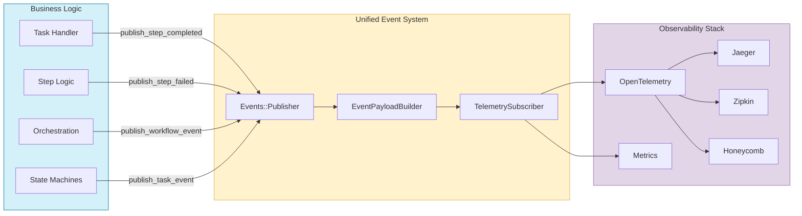

# Tasker Telemetry and Observability

## Overview

Tasker includes comprehensive telemetry capabilities to provide insights into task execution, workflow steps, and overall system performance. The telemetry system leverages OpenTelemetry standards and a unified event architecture to ensure compatibility with a wide range of observability tools and platforms.

## Key Features

- **Unified Event System** - Single `Events::Publisher` with consistent event publishing patterns
- **Standardized Event Payloads** - `EventPayloadBuilder` ensures consistent telemetry data structure
- **Production-Ready OpenTelemetry Integration** - Full instrumentation stack with safety mechanisms
- **Automatic Step Error Persistence** - Complete error data capture with atomic transactions
- **Memory-Safe Operation** - Database connection pooling and leak prevention
- **Comprehensive Event Lifecycle Tracking** - Task, step, workflow, and orchestration events
- **Sensitive Data Filtering** - Automatic security and privacy protection
- **Developer-Friendly API** - Clean `EventPublisher` concern for easy event publishing

## Architecture

Tasker's telemetry is built on a unified event system with these main components:

1. **Events::Publisher** - Centralized event publishing using dry-events with OpenTelemetry integration
2. **EventPublisher Concern** - Clean interface providing `publish_event()`, `publish_step_event()`, etc.
3. **EventPayloadBuilder** - Standardized payload creation for consistent telemetry data
4. **TelemetrySubscriber** - Converts events to OpenTelemetry spans and metrics
5. **Configuration** - OpenTelemetry setup with production-ready safety mechanisms

### Event Flow



## Standard Events

### Task Events (Tasker::Constants::TaskEvents)

| Event Constant | Description |
|----------------|-------------|
| `INITIALIZE_REQUESTED` | Task is being created and initialized |
| `START_REQUESTED` | Task processing has started |
| `COMPLETED` | Task has completed successfully |
| `FAILED` | Task has encountered an error |
| `RETRY_REQUESTED` | Task is being retried |
| `CANCELLED` | Task has been cancelled |

### Step Events (Tasker::Constants::StepEvents)

| Event Constant | Description |
|----------------|-------------|
| `EXECUTION_REQUESTED` | Step is being queued for execution |
| `BEFORE_HANDLE` | Step is about to be processed |
| `HANDLE` | Step is being processed |
| `COMPLETED` | Step has completed successfully |
| `FAILED` | Step has encountered an error |
| `RETRY_REQUESTED` | Step is being retried |
| `MAX_RETRIES_REACHED` | Step has reached retry limit |

### Workflow Events (Tasker::Constants::WorkflowEvents)

| Event Constant | Description |
|----------------|-------------|
| `TASK_STARTED` | Workflow processing has begun |
| `STEP_COMPLETED` | Individual workflow step completed |
| `VIABLE_STEPS_DISCOVERED` | Steps ready for execution identified |
| `NO_VIABLE_STEPS` | No executable steps found |
| `TASK_COMPLETED` | Entire workflow completed |

### Observability Events (Tasker::Constants::ObservabilityEvents)

| Event Constant | Description |
|----------------|-------------|
| `Task::ENQUEUE` | Task enqueued for background processing |
| `Task::START` | Task processing started |
| `Step::PROCESSING` | Step processing in progress |

## Configuration

### Tasker Configuration

Configure Tasker's telemetry in `config/initializers/tasker.rb`:

```ruby
Tasker.configuration do |config|
  # Service name used for OpenTelemetry traces (default: 'tasker')
  # This value is used for tracer names and attribute prefixes in OpenTelemetry telemetry
  config.otel_telemetry_service_name = 'my_app_tasker'

  # Service version used for OpenTelemetry traces (default: Tasker::VERSION)
  # This value is used to identify the version of the service in traces
  config.otel_telemetry_service_version = '1.2.3'

  # Parameters to filter from telemetry data for privacy and security
  # By default, uses Rails.application.config.filter_parameters if available, or a predefined list
  config.filter_parameters = [:password, :api_key, 'credit_card.number', /token/i]

  # The mask to use when filtering sensitive data (default: '[FILTERED]')
  config.telemetry_filter_mask = '***REDACTED***'
end
```

### OpenTelemetry Configuration

Configure OpenTelemetry with production-ready settings in `config/initializers/opentelemetry.rb`:

```ruby
require 'opentelemetry/sdk'
require 'opentelemetry-exporter-otlp'
require 'opentelemetry/instrumentation/all'

# Configure OpenTelemetry
OpenTelemetry::SDK.configure do |c|
  # Use the configured service name
  c.service_name = Tasker::Configuration.configuration.otel_telemetry_service_name

  # Configure OTLP exporter to send to local Jaeger
  otlp_exporter = OpenTelemetry::Exporter::OTLP::Exporter.new(
    endpoint: 'http://localhost:4318/v1/traces'
  )

  # Add the OTLP exporter
  c.add_span_processor(
    OpenTelemetry::SDK::Trace::Export::BatchSpanProcessor.new(otlp_exporter)
  )

  # Configure resource with additional attributes
  c.resource = OpenTelemetry::SDK::Resources::Resource.create({
    'service.name' => Tasker::Configuration.configuration.otel_telemetry_service_name,
    'service.version' => Tasker::Configuration.configuration.otel_telemetry_service_version,
    'service.framework' => 'tasker'
  })

  # Production-ready instrumentation configuration
  # Excludes Faraday instrumentation due to known bug (see generator template for details)
  c.use_all({ 'OpenTelemetry::Instrumentation::Faraday' => { enabled: false } })
end
```

## Integration with OpenTelemetry

Tasker's unified event system automatically integrates with OpenTelemetry through the `TelemetrySubscriber`. For each task:

1. A root span is created for the task lifecycle
2. Child spans are created for each step with proper parent-child relationships
3. Events are automatically converted to spans with standardized attributes
4. Error information is captured with full context and backtraces
5. Performance metrics include execution duration and attempt tracking

### Span Hierarchy Example

```
tasker.task.started (task_id: 123)
├── tasker.step.processing (step: fetch_cart)
│   ├── attributes: { task_id: 123, step_id: 456, attempt_number: 1 }
│   └── events: [step.started, step.completed]
├── tasker.step.processing (step: validate_products)
│   ├── attributes: { task_id: 123, step_id: 457, execution_duration: 2.34 }
│   └── events: [step.started, step.completed]
└── tasker.task.completed
    └── attributes: { task_id: 123, total_steps: 5, completion_time: "2025-06-01T12:00:00Z" }
```

## Event Payload Standardization

The `EventPayloadBuilder` ensures all events have consistent, comprehensive payloads:

### Step Event Payloads

```ruby
{
  # Core identifiers (always present)
  task_id: "task_123",
  step_id: "step_456",
  step_name: "fetch_cart",

  # Timing information
  started_at: "2025-06-01T12:00:00Z",
  completed_at: "2025-06-01T12:00:02Z",
  execution_duration: 2.34,

  # Retry and attempt tracking
  attempt_number: 1,
  retry_limit: 3,

  # Event metadata
  event_type: "completed",
  timestamp: "2025-06-01T12:00:02Z"
}
```

### Task Event Payloads

```ruby
{
  # Core identifiers
  task_id: "task_123",
  task_name: "order_processing",

  # Timing information
  started_at: "2025-06-01T12:00:00Z",
  completed_at: "2025-06-01T12:05:30Z",

  # Task statistics (from optimized queries)
  total_steps: 5,
  completed_steps: 5,
  failed_steps: 0,

  # Event metadata
  event_type: "completed",
  timestamp: "2025-06-01T12:05:30Z"
}
```

## Developing with Telemetry

### Using EventPublisher Concern

When implementing custom task handlers, use the `EventPublisher` concern for clean event publishing:

```ruby
class MyCustomStepHandler
  include Tasker::Concerns::EventPublisher

  def handle(task, sequence, step)
    # Publish step started event
    publish_step_event(
      Tasker::Constants::StepEvents::EXECUTION_REQUESTED,
      step,
      event_type: :started
    )

    begin
      # Your step logic here
      result = perform_complex_operation(task.context)
      step.results = { success: true, data: result }

      # Publish step completed event with automatic payload building
      publish_step_event(
        Tasker::Constants::StepEvents::COMPLETED,
        step,
        event_type: :completed,
        additional_context: { operation_count: result.size }
      )

    rescue StandardError => e
      # Error information automatically captured in payload
      publish_step_event(
        Tasker::Constants::StepEvents::FAILED,
        step,
        event_type: :failed,
        additional_context: { error_class: e.class.name }
      )
      raise
    end
  end
end
```

### Custom Event Publishing

For domain-specific events, use the generic `publish_event` method:

```ruby
class OrderProcessingHandler
  include Tasker::Concerns::EventPublisher

  def handle(task, sequence, step)
    # Publish custom business event
    publish_event(
      'order.payment_processed',
      {
        order_id: task.context['order_id'],
        payment_amount: calculate_total(task.context),
        payment_method: 'credit_card',
        processing_time: Time.current
      }
    )
  end
end
```

## Error Handling and Observability

Tasker automatically captures comprehensive error information:

```ruby
# Error events automatically include:
{
  task_id: "task_123",
  step_id: "step_456",
  step_name: "payment_processing",
  error_message: "Payment gateway timeout",
  error_class: "PaymentGateway::TimeoutError",
  backtrace: ["app/services/payment.rb:45", "..."],
  attempt_number: 2,
  retry_limit: 3,
  event_type: "failed",
  timestamp: "2025-06-01T12:00:15Z"
}
```

## Production Considerations

### Memory Management

Tasker includes production-ready memory management:
- Database connection pooling prevents connection exhaustion
- Explicit cleanup in concurrent processing (`futures.clear()`)
- Batched processing limits (`MAX_CONCURRENT_STEPS = 3`)

### OpenTelemetry Safety

The system includes safety mechanisms for production use:
- Selective instrumentation excludes problematic components (Faraday)
- PostgreSQL instrumentation safely re-enabled after connection improvements
- Error isolation prevents telemetry failures from affecting core workflow

### Performance Optimization

- Optimized payload building with single database queries (`WorkflowStep.task_completion_stats`)
- Immediate event emission (no custom batching overhead)
- Lightweight event publishing with standardized payloads

## Best Practices

1. **Use EventPublisher Concern** - Include in your step handlers for clean event publishing
2. **Leverage EventPayloadBuilder** - Use `publish_step_event()` for standardized payloads
3. **Include Business Context** - Add domain-specific data via `additional_context` parameter
4. **Use Event Constants** - Reference `Tasker::Constants::*Events` for type safety
5. **Monitor Error Patterns** - Use comprehensive error payloads for debugging
6. **Configure Filter Parameters** - Protect sensitive data in telemetry
7. **Test with Real Data** - Validate telemetry in staging environments

## Troubleshooting

### Common Issues

- **Missing Events**: Check that `EventPublisher` concern is included in step handlers
- **Payload Issues**: Verify `EventPayloadBuilder` is being used via `publish_step_event()`
- **OpenTelemetry Errors**: Ensure Faraday instrumentation is disabled (known bug)
- **Memory Issues**: Verify database connection pooling is configured
- **Performance Impact**: Monitor for excessive event publishing in high-throughput scenarios

### Debug Commands

```bash
# Verify OpenTelemetry configuration
bundle exec rails runner "puts OpenTelemetry.tracer_provider.inspect"

# Check event publisher availability
bundle exec rails runner "puts Tasker::Events::Publisher.instance.inspect"

# Validate telemetry subscriber
bundle exec rails runner "puts Tasker::Events::Subscribers::TelemetrySubscriber.new.inspect"
```

### Log Monitoring

Look for these log patterns:
- `Instrumentation: OpenTelemetry::Instrumentation::* was successfully installed`
- `Instrumentation: OpenTelemetry::Instrumentation::Faraday failed to install` (expected)
- Event publishing errors: `Error publishing event * :`

