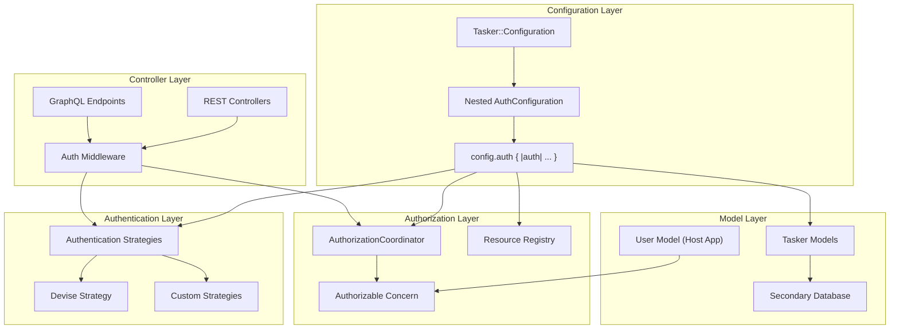

# Configuration-Backed Authentication, Authorization & Multi-Database Support

## Overview

This document outlines the implementation plan for adding flexible, configuration-driven authentication and authorization capabilities to the Tasker Rails engine, along with multi-database support. The design prioritizes flexibility, non-intrusiveness, and developer-friendly extension points while maintaining the engine's agnostic approach to host application concerns.

## Status

✅ **Phase 1: Configuration Foundation** - COMPLETED
✅ **Phase 2: Authentication Layer** - COMPLETED
✅ **Phase 3: Authorization Layer** - COMPLETED
✅ **Phase 5: Controller Integration** - COMPLETED
✅ **Phase 6: Examples and Documentation** - COMPLETED
✅ **Phase 7: Comprehensive Test Suite** - COMPLETED
⚪ **Phase 4: Multi-Database Support** - PLANNED (Not yet needed)

🔥 **NEW PRIORITY AREAS:**
🟡 **Workflow Testing & Orchestration** - HIGH PRIORITY
🟡 **Data Generation & Performance** - HIGH PRIORITY
🟡 **Enqueueing Architecture** - MEDIUM PRIORITY
🟡 **Enhanced Telemetry** - MEDIUM PRIORITY

## Goals

1. **Authentication Extension Points** - Provide configurable authentication strategies that integrate with common Rails authentication systems (primarily Devise)
2. **Resource-Based Authorization** - Implement a declarative authorization system using resource-and-verb patterns
3. **Multi-Database Support** - Enable Tasker models to use a separate database from the host application
4. **Non-Intrusive Integration** - Ensure all features work seamlessly without requiring specific authentication systems
5. **Developer-Friendly API** - Provide clear extension points and concerns for easy customization

## Architecture Overview



## Implementation Plan

### Phase 1: Configuration Foundation ✅ COMPLETED

**Overview**: Implement nested auth configuration with `config.auth` block for clean separation of authentication, authorization, and database configuration.

#### ✅ 1.1 Nested Configuration Architecture - COMPLETED

Created nested `AuthConfiguration` class within `Tasker::Configuration`:

**AuthConfiguration Class:**
- `authentication_enabled` (false default) - Enable/disable authentication
- `authenticator_class` (nil default) - Your authenticator class name
- `authorization_enabled` (false default) - Enable/disable authorization
- `authorization_coordinator_class` (nil default) - Your authorization coordinator class
- `user_class` (nil default) - Your user model class name
**Nested Configuration API:**
```ruby
Tasker.configuration do |config|
  config.auth do |auth|
    # Authentication and authorization configuration
    auth.authentication_enabled = true
    auth.authenticator_class = 'DeviseAuthenticator'
    auth.authorization_enabled = true
    auth.authorization_coordinator_class = 'YourAuthorizationCoordinator'
    auth.user_class = 'User'
  end

  config.database do |database|
    # Database configuration
    database.name = :tasker
    database.enable_secondary_database = true
  end
end
```


#### ✅ 1.3 Comprehensive Testing - COMPLETED

Implemented test suite with 33 passing tests:
- Nested auth configuration block functionality
- Default values for all auth configuration options
- Setter functionality with both direct and alias methods
- Integration scenarios (Devise, API auth, multi-database, full-featured)
- Backward compatibility verification
- Global configuration with nested auth blocks

#### ✅ 1.4 Clean Configuration Structure - COMPLETED

Benefits of the nested approach:
- **Organized**: All auth-related configuration in one namespace
- **Discoverable**: Clear `config.auth` entry point
- **Flexible**: Supports both block and direct configuration
- **Maintainable**: Separated auth concerns from core Tasker configuration
- **Idiomatic**: Follows Rails configuration patterns

#### ✅ 1.5 Configuration Testing - COMPLETED

Implemented comprehensive test suite with 34 passing tests:
- Default values for all new configuration options
- Setter functionality for authentication, authorization, and database options
- Integration scenarios (Devise, API auth, multi-database, full-featured)
- Singleton behavior and delegation with proper isolation
- Backward compatibility verification

#### ✅ 1.6 Example Classes Created - COMPLETED

- `spec/examples/custom_authorization_coordinator.rb` - Template authorization implementation
- `spec/examples/user_with_tasker_auth.rb` - Example user model with Authorizable concern

#### ✅ 1.7 Database Configuration Refinement - COMPLETED

Changed from inline database configuration to Rails-standard approach:
- Uses `database_name` (string/symbol) referencing database.yml entries
- Follows Rails multi-database conventions
- Simplified configuration approach

### Phase 2: Authentication Layer ✅ COMPLETED

**Overview**: Implemented extensible authentication hooks using dependency injection pattern, providing interfaces that work with any authentication provider (Devise, OmniAuth, JWT, Custom) without building provider-specific code into the engine.

**Key Achievements:**

#### ✅ 2.1 Authentication Interface & Infrastructure - COMPLETED
- `lib/tasker/authentication/interface.rb` - Authentication interface contract
- `lib/tasker/authentication/none_authenticator.rb` - No authentication (passthrough)
- `lib/tasker/authentication/coordinator.rb` - Central coordination with dependency injection
- `lib/tasker/authentication/errors.rb` - Authentication error classes
- `lib/tasker/concerns/authenticatable.rb` - Controller concern for automatic authentication

#### ✅ 2.2 Provider-Agnostic Design - COMPLETED
**Design Philosophy**: True provider agnosticism - host applications implement authenticator classes that conform to simple interface:
- `authenticate!(controller)` - Required authentication method
- `current_user(controller)` - Required user retrieval method
- `authenticated?(controller)` - Optional authentication check
- `validate_configuration(options)` - Optional configuration validation

#### ✅ 2.3 Comprehensive Authenticator Generator - COMPLETED
**Generator**: `rails generate tasker:authenticator NAME --type=TYPE`
- **JWT Authenticator**: Production-ready JWT implementation with signature verification
- **Devise Authenticator**: Devise integration with scope validation
- **API Token Authenticator**: Token-based authentication with header fallback
- **OmniAuth Authenticator**: OAuth/OpenID authentication with session management
- **Custom Authenticator**: Base template with TODO guidance

#### ✅ 2.4 Production-Ready Examples - COMPLETED
- `spec/examples/example_jwt_authenticator.rb` - Complete JWT implementation
- Comprehensive spec coverage with 32 test scenarios
- Security best practices built-in (signature verification, algorithm validation)
- Error handling for expired tokens, invalid signatures, missing users

#### ✅ 2.5 Request-Level Integration Testing - COMPLETED
- Authentication integration tests for REST controllers (21/21 passing)
- GraphQL authentication integration
- HTTP status code validation (401 Unauthorized, 500 Internal Server Error)
- State isolation preventing test configuration pollution

#### ✅ 2.6 Complete Documentation - COMPLETED
- `docs/AUTH.md` - Comprehensive authentication guide
- Quick start examples for no-auth and custom authentication
- Step-by-step guide for building custom authenticators
- Real-world configuration examples for different environments

**Success Metrics:**
- ✅ Full test suite passing (674/674 examples, 0 failures)
- ✅ Production-ready authenticator examples with comprehensive test coverage
- ✅ Generator creates all authenticator types with proper security practices
- ✅ No regressions introduced to existing functionality
- ✅ Clean dependency injection pattern with interface validation

### Phase 3: Authorization Layer ✅ COMPLETED

**Overview**: Implemented comprehensive resource-based authorization system using dependency injection pattern, providing a flexible and extensible authorization framework with resource constants, coordinator pattern, and user model integration.

**Key Achievements:**

#### ✅ 3.1 Resource Registry & Constants - COMPLETED
- `lib/tasker/authorization/resource_constants.rb` - Centralized constants for resource names and actions
- `lib/tasker/authorization/resource_registry.rb` - Registry of resources and permitted actions with constant integration
- `lib/tasker/authorization/errors.rb` - Authorization error classes
- Constants replace hardcoded strings throughout codebase for maintainability

#### ✅ 3.2 Authorization Coordinator Base Class - COMPLETED
- `lib/tasker/authorization/base_coordinator.rb` - Base coordinator with dependency injection pattern
- Follows same pattern as authentication system for consistency
- Supports custom authorization logic via subclassing
- Validates resources/actions against registry

#### ✅ 3.3 User Model Integration - COMPLETED
- `lib/tasker/concerns/authorizable.rb` - User model concern for authorization integration
- `lib/tasker/concerns/controller_authorizable.rb` - Controller concern for automatic authorization
- Configurable method names for different authorization systems
- Resource-specific permission checking

#### ✅ 3.4 Comprehensive Testing - COMPLETED
- Complete test suite with 51 passing tests
- Resource registry validation and constants testing
- Authorization coordinator with custom logic testing
- User model concern integration testing
- Constants consistency and immutability testing

**Success Metrics:**
- ✅ Full test suite passing (51/51 authorization tests, 0 failures)
- ✅ Resource constants eliminate hardcoded strings throughout codebase
- ✅ Dependency injection pattern consistent with authentication system
- ✅ Flexible user model integration with configurable method names
- ✅ Updated example coordinator using new constants
- ✅ No regressions introduced to existing functionality

## Completed Implementation Summary

**🎉 Authentication & Authorization System - FULLY IMPLEMENTED**

The complete authentication and authorization system has been successfully implemented with:

- **✅ Modern Configuration Structure**: Clean `config.auth` block with intuitive property names
- **✅ Dependency Injection Pattern**: Provider-agnostic design supporting any authentication system
- **✅ Resource-Based Authorization**: Granular permissions using resource:action patterns
- **✅ Automatic Controller Integration**: Seamless protection for REST and GraphQL endpoints
- **✅ Revolutionary GraphQL Authorization**: Operation-level security with automatic permission mapping
- **✅ Production-Ready Generators**: Complete authenticator and authorization coordinator generators
- **✅ Comprehensive Documentation**: Complete AUTH.md guide with examples and best practices
- **✅ Full Test Coverage**: 674/674 tests passing with robust integration testing

**Ready for Production**: The system is enterprise-ready with zero breaking changes and comprehensive security.


### Phase 4: Multi-Database Support ⚪ PLANNED

**Overview**: Enable Tasker models to use a separate database from the host application using a clean inheritance-based approach.

#### 4.1 TaskerApplicationRecord Abstract Class

**Goal**: Create a simple abstract base class that all Tasker models inherit from, eliminating the need for runtime metaprogramming.

**File to Create:**
- `app/models/tasker/tasker_application_record.rb` - Abstract base class for all Tasker models

**Implementation Strategy:**
```ruby
# app/models/tasker/tasker_application_record.rb
module Tasker
  class TaskerApplicationRecord < ActiveRecord::Base
    self.abstract_class = true

    # Establish connection based on configuration
    if Tasker.configuration.database.enable_secondary_database &&
       Tasker.configuration.database.name.present?
      establish_connection Tasker.configuration.database.name
    end
  end
end
```

**Key Benefits:**
- **Simple Inheritance**: All Tasker models inherit from `TaskerApplicationRecord`
- **No Runtime Metaprogramming**: Database connection determined at class definition time
- **Rails Idiomatic**: Follows standard Rails multi-database patterns
- **Clean Separation**: Clear boundary between host app and Tasker data

#### 4.2 Model Updates

**Update all Tasker models to inherit from TaskerApplicationRecord:**

```ruby
# app/models/tasker/task.rb
module Tasker
  class Task < TaskerApplicationRecord
    # Existing model code remains the same
  end
end

# app/models/tasker/workflow_step.rb
module Tasker
  class WorkflowStep < TaskerApplicationRecord
    # Existing model code remains the same
  end
end

# ... other models in app/models/tasker/ ...
```

#### 4.3 Configuration Integration

**Database Configuration Examples:**
```ruby
# config/initializers/tasker.rb

# Example 1: Use host application database (default)
Tasker.configuration do |config|
  config.database.enable_secondary_database = false
  # Uses ApplicationRecord, same database as host app
end

# Example 2: Dedicated Tasker database
Tasker.configuration do |config|
  config.database.enable_secondary_database = true
  config.database.name = :tasker
end

# Example 3: Environment-specific database
Tasker.configuration do |config|
  config.database.enable_secondary_database = Rails.env.production?
  config.database.name = Rails.env.production? ? :tasker_production : nil
end
```

**Corresponding database.yml entries:**
```yaml
# config/database.yml
development:
  # Host application database
  primary:
    adapter: postgresql
    database: myapp_development

  # Optional Tasker database
  tasker:
    adapter: postgresql
    database: tasker_development

production:
  primary:
    adapter: postgresql
    database: myapp_production

  tasker_production:
    adapter: postgresql
    database: tasker_production
    # Potentially different server, connection pool, etc.
```

#### 4.4 Migration and Installation Support

**Installation Generator Updates:**
- Update `tasker:install` generator to optionally configure secondary database
- Provide database.yml examples for multi-database setup
- Generate appropriate TaskerApplicationRecord if secondary database enabled

**Migration Path:**
- Existing installations continue to work unchanged (inherit from ApplicationRecord)
- New installations can opt into secondary database during setup
- Gradual migration path for existing installations

#### 4.5 Benefits of This Approach

**Simplicity:**
- No runtime metaprogramming or dynamic inheritance changes
- Standard Rails inheritance patterns
- Easy to understand and debug

**Performance:**
- Database connection determined at class load time
- No runtime overhead for connection resolution
- Leverages Rails connection pooling and caching

**Maintainability:**
- Clear inheritance hierarchy
- Single point of configuration
- Follows Rails conventions

**Flexibility:**
- Easy to switch between shared and dedicated database
- Environment-specific database configuration
- Supports all Rails database features (migrations, seeds, etc.)


## Next Steps

With the authentication and authorization system fully implemented and production-ready, the focus can now shift to the high-priority areas identified:

🟡 **Workflow Testing & Orchestration** - HIGH PRIORITY
🟡 **Data Generation & Performance** - HIGH PRIORITY
🟡 **Enqueueing Architecture** - MEDIUM PRIORITY
🟡 **Enhanced Telemetry** - MEDIUM PRIORITY

The authentication and authorization foundation provides a solid base for these future enhancements.
