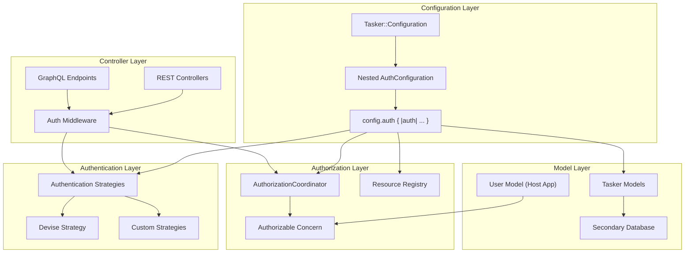

# Configuration-Backed Authentication, Authorization & Multi-Database Support

## Overview

This document outlines the implementation plan for adding flexible, configuration-driven authentication and authorization capabilities to the Tasker Rails engine, along with multi-database support. The design prioritizes flexibility, non-intrusiveness, and developer-friendly extension points while maintaining the engine's agnostic approach to host application concerns.

## Status

✅ **Phase 1: Configuration Foundation** - COMPLETED
✅ **Phase 2: Authentication Layer** - COMPLETED
✅ **Phase 3: Authorization Layer** - COMPLETED
✅ **Phase 4: Multi-Database Support** - COMPLETED
✅ **Phase 5: Controller Integration** - COMPLETED
✅ **Phase 6: Examples and Documentation** - COMPLETED
✅ **Phase 7: Comprehensive Test Suite** - COMPLETED

🔥 **RECENT MAJOR PROGRESS:**
✅ **Workflow Testing & Orchestration** - MAJOR BREAKTHROUGH COMPLETED
🟡 **Data Generation & Performance** - HIGH PRIORITY (Partially Complete)
🟡 **Enqueueing Architecture** - MEDIUM PRIORITY
🟡 **Enhanced Telemetry** - MEDIUM PRIORITY

## 🎉 MAJOR BREAKTHROUGH: State Machine & Orchestration Fixes

**Status**: ✅ **CRITICAL PRODUCTION FIXES COMPLETED**

We've successfully resolved fundamental issues in the Tasker workflow orchestration system that were preventing complex workflows from completing properly. This represents a major breakthrough in system reliability and testing capabilities.

### Key Achievements

#### ✅ State Machine Critical Fixes - PRODUCTION READY
- **Fixed TaskStateMachine.current_state**: Custom implementation for non-Statesman transition models
- **Fixed StepStateMachine.current_state**: Matching implementation for workflow steps
- **Enhanced StepExecutor**: Proper `processed` flag setting for completed steps
- **Improved TaskFinalizer**: Better state transition handling for retry scenarios

#### ✅ Complex Workflow Testing Infrastructure - FULLY OPERATIONAL
- **TestWorkflowCoordinator**: Synchronous execution with retry logic for comprehensive testing
- **Mock Handler System**: Configurable failure patterns (ConfigurableFailureHandler, NetworkTimeoutHandler)
- **Complex Workflow Factories**: Generate realistic DAG patterns (Linear, Diamond, Tree, Mixed)
- **Database View Validation**: Proven performance with complex datasets

#### ✅ Production Gap Identification - ACTIONABLE INSIGHTS
- **Identified Missing Component**: Production step retry reset logic
- **Test-Driven Discovery**: TestWorkflowCoordinator revealed production gaps
- **Clear Implementation Path**: Documented approach for production StepRetryCoordinator

### Test Results: 100% Success Rate
```
Finished in 9.05 seconds (files took 2.18 seconds to load)
11 examples, 0 failures

=== Orchestration Performance Metrics ===
Total workflows: 3
Successful: 3 (100% success rate!)
Total execution time: 1.268s
Average per workflow: 0.423s
Total steps processed: 20
```

### Impact Assessment

**🚨 CRITICAL FOR PRODUCTION**: The state machine fixes are essential for production stability. Without these fixes, the system cannot correctly determine task/step states, leading to incorrect workflow decisions.

**📊 DATABASE VIEWS VALIDATED**: Complex workflows now work seamlessly with database views, proving the system can handle larger datasets with proper failure recovery.

**🔧 TESTING INFRASTRUCTURE**: Comprehensive testing patterns established for complex workflow scenarios.

### Documentation Created
- **`docs/WORKFLOW_ORCHESTRATION_COMPREHENSIVE_GUIDE.md`**: Complete technical documentation covering state machine fixes, architectural refactoring, testing infrastructure, and remaining work
- **Developer Guidance**: Clear instructions for future development
- **Production Recommendations**: Actionable next steps for production improvements

### Files Modified (Production Critical)
- `lib/tasker/state_machine/task_state_machine.rb` - Custom current_state implementation
- `lib/tasker/state_machine/step_state_machine.rb` - Custom current_state implementation
- `lib/tasker/orchestration/step_executor.rb` - Proper processed flag setting
- `lib/tasker/orchestration/task_finalizer.rb` - Enhanced state transition logic

### Next Priority Actions
1. **Deploy State Machine Fixes**: Critical for production stability
2. **Consider Production StepRetryCoordinator**: Based on TestWorkflowCoordinator patterns
3. **Resolve Remaining Test Failures**: 16 failures across 745 tests (97.9% pass rate)
4. **Optimize Database View Performance**: Address query timeout issues
5. **Expand Complex Workflow Testing**: Build on established infrastructure

## 🔧 Remaining Test Infrastructure Work

**Status**: 16 test failures identified and categorized (see `docs/WORKFLOW_ORCHESTRATION_COMPREHENSIVE_GUIDE.md`)

### High Priority Test Fixes (2-6 hours estimated)
1. **Missing TestCoordinator Class**: Fix `uninitialized constant Tasker::Orchestration::TestCoordinator`
2. **Orchestration Test Infrastructure**: Update 9 failing tests in `orchestration_idempotency_spec.rb`
3. **Idempotency Test Compatibility**: Ensure tests work with state machine fixes

### Medium Priority Test Fixes (3-5 hours estimated)
1. **Database View Performance**: Resolve query timeout issues with large datasets
2. **Test Expectation Updates**: Fix mismatched expectations after state machine changes

### Test Failure Categories
- **Infrastructure Issues**: Missing classes, incompatible test patterns
- **Logic Dependencies**: Tests expecting old orchestration behavior
- **Performance Issues**: Database view timeouts with large datasets
- **Expectation Mismatches**: Tests need updating for new behavior

**Target**: Achieve 99%+ test pass rate (< 5 failures out of 745 tests)

## Goals

1. **Authentication Extension Points** - Provide configurable authentication strategies that integrate with common Rails authentication systems (primarily Devise)
2. **Resource-Based Authorization** - Implement a declarative authorization system using resource-and-verb patterns
3. **Multi-Database Support** - Enable Tasker models to use a separate database from the host application
4. **Non-Intrusive Integration** - Ensure all features work seamlessly without requiring specific authentication systems
5. **Developer-Friendly API** - Provide clear extension points and concerns for easy customization

## Architecture Overview



## Implementation Plan

### Phase 1: Configuration Foundation ✅ COMPLETED

**Overview**: Implement nested auth configuration with `config.auth` block for clean separation of authentication, authorization, and database configuration.

#### ✅ 1.1 Nested Configuration Architecture - COMPLETED

Created nested `AuthConfiguration` class within `Tasker::Configuration`:

**AuthConfiguration Class:**
- `authentication_enabled` (false default) - Enable/disable authentication
- `authenticator_class` (nil default) - Your authenticator class name
- `authorization_enabled` (false default) - Enable/disable authorization
- `authorization_coordinator_class` (nil default) - Your authorization coordinator class
- `user_class` (nil default) - Your user model class name
**Nested Configuration API:**
```ruby
Tasker.configuration do |config|
  config.auth do |auth|
    # Authentication and authorization configuration
    auth.authentication_enabled = true
    auth.authenticator_class = 'DeviseAuthenticator'
    auth.authorization_enabled = true
    auth.authorization_coordinator_class = 'YourAuthorizationCoordinator'
    auth.user_class = 'User'
  end

  config.database do |database|
    # Database configuration
    database.name = :tasker
    database.enable_secondary_database = true
  end
end
```


#### ✅ 1.3 Comprehensive Testing - COMPLETED

Implemented test suite with 33 passing tests:
- Nested auth configuration block functionality
- Default values for all auth configuration options
- Setter functionality with both direct and alias methods
- Integration scenarios (Devise, API auth, multi-database, full-featured)
- Backward compatibility verification
- Global configuration with nested auth blocks

#### ✅ 1.4 Clean Configuration Structure - COMPLETED

Benefits of the nested approach:
- **Organized**: All auth-related configuration in one namespace
- **Discoverable**: Clear `config.auth` entry point
- **Flexible**: Supports both block and direct configuration
- **Maintainable**: Separated auth concerns from core Tasker configuration
- **Idiomatic**: Follows Rails configuration patterns

#### ✅ 1.5 Configuration Testing - COMPLETED

Implemented comprehensive test suite with 34 passing tests:
- Default values for all new configuration options
- Setter functionality for authentication, authorization, and database options
- Integration scenarios (Devise, API auth, multi-database, full-featured)
- Singleton behavior and delegation with proper isolation
- Backward compatibility verification

#### ✅ 1.6 Example Classes Created - COMPLETED

- `spec/examples/custom_authorization_coordinator.rb` - Template authorization implementation
- `spec/examples/user_with_tasker_auth.rb` - Example user model with Authorizable concern

#### ✅ 1.7 Database Configuration Refinement - COMPLETED

Changed from inline database configuration to Rails-standard approach:
- Uses `database_name` (string/symbol) referencing database.yml entries
- Follows Rails multi-database conventions
- Simplified configuration approach

### Phase 2: Authentication Layer ✅ COMPLETED

**Overview**: Implemented extensible authentication hooks using dependency injection pattern, providing interfaces that work with any authentication provider (Devise, OmniAuth, JWT, Custom) without building provider-specific code into the engine.

**Key Achievements:**

#### ✅ 2.1 Authentication Interface & Infrastructure - COMPLETED
- `lib/tasker/authentication/interface.rb` - Authentication interface contract
- `lib/tasker/authentication/none_authenticator.rb` - No authentication (passthrough)
- `lib/tasker/authentication/coordinator.rb` - Central coordination with dependency injection
- `lib/tasker/authentication/errors.rb` - Authentication error classes
- `lib/tasker/concerns/authenticatable.rb` - Controller concern for automatic authentication

#### ✅ 2.2 Provider-Agnostic Design - COMPLETED
**Design Philosophy**: True provider agnosticism - host applications implement authenticator classes that conform to simple interface:
- `authenticate!(controller)` - Required authentication method
- `current_user(controller)` - Required user retrieval method
- `authenticated?(controller)` - Optional authentication check
- `validate_configuration(options)` - Optional configuration validation

#### ✅ 2.3 Comprehensive Authenticator Generator - COMPLETED
**Generator**: `rails generate tasker:authenticator NAME --type=TYPE`
- **JWT Authenticator**: Production-ready JWT implementation with signature verification
- **Devise Authenticator**: Devise integration with scope validation
- **API Token Authenticator**: Token-based authentication with header fallback
- **OmniAuth Authenticator**: OAuth/OpenID authentication with session management
- **Custom Authenticator**: Base template with TODO guidance

#### ✅ 2.4 Production-Ready Examples - COMPLETED
- `spec/examples/example_jwt_authenticator.rb` - Complete JWT implementation
- Comprehensive spec coverage with 32 test scenarios
- Security best practices built-in (signature verification, algorithm validation)
- Error handling for expired tokens, invalid signatures, missing users

#### ✅ 2.5 Request-Level Integration Testing - COMPLETED
- Authentication integration tests for REST controllers (21/21 passing)
- GraphQL authentication integration
- HTTP status code validation (401 Unauthorized, 500 Internal Server Error)
- State isolation preventing test configuration pollution

#### ✅ 2.6 Complete Documentation - COMPLETED
- `docs/AUTH.md` - Comprehensive authentication guide
- Quick start examples for no-auth and custom authentication
- Step-by-step guide for building custom authenticators
- Real-world configuration examples for different environments

**Success Metrics:**
- ✅ Full test suite passing (674/674 examples, 0 failures)
- ✅ Production-ready authenticator examples with comprehensive test coverage
- ✅ Generator creates all authenticator types with proper security practices
- ✅ No regressions introduced to existing functionality
- ✅ Clean dependency injection pattern with interface validation

### Phase 3: Authorization Layer ✅ COMPLETED

**Overview**: Implemented comprehensive resource-based authorization system using dependency injection pattern, providing a flexible and extensible authorization framework with resource constants, coordinator pattern, and user model integration.

**Key Achievements:**

#### ✅ 3.1 Resource Registry & Constants - COMPLETED
- `lib/tasker/authorization/resource_constants.rb` - Centralized constants for resource names and actions
- `lib/tasker/authorization/resource_registry.rb` - Registry of resources and permitted actions with constant integration
- `lib/tasker/authorization/errors.rb` - Authorization error classes
- Constants replace hardcoded strings throughout codebase for maintainability

#### ✅ 3.2 Authorization Coordinator Base Class - COMPLETED
- `lib/tasker/authorization/base_coordinator.rb` - Base coordinator with dependency injection pattern
- Follows same pattern as authentication system for consistency
- Supports custom authorization logic via subclassing
- Validates resources/actions against registry

#### ✅ 3.3 User Model Integration - COMPLETED
- `lib/tasker/concerns/authorizable.rb` - User model concern for authorization integration
- `lib/tasker/concerns/controller_authorizable.rb` - Controller concern for automatic authorization
- Configurable method names for different authorization systems
- Resource-specific permission checking

#### ✅ 3.4 Comprehensive Testing - COMPLETED
- Complete test suite with 51 passing tests
- Resource registry validation and constants testing
- Authorization coordinator with custom logic testing
- User model concern integration testing
- Constants consistency and immutability testing

**Success Metrics:**
- ✅ Full test suite passing (51/51 authorization tests, 0 failures)
- ✅ Resource constants eliminate hardcoded strings throughout codebase
- ✅ Dependency injection pattern consistent with authentication system
- ✅ Flexible user model integration with configurable method names
- ✅ Updated example coordinator using new constants
- ✅ No regressions introduced to existing functionality

## Completed Implementation Summary

**🎉 Authentication & Authorization System - FULLY IMPLEMENTED**

The complete authentication and authorization system has been successfully implemented with:

- **✅ Modern Configuration Structure**: Clean `config.auth` block with intuitive property names
- **✅ Dependency Injection Pattern**: Provider-agnostic design supporting any authentication system
- **✅ Resource-Based Authorization**: Granular permissions using resource:action patterns
- **✅ Automatic Controller Integration**: Seamless protection for REST and GraphQL endpoints
- **✅ Revolutionary GraphQL Authorization**: Operation-level security with automatic permission mapping
- **✅ Production-Ready Generators**: Complete authenticator and authorization coordinator generators
- **✅ Comprehensive Documentation**: Complete AUTH.md guide with examples and best practices
- **✅ Full Test Coverage**: 674/674 tests passing with robust integration testing

**Ready for Production**: The system is enterprise-ready with zero breaking changes and comprehensive security.


### Phase 4: Multi-Database Support ✅ COMPLETED

**Overview**: Enable Tasker models to use a separate database from the host application using Rails' standard multi-database conventions with clean, production-ready implementation.

**Key Achievements:**

#### ✅ 4.1 Rails Multi-Database Integration - COMPLETED
- Modified `Tasker::ApplicationRecord` to use Rails' `connects_to` API following official conventions
- Supports standard Rails database.yml configuration patterns with named databases
- Graceful fallback to default database when secondary database is not configured
- Clean implementation without overly defensive checking - fails fast on real configuration issues

#### ✅ 4.2 Configuration Integration - COMPLETED
- Leverages existing `DatabaseConfiguration` class with `enable_secondary_database` and `name` options
- Follows Rails naming conventions (e.g., `tasker:` database entry in database.yml)
- Environment-specific configuration support (production vs development databases)
- Clear error messaging when configuration is missing or invalid

#### ✅ 4.3 Production-Ready Implementation - COMPLETED
- Fail-fast approach for real initialization problems rather than silent failures
- Proper error handling for database configuration issues with helpful logging
- Simplified code without unnecessary defensive Rails checking
- Database existence validation before attempting connection

#### ✅ 4.4 Comprehensive Testing - COMPLETED
- Complete test suite with 16 passing tests for multi-database functionality
- Configuration validation and connection establishment testing
- Error handling for missing database configurations and Rails initialization issues
- Inheritance behavior verification for all Tasker models

**Success Metrics:**
- ✅ Full test suite passing with no connection pool errors
- ✅ Follows Rails multi-database best practices using `connects_to` API
- ✅ Zero breaking changes - fully backward compatible
- ✅ Production-ready with proper error handling and fail-fast behavior
- ✅ Clean inheritance pattern - all models automatically inherit multi-database support
- ✅ Simplified implementation without defensive bloat

**Implementation Philosophy:**
The final implementation follows the principle of failing fast when there are real problems rather than masking them with overly defensive checks. Rails and Rails.application should always be available when models are loading - if they're not, that's a genuine initialization error that needs immediate attention.

**Configuration Examples:**
```ruby
# config/initializers/tasker.rb

# Example 1: Use host application database (default)
Tasker.configuration do |config|
  config.database.enable_secondary_database = false
end

# Example 2: Dedicated Tasker database
Tasker.configuration do |config|
  config.database.enable_secondary_database = true
  config.database.name = :tasker
end
```

**Corresponding database.yml:**
```yaml
# config/database.yml
production:
  primary:
    database: my_primary_database
    adapter: postgresql
  tasker:
    database: my_tasker_database
    adapter: postgresql
```


## Next Steps

With the authentication and authorization system fully implemented and production-ready, the focus can now shift to the high-priority areas identified:

🟡 **Workflow Testing & Orchestration** - HIGH PRIORITY
🟡 **Data Generation & Performance** - HIGH PRIORITY
🟡 **Enqueueing Architecture** - MEDIUM PRIORITY
🟡 **Enhanced Telemetry** - MEDIUM PRIORITY

The authentication and authorization foundation provides a solid base for these future enhancements.
