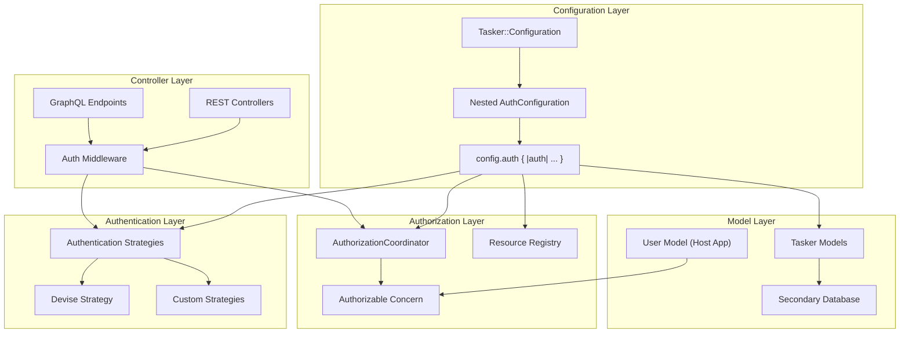

# Configuration-Backed Authentication, Authorization & Multi-Database Support

## Overview

This document outlines the implementation plan for adding flexible, configuration-driven authentication and authorization capabilities to the Tasker Rails engine, along with multi-database support. The design prioritizes flexibility, non-intrusiveness, and developer-friendly extension points while maintaining the engine's agnostic approach to host application concerns.

## Status

✅ **Phase 1: Configuration Foundation** - COMPLETED
✅ **Phase 2: Authentication Layer** - COMPLETED
✅ **Phase 3: Authorization Layer** - COMPLETED
⚪ **Phase 4: Multi-Database Support** - PLANNED
⚪ **Phase 5: Controller Integration** - PLANNED
⚪ **Phase 6: Examples and Documentation** - PLANNED
⚪ **Phase 7: Comprehensive Test Suite** - PLANNED

🔥 **NEW PRIORITY AREAS:**
🟡 **Workflow Testing & Orchestration** - HIGH PRIORITY
🟡 **Data Generation & Performance** - HIGH PRIORITY
🟡 **Enqueueing Architecture** - MEDIUM PRIORITY
🟡 **Enhanced Telemetry** - MEDIUM PRIORITY

## Goals

1. **Authentication Extension Points** - Provide configurable authentication strategies that integrate with common Rails authentication systems (primarily Devise)
2. **Resource-Based Authorization** - Implement a declarative authorization system using resource-and-verb patterns
3. **Multi-Database Support** - Enable Tasker models to use a separate database from the host application
4. **Non-Intrusive Integration** - Ensure all features work seamlessly without requiring specific authentication systems
5. **Developer-Friendly API** - Provide clear extension points and concerns for easy customization

## Architecture Overview



## Implementation Plan

### Phase 1: Configuration Foundation ✅ COMPLETED

**Overview**: Implement nested auth configuration with `config.auth` block for clean separation of authentication, authorization, and database configuration.

#### ✅ 1.1 Nested Configuration Architecture - COMPLETED

Created nested `AuthConfiguration` class within `Tasker::Configuration`:

**AuthConfiguration Class:**
- `strategy` (:none, :devise, :custom) - Authentication strategy
- `options` (hash) - Strategy-specific settings
- `current_user_method` (:current_user default) - Method to get current user
- `authenticate_user_method` (:authenticate_user! default) - Method to authenticate
- `coordinator_class` ('Tasker::Authorization::BaseCoordinator' default) - Authorization coordinator
- `user_class` (nil default) - Points to app user model
- `enabled` (false default) - Enable authorization
**Nested Configuration API:**
```ruby
Tasker.configuration do |config|
  config.auth do |auth|
    # Authentication and authorization configuration
    auth.strategy = :devise
    auth.options = { scope: :user }
    auth.enabled = true
  end

  config.database do |database|
    # Database configuration
    database.name = :tasker
    database.enable_secondary_database = true
  end
end
```

#### ✅ 1.2 Alias Methods for API Flexibility - COMPLETED

Provided convenience aliases for cleaner API:
- `authentication_strategy` → `strategy`
- `authentication_options` → `options`
- `authorization_coordinator_class` → `coordinator_class`
- `authorizable_user_class` → `user_class`
- `enable_authorization` → `enabled`

#### ✅ 1.3 Comprehensive Testing - COMPLETED

Implemented test suite with 33 passing tests:
- Nested auth configuration block functionality
- Default values for all auth configuration options
- Setter functionality with both direct and alias methods
- Integration scenarios (Devise, API auth, multi-database, full-featured)
- Backward compatibility verification
- Global configuration with nested auth blocks

#### ✅ 1.4 Clean Configuration Structure - COMPLETED

Benefits of the nested approach:
- **Organized**: All auth-related configuration in one namespace
- **Discoverable**: Clear `config.auth` entry point
- **Flexible**: Supports both block and direct configuration
- **Maintainable**: Separated auth concerns from core Tasker configuration
- **Idiomatic**: Follows Rails configuration patterns

#### ✅ 1.5 Configuration Testing - COMPLETED

Implemented comprehensive test suite with 34 passing tests:
- Default values for all new configuration options
- Setter functionality for authentication, authorization, and database options
- Integration scenarios (Devise, API auth, multi-database, full-featured)
- Singleton behavior and delegation with proper isolation
- Backward compatibility verification

#### ✅ 1.6 Example Classes Created - COMPLETED

- `spec/examples/custom_authorization_coordinator.rb` - Template authorization implementation
- `spec/examples/user_with_tasker_auth.rb` - Example user model with Authorizable concern

#### ✅ 1.7 Database Configuration Refinement - COMPLETED

Changed from inline database configuration to Rails-standard approach:
- Uses `database_name` (string/symbol) referencing database.yml entries
- Follows Rails multi-database conventions
- Simplified configuration approach

### Phase 2: Authentication Layer ✅ COMPLETED

**Overview**: Implemented extensible authentication hooks using dependency injection pattern, providing interfaces that work with any authentication provider (Devise, OmniAuth, JWT, Custom) without building provider-specific code into the engine.

**Key Achievements:**

#### ✅ 2.1 Authentication Interface & Infrastructure - COMPLETED
- `lib/tasker/authentication/interface.rb` - Authentication interface contract
- `lib/tasker/authentication/none_authenticator.rb` - No authentication (passthrough)
- `lib/tasker/authentication/coordinator.rb` - Central coordination with dependency injection
- `lib/tasker/authentication/errors.rb` - Authentication error classes
- `lib/tasker/concerns/authenticatable.rb` - Controller concern for automatic authentication

#### ✅ 2.2 Provider-Agnostic Design - COMPLETED
**Design Philosophy**: True provider agnosticism - host applications implement authenticator classes that conform to simple interface:
- `authenticate!(controller)` - Required authentication method
- `current_user(controller)` - Required user retrieval method
- `authenticated?(controller)` - Optional authentication check
- `validate_configuration(options)` - Optional configuration validation

#### ✅ 2.3 Comprehensive Authenticator Generator - COMPLETED
**Generator**: `rails generate tasker:authenticator NAME --type=TYPE`
- **JWT Authenticator**: Production-ready JWT implementation with signature verification
- **Devise Authenticator**: Devise integration with scope validation
- **API Token Authenticator**: Token-based authentication with header fallback
- **OmniAuth Authenticator**: OAuth/OpenID authentication with session management
- **Custom Authenticator**: Base template with TODO guidance

#### ✅ 2.4 Production-Ready Examples - COMPLETED
- `spec/examples/example_jwt_authenticator.rb` - Complete JWT implementation
- Comprehensive spec coverage with 32 test scenarios
- Security best practices built-in (signature verification, algorithm validation)
- Error handling for expired tokens, invalid signatures, missing users

#### ✅ 2.5 Request-Level Integration Testing - COMPLETED
- Authentication integration tests for REST controllers (21/21 passing)
- GraphQL authentication integration
- HTTP status code validation (401 Unauthorized, 500 Internal Server Error)
- State isolation preventing test configuration pollution

#### ✅ 2.6 Complete Documentation - COMPLETED
- `docs/AUTH.md` - Comprehensive authentication guide
- Quick start examples for no-auth and custom authentication
- Step-by-step guide for building custom authenticators
- Real-world configuration examples for different environments

**Success Metrics:**
- ✅ Full test suite passing (572/572 examples, 0 failures)
- ✅ Production-ready authenticator examples with comprehensive test coverage
- ✅ Generator creates all authenticator types with proper security practices
- ✅ No regressions introduced to existing functionality
- ✅ Clean dependency injection pattern with interface validation

### Phase 3: Authorization Layer ✅ COMPLETED

**Overview**: Implemented comprehensive resource-based authorization system using dependency injection pattern, providing a flexible and extensible authorization framework with resource constants, coordinator pattern, and user model integration.

**Key Achievements:**

#### ✅ 3.1 Resource Registry & Constants - COMPLETED
- `lib/tasker/authorization/resource_constants.rb` - Centralized constants for resource names and actions
- `lib/tasker/authorization/resource_registry.rb` - Registry of resources and permitted actions with constant integration
- `lib/tasker/authorization/errors.rb` - Authorization error classes
- Constants replace hardcoded strings throughout codebase for maintainability

#### ✅ 3.2 Authorization Coordinator Base Class - COMPLETED
- `lib/tasker/authorization/base_coordinator.rb` - Base coordinator with dependency injection pattern
- Follows same pattern as authentication system for consistency
- Supports custom authorization logic via subclassing
- Validates resources/actions against registry

#### ✅ 3.3 User Model Integration - COMPLETED
- `lib/tasker/concerns/authorizable.rb` - User model concern for authorization integration
- `lib/tasker/concerns/controller_authorizable.rb` - Controller concern for automatic authorization
- Configurable method names for different authorization systems
- Resource-specific permission checking

#### ✅ 3.4 Comprehensive Testing - COMPLETED
- Complete test suite with 51 passing tests
- Resource registry validation and constants testing
- Authorization coordinator with custom logic testing
- User model concern integration testing
- Constants consistency and immutability testing

**Success Metrics:**
- ✅ Full test suite passing (51/51 authorization tests, 0 failures)
- ✅ Resource constants eliminate hardcoded strings throughout codebase
- ✅ Dependency injection pattern consistent with authentication system
- ✅ Flexible user model integration with configurable method names
- ✅ Updated example coordinator using new constants
- ✅ No regressions introduced to existing functionality

#### 3.1 Resource Registry

```ruby
# lib/tasker/authorization/resource_registry.rb
module Tasker
  module Authorization
    class ResourceRegistry
      RESOURCES = {
        'tasker.task' => {
          actions: [:index, :show, :create, :update, :destroy, :retry, :cancel],
          description: 'Tasker workflow tasks'
        },
        'tasker.workflow_step' => {
          actions: [:index, :show, :update, :retry, :cancel],
          description: 'Individual workflow steps'
        },
        'tasker.task_diagram' => {
          actions: [:show],
          description: 'Task workflow diagrams'
        }
      }.freeze

      class << self
        def resources
          RESOURCES
        end

        def resource_exists?(resource)
          RESOURCES.key?(resource)
        end

        def action_exists?(resource, action)
          return false unless resource_exists?(resource)
          RESOURCES[resource][:actions].include?(action.to_sym)
        end

        def all_permissions
          RESOURCES.flat_map do |resource, config|
            config[:actions].map { |action| "#{resource}:#{action}" }
          end
        end
      end
    end
  end
end
```

#### 3.2 Authorization Coordinator Base Class

```ruby
# lib/tasker/authorization/base_coordinator.rb
module Tasker
  module Authorization
    class BaseCoordinator
      def initialize(user = nil)
        @user = user
      end

      def authorize!(resource, action, context = {})
        unless can?(resource, action, context)
          raise Tasker::Authorization::UnauthorizedError,
                "Not authorized to #{action} on #{resource}"
        end
      end

      def can?(resource, action, context = {})
        # Default: allow all actions if no authorization is configured
        return true unless authorization_enabled?

        # Validate resource and action exist
        unless ResourceRegistry.action_exists?(resource, action)
          raise ArgumentError, "Unknown resource:action '#{resource}:#{action}'"
        end

        # Delegate to subclass implementation
        authorized?(resource, action, context)
      end

      protected

      def authorized?(resource, action, context = {})
        # Default implementation: no access
        false
      end

      def authorization_enabled?
        Tasker.configuration.auth.enabled
      end

      attr_reader :user
    end

    class UnauthorizedError < StandardError; end
  end
end
```

#### 3.3 Authorizable Concern

```ruby
# lib/tasker/concerns/authorizable.rb
module Tasker
  module Concerns
    module Authorizable
      extend ActiveSupport::Concern

      included do
        # This concern provides a standard interface for authorization
        # The implementing class should define permission-checking methods
      end

      class_methods do
        def tasker_authorizable_config
          @tasker_authorizable_config ||= {
            permission_method: :has_tasker_permission?,
            role_method: :tasker_roles,
            admin_method: :tasker_admin?
          }
        end

        def configure_tasker_authorization(options = {})
          tasker_authorizable_config.merge!(options)
        end
      end

      # Standard interface methods that can be overridden
      def has_tasker_permission?(permission)
        # Default: check if a permissions method exists
        if respond_to?(:permissions)
          permissions.include?(permission)
        else
          false
        end
      end

      def tasker_roles
        # Default: check if a roles method exists
        respond_to?(:roles) ? roles : []
      end

      def tasker_admin?
        # Default: check common admin patterns
        return true if respond_to?(:admin?) && admin?
        return true if respond_to?(:role) && role == 'admin'
        return true if tasker_roles.include?('admin')
        false
      end

      def tasker_permissions_for_resource(resource)
        # Override this method to provide resource-specific permissions
        ResourceRegistry.resources[resource]&.fetch(:actions, [])&.select do |action|
          has_tasker_permission?("#{resource}:#{action}")
        end || []
      end
    end
  end
end
```

#### 3.4 Authorizable Concern (Controller Integration)

```ruby
# lib/tasker/concerns/controller_authorizable.rb
module Tasker
  module Concerns
    module ControllerAuthorizable
      extend ActiveSupport::Concern

      included do
        before_action :authorize_tasker_action!, unless: :skip_authorization?
      end

      private

      def authorize_tasker_action!
        return true if skip_authorization?

        resource = tasker_resource_name
        action = tasker_action_name
        context = tasker_authorization_context

        authorization_coordinator.authorize!(resource, action, context)
      end

      def authorization_coordinator
        @authorization_coordinator ||= build_authorization_coordinator
      end

      def build_authorization_coordinator
        coordinator_class = Tasker.configuration.auth.coordinator_class.constantize
        coordinator_class.new(current_tasker_user)
      end

      def tasker_resource_name
        # Extract from controller and action
        controller_name = self.class.name.demodulize.underscore.gsub('_controller', '')
        "tasker.#{controller_name.singularize}"
      end

      def tasker_action_name
        action_name.to_sym
      end

      def tasker_authorization_context
        {
          controller: self,
          params: params,
          resource_id: params[:id],
          parent_resource_id: params[:task_id]
        }
      end

      def skip_authorization?
        !Tasker.configuration.auth.enabled
      end
    end
  end
end
```

### Phase 4: Multi-Database Support ⚪ PLANNED

**Overview**: Enable Tasker models to use a separate database from the host application using a clean inheritance-based approach.

#### 4.1 TaskerApplicationRecord Abstract Class

**Goal**: Create a simple abstract base class that all Tasker models inherit from, eliminating the need for runtime metaprogramming.

**File to Create:**
- `app/models/tasker/tasker_application_record.rb` - Abstract base class for all Tasker models

**Implementation Strategy:**
```ruby
# app/models/tasker/tasker_application_record.rb
module Tasker
  class TaskerApplicationRecord < ActiveRecord::Base
    self.abstract_class = true

    # Establish connection based on configuration
    if Tasker.configuration.database.enable_secondary_database &&
       Tasker.configuration.database.name.present?
      establish_connection Tasker.configuration.database.name
    end
  end
end
```

**Key Benefits:**
- **Simple Inheritance**: All Tasker models inherit from `TaskerApplicationRecord`
- **No Runtime Metaprogramming**: Database connection determined at class definition time
- **Rails Idiomatic**: Follows standard Rails multi-database patterns
- **Clean Separation**: Clear boundary between host app and Tasker data

#### 4.2 Model Updates

**Update all Tasker models to inherit from TaskerApplicationRecord:**

```ruby
# app/models/tasker/task.rb
module Tasker
  class Task < TaskerApplicationRecord
    # Existing model code remains the same
  end
end

# app/models/tasker/workflow_step.rb
module Tasker
  class WorkflowStep < TaskerApplicationRecord
    # Existing model code remains the same
  end
end

# ... other models in app/models/tasker/ ...
```

#### 4.3 Configuration Integration

**Database Configuration Examples:**
```ruby
# config/initializers/tasker.rb

# Example 1: Use host application database (default)
Tasker.configuration do |config|
  config.database.enable_secondary_database = false
  # Uses ApplicationRecord, same database as host app
end

# Example 2: Dedicated Tasker database
Tasker.configuration do |config|
  config.database.enable_secondary_database = true
  config.database.name = :tasker
end

# Example 3: Environment-specific database
Tasker.configuration do |config|
  config.database.enable_secondary_database = Rails.env.production?
  config.database.name = Rails.env.production? ? :tasker_production : nil
end
```

**Corresponding database.yml entries:**
```yaml
# config/database.yml
development:
  # Host application database
  primary:
    adapter: postgresql
    database: myapp_development

  # Optional Tasker database
  tasker:
    adapter: postgresql
    database: tasker_development

production:
  primary:
    adapter: postgresql
    database: myapp_production

  tasker_production:
    adapter: postgresql
    database: tasker_production
    # Potentially different server, connection pool, etc.
```

#### 4.4 Migration and Installation Support

**Installation Generator Updates:**
- Update `tasker:install` generator to optionally configure secondary database
- Provide database.yml examples for multi-database setup
- Generate appropriate TaskerApplicationRecord if secondary database enabled

**Migration Path:**
- Existing installations continue to work unchanged (inherit from ApplicationRecord)
- New installations can opt into secondary database during setup
- Gradual migration path for existing installations

#### 4.5 Benefits of This Approach

**Simplicity:**
- No runtime metaprogramming or dynamic inheritance changes
- Standard Rails inheritance patterns
- Easy to understand and debug

**Performance:**
- Database connection determined at class load time
- No runtime overhead for connection resolution
- Leverages Rails connection pooling and caching

**Maintainability:**
- Clear inheritance hierarchy
- Single point of configuration
- Follows Rails conventions

**Flexibility:**
- Easy to switch between shared and dedicated database
- Environment-specific database configuration
- Supports all Rails database features (migrations, seeds, etc.)

### Phase 5: Controller Integration

#### 5.1 Update Existing Controllers

```ruby
# app/controllers/tasker/tasks_controller.rb
module Tasker
  class TasksController < ApplicationController
    include Tasker::Concerns::Authenticatable
    include Tasker::Concerns::ControllerAuthorizable

    # Existing controller code remains the same
    # Authentication and authorization happen automatically via concerns
  end
end

# app/controllers/tasker/workflow_steps_controller.rb
module Tasker
  class WorkflowStepsController < ApplicationController
    include Tasker::Concerns::Authenticatable
    include Tasker::Concerns::ControllerAuthorizable

    # Existing controller code remains the same
  end
end
```

#### 5.2 GraphQL Integration

```ruby
# lib/tasker/graphql/types/base_object.rb
module Tasker
  module GraphQL
    module Types
      class BaseObject < GraphQL::Schema::Object
        include Tasker::Concerns::ControllerAuthorizable

        def authorize_tasker_action!(resource, action, context = {})
          return true unless Tasker.configuration.auth.enabled

          coordinator = build_authorization_coordinator
          coordinator.authorize!(resource, action, context)
        end

        def current_tasker_user
          context[:current_user]
        end

        private

        def build_authorization_coordinator
          coordinator_class = Tasker.configuration.auth.coordinator_class.constantize
          coordinator_class.new(current_tasker_user)
        end
      end
    end
  end
end
```

### Phase 6: Examples and Documentation

#### 6.1 Example Authorization Coordinator

```ruby
# spec/examples/custom_authorization_coordinator.rb
class CustomAuthorizationCoordinator < Tasker::Authorization::BaseCoordinator
  protected

  def authorized?(resource, action, context = {})
    case resource
    when 'tasker.task'
      authorize_task_action(action, context)
    when 'tasker.workflow_step'
      authorize_step_action(action, context)
    else
      false
    end
  end

  private

  def authorize_task_action(action, context)
    return false unless user&.respond_to?(:has_tasker_permission?)

    case action
    when :index, :show
      user.has_tasker_permission?("tasker.task:#{action}")
    when :create, :update, :destroy
      user.tasker_admin? || user.has_tasker_permission?("tasker.task:#{action}")
    when :retry, :cancel
      # Special business logic: users can only retry/cancel their own tasks
      task_id = context[:resource_id]
      user.tasker_admin? || owns_task?(task_id)
    else
      false
    end
  end

  def authorize_step_action(action, context)
    return false unless user&.respond_to?(:has_tasker_permission?)

    # Steps are generally read-only for most users
    case action
    when :index, :show
      user.has_tasker_permission?("tasker.workflow_step:#{action}")
    when :update, :retry, :cancel
      user.tasker_admin?
    else
      false
    end
  end

  def owns_task?(task_id)
    return false unless task_id && user

    task = Tasker::Task.find_by(task_id: task_id)
    return false unless task

    # Check if user created the task (assuming context contains creator info)
    task.context['created_by_user_id'] == user.id.to_s
  end
end
```

#### 6.2 Example User Model

```ruby
# spec/examples/user_with_tasker_auth.rb
class User < ApplicationRecord
  include Tasker::Concerns::Authorizable

  # Configure the authorization methods
  configure_tasker_authorization(
    permission_method: :has_permission?,
    role_method: :user_roles,
    admin_method: :admin?
  )

  def has_permission?(permission)
    permissions.include?(permission)
  end

  def permissions
    @permissions ||= roles.flat_map(&:permissions).map(&:name)
  end

  def user_roles
    roles.map(&:name)
  end

  def admin?
    user_roles.include?('admin')
  end

  # Example: resource-specific permission checking
  def tasker_permissions_for_resource(resource)
    case resource
    when 'tasker.task'
      if admin?
        [:index, :show, :create, :update, :destroy, :retry, :cancel]
      else
        permissions.select { |p| p.start_with?('tasker.task:') }
                  .map { |p| p.split(':').last.to_sym }
      end
    when 'tasker.workflow_step'
      if admin?
        [:index, :show, :update, :retry, :cancel]
      else
        [:index, :show] # Regular users can only view steps
      end
    else
      []
    end
  end
end
```

## Testing Strategy

### Phase 7: Comprehensive Test Suite

#### 7.1 Configuration Tests
- Test default configuration values
- Test configuration validation
- Test environment-specific overrides

#### 7.2 Authentication Tests
- Test each authentication strategy (none, jwt, custom)
- Test authentication coordinator
- Test controller integration
- Test GraphQL integration

#### 7.3 Authorization Tests
- Test resource registry
- Test base authorization coordinator
- Test custom authorization coordinator examples
- Test controller authorization
- Test GraphQL authorization

#### 7.4 Multi-Database Tests
- Basic configuration validation (minimal testing needed)
- Standard Rails inheritance pattern (inherent Rails testing coverage)

#### 7.5 Integration Tests
- Test complete authentication + authorization flow
- Test API endpoints with different auth configurations
- Test GraphQL with authorization

## File Structure

```
lib/tasker/
├── authentication/              # Phase 2 ✅ COMPLETED
│   ├── interface.rb
│   ├── none_authenticator.rb
│   ├── coordinator.rb
│   └── errors.rb
├── authorization/               # Phase 3 ⚪
│   ├── resource_registry.rb
│   ├── base_coordinator.rb
│   └── errors.rb
├── concerns/                    # Phase 2-3 🟡⚪
│   ├── authenticatable.rb      # Phase 2 ✅ COMPLETED
│   ├── authorizable.rb         # Phase 3 ⚪
│   └── controller_authorizable.rb # Phase 3 ⚪
├── database/                    # Phase 4 ⚪
│   └── configuration.rb
└── configuration.rb             # Phase 1 ✅ COMPLETED

spec/
├── lib/tasker/
│   ├── authentication/          # Phase 2 Tests 🟡
│   │   ├── interface_spec.rb
│   │   ├── none_authenticator_spec.rb
│   │   ├── coordinator_spec.rb
│   │   └── errors_spec.rb
│   ├── authorization/           # Phase 3 Tests ⚪
│   ├── concerns/               # Phase 2-3 Tests 🟡⚪
│   │   ├── authenticatable_spec.rb     # Phase 2 🟡
│   │   ├── authorizable_spec.rb        # Phase 3 ⚪
│   │   └── controller_authorizable_spec.rb # Phase 3 ⚪
│   ├── database/               # Phase 4 Tests ⚪
│   ├── configuration_auth_db_spec.rb    # Phase 1 ✅ COMPLETED
│   ├── configuration_integration_spec.rb # Phase 1 ✅ COMPLETED
│   └── configuration_singleton_spec.rb  # Phase 1 ✅ COMPLETED
├── examples/                    # Phase 1 ✅ + Future Phases
│   ├── custom_authorization_coordinator.rb # Phase 1 ✅ COMPLETED
│   ├── user_with_tasker_auth.rb # Phase 1 ✅ COMPLETED
│   └── authenticators/          # Phase 2 🟡
│       ├── example_jwt_authenticator.rb
│       └── ...
├── enqueueing/                  # Phase C 🟡 NEW
│   ├── base_coordinator.rb
│   ├── priority_queue_adapter.rb
│   └── custom_strategies/
└── integration/                 # Phase 5-7 ⚪
    ├── authentication_integration_spec.rb # Phase 2 ✅ COMPLETED
    ├── authorization_integration_spec.rb
    └── multi_database_integration_spec.rb
```

## Migration Path

1. **Backward Compatibility**: All features are opt-in and default to current behavior
2. **Gradual Adoption**: Each component can be enabled independently
3. **Clear Documentation**: Comprehensive examples and guides for each feature
4. **Testing Coverage**: Full test suite ensures reliability
5. **Performance Impact**: Minimal overhead when features are disabled

## Benefits

1. **Flexibility**: Support for any authentication system via strategy pattern
2. **Consistency**: Standard interfaces for authorization across REST and GraphQL
3. **Scalability**: Secondary database support for high-volume deployments
4. **Security**: Declarative permissions with clear audit trails
5. **Developer Experience**: Clear extension points and comprehensive examples

This plan provides a robust foundation for authentication, authorization, and multi-database support while maintaining Tasker's core philosophy of flexibility and non-intrusiveness.
