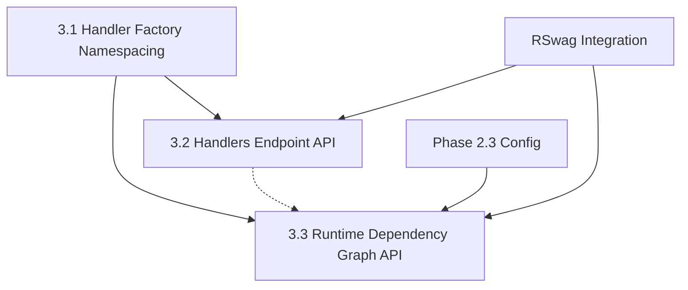

# Phase 3 Implementation Plan: API Enhancement & Handler Namespacing

## Executive Summary

Phase 3 focuses on enhancing the Tasker API with handler namespacing and dependency graph exposure. This phase builds on the solid configuration foundation established in Phase 2 and introduces REST endpoints for handler discovery and runtime dependency analysis.

## Phase Overview & Dependencies

### Implementation Order (Critical Dependencies)



**Critical Path**: 3.1 → 3.2 → 3.3
**Parallel Track**: 3.1 → 3.3 (independent of 3.2)

## 3.1 Handler Factory Namespacing

### Current State Analysis

**Existing Implementation** (`lib/tasker/handler_factory.rb`):
```ruby
def register(name, class_name)
  self.handler_classes[name.to_sym] = normalize_class_name(class_name)
end

def get(name)
  handler_class = handler_classes[name.to_sym]
  # Instantiation logic...
end
```

**Registry Structure**: `@handler_classes = { task_name => class_name }`

### Enhanced Implementation Strategy

#### New Registry Architecture
```ruby
class HandlerFactory
  def initialize
    # Namespaced registry structure
    @handler_classes = {}
    # Backward compatibility index
    @handler_index = {}
    # Namespace tracking
    @namespaces = Set.new(['default_system'])
  end

  def register(name, class_name, dependent_system: 'default_system')
    dependent_system = dependent_system.to_s
    name_sym = name.to_sym

    # Create namespace if needed
    @handler_classes[dependent_system] ||= {}
    @namespaces.add(dependent_system)

    # Store in namespaced registry
    normalized_class = normalize_class_name(class_name)
    @handler_classes[dependent_system][name_sym] = normalized_class

    # Maintain backward compatibility index
    @handler_index[name_sym] = {
      dependent_system: dependent_system,
      class_name: normalized_class
    }

    # Auto-discover custom events (existing functionality preserved)
    discover_and_register_custom_events(class_name)
  end

  def get(name, dependent_system: nil)
    name_sym = name.to_sym

    if dependent_system
      # Explicit namespace lookup
      handler_class = @handler_classes.dig(dependent_system.to_s, name_sym)
      raise_handler_not_found(name, dependent_system) unless handler_class
    else
      # Backward compatibility: check index first
      if @handler_index.key?(name_sym)
        index_entry = @handler_index[name_sym]
        handler_class = @handler_classes.dig(index_entry[:dependent_system], name_sym)
      else
        # Fallback: search all namespaces (for migration scenarios)
        handler_class = find_handler_across_namespaces(name_sym)
      end
      raise_handler_not_found(name) unless handler_class
    end

    instantiate_handler(handler_class)
  end

  def list_handlers(namespace: nil)
    if namespace
      @handler_classes[namespace.to_s] || {}
    else
      @handler_classes
    end
  end

  def namespaces
    @namespaces.to_a
  end

  private

  def find_handler_across_namespaces(name_sym)
    @handler_classes.each_value do |namespace_handlers|
      handler_class = namespace_handlers[name_sym]
      return handler_class if handler_class
    end
    nil
  end
end
```

#### Backward Compatibility Strategy
1. **Existing Calls Work Unchanged**: `factory.register('task', TaskHandler)` → uses `default_system`
2. **Lookup Fallback Chain**: `factory.get('task')` → checks index → searches namespaces
3. **Zero Breaking Changes**: All existing test/production code continues working
4. **Migration Path**: Gradual adoption of `dependent_system` parameter

#### Performance Considerations
- **O(1) Namespaced Lookup**: Direct hash access for explicit namespace calls
- **Optimized Fallback**: Index lookup for backward compatibility scenarios
- **Namespace Caching**: Set-based namespace tracking for efficient enumeration
- **Memory Efficiency**: Minimal overhead for compatibility index

### Testing Strategy for 3.1

```ruby
# spec/lib/tasker/handler_factory_spec.rb enhancements

describe 'namespaced registration' do
  it 'supports dependent_system parameter' do
    factory.register('process_payment', PaymentHandler, dependent_system: 'payments')

    # Explicit namespace access
    handler = factory.get('process_payment', dependent_system: 'payments')
    expect(handler).to be_a(PaymentHandler)

    # Namespace listing
    expect(factory.namespaces).to include('payments')
    expect(factory.list_handlers(namespace: 'payments')).to have_key(:process_payment)
  end

  it 'maintains backward compatibility' do
    # Old registration style
    factory.register('legacy_task', LegacyHandler)

    # Should work with old access pattern
    handler = factory.get('legacy_task')
    expect(handler).to be_a(LegacyHandler)

    # Should be accessible via default namespace
    handler = factory.get('legacy_task', dependent_system: 'default_system')
    expect(handler).to be_a(LegacyHandler)
  end

  it 'handles namespace conflicts gracefully' do
    factory.register('task', HandlerA, dependent_system: 'system_a')
    factory.register('task', HandlerB, dependent_system: 'system_b')

    # Both should be accessible via explicit namespace
    expect(factory.get('task', dependent_system: 'system_a')).to be_a(HandlerA)
    expect(factory.get('task', dependent_system: 'system_b')).to be_a(HandlerB)
  end
end
```

## 3.2 Handlers Endpoint API

### REST API Design

#### Route Structure
```ruby
# config/routes.rb additions
Tasker::Engine.routes.draw do
  # Existing routes...

  # Handler discovery endpoints
  resources :handlers, only: [:index, :show] do
    # Nested namespace route for explicit lookups
    collection do
      get ':namespace/:name', to: 'handlers#show_namespaced', as: :namespaced_handler
    end
  end
end
```

**Generated Routes**:
- `GET /tasker/handlers` → `HandlersController#index`
- `GET /tasker/handlers/:handler_name` → `HandlersController#show`
- `GET /tasker/handlers/:namespace/:name` → `HandlersController#show_namespaced`

#### Controller Implementation
```ruby
# app/controllers/tasker/handlers_controller.rb
class Tasker::HandlersController < ApplicationController
  before_action :set_handler_factory

  def index
    @handlers = build_handlers_list

    render json: {
      handlers: serialize_handlers(@handlers),
      namespaces: @handler_factory.namespaces,
      total_count: @handlers.sum { |_, handlers| handlers.size }
    }
  end

  def show
    handler_name = params[:handler_name]

    # Try to find handler with fallback logic
    handler_info = find_handler_info(handler_name)

    if handler_info
      render json: { handler: serialize_handler_info(handler_info) }
    else
      render json: { error: "Handler '#{handler_name}' not found" }, status: :not_found
    end
  end

  def show_namespaced
    namespace = params[:namespace]
    name = params[:name]

    handler_info = find_namespaced_handler_info(namespace, name)

    if handler_info
      render json: { handler: serialize_handler_info(handler_info) }
    else
      render json: {
        error: "Handler '#{name}' not found in namespace '#{namespace}'"
      }, status: :not_found
    end
  end

  private

  def build_handlers_list
    # Group handlers by namespace for organized response
    @handler_factory.list_handlers
  end

  def find_handler_info(handler_name)
    # Implement handler lookup with metadata extraction
    # Uses HandlerFactory's backward compatibility logic
    handler_class = nil
    namespace = nil

    # Check index for primary namespace
    if @handler_factory.handler_index.key?(handler_name.to_sym)
      index_entry = @handler_factory.handler_index[handler_name.to_sym]
      namespace = index_entry[:dependent_system]
      handler_class = index_entry[:class_name]
    end

    return nil unless handler_class

    build_handler_metadata(handler_name, handler_class, namespace)
  end

  def build_handler_metadata(name, class_name, namespace)
    {
      name: name,
      namespace: namespace,
      full_name: namespace == 'default_system' ? name : "#{namespace}.#{name}",
      class_name: class_name.to_s,
      available: class_available?(class_name),
      step_templates: extract_step_templates(class_name),
      handler_config: extract_handler_config(class_name)
    }
  end

  def class_available?(class_name)
    if class_name.is_a?(Class)
      true
    else
      class_name.to_s.camelize.constantize
      true
    end
  rescue NameError
    false
  end

  def extract_step_templates(class_name)
    # Safe step template extraction
    return [] unless class_available?(class_name)

    handler_instance = instantiate_handler_safely(class_name)
    return [] unless handler_instance&.respond_to?(:step_templates)

    handler_instance.step_templates.map do |template|
      {
        name: template.name,
        description: template.description,
        default_retryable: template.default_retryable,
        default_retry_limit: template.default_retry_limit,
        skippable: template.skippable,
        handler_class: template.handler_class.to_s,
        dependencies: {
          depends_on_step: template.depends_on_step,
          depends_on_steps: template.depends_on_steps
        }
      }
    end
  rescue StandardError => e
    Rails.logger.warn("Failed to extract step templates for #{class_name}: #{e.message}")
    []
  end
end
```

### RSwag Integration for OpenAPI Documentation

#### Request Spec Structure
```ruby
# spec/requests/tasker/handlers_spec.rb
require 'swagger_helper'

RSpec.describe 'tasker/handlers', type: :request, swagger_doc: 'v1/swagger.yaml' do

  path '/tasker/handlers' do
    get('list handlers') do
      tags 'Handlers'
      description 'List all registered task handlers grouped by namespace'
      operationId 'listHandlers'
      produces 'application/json'

      response(200, 'successful') do
        let!(:test_handlers) { setup_test_handlers }

        after do |example|
          example.metadata[:response][:content] = {
            'application/json' => {
              example: JSON.parse(response.body, symbolize_names: true)
            }
          }
        end

        run_test! do |response|
          json_response = JSON.parse(response.body, symbolize_names: true)

          expect(json_response).to have_key(:handlers)
          expect(json_response).to have_key(:namespaces)
          expect(json_response).to have_key(:total_count)

          expect(json_response[:namespaces]).to include('default_system')
          expect(json_response[:total_count]).to be > 0
        end

        schema type: :object,
          properties: {
            handlers: {
              type: :object,
              additionalProperties: {
                type: :object,
                additionalProperties: {
                  type: :object,
                  properties: {
                    name: { type: :string },
                    namespace: { type: :string },
                    full_name: { type: :string },
                    class_name: { type: :string },
                    available: { type: :boolean },
                    step_templates: {
                      type: :array,
                      items: {
                        type: :object,
                        properties: {
                          name: { type: :string },
                          description: { type: :string },
                          default_retryable: { type: :boolean },
                          default_retry_limit: { type: :integer },
                          skippable: { type: :boolean },
                          handler_class: { type: :string },
                          dependencies: {
                            type: :object,
                            properties: {
                              depends_on_step: { type: :string, nullable: true },
                              depends_on_steps: {
                                type: :array,
                                items: { type: :string }
                              }
                            }
                          }
                        }
                      }
                    }
                  }
                }
              }
            },
            namespaces: {
              type: :array,
              items: { type: :string }
            },
            total_count: { type: :integer }
          },
          required: [:handlers, :namespaces, :total_count]
      end
    end
  end

  path '/tasker/handlers/{handler_name}' do
    parameter name: 'handler_name', in: :path, type: :string, description: 'Handler name'

    get('show handler') do
      tags 'Handlers'
      description 'Get specific handler information'
      operationId 'getHandler'
      produces 'application/json'

      response(200, 'successful') do
        let(:handler_name) { 'dummy_task' }
        let!(:test_handler) { register_test_handler }

        after do |example|
          example.metadata[:response][:content] = {
            'application/json' => {
              example: JSON.parse(response.body, symbolize_names: true)
            }
          }
        end

        run_test! do |response|
          json_response = JSON.parse(response.body, symbolize_names: true)

          expect(json_response).to have_key(:handler)
          expect(json_response[:handler]).to include(
            name: handler_name,
            available: true
          )
        end

        schema type: :object,
          properties: {
            handler: {
              type: :object,
              properties: {
                name: { type: :string },
                namespace: { type: :string },
                full_name: { type: :string },
                class_name: { type: :string },
                available: { type: :boolean },
                step_templates: {
                  type: :array,
                  items: { '$ref' => '#/components/schemas/StepTemplate' }
                }
              },
              required: [:name, :namespace, :full_name, :class_name, :available]
            }
          },
          required: [:handler]
      end

      response(404, 'handler not found') do
        let(:handler_name) { 'nonexistent_handler' }

        run_test! do |response|
          json_response = JSON.parse(response.body, symbolize_names: true)
          expect(json_response).to have_key(:error)
        end

        schema type: :object,
          properties: {
            error: { type: :string }
          },
          required: [:error]
      end
    end
  end

  path '/tasker/handlers/{namespace}/{name}' do
    parameter name: 'namespace', in: :path, type: :string, description: 'Handler namespace'
    parameter name: 'name', in: :path, type: :string, description: 'Handler name'

    get('show namespaced handler') do
      tags 'Handlers'
      description 'Get handler by explicit namespace and name'
      operationId 'getNamespacedHandler'
      produces 'application/json'

      response(200, 'successful') do
        let(:namespace) { 'payments' }
        let(:name) { 'process_order' }
        let!(:namespaced_handler) { register_namespaced_test_handler }

        run_test!

        schema '$ref' => '#/components/schemas/HandlerResponse'
      end

      response(404, 'handler not found in namespace') do
        let(:namespace) { 'nonexistent' }
        let(:name) { 'handler' }

        run_test!

        schema '$ref' => '#/components/schemas/ErrorResponse'
      end
    end
  end

  # Component schemas for reuse
  components do
    schema :StepTemplate, {
      type: :object,
      properties: {
        name: { type: :string },
        description: { type: :string },
        default_retryable: { type: :boolean },
        default_retry_limit: { type: :integer },
        skippable: { type: :boolean },
        handler_class: { type: :string },
        dependencies: {
          type: :object,
          properties: {
            depends_on_step: { type: :string, nullable: true },
            depends_on_steps: { type: :array, items: { type: :string } }
          }
        }
      }
    }

    schema :HandlerResponse, {
      type: :object,
      properties: {
        handler: { '$ref' => '#/components/schemas/Handler' }
      }
    }

    schema :ErrorResponse, {
      type: :object,
      properties: {
        error: { type: :string }
      }
    }
  end

  private

  def setup_test_handlers
    factory = Tasker::HandlerFactory.instance

    # Register handlers in different namespaces
    factory.register('dummy_task', DummyTask, dependent_system: 'default_system')
    factory.register('process_payment', PaymentHandler, dependent_system: 'payments')
    factory.register('inventory_restock', InventoryHandler, dependent_system: 'inventory')
  end
end
```

## 3.3 Runtime Dependency Graph API

### Integration with Phase 2.3 Configuration

Phase 3.3 leverages the configurable RuntimeGraphAnalyzer implemented in Phase 2.3, enabling dependency analysis with customizable parameters.

#### Enhanced Task Controller
```ruby
# Update app/controllers/tasker/tasks_controller.rb
class Tasker::TasksController < ApplicationController

  def show
    @task = Task.find(params[:id])

    task_data = serialize_task(@task)

    # Optional dependency graph inclusion
    if include_dependencies?
      dependency_graph = build_dependency_graph(@task)
      task_data[:dependency_graph] = dependency_graph
    end

    render json: { task: task_data }
  end

  private

  def include_dependencies?
    params[:include_dependencies] == 'true' ||
    params[:include] == 'dependencies' ||
    params[:include] == 'dependency_graph'
  end

  def build_dependency_graph(task)
    # Use configurable RuntimeGraphAnalyzer from Phase 2.3
    analyzer = Tasker::Analysis::RuntimeGraphAnalyzer.new(task)

    {
      impact_scores: analyzer.calculate_impact_scores,
      bottleneck_analysis: analyzer.analyze_bottlenecks,
      readiness_matrix: analyzer.calculate_readiness_matrix,
      execution_context: analyzer.get_execution_context,
      metadata: {
        analysis_timestamp: Time.current.iso8601,
        configuration_used: analyzer.dependency_graph_config.to_h,
        total_steps: task.workflow_steps.count,
        analysis_version: '2.3.0'
      }
    }
  end
end
```

#### RSwag Specification for Dependency Graphs
```ruby
# spec/requests/tasker/tasks_spec.rb additions

path '/tasker/tasks/{task_id}' do
  parameter name: 'task_id', in: :path, type: :integer, description: 'task_id'
  parameter name: 'include_dependencies', in: :query, type: :boolean,
           required: false, description: 'Include dependency graph analysis'

  get('show task with optional dependencies') do
    tags 'Tasks'
    description 'Show Task with optional dependency graph analysis'
    operationId 'getTaskWithDependencies'
    produces 'application/json'

    response(200, 'successful with dependency graph') do
      let(:task_with_deps) { create_complex_workflow_task }
      let(:task_id) { task_with_deps.id }
      let(:include_dependencies) { true }

      after do |example|
        example.metadata[:response][:content] = {
          'application/json' => {
            example: JSON.parse(response.body, symbolize_names: true)
          }
        }
      end

      run_test! do |response|
        json_response = JSON.parse(response.body, symbolize_names: true)

        expect(json_response[:task]).to have_key(:dependency_graph)

        dep_graph = json_response[:task][:dependency_graph]
        expect(dep_graph).to include(:impact_scores, :bottleneck_analysis, :readiness_matrix)
        expect(dep_graph[:metadata]).to include(:analysis_timestamp, :configuration_used)
      end

      schema type: :object,
        properties: {
          task: {
            allOf: [
              { '$ref' => '#/components/schemas/Task' },
              {
                type: :object,
                properties: {
                  dependency_graph: { '$ref' => '#/components/schemas/DependencyGraph' }
                }
              }
            ]
          }
        }
    end

    response(200, 'successful without dependency graph') do
      let(:basic_task) { create_dummy_task_workflow }
      let(:task_id) { basic_task.id }
      # include_dependencies defaults to false

      run_test! do |response|
        json_response = JSON.parse(response.body, symbolize_names: true)
        expect(json_response[:task]).not_to have_key(:dependency_graph)
      end

      schema type: :object,
        properties: {
          task: { '$ref' => '#/components/schemas/Task' }
        }
    end
  end

  # Add DependencyGraph schema component
  components do
    schema :DependencyGraph, {
      type: :object,
      properties: {
        impact_scores: {
          type: :object,
          additionalProperties: { type: :number }
        },
        bottleneck_analysis: {
          type: :object,
          properties: {
            bottlenecks: { type: :array, items: { type: :string } },
            severity_levels: { type: :object, additionalProperties: { type: :string } },
            criticality_scores: { type: :object, additionalProperties: { type: :number } }
          }
        },
        readiness_matrix: {
          type: :object,
          additionalProperties: {
            type: :object,
            properties: {
              ready: { type: :boolean },
              blocked_by: { type: :array, items: { type: :string } },
              readiness_score: { type: :number }
            }
          }
        },
        execution_context: {
          type: :object,
          properties: {
            total_steps: { type: :integer },
            ready_steps: { type: :integer },
            blocked_steps: { type: :integer },
            completed_steps: { type: :integer },
            failed_steps: { type: :integer }
          }
        },
        metadata: {
          type: :object,
          properties: {
            analysis_timestamp: { type: :string, format: :datetime },
            configuration_used: { type: :object },
            total_steps: { type: :integer },
            analysis_version: { type: :string }
          }
        }
      },
      required: [:impact_scores, :bottleneck_analysis, :readiness_matrix, :metadata]
    }
  end
end
```

## Quality Assurance & Testing Strategy

### Comprehensive Test Coverage

#### Unit Tests
- **HandlerFactory**: Namespace functionality, backward compatibility, error handling
- **HandlersController**: Endpoint logic, serialization, error responses
- **Dependency Graph Integration**: RuntimeGraphAnalyzer integration, caching behavior

#### Integration Tests
- **End-to-End API**: Full request/response cycles with RSwag validation
- **Namespace Resolution**: Cross-namespace handler access patterns
- **Performance Testing**: Handler lookup performance, dependency graph generation timing

#### RSwag Documentation Testing
- **OpenAPI Compliance**: All endpoints generate valid OpenAPI 3.0 specifications
- **Schema Validation**: Request/response structures match documented schemas
- **Example Generation**: Comprehensive examples for all endpoint variations

### Performance Benchmarks

#### Handler Factory Performance
- **Namespace Lookup**: Target <1ms for O(1) hash access
- **Backward Compatibility**: <2ms fallback resolution
- **Memory Usage**: <10% increase in registry memory footprint

#### API Response Times
- **Handler List**: <50ms for handler enumeration
- **Dependency Graph**: <200ms for complex workflow analysis (with caching)
- **Handler Metadata**: <25ms for individual handler introspection

## Deployment & Migration Strategy

### Backward Compatibility Guarantee
- **Zero Breaking Changes**: All existing handler registrations continue working
- **Graceful Migration**: Optional adoption of namespacing features
- **Deprecation Timeline**: No deprecation of existing patterns in v2.x series

### Configuration Migration
```ruby
# Existing configuration (continues working)
Tasker::HandlerFactory.instance.register('task_name', TaskHandler)

# Enhanced configuration (new capability)
Tasker::HandlerFactory.instance.register('task_name', TaskHandler, dependent_system: 'payments')

# Bulk migration utility (optional)
def migrate_handlers_to_namespaces
  handlers_config = [
    { name: 'process_payment', class: PaymentHandler, system: 'payments' },
    { name: 'inventory_restock', class: InventoryHandler, system: 'inventory' }
  ]

  handlers_config.each do |config|
    Tasker::HandlerFactory.instance.register(
      config[:name],
      config[:class],
      dependent_system: config[:system]
    )
  end
end
```

## Success Metrics

### Technical Metrics
- **Test Coverage**: 100% line coverage for new functionality
- **Performance**: No degradation in existing handler factory operations
- **Documentation**: Complete OpenAPI spec generation for all new endpoints
- **Backward Compatibility**: 0 breaking changes in existing test suite

### User Experience Metrics
- **API Discoverability**: Handler discovery via REST endpoints
- **Developer Productivity**: Improved handler organization and namespace clarity
- **Integration Ease**: Simple adoption path for namespacing features

## Risk Mitigation

### Potential Risks & Mitigations
1. **Registry Performance**: Extensive benchmarking and optimization of lookup patterns
2. **Memory Usage**: Careful monitoring of registry overhead with large handler counts
3. **Complexity**: Clear documentation and examples for namespace adoption
4. **Migration Issues**: Comprehensive backward compatibility testing

### Rollback Strategy
- **Feature Flags**: Runtime disabling of namespace features if needed
- **Fallback Logic**: Built-in fallback to legacy registry behavior
- **Monitoring**: Detailed logging and metrics for namespace operations

---

This Phase 3 plan provides a comprehensive roadmap for implementing handler namespacing and dependency graph APIs while maintaining Tasker's commitment to backward compatibility and production readiness.
