# Phase 3 Implementation Plan: API Enhancement & Handler Namespacing

## Executive Summary

Phase 3 focuses on enhancing the Tasker API with handler namespacing and dependency graph exposure. **Phase 3.1 Handler Factory Namespacing has been successfully completed** with all 1000 tests passing. The foundation is now ready for REST API development.

**Strategic Implementation Status**:
- **3.1 Handler Factory Namespacing** ✅ **COMPLETED** - Foundation that enables organized handler management
- **3.2 Handlers Endpoint API** 🎯 **READY TO START** - REST API exposing namespace-aware handler discovery
- **3.3 Runtime Dependency Graph API** 🎯 **READY TO START** - Leverages Phase 2.3 configurable analysis
- **Moved to Phase 4**: GraphQL evaluation (3.3) and structured logging (1.2)

## Phase Overview & Dependencies

### Critical Implementation Dependencies

```mermaid
graph TD
    A[3.1 Handler Factory Namespacing ✅] --> B[3.2 Handlers Endpoint API 🎯]
    A --> C[3.3 Runtime Dependency Graph API 🎯]
    D[Phase 2.3 Config ✅] --> C
    E[RSwag Integration] --> B
    E --> C
    F[Existing HandlerFactory ✅] --> A
```



**Critical Path**: 3.1 ✅ → 3.2 🎯
**Parallel Opportunity**: 3.1 ✅ → 3.3 🎯 (both can start now)
**Foundation Required**: Phase 2.3 configuration ✅ for 3.3

## 3.1 Handler Factory Namespacing ✅ COMPLETED

### ✅ Implementation Achieved

**File**: `lib/tasker/handler_factory.rb`
**Original Signature**: `register(name, class_name)`
**✅ Enhanced Signature**: `register(name, class_name, dependent_system: 'default_system')`

### ✅ Final Implementation

#### Enhanced Registry Architecture ✅
```ruby
class HandlerFactory
  def initialize
    # Namespaced registry: { dependent_system => { name => class } }
    @handler_classes = {}
    # Namespace set for efficient enumeration
    @namespaces = Set.new(['default_system'])
  end

  def register(name, class_name, dependent_system: 'default_system')
    dependent_system = dependent_system.to_s
    name_sym = name.to_sym

    # Validate custom event configuration BEFORE modifying registry state (ATOMIC)
    normalized_class = normalize_class_name(class_name)
    discover_and_register_custom_events(class_name)

    # Only modify registry state after successful validation
    @handler_classes[dependent_system] ||= {}
    @namespaces.add(dependent_system)
    @handler_classes[dependent_system][name_sym] = normalized_class
  end

  def get(name, dependent_system: 'default_system')
    dependent_system = dependent_system.to_s
    name_sym = name.to_sym

    # Direct namespace lookup - allows same name in different systems
    handler_class = @handler_classes.dig(dependent_system, name_sym)
    raise_handler_not_found(name, dependent_system) unless handler_class

    instantiate_handler(handler_class)
  end

  # Ready for API support (can be added when needed)
  def list_handlers(namespace: nil)
    namespace ? (@handler_classes[namespace.to_s] || {}) : @handler_classes
  end

  def namespaces
    @namespaces.to_a
  end
end
```

#### ✅ Design Benefits Achieved
- **Same Names Across Systems**: `payments.process_order` and `inventory.process_order` can coexist
- **Simple & Clean**: No complex fallback logic or compatibility indexes needed
- **Zero Breaking Changes**: Existing `register('name', Class)` calls use `default_system`
- **Runtime Flexibility**: Registry rebuilt on each startup, no legacy data concerns
- **Atomic Registration**: Configuration validation before registry modification prevents partial state
- **"Fail Fast" Error Handling**: Configuration errors surface immediately as exceptions

### ✅ Testing Results - PERFECT

**Test Categories - ALL PASSING**:
1. ✅ **Namespace Registration**: New `dependent_system` parameter functionality working
2. ✅ **Same Name, Different Systems**: Multiple handlers with same name in different dependent systems working
3. ✅ **Default System Behavior**: Existing registration patterns continue using 'default_system'
4. ✅ **Lookup Performance**: O(1) namespace access with explicit dependent_system
5. ✅ **Error Handling**: Missing handlers in specific namespaces with clear error messages
6. ✅ **State Leakage Resolution**: Fixed test isolation with surgical cleanup pattern

**✅ Final Test Results**:
- **Total Tests**: 1000 examples, 0 failures (100% pass rate - PERFECT!)
- **Handler Factory Tests**: 45/45 tests passing
- **Production Workflow Tests**: All workflow patterns working
- **System Integration**: All health checks and orchestration working

### ✅ State Leakage Resolution - CRITICAL FIX

**Root Cause Identified**: `handler_factory_spec.rb` had destructive cleanup that wiped the entire HandlerFactory registry before each test, clearing workflow task handlers that were correctly auto-registered during class loading.

**Solution Implemented**: **Surgical Cleanup Pattern**
```ruby
before do
  # Store original handler classes for surgical cleanup
  @original_handler_classes = factory.handler_classes.deep_dup
  @original_namespaces = factory.namespaces.dup
end

after do
  # Surgical cleanup - only remove test-specific handlers
  test_namespaces = factory.namespaces - @original_namespaces
  test_namespaces.each { |namespace| factory.handler_classes.delete(namespace) }

  # Remove test handlers from existing namespaces
  @original_handler_classes.each do |namespace, handlers|
    if factory.handler_classes[namespace]
      test_handlers = factory.handler_classes[namespace].keys - handlers.keys
      test_handlers.each { |handler| factory.handler_classes[namespace].delete(handler) }
    end
  end

  # Restore original namespaces
  factory.namespaces.clear
  @original_namespaces.each { |namespace| factory.namespaces.add(namespace) }
end
```

**Key Insight**: The issue was NOT with Phase 3.1 HandlerFactory changes - it was test isolation destroying shared singleton state. The workflow task handlers were correctly registering via automatic `register_handler(TASK_NAME)` calls in class definitions.

## 3.2 Handlers Endpoint API 🎯 READY TO START

### REST API Design

#### Routes
```ruby
# config/routes.rb additions
resources :handlers, only: [:index, :show] do
  collection do
    get ':namespace/:name', to: 'handlers#show_namespaced', as: :namespaced_handler
  end
end
```

**Generated Endpoints**:
- `GET /tasker/handlers` - List all handlers grouped by namespace
- `GET /tasker/handlers/:handler_name` - Single handler with namespace resolution
- `GET /tasker/handlers/:namespace/:name` - Explicit namespaced lookup

#### JSON Response Design
```json
{
  "handlers": {
    "payments": {
      "process_order": {
        "name": "process_order",
        "namespace": "payments",
        "full_name": "payments.process_order",
        "class_name": "PaymentOrderHandler",
        "available": true,
        "step_templates": [...]
      }
    },
    "default_system": {
      "simple_task": {...}
    }
  },
  "namespaces": ["payments", "inventory", "default_system"],
  "total_count": 5
}
```

### Implementation Strategy

#### Controller Implementation
```ruby
# app/controllers/tasker/handlers_controller.rb
module Tasker
  class HandlersController < ApplicationController
    include Tasker::Concerns::Authenticatable
    include Tasker::Concerns::Authorizable

    def index
      authorize! 'tasker.handlers:index'

      factory = Tasker::HandlerFactory.instance
      handlers_by_namespace = factory.list_handlers

      render json: {
        handlers: serialize_handlers_by_namespace(handlers_by_namespace),
        namespaces: factory.namespaces,
        total_count: count_total_handlers(handlers_by_namespace)
      }
    end

    def show
      authorize! 'tasker.handlers:show'

      handler_name = params[:id]
      dependent_system = params[:namespace] || 'default_system'

      begin
        handler = Tasker::HandlerFactory.instance.get(handler_name, dependent_system: dependent_system)
        render json: serialize_handler(handler_name, dependent_system, handler.class)
      rescue Tasker::ProceduralError => e
        render json: { error: e.message }, status: :not_found
      end
    end

    def show_namespaced
      authorize! 'tasker.handlers:show'

      namespace = params[:namespace]
      name = params[:name]

      begin
        handler = Tasker::HandlerFactory.instance.get(name, dependent_system: namespace)
        render json: serialize_handler(name, namespace, handler.class)
      rescue Tasker::ProceduralError => e
        render json: { error: e.message }, status: :not_found
      end
    end

    private

    def serialize_handlers_by_namespace(handlers_by_namespace)
      handlers_by_namespace.transform_values do |handlers|
        handlers.transform_values do |handler_class|
          serialize_handler_class(handler_class)
        end
      end
    end

    def serialize_handler(name, namespace, handler_class)
      {
        name: name,
        namespace: namespace,
        full_name: "#{namespace}.#{name}",
        class_name: handler_class.name,
        available: true,
        step_templates: extract_step_templates(handler_class)
      }
    end

    def serialize_handler_class(handler_class)
      {
        class_name: handler_class.name,
        available: true,
        step_templates: extract_step_templates(handler_class)
      }
    end

    def extract_step_templates(handler_class)
      return [] unless handler_class.respond_to?(:step_templates)

      handler_class.step_templates.map do |template|
        {
          name: template.name,
          description: template.description,
          handler_class: template.handler_class&.name
        }
      end
    end

    def count_total_handlers(handlers_by_namespace)
      handlers_by_namespace.sum { |_, handlers| handlers.size }
    end
  end
end
```

### RSwag Integration Requirements

#### Request Spec Structure
```ruby
# spec/requests/tasker/handlers_spec.rb
require 'swagger_helper'

RSpec.describe 'Tasker Handlers API', type: :request do
  path '/tasker/handlers' do
    get 'List all handlers grouped by namespace' do
      tags 'Handlers'
      produces 'application/json'
      security [{ bearer: [] }]

      parameter name: :namespace, in: :query, type: :string, required: false,
                description: 'Filter handlers by specific namespace'

      response '200', 'handlers listed' do
        schema type: :object,
               properties: {
                 handlers: {
                   type: :object,
                   additionalProperties: {
                     type: :object,
                     additionalProperties: {
                       type: :object,
                       properties: {
                         name: { type: :string },
                         namespace: { type: :string },
                         full_name: { type: :string },
                         class_name: { type: :string },
                         available: { type: :boolean },
                         step_templates: {
                           type: :array,
                           items: {
                             type: :object,
                             properties: {
                               name: { type: :string },
                               description: { type: :string },
                               handler_class: { type: :string }
                             }
                           }
                         }
                       }
                     }
                   }
                 },
                 namespaces: {
                   type: :array,
                   items: { type: :string }
                 },
                 total_count: { type: :integer }
               }

        run_test!
      end

      response '401', 'unauthorized' do
        run_test!
      end

      response '403', 'forbidden' do
        run_test!
      end
    end
  end

  path '/tasker/handlers/{namespace}/{name}' do
    get 'Get specific handler by namespace and name' do
      tags 'Handlers'
      produces 'application/json'
      security [{ bearer: [] }]

      parameter name: :namespace, in: :path, type: :string, required: true,
                description: 'Handler namespace (dependent system)'
      parameter name: :name, in: :path, type: :string, required: true,
                description: 'Handler name'

      response '200', 'handler found' do
        schema type: :object,
               properties: {
                 name: { type: :string },
                 namespace: { type: :string },
                 full_name: { type: :string },
                 class_name: { type: :string },
                 available: { type: :boolean },
                 step_templates: {
                   type: :array,
                   items: {
                     type: :object,
                     properties: {
                       name: { type: :string },
                       description: { type: :string },
                       handler_class: { type: :string }
                     }
                   }
                 }
               }

        run_test!
      end

      response '404', 'handler not found' do
        schema type: :object,
               properties: {
                 error: { type: :string }
               }

        run_test!
      end

      response '401', 'unauthorized' do
        run_test!
      end

      response '403', 'forbidden' do
        run_test!
      end
    end
  end
end
```

### Testing Strategy for 3.2

**Test Categories**:
1. **Namespace Listing**: API returns handlers grouped by namespace
2. **Handler Discovery**: Individual handler lookup with namespace support
3. **Error Handling**: Proper 404 responses for missing handlers/namespaces
4. **Authorization**: Proper permission checking for handler endpoints
5. **JSON Schema**: Response format validation and consistency
6. **Performance**: Efficient handler enumeration and serialization

### Implementation Dependencies for 3.2

**Required**:
- ✅ Phase 3.1 Handler Factory Namespacing (COMPLETED)
- RSwag gem for OpenAPI documentation
- Authorization resource constants for handler permissions

**Optional Enhancements**:
- Handler metadata caching for performance
- Pagination for large handler collections
- Filtering and search capabilities

## 3.3 Runtime Dependency Graph API 🎯 READY TO START

### Enhancement Strategy

#### Enhanced Task Endpoints
```ruby
# Existing endpoints enhanced with optional dependency data
GET /tasker/tasks/:id?include_dependencies=true
GET /tasker/tasks?include_dependencies=true
```

#### JSON Response Enhancement
```json
{
  "task": {
    "id": 123,
    "name": "payment_processing",
    "status": "in_progress",
    // ... existing task fields ...
    "dependency_graph": {
      "analysis_timestamp": "2023-12-19T10:30:00Z",
      "impact_score": 8.5,
      "criticality_level": "high",
      "bottleneck_analysis": {
        "severity": "medium",
        "affected_paths": 3,
        "estimated_delay": "2.5 minutes"
      },
      "step_dependencies": [
        {
          "step_id": 456,
          "step_name": "validate_payment",
          "dependencies": [
            {
              "step_id": 455,
              "step_name": "fetch_user_data",
              "dependency_type": "sequential",
              "criticality": "high"
            }
          ],
          "impact_metrics": {
            "downstream_steps": 4,
            "estimated_duration": "30 seconds",
            "failure_impact": "workflow_blocked"
          }
        }
      ]
    }
  }
}
```

### Implementation Strategy

#### Controller Enhancement
```ruby
# app/controllers/tasker/tasks_controller.rb
module Tasker
  class TasksController < ApplicationController
    def show
      authorize! 'tasker.tasks:show'

      task = Tasker::Task.find(params[:id])
      response_data = serialize_task(task)

      if include_dependencies?
        dependency_analysis = analyze_task_dependencies(task)
        response_data[:dependency_graph] = dependency_analysis
      end

      render json: response_data
    end

    def index
      authorize! 'tasker.tasks:index'

      tasks = apply_filters(Tasker::Task.all)
      response_data = {
        tasks: tasks.map { |task| serialize_task(task) },
        total_count: tasks.count
      }

      if include_dependencies?
        response_data[:tasks].each do |task_data|
          task = tasks.find { |t| t.id == task_data[:id] }
          task_data[:dependency_graph] = analyze_task_dependencies(task)
        end
      end

      render json: response_data
    end

    private

    def include_dependencies?
      params[:include_dependencies].present? &&
        params[:include_dependencies].to_s.downcase == 'true'
    end

    def analyze_task_dependencies(task)
      analyzer = Tasker::Analysis::RuntimeGraphAnalyzer.new(
        dependency_graph_config: Tasker.configuration.dependency_graph
      )

      analysis_result = analyzer.analyze_task_dependencies(task)

      {
        analysis_timestamp: Time.current.iso8601,
        impact_score: analysis_result.impact_score,
        criticality_level: analysis_result.criticality_level,
        bottleneck_analysis: serialize_bottleneck_analysis(analysis_result.bottleneck_analysis),
        step_dependencies: serialize_step_dependencies(analysis_result.step_dependencies)
      }
    end

    def serialize_bottleneck_analysis(bottleneck_analysis)
      {
        severity: bottleneck_analysis.severity,
        affected_paths: bottleneck_analysis.affected_paths,
        estimated_delay: bottleneck_analysis.estimated_delay
      }
    end

    def serialize_step_dependencies(step_dependencies)
      step_dependencies.map do |step_dep|
        {
          step_id: step_dep.step_id,
          step_name: step_dep.step_name,
          dependencies: serialize_dependencies(step_dep.dependencies),
          impact_metrics: serialize_impact_metrics(step_dep.impact_metrics)
        }
      end
    end

    def serialize_dependencies(dependencies)
      dependencies.map do |dep|
        {
          step_id: dep.step_id,
          step_name: dep.step_name,
          dependency_type: dep.dependency_type,
          criticality: dep.criticality
        }
      end
    end

    def serialize_impact_metrics(impact_metrics)
      {
        downstream_steps: impact_metrics.downstream_steps,
        estimated_duration: impact_metrics.estimated_duration,
        failure_impact: impact_metrics.failure_impact
      }
    end
  end
end
```

### Testing Strategy for 3.3

**Test Categories**:
1. **Dependency Analysis**: RuntimeGraphAnalyzer integration with configurable parameters
2. **Performance**: Caching expensive graph computations
3. **Optional Inclusion**: Parameter-based dependency data inclusion
4. **JSON Schema**: Response format validation for dependency graphs
5. **Authorization**: Proper permission checking for dependency data access
6. **Error Handling**: Graceful degradation when analysis fails

### Implementation Dependencies for 3.3

**Required**:
- ✅ Phase 2.3 Dependency Graph Configuration (COMPLETED)
- ✅ RuntimeGraphAnalyzer with configurable parameters (COMPLETED)
- Enhanced task serialization logic

**Optional Enhancements**:
- Dependency graph caching for performance
- Real-time dependency updates via WebSocket
- Dependency visualization data for frontend

## Implementation Priorities & Next Steps

### Immediate Focus Options

**Option A: Phase 3.2 First**
- **Pros**: Simpler implementation, builds directly on 3.1 foundation
- **Cons**: Less immediate business value than dependency analysis
- **Timeline**: 1-2 weeks for complete implementation

**Option B: Phase 3.3 First**
- **Pros**: Higher business value, leverages existing Phase 2.3 work
- **Cons**: More complex implementation with caching considerations
- **Timeline**: 2-3 weeks for complete implementation

**Option C: Parallel Development**
- **Pros**: Fastest overall completion, no blocking dependencies
- **Cons**: Requires careful coordination and testing
- **Timeline**: 2-3 weeks for both phases

### Recommended Approach: **Option C - Parallel Development**

**Rationale**:
1. **No Blocking Dependencies**: 3.2 and 3.3 are independent
2. **Faster Time to Market**: Both APIs available sooner
3. **Foundation Complete**: Phase 3.1 provides solid base for both
4. **Resource Utilization**: Can work on different aspects simultaneously

### Success Criteria

**Phase 3.2 Completion**:
- ✅ REST endpoints for handler discovery
- ✅ Namespace-aware API responses
- ✅ Complete RSwag documentation
- ✅ Authorization integration
- ✅ Comprehensive test coverage

**Phase 3.3 Completion**:
- ✅ Optional dependency data in task endpoints
- ✅ RuntimeGraphAnalyzer integration
- ✅ Performance optimization with caching
- ✅ JSON schema validation
- ✅ Comprehensive test coverage

**Overall Phase 3 Success**:
- ✅ Enhanced API capabilities for handler discovery
- ✅ Runtime dependency analysis exposure
- ✅ Maintained 100% test pass rate
- ✅ Production-ready performance
- ✅ Complete API documentation

---

This comprehensive plan ensures Phase 3 delivers enhanced API capabilities while maintaining Tasker's commitment to backward compatibility and production readiness.
