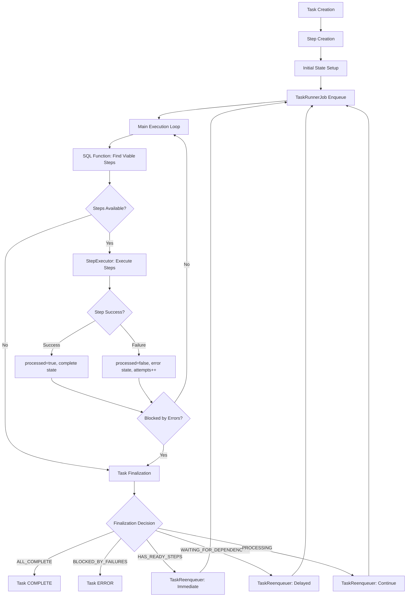

# System Patterns

## Architecture Overview

### Core Components
```
┌─────────────────┐    ┌─────────────────┐    ┌─────────────────┐
│   Task Handler  │    │  Orchestration  │    │  SQL Functions  │
│                 │    │   Coordinator   │    │                 │
│ - Step Templates│────│ - Step Discovery│────│ - Step Readiness│
│ - Handler Logic │    │ - Step Executor │    │ - Task Context  │
│ - Dependencies  │    │ - Task Finalizer│    │ - Batch Queries │
└─────────────────┘    └─────────────────┘    └─────────────────┘
         │                       │                       │
         │              ┌─────────────────┐              │
         │              │  State Machine  │              │
         └──────────────│                 │──────────────┘
                        │ - Task States   │
                        │ - Step States   │
                        │ - Transitions   │
                        └─────────────────┘
```

## Production Workflow Lifecycle

### Complete End-to-End Flow



### Phase-by-Phase Breakdown

#### Phase 1: Task Initialization
```ruby
# 1. Task Creation
task_request = Tasker::Types::TaskRequest.new(name: 'order_process', context: { order_id: 123 })

# 2. Task and Step Creation
handler = Tasker::HandlerFactory.instance.get('order_process')
task = handler.initialize_task!(task_request)

# 3. Initial State Setup
# Task: PENDING state
# Steps: PENDING state, processed = false, attempts = 0

# 4. Enqueue for Processing
Tasker::TaskRunnerJob.perform_later(task.task_id)
```

#### Phase 2: Main Execution Loop (WorkflowCoordinator)
```ruby
# CRITICAL: This is the core production logic
loop do
  task.reload
  sequence = get_sequence(task)

  # SQL Function Query - THE HEART OF THE SYSTEM
  viable_steps = find_viable_steps(task, sequence)
  break if viable_steps.empty?

  # Step Execution
  processed_steps = execute_steps(viable_steps)
  all_processed_steps.concat(processed_steps)

  # Error Check
  break if blocked_by_errors?(task)
end

# Finalization Decision
finalize_task(task, all_processed_steps)
```

#### Phase 3: Step Discovery & Retry Eligibility (SQL Function)
**The `get_step_readiness_status()` function is the authoritative source for step readiness:**

```sql
-- CRITICAL CONDITIONS for ready_for_execution = true:
CASE
  WHEN current_state IN ('pending', 'error')           -- Must be pending or failed
  AND (processed = false OR processed IS NULL)         -- Never re-execute processed steps
  AND dependencies_satisfied = true                    -- All parents complete
  AND attempts < retry_limit                           -- Haven't exhausted retries
  AND COALESCE(retryable, true) = true                 -- Step is retryable
  AND (in_process = false OR in_process IS NULL)       -- Not currently processing
  AND backoff_period_expired = true                    -- Exponential backoff satisfied
  THEN true
  ELSE false
END
```

**Key Retry Eligibility Logic:**
- **Exponential Backoff**: `2^attempts * 1 second` (max 30 seconds)
- **Manual Backoff Override**: `last_attempted_at + backoff_request_seconds`
- **Retry Limits**: Default 3 attempts, configurable per step
- **Retryability Flag**: `COALESCE(retryable, true)` - retryable by default

#### Phase 4: Step Execution (StepExecutor)
```ruby
# For each viable step:
def execute_single_step(task, sequence, step, task_handler)
  # 1. State Transition
  transition_to_in_progress(step)  # pending → in_progress

  # 2. Execute Handler
  step_handler = task_handler.get_step_handler(step)
  step_handler.handle(task, sequence, step)

  # 3. Success Path
  step.update!(processed: true)
  transition_to_complete(step)     # in_progress → complete

  # 4. Failure Path (if exception raised)
  step.update!(processed: false, attempts: attempts + 1)
  transition_to_error(step)        # in_progress → error
  store_error_data(step, exception)
end
```

#### Phase 5: Task Finalization & Reenqueuing
```ruby
# TaskFinalizer analyzes TaskExecutionContext
context = get_task_execution_context(task_id)

case context.execution_status
when 'all_complete'
  task.transition_to('complete')  # DONE
when 'blocked_by_failures'
  task.transition_to('error')     # DONE
when 'has_ready_steps'
  reenqueue_immediately(task)     # Continue processing
when 'waiting_for_dependencies'
  reenqueue_with_delay(task)      # Wait for backoff/dependencies
when 'processing'
  reenqueue_for_continuation(task) # Continue next iteration
end
```

#### Phase 6: Production Retry Mechanism
**Step-Level Retry Flow:**
1. **Step Fails**: `error` state, `processed = false`, `attempts++`
2. **Task Continues**: TaskFinalizer determines task should continue
3. **Reenqueuing**: `TaskReenqueuer` → `TaskRunnerJob.perform_later(task_id)`
4. **Next Loop**: SQL function finds failed step as `viable` (if retry eligible)
5. **Step Retry**: Same execution process, new attempt number

**CRITICAL**: This is **step-level retry via reenqueuing**, not task-level retry loops.

## Key Design Patterns

### 1. Strategy Pattern - Orchestration Components
**Problem**: Different execution contexts (production vs testing) need different behaviors
**Solution**: Pluggable strategies for coordination and reenqueuing

```ruby
class WorkflowCoordinator
  def initialize(reenqueuer_strategy: nil)
    @reenqueuer_strategy = reenqueuer_strategy || default_reenqueuer_strategy
  end
end

# Production: Uses ActiveJob
# Testing: Uses TestReenqueuer for synchronous execution
```

### 2. Function-Based Performance Pattern
**Problem**: Step readiness calculation was too slow with ActiveRecord queries
**Solution**: PostgreSQL functions for high-performance batch operations

```sql
-- Single function call replaces dozens of ActiveRecord queries
SELECT * FROM get_step_readiness_status(task_id, step_ids);
```

### 3. State Machine Pattern
**Problem**: Complex state transitions with validation and history
**Solution**: Dedicated state machine with transition tracking

```ruby
# Both tasks and steps use consistent state machine pattern
task.state_machine.transition_to('in_progress')
step.state_machine.transition_to('complete')
```

### 4. Event-Driven Architecture
**Problem**: Need observability and loose coupling between components
**Solution**: Publish/subscribe event system

```ruby
publish_step_completed(step, execution_duration: duration)
publish_task_finalization_started(task, context: context)
```

### 5. Reenqueuing-Based Retry Pattern
**Problem**: Need reliable step retry mechanism with backoff and limits
**Solution**: Failed steps become viable again through reenqueuing + SQL function

```ruby
# Production Flow:
failed_step  # error state, processed = false, attempts++
→ TaskFinalizer  # determines continuation needed
→ TaskReenqueuer  # TaskRunnerJob.perform_later(task_id)
→ New Execution Loop  # SQL function finds failed step as viable
→ Step Retry  # same execution process, new attempt
```

## Critical Implementation Paths

### Step Readiness Calculation
**Most Performance-Critical Path**
1. `WorkflowStep.get_viable_steps()` calls SQL function
2. `get_step_readiness_status()` evaluates:
   - Current step state
   - Dependency satisfaction
   - Retry eligibility (with backoff logic)
   - Processing flags
3. Returns only steps ready for immediate execution

**Key Optimization**: Single SQL function call replaces N+1 query patterns

### Task Execution Loop
**Core Orchestration Logic**
```ruby
loop do
  viable_steps = find_viable_steps(task, sequence)
  break if viable_steps.empty?

  processed_steps = execute_steps(viable_steps)
  break if blocked_by_errors?(task, processed_steps)
end

finalize_task(task, all_processed_steps)
```

### Retry Logic Implementation
**Complex Business Logic**
1. **Exponential Backoff**: `2^attempts * base_interval` (max 30 seconds)
2. **Retry Limits**: Configurable per step template
3. **Backoff Override**: Manual backoff periods for specific scenarios
4. **State Coordination**: Failed steps marked as `processed=false` for retry eligibility

### Reenqueuing Decision Logic
**TaskFinalizer Business Rules**
- **All Complete**: Task done, no reenqueuing
- **Blocked by Failures**: Task failed, no reenqueuing
- **Has Ready Steps**: Immediate reenqueuing for step execution
- **Waiting**: Delayed reenqueuing based on earliest retry time
- **Processing**: Continuation reenqueuing for next iteration

## Component Relationships

### Task Handler → Orchestration
- Task handlers define step templates and dependencies
- Orchestration components execute the defined workflows
- Clean separation of business logic from execution logic

### SQL Functions → ActiveRecord Models
- SQL functions provide raw performance data
- ActiveRecord models wrap functions with Ruby interfaces
- Caching layer prevents redundant function calls

### State Machine → Database
- State machines manage transitions and validation
- Database stores transition history for audit trails
- Most recent transitions flagged for performance

### Event System → Observability
- All major workflow events published to event bus
- Telemetry subscribers collect metrics and logs
- Loose coupling allows adding new observers without code changes

### TaskReenqueuer → ActiveJob
- Reenqueuer translates continuation decisions into job enqueuing
- ActiveJob handles actual background processing
- Strategy pattern allows testing without actual job queuing

## Section 8: Backoff Configuration (Phase 2.4)

### Overview
The backoff configuration system provides comprehensive control over retry timing, exponential backoff calculations, and task reenqueue delays. This replaces hardcoded constants in `BackoffCalculator` and `TaskFinalizer` with configurable parameters.

### BackoffConfig Type Schema
```ruby
class BackoffConfig < BaseConfig
  # Backoff progression for retry attempts (seconds)
  attribute :default_backoff_seconds, Types::Array.of(Types::Integer)
                                                  .default([1, 2, 4, 8, 16, 32].freeze)

  # Maximum backoff time cap (seconds)
  attribute :max_backoff_seconds, Types::Integer.default(300)

  # Exponential backoff multiplier
  attribute :backoff_multiplier, Types::Float.default(2.0)

  # Jitter configuration
  attribute :jitter_enabled, Types::Bool.default(true)
  attribute :jitter_max_percentage, Types::Float.default(0.1)

  # Task reenqueue delays by execution status
  attribute :reenqueue_delays, Types::Hash.schema(
    has_ready_steps: Types::Integer.default { 0 },
    waiting_for_dependencies: Types::Integer.default { 45 },
    processing: Types::Integer.default { 10 }
  )

  # Default reenqueue delay and buffer time
  attribute :default_reenqueue_delay, Types::Integer.default(30)
  attribute :buffer_seconds, Types::Integer.default(5)
end
```

### Backoff Calculation Logic
**Step Retry Backoff (BackoffCalculator)**
```ruby
def calculate_backoff_seconds(attempt_number)
  return 0 if attempt_number <= 0

  # Use predefined progression if available
  base_backoff = if attempt_number <= default_backoff_seconds.length
                   default_backoff_seconds[attempt_number - 1]  # 0-based indexing
                 else
                   # Exponential: attempt^multiplier for attempts beyond array
                   (attempt_number**backoff_multiplier).to_i
                 end

  # Apply maximum limit
  backoff_time = [base_backoff, max_backoff_seconds].min

  # Apply jitter if enabled (±jitter_max_percentage variation)
  if jitter_enabled
    jitter_range = (backoff_time * jitter_max_percentage).round
    jitter = Random.rand(-jitter_range..jitter_range)
    backoff_time = [backoff_time + jitter, 1].max  # Minimum 1 second
  end

  backoff_time
end
```

**Attempt Number Mapping**
- `step.attempts = 0` (first attempt) → `calculate_backoff_seconds(1)` → `backoff[0] = 1` second
- `step.attempts = 1` (second attempt) → `calculate_backoff_seconds(2)` → `backoff[1] = 2` seconds
- `step.attempts = 2` (third attempt) → `calculate_backoff_seconds(3)` → `backoff[2] = 4` seconds

### Task Reenqueue Logic (TaskFinalizer)
**Dynamic Delay Calculation**
```ruby
def calculate_buffer_time
  backoff_config.buffer_seconds
end

def get_delay_for_status(status)
  case status
  when :has_ready_steps
    backoff_config.reenqueue_delays[:has_ready_steps]
  when :waiting_for_dependencies
    backoff_config.reenqueue_delays[:waiting_for_dependencies]
  when :processing
    backoff_config.reenqueue_delays[:processing]
  else
    backoff_config.default_reenqueue_delay
  end
end
```

### HTTP Retry-After Header Integration
**Server-Requested Backoff (Preserved)**
```ruby
def apply_server_requested_backoff(step, retry_after)
  backoff_seconds = @retry_parser.parse_retry_after(retry_after)

  # Apply configurable cap for server-requested backoff
  max_server_backoff = backoff_config.max_backoff_seconds
  backoff_seconds = [backoff_seconds, max_server_backoff].min

  step.backoff_request_seconds = backoff_seconds
end
```

**Priority Order**:
1. HTTP Retry-After header (if present)
2. Exponential backoff calculation (if enabled)
3. No backoff (step fails without retry timing)

### Configuration Usage Examples

**Basic Configuration**
```ruby
Tasker.configuration do |config|
  config.backoff do |backoff|
    backoff.default_backoff_seconds = [1, 2, 4, 8, 16, 32]
    backoff.max_backoff_seconds = 300
    backoff.jitter_enabled = true
  end
end
```

**Advanced Reenqueue Tuning**
```ruby
config.backoff do |backoff|
  # Aggressive immediate processing
  backoff.reenqueue_delays = {
    has_ready_steps: 0,              # Immediate
    waiting_for_dependencies: 15,    # Quick retry
    processing: 5                    # Fast continuation
  }

  # Longer buffer for safety
  backoff.buffer_seconds = 10
end
```

**Custom Exponential Progression**
```ruby
config.backoff do |backoff|
  # Slower initial progression
  backoff.default_backoff_seconds = [2, 5, 10, 20, 40, 80]
  backoff.backoff_multiplier = 1.5  # Gentler exponential growth
  backoff.max_backoff_seconds = 600  # 10 minute maximum
end
```

### Mathematical Formulas

**Exponential Backoff Formula**
```
For attempt > array.length:
backoff_time = attempt_number ^ backoff_multiplier

With jitter (when enabled):
jitter_range = backoff_time * jitter_max_percentage
final_time = backoff_time + random(-jitter_range, +jitter_range)
final_time = max(final_time, 1)  // Minimum 1 second
```

**Reenqueue Timing Formula**
```
reenqueue_delay = base_delay + buffer_seconds

Where base_delay depends on execution status:
- has_ready_steps: immediate (0s)
- waiting_for_dependencies: moderate delay (45s default)
- processing: short delay (10s default)
```

### Integration Points

**BackoffCalculator Integration**
- Memoized `backoff_config` method provides O(1) configuration access
- Replaces hardcoded constants: `max_server_backoff`, `min_exponent`, `base_delay`, `max_delay`
- Maintains HTTP Retry-After header priority over exponential backoff

**TaskFinalizer Integration**
- Dynamic DelayCalculator methods replace hardcoded DELAY_MAP constants
- Configurable reenqueue delays for different execution states
- Buffer time calculation for optimal retry timing

### Performance Characteristics
- **Configuration Access**: O(1) via memoization
- **Calculation Complexity**: O(1) for array lookups, O(log n) for exponential calculation
- **Memory Usage**: Minimal - configuration objects are frozen and shared
- **Jitter Impact**: Negligible performance cost, significant "thundering herd" prevention

### Testing Considerations

**Deterministic Testing**
```ruby
# Disable jitter for predictable test results
config.backoff.jitter_enabled = false

# Use fast progression for rapid testing
config.backoff.default_backoff_seconds = [0.1, 0.2, 0.5]
config.backoff.reenqueue_delays = { has_ready_steps: 0, waiting_for_dependencies: 0.1, processing: 0.1 }
```

**HTTP Header Simulation**
```ruby
# Test preserves HTTP Retry-After functionality
stubs.get("/api") { [429, { 'Retry-After' => '30' }, ''] }
expect(step.backoff_request_seconds).to eq(30)  # Server-requested timing honored
```

### Migration from Hardcoded Constants

**Before (Hardcoded)**
```ruby
# BackoffCalculator
max_server_backoff = 3600
base_delay = 1.0
max_delay = 30.0

# TaskFinalizer::DelayCalculator
DEFAULT_DELAY = 30
MAXIMUM_DELAY = 300
DELAY_MAP = { has_ready_steps: 0, waiting_for_dependencies: 45, processing: 10 }.freeze
```

**After (Configurable)**
```ruby
# BackoffCalculator
max_server_backoff = backoff_config.max_backoff_seconds
backoff_seconds = backoff_config.calculate_backoff_seconds(attempt)

# TaskFinalizer::DelayCalculator
default_delay = backoff_config.default_reenqueue_delay
maximum_delay = backoff_config.max_backoff_seconds
delay = backoff_config.reenqueue_delays[status] || backoff_config.default_reenqueue_delay
```

**Backward Compatibility**: All defaults match previous hardcoded values ensuring zero breaking changes.

## Error Handling Patterns

### Graceful Degradation
- SQL function failures fall back to ActiveRecord queries
- Missing dependencies cause workflow pause, not failure
- Partial step completion preserved across retries

### Idempotency Guarantees
- Steps can be safely re-executed without side effects
- Database transactions ensure atomic state changes
- Unique constraints prevent duplicate step creation

### Recovery Mechanisms
- Failed steps can be manually reset for retry
- Workflow state can be reconstructed from transition history
- Test infrastructure provides backoff bypass for rapid testing

## Performance Optimizations

### Database Level
- Composite indexes on (task_id, most_recent) for fast state lookups
- Function-based step readiness calculation
- Batch operations for multi-task scenarios

### Application Level
- Connection pooling for concurrent step execution
- Memory-efficient step processing with limited concurrency
- Cached step readiness status to prevent redundant calculations

### Testing Level
- Synchronous test coordinators bypass ActiveJob overhead
- Configurable failure handlers for deterministic test scenarios
- Backoff bypass mechanisms for rapid test execution

## Anti-Patterns and Common Mistakes

### ❌ Task-Level Retry Loops
**Wrong**: Implementing retry logic at the task level with manual loops
**Right**: Step-level retries through reenqueuing + SQL function eligibility

### ❌ Bypassing SQL Function Logic
**Wrong**: Using ActiveRecord queries to determine step readiness in tests
**Right**: Testing the actual SQL function behavior for retry eligibility

### ❌ Manual State Manipulation
**Wrong**: Directly updating step states without using state machine
**Right**: Using `safe_transition_to` for all state changes

### ❌ Ignoring `processed` Flag
**Wrong**: Re-executing steps that have `processed = true`
**Right**: Only executing steps with `processed = false`

### ❌ Incomplete Strategy Pattern
**Wrong**: Test strategies that don't replicate production behavior
**Right**: Test strategies that follow the same reenqueuing path as production
