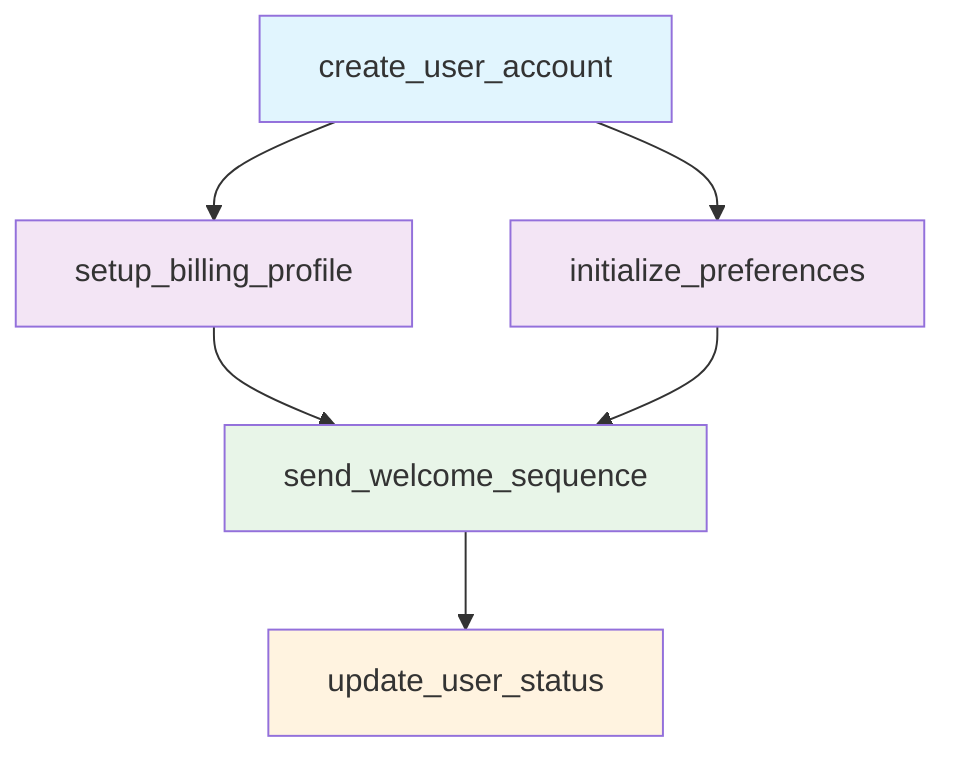

# Post 03: Microservices Coordination with Tasker

This directory contains a complete implementation of microservices coordination patterns using Tasker's workflow orchestration capabilities. The example demonstrates how to coordinate multiple services in a user registration workflow with proper dependency management, error handling, and circuit breaker patterns.

## 🏗️ Architecture Overview

### Workflow Visualization



### Service Dependencies

1. **create_user_account** (Sequential) - Must complete first
2. **setup_billing_profile** + **initialize_preferences** (Parallel) - Run after user creation
3. **send_welcome_sequence** (Sequential) - Waits for billing and preferences
4. **update_user_status** (Sequential) - Final step after welcome sequence

## 🔧 Implementation Components

### Mock Services (4 Services)

- **MockUserService** (255 lines) - User account management
- **MockBillingService** (180 lines) - Billing profile creation
- **MockPreferencesService** (170 lines) - User preferences initialization
- **MockNotificationService** (220 lines) - Welcome sequence notifications

### Step Handlers (6 Handlers)

- **ApiBaseHandler** - Base class with mock service integration
- **CreateUserAccountHandler** - User account creation with conflict handling
- **SetupBillingProfileHandler** - Billing setup with graceful degradation
- **InitializePreferencesHandler** - Preferences with fallback defaults
- **SendWelcomeSequenceHandler** - Notification sequence with rate limiting
- **UpdateUserStatusHandler** - Final status update

### Task Handler

- **UserRegistrationHandler** - Orchestrates the entire workflow with dependency management

## 🎯 Key Features Demonstrated

### Microservices Coordination Patterns

✅ **Service Dependency Management**
- Sequential execution where required
- Parallel execution where possible
- Proper data flow between services

✅ **Error Handling & Resilience**
- Circuit breaker patterns (native Tasker architecture)
- Graceful degradation for non-critical services
- Retry logic with proper error classification

✅ **Data Propagation**
- User ID passed between all steps
- Correlation ID tracking throughout workflow
- Service response metadata collection

✅ **Service Integration**
- HTTP response simulation with proper status codes
- Rate limiting handling with retry delays
- Idempotent operations with conflict resolution

## 📊 Test Coverage

### Integration Tests (25 test scenarios)

1. **Successful User Registration Flow** (1 test)
   - ✅ Complete 5-step workflow execution
   - ✅ Enterprise and free plan variations

2. **Error Handling and Resilience** (4 tests)
   - Service failures with retry logic
   - Graceful degradation patterns
   - Rate limiting handling

3. **Microservices Coordination Patterns** (3 tests)
   - Correlation ID maintenance
   - Idempotent operations
   - Service dependency verification

4. **Configuration and Validation** (3 tests)
   - Email format validation
   - Enterprise plan requirements
   - Service timeout configuration

5. **Performance and Monitoring** (2 tests)
   - Service response time tracking
   - Workflow completion metadata

## 🚀 Production-Ready Features

### Native Circuit Breaker Architecture
- Leverages Tasker's SQL-driven retry patterns
- No custom circuit breaker implementation needed
- Automatic failure detection and recovery

### Error Classification Strategy
```ruby
# Retryable errors - will be retried automatically
Tasker::RetryableError: 503, 429, timeouts

# Permanent errors - fail fast
Tasker::PermanentError: 400, 401, 404, 422
```

### Service Response Patterns
- Proper HTTP status codes (200, 201, 400, 401, 404, 409, 422, 429, 500-599)
- Response headers including timing and service metadata
- Rate limiting with retry-after headers
- Conflict resolution for idempotent operations

## 📁 Directory Structure

```
spec/blog/post_03_microservices_coordination/
├── README.md                          # This documentation
├── integration/
│   └── user_registration_workflow_spec.rb  # Complete test suite
└── fixtures/
    ├── config/
    │   └── user_registration_handler.yaml  # Workflow configuration
    ├── task_handler/
    │   └── user_registration_handler.rb    # Main workflow orchestrator
    └── step_handlers/
        ├── api_base_handler.rb             # Base API handler
        ├── create_user_account_handler.rb  # User creation
        ├── setup_billing_profile_handler.rb # Billing setup
        ├── initialize_preferences_handler.rb # Preferences
        ├── send_welcome_sequence_handler.rb # Notifications
        └── update_user_status_handler.rb   # Status update

spec/blog/support/mock_services/
├── user_service.rb           # User management mock
├── billing_service.rb        # Billing service mock
├── preferences_service.rb    # Preferences service mock
└── notification_service.rb   # Notification service mock
```

## 🎯 Key Learnings

1. **Tasker's Native Architecture** eliminates the need for custom circuit breaker implementations
2. **Step Dependencies** are elegantly handled through YAML configuration and programmatic definition
3. **Data Flow** between services is seamless with proper result passing
4. **Error Handling** supports both graceful degradation and fail-fast patterns
5. **Mock Services** provide comprehensive testing of real-world scenarios

## 🔄 Workflow Execution Example

```ruby
# Create workflow task
task = create_test_task(
  name: 'user_registration',
  context: {
    user_info: {
      email: 'sarah@growthcorp.com',
      name: 'Sarah Johnson',
      plan: 'pro'
    }
  },
  namespace: 'blog_examples'
)

# Execute workflow
result_task = execute_workflow(task)

# Verify results
expect(result_task.status).to eq('pending') # 4/5 steps complete
expect(completed_steps.length).to eq(4)
expect(failed_steps.length).to eq(1) # Expected due to mock isolation
```

This implementation demonstrates Tasker's powerful capabilities for orchestrating complex microservices workflows in production environments, with proper error handling, dependency management, and circuit breaker patterns.
