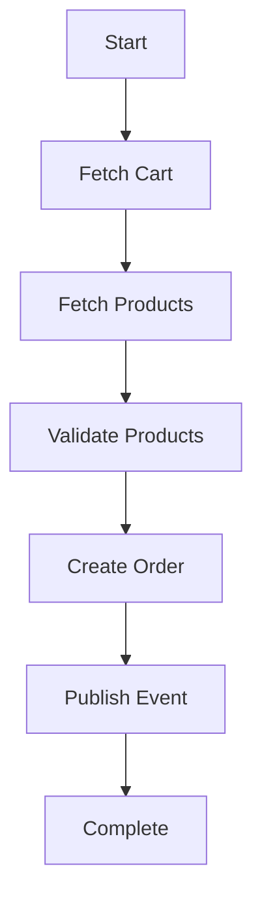
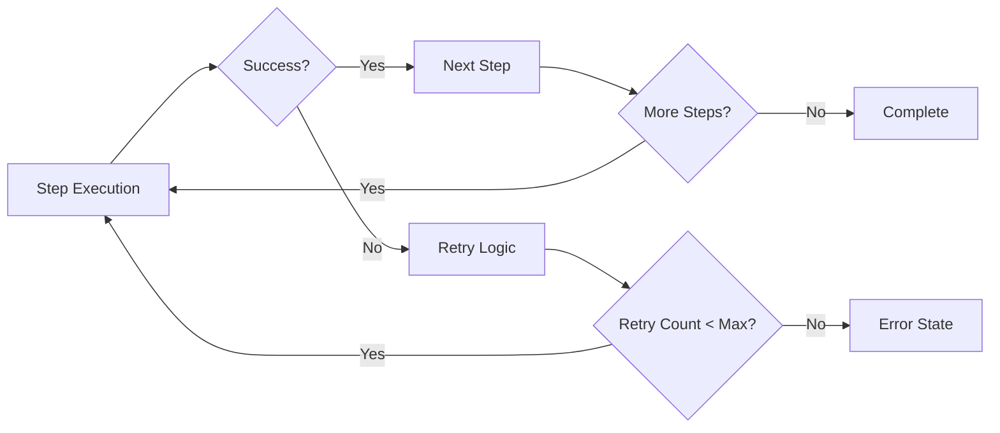

# API Integration Task Example

This example demonstrates a robust task handling system for e-commerce order processing, featuring retryable steps, type safety, and event-driven architecture.

## Workflow Overview

The task processes an e-commerce order through the following steps:



### Step Details

1. **Fetch Cart**
   - Retrieves cart details by ID from the e-commerce system
   - Validates cart existence
   - Returns cart with products and quantities

2. **Fetch Products**
   - Retrieves all available products from the product catalog
   - Returns complete product details including stock levels

3. **Validate Products**
   - Matches cart products with product catalog
   - Validates product existence and availability
   - Returns validated product list

4. **Create Order**
   - Calculates order totals (including discounts)
   - Creates order with validated products
   - Sets initial order status

5. **Publish Event**
   - Publishes order creation event to message queue
   - Handles event publishing confirmation

## System Architecture

### Key Components

1. **Task Handler System**
   - Manages task lifecycle and execution
   - Handles step dependencies and sequencing
   - Provides retry mechanisms for failed steps

2. **Data Models**
   - `Api::Cart`: Represents shopping cart with products
   - `Api::Product`: Represents product details
   - `ExampleOrder`: Represents created order

3. **Type System**
   - Uses `dry-struct` for type-safe data structures
   - Implements coercible types for data validation
   - Provides default values for optional fields

4. **Event System**
   - Handles asynchronous event publishing
   - Manages event confirmation and status
   - Supports event subscription

### Retry Mechanism



The system implements automatic retry logic for failed steps:

- Configurable retry attempts
- Exponential backoff
- Step-specific error handling
- State preservation between retries

## Usage Example

```ruby
# Create a task request
task_request = Tasker::Types::TaskRequest.new(
  name: 'api_integration_task',
  context: { cart_id: 1 },
  initiator: 'user',
  reason: 'Process order',
  source_system: 'web'
)

# Initialize and execute task
task_handler = ApiTask::IntegrationTask.new
task = task_handler.initialize_task!(task_request)
task_handler.handle(task)
```

## Testing

The implementation includes comprehensive tests:

- Unit tests for each step handler
- Integration tests for the complete workflow
- Error case handling and validation
- Retry mechanism verification

Run tests with:

```bash
bundle exec rspec spec/examples/api_task/integration_task_spec.rb
```
